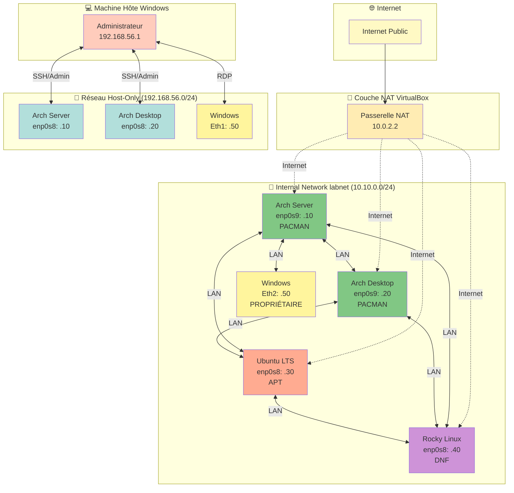

# Module 6 : Laboratoire Multi-OS Complet

<div
  class="omny-meta"
  data-level="🟡 Intermédiaire & 🔴 Avancé"
  data-version="0.2"
  data-time="120-150 minutes">
</div>

## Introduction

Les **Modules 3, 4 et 5** vous ont permis de construire une infrastructure Arch Linux complète avec un réseau segmenté :

- **Module 3** : Arch Server minimal (**boot UEFI**, **systemd-boot**, **services de base**)
- **Module 4** : Arch Desktop complet (**KDE Plasma** ou **GNOME**, **pile graphique**)
- **Module 5** : Réseau VirtualBox professionnel (**NAT**, **Host-Only**, **Internal Network**)

!!! quote "Ces trois modules constituent le **socle Arch Linux** de votre laboratoire. Mais un environnement professionnel réaliste nécessite **plusieurs systèmes d'exploitation** pour refléter la diversité des infrastructures d'entreprise."

Ce **Module 6** complète votre laboratoire en intégrant :

- **Ubuntu LTS** : distribution stable, écosystème Debian/apt, référence universelle
- **Rocky Linux** : clone RHEL, famille Red Hat/dnf, standard entreprise
- **Windows 10/11** : poste utilisateur, administration, tests multi-plateformes

À la fin de ce module, vous disposerez d'un **datacenter virtualisé complet** avec 5 systèmes interconnectés, prêt pour :

- Formation système et réseau
- DevSecOps et CI/CD multi-OS
- Scénarios SOC/SIEM/EDR
- Pentest Red Team / Blue Team
- Active Directory et gestion de domaine
- Développement multi-plateformes

!!! quote "Analogie pédagogique"
    Imaginez que vous venez de construire **le châssis et le moteur** d'un datacenter avec Arch Linux (Modules 3-5).
    
    Le Module 6 ajoute maintenant **les différents véhicules** qui roulent dans ce datacenter : un camion robuste (Rocky), une berline stable (Ubuntu), et une voiture de fonction (Windows).
    
    Chaque véhicule a son propre moteur, mais tous utilisent les mêmes routes (réseau VirtualBox) que vous avez construites.

## Objectifs d'Apprentissage

> À la fin de ce module, **vous serez capable de** :

### Objectifs Techniques

- [ ] Installer Ubuntu LTS en mode serveur avec configuration réseau Netplan
- [ ] Installer Rocky Linux en mode minimal avec NetworkManager
- [ ] Installer Windows 10/11 et configurer ses interfaces réseau
- [ ] Intégrer les trois nouveaux systèmes dans le réseau Internal labnet
- [ ] Configurer des adresses IP statiques sur Ubuntu (Netplan) et Rocky (nmcli)
- [ ] Tester la connectivité réseau complète entre les 5 systèmes
- [ ] Créer des snapshots de référence pour chaque OS

### Objectifs Conceptuels

- [ ] Comprendre les différences entre les trois grandes familles Linux (Arch, Debian, Red Hat)
- [ ] Saisir les rôles spécifiques de chaque OS dans un lab professionnel
- [ ] Maîtriser la configuration réseau sur trois systèmes différents (Arch/nmcli, Ubuntu/Netplan, Rocky/nmcli)
- [ ] Comprendre l'importance de la diversité des OS pour les tests cybersécurité
- [ ] Anticiper les cas d'usage professionnels du lab complet

## Prérequis

Avant de commencer, **assurez-vous d'avoir** :

- [ ] **Module 3 validé** : Arch Server fonctionnel et stable
- [ ] **Module 4 validé** : Arch Desktop avec environnement graphique opérationnel
- [ ] **Module 5 validé** : Réseau VirtualBox configuré (NAT, Host-Only, Internal labnet)
- [ ] **ISOs téléchargées** :

    - [ ] Ubuntu Server LTS ([ubuntu.com/download/server](https://ubuntu.com/download/server))
    - [ ] Rocky Linux ([rockylinux.org/download](https://rockylinux.org/download))
    - [ ] Windows 10/11 (_ISO officielle Microsoft_ ou _licence éducation_)

- [ ] **VirtualBox 7.0+** avec Extension Pack
- [ ] **120 à 150 minutes** devant vous sans interruption
- [ ] **Plan d'adressage IP** du Module 5 sous les yeux

!!! warning "Vérifiez votre réseau AVANT d'ajouter de nouvelles VMs, Si _Arch Server_ et _Arch Desktop_ ne communiquent pas correctement via Internal Network (ping 10.10.0.10 ↔ 10.10.0.20), **corrigez le Module 5 d'abord**. Ajouter de nouvelles machines sur un réseau cassé ne fera qu'aggraver les problèmes."

## Comprendre Avant d'Agir : La Diversité Multi-OS

> Avant d'installer Ubuntu, Rocky et Windows, vous devez comprendre **pourquoi** nous intégrons ces systèmes spécifiques et **quel rôle** ils jouent dans Arch-Lab.

### Structure du Module en 18 Étapes

Ce module est organisé en **4 phases principales** :

| Phase | Étapes | Objectif | Durée estimée |
|-------|:------:|----------|:-------------:|
| **Phase 1<br/><small>Déploiement Ubuntu LTS</small>** | 1 à 5 | Installation, configuration réseau Netplan, intégration labnet | 30-40 min |
| **Phase 2<br/><small>Déploiement Rocky Linux</small>** | 6 à 10 | Installation, configuration réseau nmcli, intégration labnet | 30-40 min |
| **Phase 3<br/><small>Déploiement Windows</small>** | 11 à 14 | Installation, configuration réseau statique, intégration labnet | 40-50 min |
| **Phase 4<br/><small>Tests & Validation Globale</small>** | 15 à 18 | Tests croisés, diagnostic, snapshots, documentation | 20-30 min |

### Ce que Vous Allez Vraiment Faire

Concrètement, vous allez :

- **Étapes 1-2** : _Créer la VM Ubuntu, installer le système en mode serveur_
- **Étapes 3-5** : _Configurer le réseau avec Netplan, tester la connectivité_
- **Étapes 6-7** : _Créer la VM Rocky, installer en mode minimal_
- **Étapes 8-10** : _Configurer le réseau avec nmcli, intégrer dans labnet_
- **Étapes 11-12** : _Créer la VM Windows, installer le système_
- **Étapes 13-14** : _Configurer les deux interfaces réseau (Host-Only + Internal)_
- **Étapes 15-16** : _Tests de connectivité complets entre les 5 systèmes_
- **Étapes 17-18** : _Créer les snapshots de référence et documenter_

### Vue d'Ensemble du Processus

Avant de commencer les 18 étapes détaillées, prenez le temps de **visualiser l'ensemble du parcours**. Les deux diagrammes suivants vous donnent une vue macro du processus :

1. **Le diagramme de séquence** montre le déroulé temporel des 18 étapes
2. **Le schéma de topologie finale** montre l'architecture complète à 5 systèmes

Ces diagrammes sont votre **carte de navigation** pour ce module. Consultez-les régulièrement pendant l'installation pour savoir où vous en êtes.

!!! tip "Comment utiliser ces diagrammes"
    - **Avant de commencer** : lisez-les pour comprendre où vous allez
    - **Pendant l'installation** : revenez-y pour vous situer dans le processus
    - **En cas de blocage** : identifiez à quelle phase vous êtes pour mieux chercher de l'aide

=== "Diagramme de Séquence Complet"

    La construction du laboratoire multi-OS suit un **processus structuré en 18 étapes** réparties en 4 phases distinctes. Ce diagramme représente l'intégralité du parcours, depuis l'installation d'Ubuntu jusqu'à la validation complète du lab à 5 systèmes.

    **Comment lire ce diagramme ?**

    - Les **flèches pleines** (→) représentent vos actions
    - Les **flèches pointillées** (-->) représentent les réponses du système
    - Les **notes colorées** détaillent ce qui se passe en arrière-plan
    - Les **séparateurs horizontaux** marquent les transitions entre phases

    Ce diagramme vous sert de **carte de navigation** pour compléter Arch-Lab avec Ubuntu, Rocky et Windows.

    ```mermaid
    sequenceDiagram
        participant You as Vous
        participant VB as VirtualBox
        participant UB as Ubuntu LTS
        participant RL as Rocky Linux
        participant WIN as Windows
        participant Lab as Lab (5 systèmes)
        
        rect rgb(230, 245, 255)
            Note over You,Lab: PHASE 1 : Déploiement Ubuntu LTS (Étapes 1-5)
        end
        
        You->>VB: 1. Créer VM Ubuntu
        Note over VB: RAM 2-4Go, 2 vCPU<br/>NAT + Internal labnet
        VB-->>You: VM créée
        
        You->>UB: 2. Installer Ubuntu Server LTS
        Note over UB: Mode minimal<br/>Partition automatique
        UB-->>You: Installation terminée
        
        You->>UB: 3. Configuration Netplan
        Note over UB: /etc/netplan/01-netcfg.yaml<br/>10.10.0.30/24 statique
        
        You->>UB: 4. sudo netplan apply
        UB-->>You: Interface enp0s8 configurée
        
        You->>UB: 5. Tests connectivité
        Note over UB: ping 10.10.0.10 (Arch Server)<br/>ping 10.10.0.20 (Arch Desktop)
        UB-->>You: Connectivité OK
        
        rect rgb(255, 245, 230)
            Note over You,Lab: PHASE 2 : Déploiement Rocky Linux (Étapes 6-10)
        end
        
        You->>VB: 6. Créer VM Rocky Linux
        Note over VB: RAM 2-4Go, 2 vCPU<br/>NAT + Internal labnet
        VB-->>You: VM créée
        
        You->>RL: 7. Installer Rocky Minimal
        Note over RL: Installation minimale<br/>LVM par défaut
        RL-->>You: Installation terminée
        
        You->>RL: 8. sudo dnf update
        Note over RL: Mise à jour système
        
        You->>RL: 9. Configuration nmcli
        Note over RL: nmcli con mod enp0s8<br/>10.10.0.40/24 statique
        
        You->>RL: 10. Tests connectivité
        Note over RL: ping 10.10.0.10 (Arch Server)<br/>ping 10.10.0.30 (Ubuntu)
        RL-->>You: Connectivité OK
        
        rect rgb(230, 255, 230)
            Note over You,Lab: PHASE 3 : Déploiement Windows (Étapes 11-14)
        end
        
        You->>VB: 11. Créer VM Windows
        Note over VB: RAM 4-8Go, 2 vCPU<br/>Host-Only + Internal labnet
        VB-->>You: VM créée
        
        You->>WIN: 12. Installer Windows 10/11
        Note over WIN: Compte local<br/>Mises à jour système
        WIN-->>You: Installation terminée
        
        You->>WIN: 13. Config interface Host-Only
        Note over WIN: Ethernet 1<br/>192.168.56.50 statique
        
        You->>WIN: 14. Config interface Internal
        Note over WIN: Ethernet 2<br/>10.10.0.50 statique
        WIN-->>You: Réseau configuré
        
        rect rgb(255, 230, 230)
            Note over You,Lab: PHASE 4 : Tests & Validation Globale (Étapes 15-18)
        end
        
        You->>Lab: 15. Tests croisés complets
        Note over Lab: Ubuntu → Rocky<br/>Arch → Windows<br/>Windows → Ubuntu<br/>5x5 = 25 combinaisons
        Lab-->>You: Tous les pings OK
        
        You->>Lab: 16. Tests services réseau
        Note over Lab: SSH, RDP, HTTP<br/>selon scénarios
        Lab-->>You: Services opérationnels
        
        You->>Lab: 17. Documentation finale
        Note over Lab: Plan d'adressage complet<br/>Schéma topologie<br/>Matrice connectivité
        
        You->>VB: 18. Snapshots "Lab-Complete"
        VB-->>You: 5 points de restauration créés
        
        Note over You,Lab: ✓ Laboratoire Multi-OS opérationnel
    ```

    <small>*Ce diagramme représente la construction complète du laboratoire Arch-Lab avec 5 systèmes d'exploitation. Les 18 étapes sont organisées en 4 phases : (1) déploiement Ubuntu LTS avec configuration Netplan, (2) déploiement Rocky Linux avec configuration nmcli, (3) déploiement Windows avec double interface réseau, (4) tests de connectivité croisée et validation globale. Durée totale estimée : 120 à 150 minutes.*</small>

=== "Schéma de Topologie Finale"

    Avant de commencer les installations, il est essentiel que **vous visualisiez l'architecture finale** du laboratoire Arch-Lab complet. Ce schéma représente les 5 systèmes interconnectés avec leurs adresses IP définitives.

    **Que montre ce schéma ?**

    - **Les 5 machines** : Arch Server, Arch Desktop, Ubuntu LTS, Rocky Linux, Windows
    - **Les 3 couches réseau** : NAT (Internet), Host-Only (admin), Internal (LAN privé)
    - **Le plan d'adressage complet** : toutes les IPs statiques du lab

    **Comment lire ce schéma ?**

    - Les **rectangles colorés** représentent les segments réseau
    - Les **nœuds avec IPs** sont les interfaces réseau des VMs
    - Les **flèches bidirectionnelles** montrent les communications possibles
    - Les **couleurs** différencient les familles d'OS (voir légende)

    Ce schéma vous servira de **référence architecturale** pour tout le module et les suivants.

    ```mermaid
    flowchart TB
        subgraph Internet[" "]
            NAT[NAT VirtualBox<br/>Accès Internet sortant]
        end

        subgraph HostOnly["Réseau Host-Only (192.168.56.0/24)<br/>Administration"]
            direction LR
            HOST[Hôte Windows<br/>192.168.56.1]
            HS_HO[Arch Server<br/>enp0s8: 192.168.56.10]
            HD_HO[Arch Desktop<br/>enp0s8: 192.168.56.20]
            WIN_HO[Windows<br/>Ethernet 1: 192.168.56.50]
        end

        subgraph Internal["Internal Network labnet (10.10.0.0/24)<br/>LAN Lab Isolé"]
            direction TB
            HS_INT[Arch Server<br/>enp0s9: 10.10.0.10]
            HD_INT[Arch Desktop<br/>enp0s9: 10.10.0.20]
            UB_INT[Ubuntu LTS<br/>enp0s8: 10.10.0.30]
            RL_INT[Rocky Linux<br/>enp0s8: 10.10.0.40]
            WIN_INT[Windows<br/>Ethernet 2: 10.10.0.50]
            
            HS_INT ---|LAN| HD_INT
            HS_INT ---|LAN| UB_INT
            HS_INT ---|LAN| RL_INT
            HD_INT ---|LAN| WIN_INT
            UB_INT ---|LAN| RL_INT
        end

        NAT -.->|Internet| HS_INT
        NAT -.->|Internet| HD_INT
        NAT -.->|Internet| UB_INT
        NAT -.->|Internet| RL_INT

        HOST <-->|SSH/Admin| HS_HO
        HOST <-->|SSH/Admin| HD_HO
        HOST <-->|RDP| WIN_HO

        style NAT fill:#fff9c4
        style HostOnly fill:#e1f5ff
        style Internal fill:#c8e6c9
        style HOST fill:#ffccbc
        style HS_HO fill:#b2dfdb
        style HD_HO fill:#b2dfdb
        style HS_INT fill:#81c784
        style HD_INT fill:#81c784
        style UB_INT fill:#ffab91
        style RL_INT fill:#ce93d8
        style WIN_INT fill:#fff59d
        style WIN_HO fill:#fff59d
    ```

    <small>*Ce schéma illustre l'architecture finale du laboratoire Arch-Lab avec ses 5 systèmes d'exploitation. Les trois couches réseau sont clairement séparées : (1) **NAT VirtualBox** fournit l'accès Internet sortant aux 4 systèmes Linux pour les mises à jour (Windows n'a pas de NAT), (2) **Host-Only (192.168.56.0/24)** permet l'administration SSH/RDP depuis votre PC Windows vers Arch Server, Arch Desktop et Windows VM, (3) **Internal Network labnet (10.10.0.0/24)** crée le LAN privé où les 5 machines communiquent librement entre elles. Les flèches dans l'Internal Network montrent des exemples de communication, mais toutes les machines étant sur le même réseau 10.10.0.0/24, elles peuvent toutes se parler directement.*</small>

    **Légende des couleurs :**

    | Couleur | Type de segment/machine | Exemples |
    |---------|-------------------------|----------|
    | 🟡 Jaune | NAT / Internet | Accès sortant uniquement |
    | 🔵 Bleu clair | Réseau Host-Only | Administration hôte ↔ VMs |
    | 🟢 Vert clair | Internal Network | LAN privé du lab |
    | 🔷 Bleu-vert | Arch Linux | Rolling release (Server + Desktop) |
    | 🟠 Orange | Ubuntu LTS | Famille Debian/apt, stabilité |
    | 🟣 Violet | Rocky Linux | Famille Red Hat/dnf, entreprise |
    | 🟨 Jaune pâle | Windows | Système propriétaire Microsoft |

### Rôles des Systèmes dans Arch-Lab

!!! quote "Avant d'installer, comprenons **pourquoi** chaque OS a été choisi et **quel rôle** il joue."

**Tableau des rôles pédagogiques :**

| Système | Famille | Gestionnaire | Rôle dans Arch-Lab | Cas d'usage professionnels |
|---------|---------|--------------|-------------------|---------------------------|
| **Arch Server** | Arch Linux | pacman | Socle minimal, serveur d'applications | Infrastructure légère, conteneurs |
| **Arch Desktop** | Arch Linux | pacman | Poste développeur, tests graphiques | Workstation, DevOps |
| **Ubuntu LTS** | Debian | apt | Référence stable, écosystème large | Production, cloud, CI/CD |
| **Rocky Linux** | Red Hat | dnf/yum | Standard entreprise, SELinux | Datacenter, certifications |
| **Windows** | Microsoft | Propriétaire | Poste utilisateur, Active Directory | Administration, bureautique |

**Pourquoi cette diversité ?**

1. **Formation comparative** : comprendre les différences entre distributions
2. **Tests multi-plateformes** : valider applications sur plusieurs OS
3. **Scénarios réalistes** : reproduire environnements d'entreprise mixtes
4. **Cybersécurité** : attaques/défenses sur systèmes hétérogènes
5. **DevSecOps** : pipelines CI/CD multi-OS (Linux + Windows)

!!! quote "Un lab homogène (que des Arch) serait plus simple, mais moins formateur. Dans la vraie vie, vous gérerez **toujours** des environnements hétérogènes : **serveurs Red Hat**, **postes Ubuntu**, **workstations Windows**, **conteneurs Alpine**. Arch-Lab vous y prépare."

## Phase 1 — Déploiement Ubuntu LTS (Étapes 1 à 5)

### Étape 1 : Création de la VM Ubuntu dans VirtualBox

!!! quote "Ouvrez VirtualBox et créez une nouvelle VM."

**Paramètres de création :**

| Paramètre | Valeur | Justification |
|-----------|--------|---------------|
| **Nom** | Ubuntu-Lab | Identification claire |
| **Type** | Linux | Optimisations Linux |
| **Version** | Ubuntu (64-bit) | Détection automatique |
| **RAM** | 2048-4096 Mo | Suffisant pour serveur minimal |
| **CPU** | 2 vCPU | Performance équilibrée |
| **Disque** | 20-30 Go (dynamique) | Espace confortable |
| **Firmware** | UEFI | Standard moderne |

**Configuration réseau :**

1. **Settings** → **Network**
2. **Adapter 1** :
   - Type : **NAT**
   - Promiscuous Mode : Deny
3. **Adapter 2** :
   - Enable : ✅
   - Type : **Internal Network**
   - Name : **labnet**
   - Promiscuous Mode : Allow All

!!! warning "Ubuntu n'a PAS de Host-Only - Contrairement à Arch Server/Desktop, Ubuntu n'a qu'Internet (NAT) + LAN (Internal). **L'administration se fera via Arch Server en relais SSH.**"

**Monter l'ISO Ubuntu Server :**

1. **Settings** → **Storage**
2. Contrôleur IDE → Icône CD → **Choose a disk file**
3. Sélectionner `ubuntu-24.04-live-server-amd64.iso` (ou version LTS actuelle)
4. **OK**

### Étape 2 : Installation d'Ubuntu Server LTS

!!! quote "Démarrez la VM. L'installeur Ubuntu se lance."

- **Écran de langue :** Sélectionnez **English** (ou votre langue)
- **Écran de clavier :** Sélectionnez **French** (ou votre disposition)
- **Écran "Choose type of install" :** Sélectionnez **Ubuntu Server (minimized)**
- **Écran réseau :**

    - L'interface NAT (enp0s3) reçoit une IP automatiquement via DHCP
    - L'interface Internal (enp0s8) n'est pas configurée pour l'instant et puis **Continue**

- **Écran proxy :** Laisser vide si pas de proxy puis **Done**
- **Écran mirror :** Utiliser le miroir par défaut et puis **Done**
- **Écran storage :**

    - **Use entire disk**
    - **Set up this disk as an LVM group** (recommandé)
    - **Done** → **Continue** (confirmer)

- **Écran profil :**
  
    - **Your name** : Admin Ubuntu
    - **Your server's name** : ubuntu-lab
    - **Pick a username** : admin
    - **Choose a password** : [votre mot de passe mais attention a bien respecter une entropie forte (12 caractères)]
    - **Done**

- **Écran SSH :** ✅ **Install OpenSSH server** et puis **Done**
- **Écran Featured Server Snaps :** Ne sélectionnez rien puis **Done**

!!! info "Vous aurez le message : **Installation en cours...**, patientez 5-10 minutes. Quand "Installation complete" apparaît, faudra **Reboot Now**"

!!! note "Retirer l'ISO après reboot"
    VirtualBox devrait éjecter l'ISO automatiquement. Sinon, **Devices** → **Optical Drives** → **Remove disk from virtual drive**.


### Étape 3 : Configuration réseau avec Netplan

Ubuntu utilise **Netplan**[^1] pour configurer les interfaces réseau (contrairement à NetworkManager sur Arch).

**Connexion à Ubuntu :**

```bash
# Login en console (tty)
# Utilisateur : admin
# Mot de passe : [celui défini lors de l'installation]
```

**Vérification des interfaces :**

```bash
# Lister les interfaces réseau
# ip : commande moderne de gestion réseau
# link : affiche les interfaces au niveau liaison
ip link show

# Résultat attendu :
# 1: lo: ... (loopback)
# 2: enp0s3: ... (NAT, devrait être UP)
# 3: enp0s8: ... (Internal, probablement DOWN)
```

**Création du fichier Netplan :**

```bash
# Éditer le fichier de configuration Netplan
# sudoedit : édite un fichier avec vim/nano en tant que sudo
# /etc/netplan/ : répertoire des configurations réseau Ubuntu
sudo nano /etc/netplan/01-netcfg.yaml
```

**Contenu du fichier :**

```yaml
# Configuration réseau Ubuntu Lab
# ATTENTION : YAML est sensible à l'indentation (2 espaces, pas de tabulations)

network:
  version: 2
  # ethernets : configuration des interfaces Ethernet
  ethernets:
    # enp0s3 : interface NAT (gérée automatiquement par DHCP)
    enp0s3:
      dhcp4: true  # Obtenir IP automatiquement depuis VirtualBox NAT
    
    # enp0s8 : interface Internal Network labnet
    enp0s8:
      dhcp4: false  # Pas de DHCP, on force une IP statique
      addresses:
        - 10.10.0.30/24  # IP statique dans le réseau privé labnet
```

!!! note "**Sauvegarder :** Ctrl+O, Entrée, Ctrl+X"

!!! danger "Indentation YAML critique qui utilise **2 espaces** pour l'indentation, **jamais de tabulations**. Un espace de trop ou de moins casse tout le fichier."

### Étape 4 : Application de la configuration Netplan

```bash
# Tester la configuration AVANT de l'appliquer
# --debug : affiche les détails en cas d'erreur de syntaxe
sudo netplan --debug generate

# Si aucune erreur, appliquer la configuration
# netplan apply : active immédiatement la nouvelle config réseau
sudo netplan apply
```

!!! note "**Résultat attendu :** Aucun message = succès."

**Vérification :**

```bash
# Afficher les adresses IP de toutes les interfaces
ip addr show

# Résultat attendu :
# 2: enp0s3: ... inet 10.0.2.15/24 ... (NAT, DHCP)
# 3: enp0s8: ... inet 10.10.0.30/24 ... (Internal, statique)
```

!!! success "Checkpoint Ubuntu - Si vous voyez `10.10.0.30/24` sur enp0s8, **Ubuntu est correctement configuré** pour labnet."

### Étape 5 : Tests de connectivité depuis Ubuntu

**Test 1 : Accès Internet via NAT**

```bash
# Tester connectivité Internet
# -c 3 : envoie 3 paquets ICMP puis s'arrête
ping -c 3 ubuntu.com

# Résultat attendu :
# 3 packets transmitted, 3 received, 0% packet loss
```

✅ **NAT fonctionnel**

**Test 2 : Communication avec Arch Server via Internal**

```bash
# Tester connexion au serveur Arch via LAN privé
# 10.10.0.10 : IP d'Arch Server sur labnet
ping -c 3 10.10.0.10

# Résultat attendu :
# 3 packets transmitted, 3 received, 0% packet loss
```

✅ **Internal Network fonctionnel**

**Test 3 : Communication avec Arch Desktop via Internal**

```bash
# Tester connexion au desktop Arch via LAN privé
# 10.10.0.20 : IP d'Arch Desktop sur labnet
ping -c 3 10.10.0.20

# Résultat attendu :
# 3 packets transmitted, 3 received, 0% packet loss
```

✅ **Ubuntu intégré dans labnet**

**Mise à jour système :**

```bash
# Mettre à jour les dépôts et le système
# apt update : rafraîchit la liste des paquets disponibles
# apt upgrade : installe les mises à jour de sécurité et fonctionnalités
sudo apt update && sudo apt upgrade -y
```

!!! success "Ubuntu déployé - Ubuntu LTS est maintenant opérationnel et intégré dans Arch-Lab."

> Ainsi s'achève la Phase Déploiement Ubuntu LTS (Étapes 1-5)

## Phase 2 — Déploiement Rocky Linux (Étapes 6 à 10)

### Étape 6 : Création de la VM Rocky Linux dans VirtualBox

!!! quote "Créez une nouvelle VM pour Rocky Linux."

**Paramètres de création :**

| Paramètre | Valeur | Justification |
|-----------|--------|---------------|
| **Nom** | Rocky-Lab | Identification claire |
| **Type** | Linux | Optimisations Linux |
| **Version** | Red Hat (64-bit) | Rocky est un clone RHEL |
| **RAM** | 2048-4096 Mo | Suffisant pour système minimal |
| **CPU** | 2 vCPU | Performance équilibrée |
| **Disque** | 20-30 Go (dynamique) | Espace confortable |
| **Firmware** | UEFI | Standard moderne |

**Configuration réseau :**

Identique à Ubuntu :

1. **Settings** → **Network**
2. **Adapter 1** : NAT
3. **Adapter 2** : Internal Network → `labnet`

**Monter l'ISO Rocky Linux :**

1. **Settings** → **Storage**
2. Contrôleur IDE → Icône CD → **Choose a disk file**
3. Sélectionner `Rocky-9.x-x86_64-minimal.iso`
4. **OK**

### Étape 7 : Installation de Rocky Linux en mode minimal

Démarrez la VM. L'installeur Anaconda se lance.

**Écran de langue :**
- Sélectionnez **French** (ou votre langue)
- **Continuer**

**Écran "Résumé de l'installation" :**

Configurez les éléments suivants :

???+ abstract "1. Destination de l'installation"

    - **Installation Destination** → **Done** (accepter le disque par défaut)
    - Ou **Partitionnement personnalisé** si vous voulez contrôler

???+ abstract "2. Réseau et nom d'hôte"

    - **Network & Host Name**
    - Nom d'hôte : `rocky-lab`
    - **Appliquer**
    - Activer l'interface enp0s3 (NAT) en cliquant sur le bouton **ON**
    - L'interface enp0s8 (Internal) reste OFF pour l'instant
    - **Done**

???+ abstract "3. Sélection des logiciels"

    - **Software Selection**
    - Sélectionnez **Minimal Install**[^2]
    - **Done**

???+ abstract "4. Mot de passe root"

    - **Root Password**
    - Définir un mot de passe root fort
    - **Done**

???+ abstract "5. Création utilisateur"

    - **User Creation**
    - **Full name** : Admin Rocky
    - **User name** : admin
    - ✅ **Make this user administrator**
    - Définir un mot de passe
    - **Done**

**Lancer l'installation :**

- **Begin Installation**

**Attendre 5-15 minutes.**

Quand "Installation complete!" apparaît : **Reboot System**

### Étape 8 : Première connexion et mise à jour

**Connexion :**

```bash
# Login en console (tty)
# Utilisateur : admin
# Mot de passe : [celui défini lors de l'installation]
```

**Mise à jour système :**

```bash
# Mettre à jour Rocky Linux
# dnf update : équivalent de "apt upgrade" sous Debian/Ubuntu
# -y : accepte automatiquement toutes les confirmations
sudo dnf update -y
```

!!! note "Durée : 5-10 minutes selon les mises à jour disponibles"

**Redémarrage si le noyau a été mis à jour :**

```bash
# Redémarrer le système
sudo reboot
```

!!! note "Reconnectez-vous après le reboot."

### Étape 9 : Configuration réseau avec nmcli

!!! quote "Rocky Linux utilise **NetworkManager** (comme Arch), donc la configuration se fait avec `nmcli`."

**Vérification des interfaces :**

```bash
# Lister toutes les interfaces réseau
ip link show

# Résultat attendu :
# 1: lo: ... (loopback)
# 2: enp0s3: ... (NAT, UP)
# 3: enp0s8: ... (Internal, DOWN ou UP sans IP)
```

**Configuration de l'interface Internal (enp0s8) :**

```bash
# Vérifier les connexions existantes
# nmcli con show : liste toutes les connexions NetworkManager
nmcli con show

# Créer une nouvelle connexion pour l'interface Internal
# con add : ajouter une connexion
# type ethernet : type de connexion filaire
# ifname enp0s8 : nom de l'interface physique
# con-name internal : nom logique de la connexion
nmcli con add type ethernet ifname enp0s8 con-name internal

# Configurer l'IP statique
# con mod : modifier une connexion
# ipv4.method manual : désactive DHCP, force IP statique
# ipv4.addresses 10.10.0.40/24 : adresse IP dans le réseau labnet
nmcli con mod internal ipv4.method manual ipv4.addresses 10.10.0.40/24

# Activer la connexion
# con up : démarrer/activer une connexion
nmcli con up internal
```

**Vérification :**

```bash
# Afficher les adresses IP
ip addr show enp0s8

# Résultat attendu :
# 3: enp0s8: ... inet 10.10.0.40/24 ... (UP)
```

!!! success "Checkpoint Rocky - Si vous voyez `10.10.0.40/24` sur enp0s8, **Rocky Linux est correctement configuré** pour labnet."

### Étape 10 : Tests de connectivité depuis Rocky Linux

**Test 1 : Accès Internet via NAT**

```bash
# Tester connectivité Internet
ping -c 3 rockylinux.org

# Résultat attendu :
# 3 packets transmitted, 3 received, 0% packet loss
```

✅ **NAT fonctionnel**

**Test 2 : Communication avec Arch Server via Internal**

```bash
# Tester connexion au serveur Arch
ping -c 3 10.10.0.10

# Résultat attendu :
# 3 packets transmitted, 3 received, 0% packet loss
```

✅ **Internal Network fonctionnel**

**Test 3 : Communication avec Ubuntu via Internal**

```bash
# Tester connexion à Ubuntu
ping -c 3 10.10.0.30

# Résultat attendu :
# 3 packets transmitted, 3 received, 0% packet loss
```

✅ **Rocky intégré dans labnet**

**Test 4 : Communication avec Arch Desktop via Internal**

```bash
# Tester connexion au desktop Arch
ping -c 3 10.10.0.20

# Résultat attendu :
# 3 packets transmitted, 3 received, 0% packet loss
```

✅ **Connectivité complète**

!!! success "Rocky déployé est maintenant opérationnel et intégré dans Arch-Lab."

> Ainsi s'achève la Phase Déploiement Rocky Linux (Étapes 6-10)

## Phase 3 — Déploiement Windows (Étapes 11 à 14)

### Étape 11 : Création de la VM Windows dans VirtualBox

!!! quote "Créez une nouvelle VM pour Windows."

**Paramètres de création :**

| Paramètre | Valeur | Justification |
|-----------|--------|---------------|
| **Nom** | Windows-Lab | Identification claire |
| **Type** | Microsoft Windows | Optimisations Windows |
| **Version** | Windows 10/11 (64-bit) | Selon votre ISO |
| **RAM** | 4096-8192 Mo | Windows nécessite plus de RAM |
| **CPU** | 2 vCPU | Performance minimale |
| **Disque** | 40-60 Go (dynamique) | Windows occupe plus d'espace |
| **Firmware** | UEFI | Standard moderne |

**Configuration réseau spécifique à Windows :**

!!! warning "Windows N'A PAS de NAT"
    Contrairement aux systèmes Linux, Windows ne doit pas avoir accès direct à Internet via NAT. Cela évite :
    
    - Les mises à jour Windows intempestives
    - La consommation de ressources inutile
    - Les activations/télémétrie non souhaitées dans le lab

Windows aura **deux interfaces** :

1. **Settings** → **Network**
2. **Adapter 1** :
   - Enable : ✅
   - Type : **Host-only Adapter**
   - Name : vboxnet0
   - Promiscuous Mode : Deny
3. **Adapter 2** :
   - Enable : ✅
   - Type : **Internal Network**
   - Name : **labnet**
   - Promiscuous Mode : Allow All

**Monter l'ISO Windows :**

1. **Settings** → **Storage**
2. Contrôleur IDE → Icône CD → **Choose a disk file**
3. Sélectionner votre ISO Windows 10/11
4. **OK**

### Étape 12 : Installation de Windows 10/11

!!! quote "Démarrez la VM. L'installeur Windows se lance."

**Installation standard :**

1. **Langue, format, clavier** : sélectionnez selon vos préférences
2. **Installer maintenant**
3. **Clé de produit** :
   - Si vous avez une clé : entrez-la
   - Sinon : **Je n'ai pas de clé de produit** (fonctionnera en mode évaluation)
4. **Système d'exploitation** : sélectionnez votre édition (Pro recommandée)
5. **Type d'installation** : **Personnalisée**
6. **Partitions** : sélectionnez le disque → **Suivant**
7. **Installation en cours...** (15-30 minutes)

**Configuration initiale :**

1. **Région** : sélectionnez votre pays
2. **Disposition du clavier** : sélectionnez votre langue
3. **Réseau** : **Je n'ai pas Internet** ou **Ignorer**
4. **Compte** : créez un compte local (ex: `admin`)
5. **Mot de passe** : définissez un mot de passe
6. **Questions de sécurité** : répondez aux 3 questions
7. **Paramètres de confidentialité** : désactivez tout (lab hors ligne)
8. **Cortana** : **Non merci**

**Windows démarre sur le bureau.**

### Étape 13 : Configuration interface Host-Only (Ethernet 1)

!!! quote "Windows a besoin d'IPs statiques sur ses deux interfaces."

**Ouvrir les paramètres réseau :**

1. **Clic droit sur l'icône réseau** (barre des tâches) → **Ouvrir les paramètres réseau et Internet**
2. **Modifier les options d'adaptateur**

**Vous voyez 2 cartes réseau :**

- **Ethernet** (ou Ethernet 1) : Host-Only
- **Ethernet 2** (ou Ethernet 3) : Internal Network

**Configurer Ethernet (Host-Only) :**

1. **Clic droit sur Ethernet** → **Propriétés**
2. Désactiver **IPv6**
3. Sélectionner **Protocole Internet version 4 (TCP/IPv4)** → **Propriétés**
4. **Utiliser l'adresse IP suivante** :
   - **Adresse IP** : `192.168.56.50`
   - **Masque de sous-réseau** : `255.255.255.0`
   - **Passerelle par défaut** : laisser vide
   - **Serveur DNS préféré** : laisser vide
5. **OK** → **OK**

---

### Étape 14 : Configuration interface Internal (Ethernet 2)

**Configurer Ethernet 2 (Internal Network) :**

1. **Clic droit sur Ethernet 2** → **Propriétés**
2. Désactiver **IPv6**
3. Sélectionner **Protocole Internet version 4 (TCP/IPv4)** → **Propriétés**
4. **Utiliser l'adresse IP suivante** :
   - **Adresse IP** : `10.10.0.50`
   - **Masque de sous-réseau** : `255.255.255.0`
   - **Passerelle par défaut** : laisser vide
   - **Serveur DNS préféré** : `10.10.0.10` (Arch Server, si vous configurez un DNS plus tard)
5. **OK** → **OK**

**Vérification :**

Ouvrir **PowerShell** ou **Invite de commandes** :

```powershell
# Afficher la configuration réseau
ipconfig

# Résultat attendu :
# Ethernet (Host-Only) :
#   IPv4 Address: 192.168.56.50
#   Subnet Mask: 255.255.255.0
#
# Ethernet 2 (Internal) :
#   IPv4 Address: 10.10.0.50
#   Subnet Mask: 255.255.255.0
```

!!! success "Checkpoint Windows"
    Si vous voyez les deux IPs correctement configurées, **Windows est intégré dans Arch-Lab**.

> Ainsi s'achève la Phase Déploiement Windows (Étapes 11-14)

---

## Phase 4 — Tests et Validation Globale (Étapes 15 à 18)

### Étape 15 : Tests de connectivité croisée complète

Maintenant que les 5 systèmes sont déployés, testons **toutes les combinaisons de communication**.

**Matrice de connectivité théorique :**

|  | Arch Server | Arch Desktop | Ubuntu | Rocky | Windows |
|---|:---:|:---:|:---:|:---:|:---:|
| **Arch Server** | — | ✅ | ✅ | ✅ | ✅ |
| **Arch Desktop** | ✅ | — | ✅ | ✅ | ✅ |
| **Ubuntu** | ✅ | ✅ | — | ✅ | ✅ |
| **Rocky** | ✅ | ✅ | ✅ | — | ✅ |
| **Windows** | ✅ | ✅ | ✅ | ✅ | — |

**Tests depuis Arch Server :**

```bash
# Tester toutes les machines du lab
ping -c 3 10.10.0.20  # Arch Desktop
ping -c 3 10.10.0.30  # Ubuntu
ping -c 3 10.10.0.40  # Rocky
ping -c 3 10.10.0.50  # Windows
```

✅ **Toutes les réponses doivent être OK**

**Tests depuis Ubuntu :**

```bash
ping -c 3 10.10.0.10  # Arch Server
ping -c 3 10.10.0.20  # Arch Desktop
ping -c 3 10.10.0.40  # Rocky
ping -c 3 10.10.0.50  # Windows
```

✅ **Toutes les réponses doivent être OK**

**Tests depuis Windows (PowerShell) :**

```powershell
# Tester toutes les machines Linux
ping 10.10.0.10  # Arch Server
ping 10.10.0.20  # Arch Desktop
ping 10.10.0.30  # Ubuntu
ping 10.10.0.40  # Rocky
```

✅ **Toutes les réponses doivent être OK**

**Test SSH depuis Windows vers Arch Server (Host-Only) :**

```powershell
# Se connecter en SSH à Arch Server via Host-Only
ssh admin@192.168.56.10
```

✅ **Connexion SSH doit fonctionner**

!!! success "Lab complet validé !"
    Si tous les `ping` passent et que SSH fonctionne, **votre laboratoire Arch-Lab est opérationnel à 100%**.

### Étape 16 : Tests de services réseau (optionnel)

Pour aller plus loin, testez des services réels.

**Exemple 1 : Serveur HTTP sur Arch Server**

```bash
# Depuis Arch Server
# Installer nginx comme serveur web de test
sudo pacman -S nginx

# Démarrer nginx
sudo systemctl start nginx
```

**Depuis Ubuntu, tester l'accès HTTP :**

```bash
# Tester l'accès au serveur web d'Arch Server
# curl : outil de requête HTTP en ligne de commande
curl http://10.10.0.10

# Résultat attendu : page HTML par défaut de nginx
```

**Exemple 2 : Partage de fichiers SMB (pour Windows)**

```bash
# Depuis Ubuntu
# Installer Samba pour partage de fichiers Windows-compatible
sudo apt install samba -y

# Configurer un partage (simplifié pour le lab)
# Voir documentation Samba pour config complète
```

Ces tests avancés dépassent le scope du Module 6, mais démontrent les possibilités infinies du lab.

---

### Étape 17 : Documentation finale du laboratoire

Créez un document de référence complet du lab.

**Sur Arch Server (ou votre machine préférée) :**

```bash
# Créer le fichier de documentation
nano ~/arch-lab-complete-documentation.md
```

**Contenu recommandé :**

````
```markdown
# Documentation Arch-Lab Complet

Date de création : [DATE]
Version : 1.0

## Architecture Globale

- 5 systèmes d'exploitation
- 3 couches réseau (NAT, Host-Only, Internal)
- 1 réseau privé labnet (10.10.0.0/24)

## Plan d'Adressage IP Complet

### Réseau Host-Only (192.168.56.0/24)
| Machine | IP | Interface | OS |
|---------|----|-----------|----|
| Hôte Windows | 192.168.56.1 | — | Windows 10/11 (hôte) |
| Arch Server | 192.168.56.10 | enp0s8 | Arch Linux |
| Arch Desktop | 192.168.56.20 | enp0s8 | Arch Linux |
| Windows Lab | 192.168.56.50 | Ethernet 1 | Windows 10/11 |

### Réseau Internal labnet (10.10.0.0/24)
| Machine | IP | Interface | OS | Gestionnaire |
|---------|----|-----------|----|--------------|
| Arch Server | 10.10.0.10 | enp0s9 | Arch Linux | pacman |
| Arch Desktop | 10.10.0.20 | enp0s9 | Arch Linux | pacman |
| Ubuntu Lab | 10.10.0.30 | enp0s8 | Ubuntu 24.04 LTS | apt |
| Rocky Lab | 10.10.0.40 | enp0s8 | Rocky Linux 9 | dnf |
| Windows Lab | 10.10.0.50 | Ethernet 2 | Windows 10/11 | — |

## Configuration Réseau par Système

### Arch Server & Arch Desktop
- Outil : NetworkManager (nmcli)
- Fichiers : `/etc/systemd/network/` ou connexions NetworkManager

### Ubuntu
- Outil : Netplan
- Fichier : `/etc/netplan/01-netcfg.yaml`

### Rocky
- Outil : NetworkManager (nmcli)
- Fichiers : `/etc/NetworkManager/system-connections/`

### Windows
- Outil : Interface graphique (Panneau de configuration → Réseau)
- IPs statiques configurées manuellement

## Commandes de Test Rapide

```bash
# Test Internet (depuis Linux)
ping -c 3 archlinux.org

# Test Internal Network (depuis n'importe quelle machine)
ping -c 3 10.10.0.10  # Arch Server
ping -c 3 10.10.0.20  # Arch Desktop
ping -c 3 10.10.0.30  # Ubuntu
ping -c 3 10.10.0.40  # Rocky
ping -c 3 10.10.0.50  # Windows

# Test Host-Only (depuis hôte Windows)
ping 192.168.56.10
ssh admin@192.168.56.10
```

## Snapshots Créés

- Arch-Server-Lab-Complete : [DATE]
- Arch-Desktop-Lab-Complete : [DATE]
- Ubuntu-Lab-Complete : [DATE]
- Rocky-Lab-Complete : [DATE]
- Windows-Lab-Complete : [DATE]

## Scénarios d'Usage

### Formation Système
- Comparaison des gestionnaires de paquets (pacman, apt, dnf)
- Étude des différences de configuration réseau
- Scripts shell multi-distributions

### DevSecOps
- Pipelines CI/CD multi-OS
- Tests d'applications sur 3 distributions Linux + Windows
- Automatisation Ansible/Puppet sur environnement hétérogène

### Cybersécurité
- Scénarios SOC : Arch Server = SIEM, autres machines = agents
- Red Team : attaques depuis Arch Desktop vers Ubuntu/Rocky/Windows
- Blue Team : détection et réponse sur systèmes variés
- Active Directory : Windows = DC, Linux = clients domaine

### Développement
- Applications web testées sur 4 systèmes Linux différents
- Tests de compatibilité binaire (Arch rolling vs Ubuntu LTS vs Rocky stable)
- Développement d'outils CLI multi-plateformes
```
````

!!! note "**Sauvegarder :** Ctrl+O, Entrée, Ctrl+X"

### Étape 18 : Création des snapshots de référence

!!! quote "Chaque machine doit avoir un snapshot "Lab-Complete" comme point de restauration."

**Pour chaque VM (Arch Server, Arch Desktop, Ubuntu, Rocky, Windows) :**

1. Éteignez proprement la VM :
   - Linux : `sudo poweroff`
   - Windows : Démarrer → Arrêter
2. VirtualBox → Sélectionner la VM → **Snapshots** → **Take**
3. **Nom** : `Lab-Complete`
4. **Description** :

```
Configuration complète Arch-Lab
- Réseau Internal labnet (10.10.0.0/24) configuré
- [Pour Arch Server/Desktop] Réseau Host-Only (192.168.56.0/24) configuré
- [Pour Windows] Réseau Host-Only (192.168.56.0/24) configuré
- Connectivité testée avec les 5 systèmes
- Système à jour au [DATE]
- Prêt pour scénarios cyber/DevSecOps
```

!!! success "Snapshots créés pour les 5 systèmes"
    Vous pouvez maintenant restaurer n'importe quelle machine à cet état stable en quelques secondes.

> Ainsi s'achève la Phase Tests et Validation Globale (Étapes 15-18)


## Schéma Récapitulatif de l'Architecture Finale



<small>*Architecture finale du laboratoire Arch-Lab avec ses 5 systèmes opérationnels. Les trois couches réseau (NAT pour Internet, Host-Only pour administration, Internal pour LAN privé) sont entièrement configurées. Chaque système a son gestionnaire de paquets spécifique (pacman, apt, dnf) et communique librement avec tous les autres dans le réseau labnet 10.10.0.0/24. Le lab est prêt pour formations, DevSecOps et cybersécurité.*</small>

## Dépannage Avancé

??? abstract "Ubuntu ne peut pas accéder à Internet après installation"

    **Symptôme :** `ping ubuntu.com` échoue avec "Network unreachable".

    **Cause :** Interface NAT (enp0s3) non activée ou mal configurée.

    **Solution :**

    ```bash
    # Vérifier l'état de enp0s3
    ip addr show enp0s3
    
    # Si pas d'IP, éditer Netplan
    sudo nano /etc/netplan/01-netcfg.yaml
    
    # Ajouter/vérifier :
    network:
      version: 2
      ethernets:
        enp0s3:
          dhcp4: true
        enp0s8:
          dhcp4: false
          addresses:
            - 10.10.0.30/24
    
    # Appliquer
    sudo netplan apply
    
    # Tester
    ping -c 3 ubuntu.com
    ```

??? abstract "Rocky Linux : erreur "Connection activation failed" avec nmcli"

    **Symptôme :** `nmcli con up internal` échoue avec un message d'erreur.

    **Cause :** Conflits avec d'anciennes configurations ou interface déjà utilisée.

    **Solution :**

    ```bash
    # Lister toutes les connexions
    nmcli con show
    
    # Supprimer les connexions en double sur enp0s8
    nmcli con delete "Wired connection 1"  # ou nom similaire
    
    # Recréer proprement
    nmcli con add type ethernet ifname enp0s8 con-name internal
    nmcli con mod internal ipv4.method manual ipv4.addresses 10.10.0.40/24
    nmcli con up internal
    
    # Vérifier
    ip addr show enp0s8
    ```

??? abstract "Windows ne peut pas pinguer les machines Linux"

    **Symptôme :** Depuis Windows, `ping 10.10.0.10` timeout, mais depuis Linux vers Windows fonctionne.

    **Cause :** Pare-feu Windows bloque les requêtes ICMP entrantes.

    **Solution :**

    1. **Panneau de configuration** → **Système et sécurité** → **Pare-feu Windows Defender**
    2. **Paramètres avancés**
    3. **Règles de trafic entrant**
    4. Chercher **"Partage de fichiers et d'imprimantes (Demande d'écho - ICMPv4-In)"**
    5. **Activer la règle** pour le profil **Privé**
    6. **OK**

    **Ou via PowerShell (en administrateur) :**

    ```powershell
    # Autoriser ICMP (ping) entrant
    New-NetFirewallRule -DisplayName "Allow ICMPv4-In" -Protocol ICMPv4 -IcmpType 8 -Enabled True -Profile Private -Action Allow
    ```

??? abstract "Impossible de se connecter en SSH depuis Windows vers Ubuntu/Rocky"

    **Symptôme :** `ssh admin@10.10.0.30` timeout ou connection refused.

    **Cause :** SSH serveur non installé ou non démarré sur Ubuntu/Rocky.

    **Solution Ubuntu :**

    ```bash
    # Installer OpenSSH server (normalement fait lors de l'install)
    sudo apt install openssh-server -y
    
    # Démarrer et activer SSH
    sudo systemctl start ssh
    sudo systemctl enable ssh
    
    # Vérifier
    sudo systemctl status ssh
    ```

    **Solution Rocky :**

    ```bash
    # Installer OpenSSH server (normalement inclus)
    sudo dnf install openssh-server -y
    
    # Démarrer et activer SSH
    sudo systemctl start sshd
    sudo systemctl enable sshd
    
    # Vérifier
    sudo systemctl status sshd
    ```

    **Note :** Ubuntu/Rocky n'ont pas de Host-Only, donc SSH se fait via Internal Network (10.10.0.x) ou en relais via Arch Server.


## Le Mot de la Fin

### FÉLICITATIONS ! Vous avez construit un laboratoire professionnel complet.

!!! success "**Vous venez de créer un datacenter virtualisé à 5 systèmes** avec architecture réseau segmentée. C'est une infrastructure que beaucoup de professionnels DevSecOps mettraient des semaines à construire."

### Ce que vous avez appris dans ce module

!!! success "Compétences Techniques"

    - ✅ Installation d'Ubuntu Server LTS en mode minimal
    - ✅ Configuration réseau avec Netplan (syntaxe YAML)
    - ✅ Installation de Rocky Linux (clone RHEL, famille Red Hat)
    - ✅ Configuration réseau avec nmcli sous Rocky
    - ✅ Installation de Windows 10/11 en environnement lab
    - ✅ Configuration réseau statique Windows (GUI)
    - ✅ Intégration de 3 nouveaux OS dans Internal Network labnet
    - ✅ Tests de connectivité croisée (25 combinaisons)
    - ✅ Gestion de snapshots multi-systèmes

!!! success "Compétences Conceptuelles"

    - ✅ Différences fondamentales entre familles Linux (Arch/Debian/Red Hat)
    - ✅ Philosophies des gestionnaires de paquets (pacman/apt/dnf)
    - ✅ Importance de la diversité OS pour les tests professionnels
    - ✅ Architecture réseau d'entreprise simulée (segmentation, isolation)
    - ✅ Rôles spécifiques de chaque OS dans un environnement mixte

### Récapitulatif des Systèmes Déployés

| Système | IP Internal | IP Host-Only | Gestionnaire | Rôle Lab |
|---------|-------------|--------------|--------------|----------|
| **Arch Server** | 10.10.0.10 | 192.168.56.10 | pacman | Infrastructure, services |
| **Arch Desktop** | 10.10.0.20 | 192.168.56.20 | pacman | Workstation, dev |
| **Ubuntu LTS** | 10.10.0.30 | — | apt | Production stable |
| **Rocky Linux** | 10.10.0.40 | — | dnf | Entreprise, SELinux |
| **Windows** | 10.10.0.50 | 192.168.56.50 | Propriétaire | Utilisateur, AD |

### Points Clés à Retenir

Avant de passer au Module 7, assurez-vous d'avoir compris ces concepts fondamentaux :

1. **Ubuntu utilise Netplan** pour la config réseau (syntaxe YAML stricte)
2. **Rocky Linux est un clone RHEL gratuit** (1:1 compatible, idéal pour formation entreprise)
3. **Windows n'a pas de NAT** dans ce lab (évite mises à jour/télémétrie intempestives)
4. **Internal Network labnet relie les 5 systèmes** en LAN privé complet
5. **Trois méthodes de config réseau** : nmcli (Arch/Rocky), Netplan (Ubuntu), GUI (Windows)
6. **Snapshots indispensables** : permettent de revenir à un état stable en 10 secondes
7. **La diversité OS est un atout** : teste compatibilité, résilience, sécurité
8. **Chaque OS a un rôle pédagogique** : Arch=contrôle, Ubuntu=stabilité, Rocky=entreprise, Windows=réalisme

### Comparaison Avant/Après Module 6

| Aspect | Modules 3-5 | Module 6 (complet) |
|--------|-------------|-------------------|
| **Nombre de systèmes** | 2 (Arch Server + Desktop) | 5 (+ Ubuntu + Rocky + Windows) |
| **Familles Linux** | 1 (Arch) | 3 (Arch, Debian, Red Hat) |
| **Gestionnaires paquets** | pacman | pacman, apt, dnf |
| **Systèmes propriétaires** | Aucun | Windows 10/11 |
| **Scénarios possibles** | Formation Arch Linux | SOC, pentest, DevSecOps, AD, multi-OS |
| **Complexité réseau** | 2 machines | 5 machines interconnectées |
| **Temps de restauration** | 2 snapshots | 5 snapshots (lab complet) |

### Prochaine Étape : Module 7 - Annexes & Automatisation

Vous disposez maintenant de :

- **Module 3** : Arch Server minimal maîtrisé
- **Module 4** : Arch Desktop complet fonctionnel
- **Module 5** : Réseau VirtualBox professionnel segmenté
- **Module 6** : Laboratoire multi-OS complet (5 systèmes)

Le **Module 7** sera un module de référence avec :

- **Scripts d'automatisation** : provisionner le lab en quelques commandes
- **Gestion avancée des snapshots** : stratégies de sauvegarde/restauration
- **Méthodologie de maintenance** : garder le lab à jour sans tout casser
- **Cas d'usage professionnels** : scénarios SOC, pentest, DevSecOps documentés
- **Troubleshooting avancé** : résoudre les problèmes complexes multi-systèmes
- **Optimisations VirtualBox** : performances, ressources, stabilité

**Prenez une pause bien méritée de 30 minutes, vous l'avez largement mérité !**

[:lucide-arrow-right: Accéder au Module 7 - Annexes & Automatisation](./07-annexes-automatisation.md){ .md-button .md-button--primary }

[^1]: **Netplan** : outil de configuration réseau introduit par Canonical dans Ubuntu 17.10. Utilise des fichiers YAML pour définir les interfaces réseau. Génère ensuite la configuration pour systemd-networkd ou NetworkManager. Syntaxe stricte (indentation YAML critique).

[^2]: **Minimal Install (Rocky/RHEL)** : installation sans interface graphique, uniquement les paquets essentiels du système. Idéal pour serveurs ou VMs de lab. Équivalent Ubuntu : "Ubuntu Server (minimized)". Occupe 1-2 Go contre 10-20 Go pour une installation complète avec bureau.
