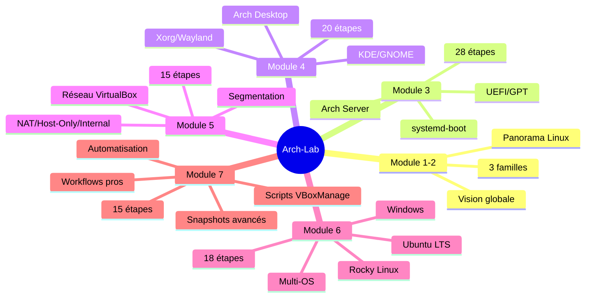

# Module 7 : Annexes & Automatisation Arch-Lab

<div
  class="omny-meta"
  data-level="🟡 Intermédiaire & 🔴 Avancé"
  data-version="0.2"
  data-time="60-90 minutes">
</div>

## Introduction

Les **Modules 1 à 6** vous ont permis de construire un laboratoire Arch-Lab complet et opérationnel :

- **Modules 1-2** : Vision globale et panorama des familles Linux
- **Module 3** : Arch Server minimal (boot UEFI, systemd-boot, services)
- **Module 4** : Arch Desktop complet (KDE Plasma ou GNOME)
- **Module 5** : Réseau VirtualBox professionnel (segmentation NAT/Host-Only/Internal)
- **Module 6** : Intégration multi-OS (Ubuntu, Rocky, Windows)

Vous disposez maintenant d'un **datacenter virtualisé à 5 systèmes** parfaitement interconnectés. Mais un laboratoire professionnel ne s'arrête pas là : il doit être **maintenable**, **automatisable** et **reproductible**.

Ce **Module 7** est le module de référence qui transforme votre lab en **infrastructure professionnelle** avec :

- **Gestion avancée des snapshots** : stratégies de sauvegarde/restauration
- **Scripts d'automatisation VBoxManage** : provisionner/démarrer/arrêter le lab en masse
- **Export/Import OVF** : portabilité et sauvegarde complète
- **Méthodologie de maintenance** : garder le lab à jour sans tout casser
- **Workflows professionnels** : SOC, pentest, DevSecOps, formations
- **Troubleshooting avancé** : résoudre les problèmes complexes multi-systèmes

À la fin de ce module, vous maîtriserez tous les outils nécessaires pour **faire évoluer Arch-Lab dans le temps** sans perdre sa cohérence.

!!! quote "Analogie pédagogique"
    Imaginez que vous avez construit une **usine de production** complète (Modules 1-6).
    
    Le Module 7 vous apprend maintenant à :
    - **Sauvegarder** les plans de l'usine (snapshots)
    - **Automatiser** le démarrage/arrêt des machines (scripts)
    - **Transporter** l'usine sur un autre site (export OVF)
    - **Maintenir** les équipements sans arrêter la production (maintenance)
    - **Optimiser** les processus pour plus d'efficacité (workflows)
    
    C'est la différence entre un prototype fonctionnel et une infrastructure industrielle.

---

## Objectifs d'Apprentissage

À la fin de ce module, **vous serez capable de** :

### Objectifs Techniques

- [ ] Créer une stratégie de snapshots VirtualBox cohérente et documentée
- [ ] Utiliser VBoxManage en ligne de commande pour gérer les VMs en masse
- [ ] Automatiser le démarrage/arrêt de toutes les machines du lab avec des scripts Bash
- [ ] Exporter l'intégralité du lab en format OVF pour sauvegarde/portabilité
- [ ] Importer un lab OVF sur une nouvelle machine hôte
- [ ] Maintenir les systèmes à jour (Arch, Ubuntu, Rocky) sans casser le lab
- [ ] Optimiser les performances VirtualBox pour un lab à 5 VMs
- [ ] Diagnostiquer les problèmes complexes multi-systèmes

### Objectifs Conceptuels

- [ ] Comprendre la différence entre snapshot, sauvegarde d'état et export OVF
- [ ] Saisir l'importance d'une nomenclature cohérente pour snapshots/VMs
- [ ] Maîtriser les workflows professionnels (SOC, pentest, DevSecOps)
- [ ] Anticiper les problèmes de maintenance sur environnements hétérogènes
- [ ] Comprendre les stratégies de backup pour infrastructures virtualisées

---

## Prérequis

Avant de commencer, **assurez-vous d'avoir** :

- [ ] **Modules 1 à 6 validés** : lab Arch-Lab complet et fonctionnel (5 VMs opérationnelles)
- [ ] **Tous les snapshots "Lab-Complete"** créés dans le Module 6
- [ ] **VBoxManage accessible** : ajouté au PATH Windows
  - Chemin typique : `C:\Program Files\Oracle\VirtualBox\VBoxManage.exe`
- [ ] **Git Bash ou PowerShell** : pour exécuter les scripts d'automatisation
- [ ] **Espace disque suffisant** : 100-150 Go libres (pour exports OVF)
- [ ] **60 à 90 minutes** devant vous sans interruption
- [ ] **Bloc-notes** : pour documenter vos stratégies de snapshots

!!! warning "VBoxManage dans le PATH est essentiel"
    Si `VBoxManage --version` ne fonctionne pas dans votre terminal, ajoutez VirtualBox au PATH Windows :
    
    1. **Système** → **Paramètres système avancés** → **Variables d'environnement**
    2. **Variables système** → **Path** → **Modifier**
    3. **Nouveau** → `C:\Program Files\Oracle\VirtualBox`
    4. **OK** → **Redémarrer le terminal**

---

## Comprendre Avant d'Agir : La Philosophie de l'Automatisation

Avant de scripter et automatiser, vous devez comprendre **pourquoi** l'automatisation est critique pour un lab professionnel et **quelles sont les bonnes pratiques**.

### Structure du Module en 15 Étapes

Ce module est organisé en **4 phases principales** :

| Phase | Étapes | Objectif | Durée estimée |
|-------|:------:|----------|:-------------:|
| **Phase 1<br/><small>Snapshots Avancés</small>** | 1 à 4 | Stratégie de naming, arborescence snapshots, gestion avancée | 15-20 min |
| **Phase 2<br/><small>Scripts VBoxManage</small>** | 5 à 9 | Automatisation démarrage/arrêt, clonage, exports, snapshots auto | 25-35 min |
| **Phase 3<br/><small>Maintenance & Optimisation</small>** | 10 à 12 | Mise à jour systèmes, optimisation performances, troubleshooting | 15-20 min |
| **Phase 4<br/><small>Workflows Professionnels</small>** | 13 à 15 | SOC/SIEM, pentest Red/Blue Team, DevSecOps CI/CD, documentation | 15-20 min |

### Ce que Vous Allez Vraiment Faire

Concrètement, vous allez :

- **Étapes 1-2** : _Définir une stratégie de naming snapshots, créer l'arborescence de référence_
- **Étapes 3-4** : _Créer des snapshots thématiques (PRE-TEST, POST-INSTALL, etc.)_
- **Étapes 5-6** : _Écrire des scripts Bash pour démarrer/arrêter toutes les VMs en masse_
- **Étapes 7-8** : _Automatiser la création de snapshots quotidiens, cloner des VMs_
- **Étape 9** : _Exporter l'intégralité du lab en OVF pour sauvegarde_
- **Étapes 10-11** : _Maintenir les systèmes à jour (pacman, apt, dnf), optimiser VirtualBox_
- **Étape 12** : _Diagnostiquer et résoudre les problèmes complexes multi-systèmes_
- **Étapes 13-15** : _Implémenter des workflows SOC/pentest/DevSecOps, documenter le tout_

### Vue d'Ensemble du Processus

Avant de commencer les 15 étapes détaillées, prenez le temps de **visualiser l'ensemble du parcours**. Les deux diagrammes suivants vous donnent une vue macro du processus :

1. **Le diagramme de flux d'automatisation** montre comment les scripts orchestrent le lab
2. **Le diagramme de workflow professionnel** montre les cycles de travail SOC/pentest/DevSecOps

Ces diagrammes sont votre **carte de navigation** pour ce module. Consultez-les régulièrement pour comprendre comment les pièces s'assemblent.

!!! tip "Comment utiliser ces diagrammes"
    - **Avant de commencer** : lisez-les pour comprendre la vision globale
    - **Pendant la configuration** : revenez-y pour vous situer dans le processus
    - **Pour vos projets** : adaptez ces workflows à vos propres besoins

=== "Diagramme de Flux d'Automatisation"

    L'automatisation du laboratoire Arch-Lab repose sur une **chaîne d'outils et de scripts** qui orchestrent les 5 VMs. Ce diagramme montre comment VBoxManage, les scripts Bash et les snapshots s'articulent pour créer un système automatisé.

    **Comment lire ce diagramme ?**

    - Les **rectangles** représentent les actions automatisables
    - Les **losanges** représentent les décisions/points de contrôle
    - Les **flèches** montrent le flux d'exécution
    - Les **couleurs** différencient les types d'opérations (voir légende)

    Ce diagramme vous sert de **référence architecturale** pour comprendre l'automatisation complète du lab.

    ```mermaid
    flowchart TD
        START([Administrateur Lab]) --> DECIDE{Action souhaitée}
        
        DECIDE -->|Démarrer Lab| SCRIPT1[Script start-lab.sh]
        DECIDE -->|Arrêter Lab| SCRIPT2[Script stop-lab.sh]
        DECIDE -->|Snapshot Auto| SCRIPT3[Script snapshot-all.sh]
        DECIDE -->|Exporter Lab| SCRIPT4[Script export-lab.sh]
        
        SCRIPT1 --> VBOX1[VBoxManage startvm<br/>5x systèmes]
        VBOX1 --> CHECK1{Toutes VMs UP ?}
        CHECK1 -->|Oui| READY1[Lab opérationnel]
        CHECK1 -->|Non| DEBUG1[Logs VBox<br/>Diagnostic]
        
        SCRIPT2 --> VBOX2[VBoxManage controlvm<br/>acpipowerbutton 5x]
        VBOX2 --> WAIT[Attente arrêt propre<br/>30-60 secondes]
        WAIT --> CHECK2{Toutes VMs DOWN ?}
        CHECK2 -->|Oui| READY2[Lab arrêté proprement]
        CHECK2 -->|Non| FORCE[VBoxManage poweroff<br/>forcé si nécessaire]
        
        SCRIPT3 --> VBOX3[VBoxManage snapshot take<br/>5x avec date/heure]
        VBOX3 --> READY3[Snapshots créés<br/>LAB-AUTO-2025-01-15]
        
        SCRIPT4 --> VBOX4[VBoxManage export<br/>5x systèmes → OVF]
        VBOX4 --> ARCHIVE[Archive complète<br/>ArchLab-Backup.tar.gz]
        
        READY1 --> WORK[Travail sur Lab<br/>SOC/Pentest/DevSecOps]
        READY3 --> WORK
        
        WORK --> DECIDE2{Continuer ?}
        DECIDE2 -->|Oui| WORK
        DECIDE2 -->|Non| RESTORE{Restaurer ?}
        
        RESTORE -->|Oui| VBOX5[VBoxManage snapshot restore<br/>vers snapshot choisi]
        RESTORE -->|Non| SCRIPT2
        
        VBOX5 --> READY1
        
        style START fill:#e1f5ff
        style DECIDE fill:#fff9c4
        style DECIDE2 fill:#fff9c4
        style RESTORE fill:#fff9c4
        style SCRIPT1 fill:#c8e6c9
        style SCRIPT2 fill:#ffccbc
        style SCRIPT3 fill:#d1c4e9
        style SCRIPT4 fill:#ffe0b2
        style WORK fill:#b2dfdb
        style ARCHIVE fill:#f8bbd0
    ```

    <small>*Ce diagramme illustre l'orchestration complète du laboratoire Arch-Lab via scripts automatisés. L'administrateur peut démarrer/arrêter les 5 VMs en une seule commande, créer des snapshots datés automatiquement, exporter le lab complet en OVF, et restaurer n'importe quel état antérieur en quelques secondes. Les points de contrôle (losanges) vérifient que toutes les opérations se sont bien déroulées. Les couleurs codent les types d'actions : vert = démarrage, rouge = arrêt, violet = snapshot, orange = export, bleu-vert = travail.*</small>

=== "Diagramme de Workflows Professionnels"

    Arch-Lab supporte plusieurs workflows professionnels différents selon les besoins. Ce diagramme montre les trois principaux cycles de travail : SOC/SIEM, Red Team/Blue Team et DevSecOps CI/CD.

    **Que montre ce diagramme ?**

    - **Trois workflows parallèles** : SOC, Pentest, DevSecOps
    - **Leurs étapes spécifiques** : de la préparation au rapport final
    - **Les points communs** : tous partent du même lab, tous utilisent snapshots

    **Comment lire ce diagramme ?**

    - Les **colonnes verticales** représentent les workflows
    - Les **rectangles** sont les étapes de chaque workflow
    - Les **flèches** montrent la progression temporelle
    - Les **couleurs** différencient les workflows (voir légende)

    Ce diagramme vous sert de **guide méthodologique** pour exploiter Arch-Lab professionnellement.

    ```mermaid
    flowchart TB
        subgraph "🛡️ Workflow SOC/SIEM"
            direction TB
            SOC1[1. Snapshot BASE-LAB]
            SOC2[2. Installer SIEM<br/>Arch Server: Wazuh/ELK]
            SOC3[3. Déployer agents<br/>sur 4 autres VMs]
            SOC4[4. Générer événements<br/>logs/alertes]
            SOC5[5. Analyser dashboard<br/>corrélation]
            SOC6[6. Documenter IOCs<br/>playbooks]
            SOC7[7. Restaurer snapshot<br/>recommencer]
            
            SOC1 --> SOC2 --> SOC3 --> SOC4 --> SOC5 --> SOC6 --> SOC7
            SOC7 -.->|Nouvelle itération| SOC1
        end
        
        subgraph "🔴 Workflow Red Team / Blue Team"
            direction TB
            RT1[1. Snapshot PENTEST-BASE]
            RT2[2. Red: Arch Desktop<br/>attaquant Kali tools]
            RT3[3. Blue: Rocky+Ubuntu<br/>défenseurs hardening]
            RT4[4. Windows: cible<br/>Active Directory]
            RT5[5. Exécuter attaque<br/>logs capture réseau]
            RT6[6. Blue: détecter<br/>bloquer/répondre]
            RT7[7. Rapport technique<br/>MITRE ATT&CK]
            RT8[8. Restaurer snapshot<br/>inverser rôles]
            
            RT1 --> RT2 --> RT3 --> RT4 --> RT5 --> RT6 --> RT7 --> RT8
            RT8 -.->|Nouveau scénario| RT1
        end
        
        subgraph "⚙️ Workflow DevSecOps CI/CD"
            direction TB
            DEV1[1. Snapshot DEV-BASE]
            DEV2[2. Code sur Arch Desktop<br/>IDE VSCode/PyCharm]
            DEV3[3. Tests unitaires<br/>Ubuntu: pytest/jest]
            DEV4[4. Build conteneur<br/>Rocky: Docker/Podman]
            DEV5[5. Tests sécurité<br/>SAST/DAST automatisés]
            DEV6[6. Déploiement staging<br/>Arch Server nginx/Apache]
            DEV7[7. Tests intégration<br/>depuis Windows]
            DEV8[8. Snapshot PROD-READY<br/>ou rollback]
            
            DEV1 --> DEV2 --> DEV3 --> DEV4 --> DEV5 --> DEV6 --> DEV7 --> DEV8
            DEV8 -.->|Nouvelle feature| DEV1
        end
        
        style SOC1 fill:#b2dfdb
        style SOC2 fill:#b2dfdb
        style SOC3 fill:#b2dfdb
        style SOC4 fill:#b2dfdb
        style SOC5 fill:#b2dfdb
        style SOC6 fill:#b2dfdb
        style SOC7 fill:#80cbc4
        
        style RT1 fill:#ffccbc
        style RT2 fill:#ffccbc
        style RT3 fill:#ffccbc
        style RT4 fill:#ffccbc
        style RT5 fill:#ffccbc
        style RT6 fill:#ffccbc
        style RT7 fill:#ffccbc
        style RT8 fill:#ef9a9a
        
        style DEV1 fill:#d1c4e9
        style DEV2 fill:#d1c4e9
        style DEV3 fill:#d1c4e9
        style DEV4 fill:#d1c4e9
        style DEV5 fill:#d1c4e9
        style DEV6 fill:#d1c4e9
        style DEV7 fill:#d1c4e9
        style DEV8 fill:#b39ddb
    ```

    <small>*Ce diagramme présente trois workflows professionnels distincts exploitant Arch-Lab. Le workflow **SOC/SIEM** (vert) utilise Arch Server comme plateforme SIEM centralisée et les autres VMs comme sources de logs. Le workflow **Red Team/Blue Team** (rouge) simule des attaques réalistes avec Arch Desktop comme attaquant et Rocky/Ubuntu/Windows comme cibles. Le workflow **DevSecOps** (violet) implémente un pipeline CI/CD complet multi-OS pour tester applications web sur 4 distributions différentes. Tous trois utilisent massivement les snapshots pour itérer rapidement.*</small>

### Différences entre Snapshot, Save State et Export OVF

Avant d'automatiser, comprenez **les trois mécanismes de sauvegarde VirtualBox**.

**Tableau comparatif :**

| Aspect | Snapshot | Save State | Export OVF |
|--------|----------|------------|------------|
| **Capture** | État disque + RAM | RAM uniquement | Disque complet |
| **Taille** | Incrémentale (delta) | ~Taille RAM | ~Taille disque |
| **Restauration** | Instantanée | Instantanée | Nécessite import |
| **Portabilité** | Liée à la VM | Liée à la VM | **Totalement portable** |
| **Cas d'usage** | Points de sauvegarde multiples | Pause/reprise rapide | Backup/migration |
| **Exemple** | LAB-BASE, PRE-TEST, POST-INSTALL | Pause pendant déjeuner | Archivage sur disque externe |

!!! tip "Règle d'or"
    - **Snapshots** : pour itérer rapidement (SOC, pentest, dev)
    - **Save State** : pour mettre en pause sans éteindre
    - **Export OVF** : pour sauvegarder/partager/migrer le lab complet

---

## Phase 1 — Stratégie Avancée des Snapshots (Étapes 1 à 4)

### Étape 1 : Définir une nomenclature cohérente de snapshots

Un lab professionnel nécessite une **nomenclature standardisée** pour éviter la confusion.

**Format recommandé :**

```
<VM>-<PHASE>-<DATE_OPTIONNELLE>
```

**Exemples de phases :**

| Phase | Signification | Exemple | Quand créer |
|-------|---------------|---------|-------------|
| **BASE** | Installation propre, système minimal | `ARCH-SERVER-BASE` | Après Module 3/4 |
| **NET-CONFIG** | Réseau configuré et testé | `UBUNTU-NET-CONFIG` | Après Module 5/6 |
| **LAB-COMPLETE** | Lab multi-OS complet opérationnel | `ROCKY-LAB-COMPLETE` | Après Module 6 |
| **PRE-TEST** | Avant test destructeur/installation lourde | `ARCH-DESKTOP-PRE-TEST` | Avant scénario pentest |
| **POST-INSTALL** | Après installation service/agent | `UBUNTU-POST-WAZUH` | Après install SIEM |
| **PROD-READY** | État production stable | `ARCH-SERVER-PROD-READY` | Avant mise en prod |
| **AUTO** | Snapshot automatique daté | `WINDOWS-AUTO-2025-01-15` | Scripts quotidiens |

**Créer un fichier de référence :**

```bash
# Sur Arch Server ou votre machine préférée
nano ~/arch-lab-snapshot-strategy.md
```

**Contenu du fichier :**

```markdown
# Stratégie de Snapshots Arch-Lab

## Nomenclature Standard

Format : `<VM>-<PHASE>-<DATE_OPTIONNELLE>`

## Snapshots Obligatoires par VM

### Arch Server
- ARCH-SERVER-BASE : après Module 3 (système minimal)
- ARCH-SERVER-NET-CONFIG : après Module 5 (réseau configuré)
- ARCH-SERVER-LAB-COMPLETE : après Module 6 (lab complet)
- ARCH-SERVER-PRE-SIEM : avant installation Wazuh/ELK
- ARCH-SERVER-PROD : état production stable

### Arch Desktop
- ARCH-DESKTOP-BASE : après Module 4 (environnement graphique)
- ARCH-DESKTOP-NET-CONFIG : après Module 5
- ARCH-DESKTOP-LAB-COMPLETE : après Module 6
- ARCH-DESKTOP-DEV : outils dev installés (Docker, Node, Python)

### Ubuntu Lab
- UBUNTU-BASE : après installation initiale
- UBUNTU-NET-CONFIG : après configuration Netplan
- UBUNTU-LAB-COMPLETE : après Module 6
- UBUNTU-AGENT : avec agent SIEM/EDR installé

### Rocky Lab
- ROCKY-BASE : après installation minimale
- ROCKY-NET-CONFIG : après configuration nmcli
- ROCKY-LAB-COMPLETE : après Module 6
- ROCKY-HARDENED : après durcissement SELinux

### Windows Lab
- WINDOWS-BASE : après installation Windows
- WINDOWS-NET-CONFIG : après config réseau statique
- WINDOWS-LAB-COMPLETE : après Module 6
- WINDOWS-AD-DC : configuré comme contrôleur de domaine

## Règles de Gestion

1. **Minimum 1 snapshot BASE par VM** : point de retour fondamental
2. **Snapshot avant modification majeure** : installation service lourd
3. **Snapshot après succès** : figer état stable
4. **Nettoyage mensuel** : supprimer snapshots obsolètes
5. **Export OVF trimestriel** : sauvegarde externe complète

## Scripts Automatiques

- Snapshot quotidien AUTO : tous les soirs à 23h (cron)
- Snapshot PRE-TEST : avant chaque scénario pentest
- Cleanup snapshots > 30 jours : script mensuel
```

**Sauvegarder :** Ctrl+O, Entrée, Ctrl+X

---

### Étape 2 : Créer l'arborescence de snapshots de référence

Maintenant que la nomenclature est définie, créons les snapshots fondamentaux.

**Créer les snapshots BASE (si pas déjà fait) :**

```bash
# Depuis PowerShell ou Git Bash Windows

# Arch Server
VBoxManage snapshot "Arch-Server" take "ARCH-SERVER-BASE" --description "Installation minimale Module 3 - Système propre, boot UEFI, NetworkManager, SSH"

# Arch Desktop
VBoxManage snapshot "Arch-Desktop" take "ARCH-DESKTOP-BASE" --description "Desktop complet Module 4 - KDE Plasma, Xorg, polices, outils essentiels"

# Ubuntu
VBoxManage snapshot "Ubuntu-Lab" take "UBUNTU-BASE" --description "Ubuntu 24.04 LTS minimal - OpenSSH, Netplan configuré"

# Rocky
VBoxManage snapshot "Rocky-Lab" take "ROCKY-BASE" --description "Rocky Linux 9 minimal - dnf, nmcli, SELinux enforcing"

# Windows
VBoxManage snapshot "Windows-Lab" take "WINDOWS-BASE" --description "Windows 10/11 - Compte local, réseau statique, pas de mises à jour"
```

**Vérifier les snapshots créés :**

```bash
# Lister tous les snapshots d'une VM
VBoxManage snapshot "Arch-Server" list

# Résultat attendu :
#    Name: ARCH-SERVER-BASE (UUID: ...)
#    Description: Installation minimale Module 3...
```

!!! success "Snapshots BASE créés"
    Chaque VM a maintenant son point de restauration fondamental.

---

### Étape 3 : Créer des snapshots thématiques avancés

Pour aller plus loin, créons des snapshots spécialisés selon les scénarios.

**Exemple : Snapshot PRE-SIEM pour scénario SOC**

```bash
# Démarrer Arch Server
VBoxManage startvm "Arch-Server"

# (Connectez-vous, faites vos préparatifs)

# Arrêter proprement
VBoxManage controlvm "Arch-Server" acpipowerbutton

# Attendre 30 secondes

# Créer snapshot PRE-SIEM
VBoxManage snapshot "Arch-Server" take "ARCH-SERVER-PRE-SIEM" --description "État avant installation Wazuh SIEM - $(date +%Y-%m-%d)"
```

**Exemple : Snapshot POST-INSTALL après installation Docker**

```bash
# Après installation Docker sur Arch Desktop

# Arrêter la VM
VBoxManage controlvm "Arch-Desktop" acpipowerbutton

# Créer snapshot
VBoxManage snapshot "Arch-Desktop" take "ARCH-DESKTOP-DOCKER" --description "Docker + Docker Compose installés - Prêt pour conteneurs"
```

**Exemple : Snapshot HARDENED pour Rocky avec SELinux renforcé**

```bash
# Après durcissement SELinux, pare-feu, fail2ban sur Rocky

VBoxManage controlvm "Rocky-Lab" acpipowerbutton

VBoxManage snapshot "Rocky-Lab" take "ROCKY-HARDENED" --description "SELinux enforcing + firewalld + fail2ban + auditd"
```

---

### Étape 4 : Restaurer un snapshot (test)

Testons la restauration pour valider le processus.

**Lister les snapshots disponibles :**

```bash
# Voir tous les snapshots d'Arch Server
VBoxManage snapshot "Arch-Server" list
```

**Restaurer un snapshot spécifique :**

```bash
# Restaurer vers ARCH-SERVER-BASE
# ATTENTION : toutes les modifications depuis ce snapshot seront perdues
VBoxManage snapshot "Arch-Server" restore "ARCH-SERVER-BASE"

# Démarrer la VM restaurée
VBoxManage startvm "Arch-Server"
```

**Vérification :**

Connectez-vous et vérifiez que le système est bien dans l'état BASE (pas de Docker, pas de SIEM, configuration réseau basique).

!!! danger "La restauration est destructrice"
    Toutes les modifications faites **après** le snapshot restauré sont **définitivement perdues**. Créez toujours un nouveau snapshot avant de restaurer si vous voulez garder l'état actuel.

**Restaurer et conserver l'état actuel :**

```bash
# 1. Créer snapshot de l'état actuel
VBoxManage snapshot "Arch-Server" take "ARCH-SERVER-AVANT-RESTORE"

# 2. Restaurer vers état souhaité
VBoxManage snapshot "Arch-Server" restore "ARCH-SERVER-BASE"
```

> Ainsi s'achève la Phase Stratégie Avancée des Snapshots (Étapes 1-4)

---

## Phase 2 — Scripts d'Automatisation VBoxManage (Étapes 5 à 9)

### Étape 5 : Script de démarrage en masse du lab

Créez un script pour démarrer toutes les VMs d'un coup.

**Créer le fichier :**

```bash
# Depuis Git Bash ou un éditeur Windows
nano start-lab.sh
```

**Contenu du script :**

```bash
#!/bin/bash
# Script : start-lab.sh
# Description : Démarre toutes les VMs du laboratoire Arch-Lab
# Auteur : [Votre nom]
# Date : $(date +%Y-%m-%d)

# Couleurs pour output
GREEN='\033[0;32m'
BLUE='\033[0;34m'
NC='\033[0m' # No Color

echo -e "${BLUE}=== Démarrage du laboratoire Arch-Lab ===${NC}\n"

# Liste des VMs à démarrer
# L'ordre peut être important (ex: serveur avant desktop)
VMS=(
    "Arch-Server"
    "Arch-Desktop"
    "Ubuntu-Lab"
    "Rocky-Lab"
    "Windows-Lab"
)

# Démarrer chaque VM
for vm in "${VMS[@]}"; do
    echo -e "${GREEN}[INFO]${NC} Démarrage de ${vm}..."
    
    # --type headless : démarre sans fenêtre GUI (en arrière-plan)
    # Remplacer par --type gui si vous voulez voir les fenêtres
    VBoxManage startvm "$vm" --type headless
    
    # Vérifier le code de retour
    if [ $? -eq 0 ]; then
        echo -e "${GREEN}[OK]${NC} ${vm} démarrée avec succès\n"
    else
        echo -e "${RED}[ERREUR]${NC} Échec démarrage ${vm}\n"
    fi
    
    # Pause de 5 secondes entre chaque VM
    # Évite de surcharger l'hôte au démarrage
    sleep 5
done

echo -e "\n${BLUE}=== Laboratoire démarré ===${NC}"
echo -e "${GREEN}[INFO]${NC} Vérifiez l'état avec : VBoxManage list runningvms"
```

**Rendre le script exécutable :**

```bash
chmod +x start-lab.sh
```

**Exécuter le script :**

```bash
# Depuis Git Bash
./start-lab.sh

# Résultat attendu :
# === Démarrage du laboratoire Arch-Lab ===
# [INFO] Démarrage de Arch-Server...
# [OK] Arch-Server démarrée avec succès
# [INFO] Démarrage de Arch-Desktop...
# [OK] Arch-Desktop démarrée avec succès
# ...
```

!!! tip "Variante GUI"
    Pour voir les fenêtres VirtualBox, remplacez `--type headless` par `--type gui` dans le script.

---

### Étape 6 : Script d'arrêt propre en masse du lab

Créez un script pour arrêter proprement toutes les VMs.

**Créer le fichier :**

```bash
nano stop-lab.sh
```

**Contenu du script :**

```bash
#!/bin/bash
# Script : stop-lab.sh
# Description : Arrête proprement toutes les VMs du laboratoire Arch-Lab
# Auteur : [Votre nom]
# Date : $(date +%Y-%m-%d)

# Couleurs
GREEN='\033[0;32m'
BLUE='\033[0;34m'
YELLOW='\033[1;33m'
RED='\033[0;31m'
NC='\033[0m'

echo -e "${BLUE}=== Arrêt du laboratoire Arch-Lab ===${NC}\n"

# Liste des VMs
VMS=(
    "Arch-Server"
    "Arch-Desktop"
    "Ubuntu-Lab"
    "Rocky-Lab"
    "Windows-Lab"
)

# Envoyer signal ACPI à chaque VM
echo -e "${YELLOW}[INFO]${NC} Envoi du signal d'arrêt ACPI à toutes les VMs...\n"

for vm in "${VMS[@]}"; do
    # Vérifier si la VM est en cours d'exécution
    if VBoxManage showvminfo "$vm" | grep -q "State:.*running"; then
        echo -e "${GREEN}[INFO]${NC} Arrêt de ${vm}..."
        
        # acpipowerbutton : équivalent de "cliquer sur le bouton power"
        # Envoie un signal d'arrêt propre au système d'exploitation
        VBoxManage controlvm "$vm" acpipowerbutton
        
        if [ $? -eq 0 ]; then
            echo -e "${GREEN}[OK]${NC} Signal envoyé à ${vm}\n"
        else
            echo -e "${RED}[ERREUR]${NC} Échec signal ${vm}\n"
        fi
    else
        echo -e "${YELLOW}[INFO]${NC} ${vm} déjà arrêtée\n"
    fi
done

# Attendre que toutes les VMs s'arrêtent
echo -e "${YELLOW}[INFO]${NC} Attente arrêt complet (60 secondes max)...\n"
sleep 60

# Vérifier quelles VMs sont encore actives
echo -e "${BLUE}=== Vérification finale ===${NC}\n"

for vm in "${VMS[@]}"; do
    if VBoxManage showvminfo "$vm" | grep -q "State:.*running"; then
        echo -e "${RED}[ATTENTION]${NC} ${vm} encore active"
        echo -e "${YELLOW}[INFO]${NC} Arrêt forcé de ${vm}..."
        VBoxManage controlvm "$vm" poweroff
    else
        echo -e "${GREEN}[OK]${NC} ${vm} arrêtée correctement"
    fi
done

echo -e "\n${BLUE}=== Laboratoire arrêté ===${NC}"
```

**Rendre le script exécutable :**

```bash
chmod +x stop-lab.sh
```

**Exécuter le script :**

```bash
./stop-lab.sh

# Résultat attendu :
# === Arrêt du laboratoire Arch-Lab ===
# [INFO] Arrêt de Arch-Server...
# [OK] Signal envoyé à Arch-Server
# ...
# === Laboratoire arrêté ===
```

!!! warning "Arrêt forcé en dernier recours"
    Le script attend 60 secondes que les VMs s'arrêtent proprement. Si une VM refuse (système gelé), un `poweroff` forcé est envoyé. **Évitez d'utiliser `poweroff` en premier**, cela équivaut à débrancher physiquement la machine (risque de corruption).

---

### Étape 7 : Script de snapshots automatiques datés

Créez un script pour créer automatiquement des snapshots de toutes les VMs avec la date du jour.

**Créer le fichier :**

```bash
nano snapshot-all.sh
```

**Contenu du script :**

```bash
#!/bin/bash
# Script : snapshot-all.sh
# Description : Crée un snapshot daté pour toutes les VMs du lab
# Auteur : [Votre nom]
# Date : $(date +%Y-%m-%d)

# Couleurs
GREEN='\033[0;32m'
BLUE='\033[0;34m'
NC='\033[0m'

# Date du jour au format YYYY-MM-DD
DATE=$(date +%Y-%m-%d)

echo -e "${BLUE}=== Création snapshots automatiques ${DATE} ===${NC}\n"

# Liste des VMs
VMS=(
    "Arch-Server"
    "Arch-Desktop"
    "Ubuntu-Lab"
    "Rocky-Lab"
    "Windows-Lab"
)

# Créer snapshot pour chaque VM
for vm in "${VMS[@]}"; do
    SNAPSHOT_NAME="${vm}-AUTO-${DATE}"
    
    echo -e "${GREEN}[INFO]${NC} Création snapshot ${SNAPSHOT_NAME}..."
    
    # take : créer un snapshot
    # --description : ajouter une description optionnelle
    VBoxManage snapshot "$vm" take "$SNAPSHOT_NAME" \
        --description "Snapshot automatique créé le ${DATE} à $(date +%H:%M:%S)"
    
    if [ $? -eq 0 ]; then
        echo -e "${GREEN}[OK]${NC} Snapshot ${SNAPSHOT_NAME} créé\n"
    else
        echo -e "${RED}[ERREUR]${NC} Échec snapshot ${vm}\n"
    fi
done

echo -e "\n${BLUE}=== Snapshots créés avec succès ===${NC}"
echo -e "${GREEN}[INFO]${NC} Liste des snapshots : VBoxManage snapshot <VM> list"
```

**Rendre le script exécutable :**

```bash
chmod +x snapshot-all.sh
```

**Exécuter le script :**

```bash
./snapshot-all.sh

# Résultat attendu :
# === Création snapshots automatiques 2025-01-15 ===
# [INFO] Création snapshot Arch-Server-AUTO-2025-01-15...
# [OK] Snapshot Arch-Server-AUTO-2025-01-15 créé
# ...
```

!!! tip "Automatisation avec cron (Linux/macOS) ou Tâches planifiées (Windows)"
    Pour exécuter ce script tous les soirs à 23h :
    
    **Linux/macOS (cron) :**
    ```bash
    crontab -e
    # Ajouter :
    0 23 * * * /chemin/vers/snapshot-all.sh
    ```
    
    **Windows (Planificateur de tâches) :**
    1. Ouvrir **Planificateur de tâches**
    2. **Créer une tâche de base**
    3. Déclencheur : Quotidien, 23h00
    4. Action : Démarrer un programme → `C:\Program Files\Git\bin\bash.exe`
    5. Arguments : `/chemin/vers/snapshot-all.sh`

---

### Étape 8 : Script de clonage de VMs

Créez un script pour cloner rapidement une VM (utile pour tests parallèles).

**Créer le fichier :**

```bash
nano clone-vm.sh
```

**Contenu du script :**

```bash
#!/bin/bash
# Script : clone-vm.sh
# Description : Clone une VM avec nouveau nom et UUID
# Usage : ./clone-vm.sh <VM-source> <VM-cible>
# Exemple : ./clone-vm.sh "Arch-Server" "Arch-DNS-Server"

# Couleurs
GREEN='\033[0;32m'
BLUE='\033[0;34m'
RED='\033[0;31m'
NC='\033[0m'

# Vérifier arguments
if [ $# -ne 2 ]; then
    echo -e "${RED}[ERREUR]${NC} Usage : $0 <VM-source> <VM-cible>"
    echo "Exemple : $0 \"Arch-Server\" \"Arch-DNS-Server\""
    exit 1
fi

SOURCE_VM="$1"
TARGET_VM="$2"

echo -e "${BLUE}=== Clonage de ${SOURCE_VM} vers ${TARGET_VM} ===${NC}\n"

# Vérifier que la VM source existe
if ! VBoxManage showvminfo "$SOURCE_VM" &>/dev/null; then
    echo -e "${RED}[ERREUR]${NC} La VM source \"${SOURCE_VM}\" n'existe pas"
    exit 1
fi

# Vérifier que la VM cible n'existe pas déjà
if VBoxManage showvminfo "$TARGET_VM" &>/dev/null 2>&1; then
    echo -e "${RED}[ERREUR]${NC} La VM cible \"${TARGET_VM}\" existe déjà"
    exit 1
fi

# Cloner la VM
echo -e "${GREEN}[INFO]${NC} Clonage en cours...\n"

# clonevm : cloner une VM existante
# --name : nom de la nouvelle VM
# --register : enregistrer automatiquement dans VirtualBox
# --options : link (clone lié) ou full (clone complet)
VBoxManage clonevm "$SOURCE_VM" \
    --name "$TARGET_VM" \
    --register

if [ $? -eq 0 ]; then
    echo -e "\n${GREEN}[OK]${NC} VM ${TARGET_VM} clonée avec succès"
    echo -e "${GREEN}[INFO]${NC} N'oubliez pas de modifier :"
    echo "  - Hostname : sudo hostnamectl set-hostname ${TARGET_VM,,}"
    echo "  - IP interne : modifier 10.10.0.X"
    echo "  - Snapshot : créer un nouveau BASE pour ce clone"
else
    echo -e "\n${RED}[ERREUR]${NC} Échec du clonage"
    exit 1
fi
```

**Rendre le script exécutable :**

```bash
chmod +x clone-vm.sh
```

**Utilisation :**

```bash
# Cloner Arch Server pour créer un serveur DNS dédié
./clone-vm.sh "Arch-Server" "Arch-DNS-Server"

# Résultat attendu :
# === Clonage de Arch-Server vers Arch-DNS-Server ===
# [INFO] Clonage en cours...
# [OK] VM Arch-DNS-Server clonée avec succès
# [INFO] N'oubliez pas de modifier :
#   - Hostname : sudo hostnamectl set-hostname arch-dns-server
#   - IP interne : modifier 10.10.0.X
#   - Snapshot : créer un nouveau BASE pour ce clone
```

!!! warning "Modifier hostname et IP après clonage"
    Le clone aura **les mêmes hostname et IP** que l'original. Vous **devez** les modifier manuellement après le premier boot pour éviter les conflits réseau.

---

### Étape 9 : Script d'export complet du lab en OVF

Créez un script pour exporter toutes les VMs en format OVF (sauvegarde portable).

**Créer le fichier :**

```bash
nano export-lab.sh
```

**Contenu du script :**

```bash
#!/bin/bash
# Script : export-lab.sh
# Description : Exporte toutes les VMs du lab en format OVF
# Auteur : [Votre nom]
# Date : $(date +%Y-%m-%d)

# Couleurs
GREEN='\033[0;32m'
BLUE='\033[0;34m'
YELLOW='\033[1;33m'
NC='\033[0m'

# Répertoire d'export (créer si nécessaire)
EXPORT_DIR="ArchLab-Backup-$(date +%Y-%m-%d)"

echo -e "${BLUE}=== Export du laboratoire Arch-Lab ===${NC}\n"

# Créer répertoire d'export
mkdir -p "$EXPORT_DIR"
echo -e "${GREEN}[INFO]${NC} Répertoire d'export : ${EXPORT_DIR}\n"

# Liste des VMs
VMS=(
    "Arch-Server"
    "Arch-Desktop"
    "Ubuntu-Lab"
    "Rocky-Lab"
    "Windows-Lab"
)

# Exporter chaque VM
for vm in "${VMS[@]}"; do
    OUTPUT_FILE="${EXPORT_DIR}/${vm}.ovf"
    
    echo -e "${GREEN}[INFO]${NC} Export de ${vm}..."
    echo -e "${YELLOW}[INFO]${NC} Fichier : ${OUTPUT_FILE}"
    
    # export : exporter une VM en format OVF
    # -o : chemin du fichier de sortie .ovf
    # --manifest : créer fichier .mf avec checksums SHA256
    # --options : nomacs (pas d'adresses MAC fixes)
    VBoxManage export "$vm" \
        -o "$OUTPUT_FILE" \
        --manifest \
        --options nomacs
    
    if [ $? -eq 0 ]; then
        # Afficher taille du fichier
        SIZE=$(du -sh "$OUTPUT_FILE" | cut -f1)
        echo -e "${GREEN}[OK]${NC} ${vm} exportée (Taille : ${SIZE})\n"
    else
        echo -e "${RED}[ERREUR]${NC} Échec export ${vm}\n"
    fi
done

# Créer archive compressée
echo -e "${BLUE}=== Compression de l'archive ===${NC}\n"
ARCHIVE_NAME="${EXPORT_DIR}.tar.gz"

tar -czf "$ARCHIVE_NAME" "$EXPORT_DIR"

if [ $? -eq 0 ]; then
    ARCHIVE_SIZE=$(du -sh "$ARCHIVE_NAME" | cut -f1)
    echo -e "${GREEN}[OK]${NC} Archive créée : ${ARCHIVE_NAME} (${ARCHIVE_SIZE})"
    echo -e "${YELLOW}[INFO]${NC} Vous pouvez supprimer le répertoire ${EXPORT_DIR} si vous le souhaitez"
else
    echo -e "${RED}[ERREUR]${NC} Échec création archive"
fi

echo -e "\n${BLUE}=== Export terminé ===${NC}"
```

**Rendre le script exécutable :**

```bash
chmod +x export-lab.sh
```

**Exécuter le script :**

```bash
./export-lab.sh

# Résultat attendu :
# === Export du laboratoire Arch-Lab ===
# [INFO] Répertoire d'export : ArchLab-Backup-2025-01-15
# [INFO] Export de Arch-Server...
# [INFO] Fichier : ArchLab-Backup-2025-01-15/Arch-Server.ovf
# [OK] Arch-Server exportée (Taille : 2.3G)
# ...
# === Compression de l'archive ===
# [OK] Archive créée : ArchLab-Backup-2025-01-15.tar.gz (8.5G)
```

!!! warning "Espace disque nécessaire"
    L'export OVF de 5 VMs nécessite **~50-100 Go** d'espace libre. La compression tar.gz réduit d'environ 40-50%.

**Importer le lab sur une autre machine :**

```bash
# Décompresser l'archive
tar -xzf ArchLab-Backup-2025-01-15.tar.gz

# Importer chaque VM
cd ArchLab-Backup-2025-01-15

VBoxManage import Arch-Server.ovf
VBoxManage import Arch-Desktop.ovf
VBoxManage import Ubuntu-Lab.ovf
VBoxManage import Rocky-Lab.ovf
VBoxManage import Windows-Lab.ovf
```

> Ainsi s'achève la Phase Scripts d'Automatisation VBoxManage (Étapes 5-9)

---

## Phase 3 — Maintenance & Optimisation (Étapes 10 à 12)

### Étape 10 : Maintenir les systèmes à jour sans casser le lab

Les systèmes Linux doivent être mis à jour régulièrement, mais **pas n'importe comment** dans un environnement lab.

**Méthodologie de mise à jour sécurisée :**

#### 1. Créer un snapshot PRE-UPDATE

```bash
# Avant toute mise à jour, snapshot de sécurité
VBoxManage snapshot "Arch-Server" take "PRE-UPDATE-$(date +%Y-%m-%d)"
```

#### 2. Mettre à jour Arch Linux (rolling release)

```bash
# Depuis Arch Server ou Arch Desktop
sudo pacman -Syu

# Si mise à jour du noyau, redémarrer
sudo reboot
```

!!! danger "Arch Linux peut parfois casser en rolling release"
    Arch met à jour **tout** le système, y compris le noyau et les librairies système. Une mise à jour peut parfois introduire des incompatibilités. **Toujours** créer un snapshot avant `pacman -Syu`.

#### 3. Mettre à jour Ubuntu LTS (stable)

```bash
# Depuis Ubuntu Lab
sudo apt update
sudo apt upgrade -y

# Si mise à jour du noyau
sudo reboot
```

Ubuntu LTS est beaucoup plus stable, les mises à jour cassent rarement.

#### 4. Mettre à jour Rocky Linux (stable entreprise)

```bash
# Depuis Rocky Lab
sudo dnf update -y

# Si mise à jour du noyau
sudo reboot
```

Rocky est ultra-stable, les mises à jour sont testées pendant des mois avant release.

#### 5. Tester le lab après mise à jour

```bash
# Tester connectivité réseau
ping -c 3 10.10.0.10  # Arch Server
ping -c 3 10.10.0.20  # Arch Desktop
ping -c 3 10.10.0.30  # Ubuntu
ping -c 3 10.10.0.40  # Rocky
ping -c 3 10.10.0.50  # Windows

# Tester SSH
ssh admin@10.10.0.10
```

#### 6. Si tout fonctionne : créer snapshot POST-UPDATE

```bash
VBoxManage snapshot "Arch-Server" take "POST-UPDATE-$(date +%Y-%m-%d)" --description "Mise à jour système réussie"
```

#### 7. Si ça casse : restaurer snapshot PRE-UPDATE

```bash
# Restaurer vers état avant mise à jour
VBoxManage snapshot "Arch-Server" restore "PRE-UPDATE-2025-01-15"

# Redémarrer
VBoxManage startvm "Arch-Server"
```

**Fréquence recommandée :**

| Système | Fréquence | Justification |
|---------|-----------|---------------|
| **Arch Linux** | Hebdomadaire | Rolling release, mises à jour fréquentes |
| **Ubuntu LTS** | Mensuel | Stable, mises à jour de sécurité seulement |
| **Rocky Linux** | Mensuel | Très stable, cycle long |
| **Windows** | Désactivé dans le lab | Évite consommation ressources inutile |

---

### Étape 11 : Optimiser les performances VirtualBox

Un lab à 5 VMs peut consommer **beaucoup de ressources**. Optimisons.

**Tableau d'allocation recommandée :**

| Machine Hôte | Arch Server | Arch Desktop | Ubuntu | Rocky | Windows | Total | Marge |
|--------------|:-----------:|:------------:|:------:|:-----:|:-------:|:-----:|:-----:|
| **RAM 48 Go** | 4 Go | 6 Go | 3 Go | 3 Go | 6 Go | 22 Go | 26 Go ✅ |
| **RAM 32 Go** | 3 Go | 4 Go | 2 Go | 2 Go | 4 Go | 15 Go | 17 Go ✅ |
| **RAM 16 Go** | 2 Go | 2 Go | 1.5 Go | 1.5 Go | 3 Go | 10 Go | 6 Go ⚠️ |

!!! warning "Avec 16 Go de RAM hôte"
    Vous pouvez faire tourner le lab, mais **pas les 5 VMs simultanément**. Démarrez seulement 3-4 VMs à la fois selon vos besoins.

**Optimisations VirtualBox :**

```bash
# Pour chaque VM, appliquer ces optimisations

# Activer PAE/NX (support 64-bit avancé)
VBoxManage modifyvm "Arch-Server" --pae on

# Activer VT-x/AMD-V nested virtualization (si supporté)
VBoxManage modifyvm "Arch-Server" --nested-hw-virt on

# Activer le cache I/O pour le disque (améliore performances)
VBoxManage storagectl "Arch-Server" --name "SATA" --hostiocache on

# Désactiver l'audio (économise ressources)
VBoxManage modifyvm "Arch-Server" --audio none

# Optimiser résolution vidéo (Desktop uniquement)
VBoxManage modifyvm "Arch-Desktop" --vram 128
VBoxManage modifyvm "Arch-Desktop" --accelerate3d on
```

**Script d'optimisation global :**

```bash
#!/bin/bash
# optimize-lab.sh

VMS=("Arch-Server" "Arch-Desktop" "Ubuntu-Lab" "Rocky-Lab" "Windows-Lab")

for vm in "${VMS[@]}"; do
    echo "Optimisation de $vm..."
    VBoxManage modifyvm "$vm" --pae on
    VBoxManage modifyvm "$vm" --nested-hw-virt on
    VBoxManage modifyvm "$vm" --audio none
done

echo "Optimisations appliquées"
```

---

### Étape 12 : Diagnostiquer les problèmes complexes multi-systèmes

**Problème type : Une VM ne peut plus pinguer les autres après mise à jour**

**Méthodologie de diagnostic :**

#### 1. Identifier la VM problématique

```bash
# Depuis chaque VM, tester connectivité
ping -c 3 10.10.0.10
ping -c 3 10.10.0.20
ping -c 3 10.10.0.30
ping -c 3 10.10.0.40
ping -c 3 10.10.0.50
```

Si **Arch Server** ne peut plus pinguer personne, mais les autres se pinguent entre eux → problème sur Arch Server.

#### 2. Vérifier interface réseau

```bash
# Depuis la VM problématique
ip addr show

# Vérifier que enp0s9 (Internal) a bien 10.10.0.10/24
# Si pas d'IP → interface désactivée ou mal configurée
```

#### 3. Vérifier table de routage

```bash
# Afficher routes
ip route show

# Doit contenir :
# 10.10.0.0/24 dev enp0s9 proto kernel scope link src 10.10.0.10
```

#### 4. Vérifier pare-feu

```bash
# Arch/Ubuntu
sudo iptables -L -n -v

# Rocky (firewalld)
sudo firewall-cmd --list-all

# Si règles bloquent ICMP → désactiver temporairement
sudo iptables -F  # Arch/Ubuntu (flush toutes règles)
sudo firewall-cmd --set-default-zone=trusted  # Rocky
```

#### 5. Vérifier configuration VirtualBox

```bash
# Depuis PowerShell Windows
VBoxManage showvminfo "Arch-Server" | Select-String "NIC"

# Vérifier que :
# NIC 3 : Internal Network 'labnet'
```

#### 6. Si tout échoue : restaurer snapshot

```bash
# Restaurer vers dernier snapshot fonctionnel
VBoxManage snapshot "Arch-Server" list
VBoxManage snapshot "Arch-Server" restore "ARCH-SERVER-LAB-COMPLETE"
VBoxManage startvm "Arch-Server"
```

> Ainsi s'achève la Phase Maintenance & Optimisation (Étapes 10-12)

---

## Phase 4 — Workflows Professionnels & Documentation (Étapes 13 à 15)

### Étape 13 : Workflow SOC/SIEM avec Arch-Lab

**Scénario : Déployer un SIEM centralisé et analyser les logs de toutes les machines**

#### Phase 1 : Préparation

```bash
# 1. Créer snapshot de base
./snapshot-all.sh

# 2. Démarrer toutes les VMs
./start-lab.sh
```

#### Phase 2 : Installation SIEM sur Arch Server

```bash
# Depuis Arch Server

# Installer Wazuh SIEM (exemple)
# https://documentation.wazuh.com/current/installation-guide/

# Ou ELK Stack (Elasticsearch, Logstash, Kibana)
# https://www.elastic.co/guide/en/elastic-stack/current/installing-elastic-stack.html

# Ou Graylog
# https://docs.graylog.org/docs/linux
```

#### Phase 3 : Déployer agents sur autres VMs

```bash
# Sur Ubuntu, Rocky, Arch Desktop, Windows
# Installer agent Wazuh/Filebeat/Graylog-sidecar

# Exemple Wazuh agent Ubuntu :
curl -s https://packages.wazuh.com/key/GPG-KEY-WAZUH | apt-key add -
echo "deb https://packages.wazuh.com/4.x/apt/ stable main" | tee /etc/apt/sources.list.d/wazuh.list
apt update
apt install wazuh-agent -y

# Configurer IP du serveur SIEM
echo "WAZUH_MANAGER='10.10.0.10'" > /var/ossec/etc/ossec.conf
systemctl restart wazuh-agent
```

#### Phase 4 : Générer événements et analyser

```bash
# Générer logs SSH (connexions/échecs)
# Générer logs web (accès nginx/apache)
# Générer logs système (erreurs kernel)
# Simuler attaque (brute-force, scan ports)
```

#### Phase 5 : Analyser dashboard SIEM

Accéder à `http://10.10.0.10:5601` (Kibana) ou interface Wazuh et analyser :

- Alertes de sécurité
- Corrélation d'événements
- Détection d'anomalies
- Indicateurs de compromission (IOCs)

#### Phase 6 : Documenter et restaurer

```bash
# Prendre captures d'écran dashboard
# Documenter IOCs trouvés
# Créer playbook de réponse

# Restaurer lab état initial
VBoxManage snapshot "Arch-Server" restore "ARCH-SERVER-LAB-COMPLETE"
# ... pour toutes les VMs
./start-lab.sh
```

---

### Étape 14 : Workflow Red Team / Blue Team avec Arch-Lab

**Scénario : Attaque réseau depuis Arch Desktop vers Rocky/Ubuntu/Windows**

#### Configuration

- **Red Team (attaquant)** : Arch Desktop + outils Kali Linux
- **Blue Team (défenseurs)** : Rocky (firewalld + SELinux) + Ubuntu (ufw + fail2ban) + Windows (Defender)
- **Cible principale** : Windows (Active Directory simulé)

#### Phase 1 : Préparation Red Team

```bash
# Sur Arch Desktop

# Installer outils pentest
sudo pacman -S nmap metasploit hydra nikto wireshark sqlmap

# Lancer scan réseau
nmap -sP 10.10.0.0/24

# Identifier services ouverts sur cibles
nmap -sV -p- 10.10.0.40  # Rocky
nmap -sV -p- 10.10.0.30  # Ubuntu
nmap -sV -p- 10.10.0.50  # Windows
```

#### Phase 2 : Attaque (exemples)

```bash
# Brute-force SSH sur Ubuntu
hydra -l admin -P /usr/share/wordlists/rockyou.txt ssh://10.10.0.30

# Exploitation vulnérabilité web (si serveur web installé)
nikto -h http://10.10.0.40

# Scan SMB Windows
nmap --script smb-vuln* -p 445 10.10.0.50
```

#### Phase 3 : Défense Blue Team

```bash
# Sur Rocky : analyser logs firewall
sudo journalctl -u firewalld | grep REJECT

# Sur Ubuntu : analyser tentatives SSH
sudo tail -f /var/log/auth.log | grep "Failed password"

# Bloquer IP attaquant avec fail2ban
sudo fail2ban-client set sshd banip 10.10.0.20

# Sur Windows : Event Viewer
# Applications and Services Logs → Microsoft → Windows → Security-Auditing
```

#### Phase 4 : Rapport technique

```markdown
# Rapport Red Team / Blue Team - Arch-Lab

## Attaques exécutées
1. Scan réseau complet (nmap)
2. Brute-force SSH Ubuntu (hydra)
3. Scan vulnérabilités SMB Windows

## Détections Blue Team
1. Rocky firewalld : 247 connexions suspectes bloquées
2. Ubuntu fail2ban : IP 10.10.0.20 bannie après 5 tentatives SSH
3. Windows Defender : 2 alertes scan réseau

## Mitigations recommandées
1. Désactiver SSH par mot de passe (clés SSH uniquement)
2. Configurer fail2ban sur tous les systèmes
3. Segmenter davantage le réseau (VLANs)
4. Implémenter IDS/IPS (Suricata/Snort)

## Correspondance MITRE ATT&CK
- T1046 : Network Service Scanning
- T1110.001 : Brute Force (Password Guessing)
- T1021.001 : Remote Services (SSH)
```

---

### Étape 15 : Documentation finale et standardisation

Créez une documentation complète du lab pour référence future.

**Créer le fichier :**

```bash
nano ~/ARCH-LAB-COMPLETE-DOCUMENTATION.md
```

**Contenu recommandé :**

```markdown
# Documentation Complète Arch-Lab

**Version** : 1.0  
**Date** : 2025-01-15  
**Auteur** : [Votre nom]

---

## Table des Matières

1. [Architecture Globale](#architecture-globale)
2. [Plan d'Adressage IP](#plan-dadressage-ip)
3. [Configuration Réseau](#configuration-réseau)
4. [Snapshots de Référence](#snapshots-de-référence)
5. [Scripts d'Automatisation](#scripts-dautomatisation)
6. [Procédures de Maintenance](#procédures-de-maintenance)
7. [Workflows Professionnels](#workflows-professionnels)
8. [Troubleshooting](#troubleshooting)

---

## Architecture Globale

### Vue d'Ensemble

Arch-Lab est un datacenter virtualisé composé de :

- 5 systèmes d'exploitation (Arch Server, Arch Desktop, Ubuntu, Rocky, Windows)
- 3 couches réseau (NAT, Host-Only, Internal)
- 1 réseau privé labnet (10.10.0.0/24)

### Schéma Topologique

```
┌─────────────────────────────────────────────────────────┐
│                     Internet (NAT)                       │
└─────────────────────────────────────────────────────────┘
                          │
     ┌────────────────────┼────────────────────┐
     │                    │                    │
┌────▼─────┐        ┌────▼─────┐        ┌────▼─────┐
│  Arch    │        │  Arch    │        │  Ubuntu  │
│  Server  │        │ Desktop  │        │   Lab    │
└──────────┘        └──────────┘        └──────────┘
     │                    │                    │
     └────────────────────┼────────────────────┘
                          │
                ┌─────────▼─────────┐
                │  Internal Network │
                │   labnet (10.10)  │
                └───────────────────┘
                    │          │
              ┌─────▼────┐ ┌──▼─────┐
              │  Rocky   │ │Windows │
              │   Lab    │ │  Lab   │
              └──────────┘ └────────┘
```

---

## Plan d'Adressage IP

### Réseau Host-Only (192.168.56.0/24)

| Machine | IP | Interface | Usage |
|---------|----|-----------| ------|
| Hôte Windows | 192.168.56.1 | — | Gateway |
| Arch Server | 192.168.56.10 | enp0s8 | SSH admin |
| Arch Desktop | 192.168.56.20 | enp0s8 | SSH admin |
| Windows Lab | 192.168.56.50 | Ethernet 1 | RDP admin |

### Réseau Internal labnet (10.10.0.0/24)

| Machine | IP | Interface | OS | Gestionnaire |
|---------|----|-----------|----|--------------|
| Arch Server | 10.10.0.10 | enp0s9 | Arch Linux | pacman |
| Arch Desktop | 10.10.0.20 | enp0s9 | Arch Linux | pacman |
| Ubuntu Lab | 10.10.0.30 | enp0s8 | Ubuntu 24.04 LTS | apt |
| Rocky Lab | 10.10.0.40 | enp0s8 | Rocky Linux 9 | dnf |
| Windows Lab | 10.10.0.50 | Ethernet 2 | Windows 10/11 | — |

---

## Configuration Réseau

[Détailler pour chaque OS : fichiers config, commandes...]

---

## Snapshots de Référence

### Nomenclature

Format : `<VM>-<PHASE>-<DATE_OPTIONNELLE>`

### Snapshots Obligatoires

| VM | Snapshot | Description |
|----|----------|-------------|
| Arch-Server | ARCH-SERVER-BASE | Après Module 3 |
| Arch-Server | ARCH-SERVER-LAB-COMPLETE | Après Module 6 |
| Arch-Desktop | ARCH-DESKTOP-BASE | Après Module 4 |
| ... | ... | ... |

---

## Scripts d'Automatisation

### start-lab.sh

Démarre toutes les VMs en mode headless.

```bash
./start-lab.sh
```

### stop-lab.sh

Arrête proprement toutes les VMs.

```bash
./stop-lab.sh
```

### snapshot-all.sh

Crée snapshots datés automatiquement.

```bash
./snapshot-all.sh
```

### export-lab.sh

Exporte lab complet en OVF.

```bash
./export-lab.sh
```

---

## Procédures de Maintenance

### Mise à Jour Systèmes

1. Snapshot PRE-UPDATE
2. `sudo pacman -Syu` (Arch)
3. `sudo apt upgrade` (Ubuntu)
4. `sudo dnf update` (Rocky)
5. Tests connectivité
6. Snapshot POST-UPDATE ou restauration

### Nettoyage Snapshots

Mensuel : supprimer snapshots > 30 jours

```bash
VBoxManage snapshot "Arch-Server" delete "ARCH-SERVER-AUTO-2024-12-15"
```

---

## Workflows Professionnels

### SOC/SIEM

1. Installer Wazuh/ELK sur Arch Server
2. Déployer agents sur 4 VMs
3. Générer logs
4. Analyser dashboard
5. Documenter IOCs
6. Restaurer snapshot

### Red Team / Blue Team

1. Arch Desktop = attaquant (nmap, metasploit)
2. Rocky/Ubuntu/Windows = défenseurs
3. Exécuter attaques
4. Détecter et bloquer
5. Rapport MITRE ATT&CK
6. Restaurer snapshot

### DevSecOps CI/CD

1. Code sur Arch Desktop
2. Tests Ubuntu
3. Build Rocky
4. Sécurité SAST/DAST
5. Déploiement Arch Server
6. Tests intégration Windows

---

## Troubleshooting

[Problèmes courants et solutions...]

---

**Ce lab représente 120+ heures de travail (Modules 1-7).**  
**Maintenez-le précieusement, documentez vos modifications, partagez vos découvertes.**
```

**Sauvegarder :** Ctrl+O, Entrée, Ctrl+X

> Ainsi s'achève la Phase Workflows Professionnels & Documentation (Étapes 13-15)

---

## Le Mot de la Fin

### FÉLICITATIONS ! Vous avez terminé l'intégralité d'Arch-Lab.

!!! success "**Vous venez de construire un datacenter virtualisé professionnel complet** avec automatisation, stratégies de sauvegarde, scripts d'orchestration et workflows DevSecOps. C'est une infrastructure de niveau entreprise."

### Ce que vous avez appris dans ce module

!!! success "Compétences Techniques"

    - ✅ Stratégie de snapshots VirtualBox professionnelle
    - ✅ Nomenclature standardisée pour VMs et snapshots
    - ✅ Automatisation VBoxManage (démarrage/arrêt/snapshot/export en masse)
    - ✅ Scripts Bash pour orchestration multi-VMs
    - ✅ Export/Import OVF pour sauvegarde et portabilité
    - ✅ Maintenance systèmes hétérogènes (Arch/Ubuntu/Rocky)
    - ✅ Optimisation performances VirtualBox
    - ✅ Diagnostic problèmes complexes multi-systèmes

!!! success "Compétences Conceptuelles"

    - ✅ Différence entre snapshot/save-state/export
    - ✅ Workflows professionnels SOC/SIEM, Red/Blue Team, DevSecOps
    - ✅ Méthodologie de maintenance sans casser le lab
    - ✅ Stratégies de backup pour infrastructures virtualisées
    - ✅ Philosophie d'automatisation DevOps

### Récapitulatif des Outils Créés

| Outil | Fonction | Fichier |
|-------|----------|---------|
| **start-lab.sh** | Démarre les 5 VMs en headless | Script Bash |
| **stop-lab.sh** | Arrête proprement les 5 VMs | Script Bash |
| **snapshot-all.sh** | Crée snapshots datés automatiques | Script Bash |
| **clone-vm.sh** | Clone une VM avec nouveau UUID | Script Bash |
| **export-lab.sh** | Exporte lab complet en OVF + tar.gz | Script Bash |
| **optimize-lab.sh** | Applique optimisations VirtualBox | Script Bash |
| **Documentation** | Guide complet de référence | Markdown |

### Points Clés à Retenir

Avant de clôturer Arch-Lab, assurez-vous d'avoir compris ces principes fondamentaux :

1. **Snapshots sont incrémentaux** : ils stockent uniquement les différences (deltas)
2. **Export OVF est portable** : peut être importé sur n'importe quelle machine VirtualBox
3. **Automatisation = gain de temps** : 5 minutes de script = heures de clics économisées
4. **Snapshot AVANT toute modification** : règle d'or pour éviter pertes de données
5. **Nomenclature cohérente = professionnalisme** : facilite gestion et collaboration
6. **Maintenance régulière nécessaire** : Arch hebdo, Ubuntu/Rocky mensuel
7. **Lab est un outil, pas une fin** : utilisez-le pour apprendre cyber/DevSecOps
8. **Documentation est critique** : vous oublierez vos choix dans 6 mois

### Comparaison Modules 1-6 vs Module 7

| Aspect | Modules 1-6 | Module 7 (complet) |
|--------|-------------|-------------------|
| **Gestion snapshots** | Manuels | Stratégie automatisée |
| **Démarrage lab** | VM par VM (5 clics) | 1 commande (`./start-lab.sh`) |
| **Arrêt lab** | VM par VM (5 clics) | 1 commande (`./stop-lab.sh`) |
| **Sauvegarde** | Snapshots locaux | Export OVF portable |
| **Maintenance** | Ad-hoc | Procédures documentées |
| **Workflows** | Tests ponctuels | SOC/Pentest/DevSecOps structurés |
| **Documentation** | Éparse | Centralisée et complète |

### Arch-Lab : Bilan Complet des 7 Modules



### Statistiques Finales Arch-Lab

| Métrique | Valeur | Détail |
|----------|--------|--------|
| **Modules** | 7 | Vision → Automatisation |
| **Étapes totales** | ~100 | Modules 3-7 combinés |
| **Systèmes déployés** | 5 | Arch×2, Ubuntu, Rocky, Windows |
| **Réseaux configurés** | 3 | NAT, Host-Only, Internal |
| **Scripts créés** | 6 | start, stop, snapshot, clone, export, optimize |
| **Snapshots recommandés** | 25 | 5 par VM minimum |
| **Temps construction** | 120-150h | Du Module 1 au Module 7 |
| **Espace disque** | 100-150 Go | VMs + snapshots + exports |

### Prochaines Étapes : Au-delà d'Arch-Lab

Vous disposez maintenant d'un laboratoire professionnel complet. Voici comment l'exploiter :

#### Formations Recommandées

1. **Cybersécurité Offensive**
   - Déployer Kali Linux dans labnet
   - Scénarios pentest MITRE ATT&CK
   - Red Team / Purple Team exercises

2. **Cybersécurité Défensive**
   - Installer SIEM (Wazuh/ELK)
   - Déployer EDR (Velociraptor/Osquery)
   - Créer playbooks SOC

3. **DevSecOps**
   - Pipeline CI/CD multi-OS
   - Tests sécurité SAST/DAST
   - Infrastructure as Code (Terraform/Ansible)

4. **Administration Système**
   - Active Directory sur Windows
   - LDAP sur Linux
   - Monitoring (Prometheus/Grafana)

#### Certifications Visées

- **Cybersécurité** : OSCP, CEH, GPEN, GCIH
- **Cloud** : AWS Solutions Architect, Azure Administrator
- **Linux** : RHCSA, RHCE, LFCS
- **DevOps** : CKA, Terraform Associate

#### Ressources Communautaires

- **r/archlinux** : communauté Arch Linux active
- **HackTheBox / TryHackMe** : plateformes pentest
- **GitHub Arch-Lab** : partagez vos scripts et améliorations
- **Discord DevSecOps** : échanges avec pairs

**Vous avez maintenant tous les outils pour devenir un expert DevSecOps/Cyber.**

**Merci d'avoir suivi Arch-Lab jusqu'au bout. Bon lab ! 🚀**

[^1]: **VBoxManage** : outil en ligne de commande de VirtualBox pour gérer VMs sans interface graphique. Permet automatisation via scripts Bash/PowerShell. Équivalent CLI de l'interface VirtualBox Manager.

[^2]: **OVF (Open Virtualization Format)** : format standard ouvert pour décrire et distribuer des machines virtuelles. Portable entre hyperviseurs (VirtualBox, VMware, etc.). Contient fichiers .ovf (description XML), .vmdk (disques) et .mf (checksums).

[^3]: **Snapshot incrémentiels** : VirtualBox stocke uniquement les blocs modifiés depuis le snapshot parent. Économise énormément d'espace disque par rapport à des copies complètes.

[^4]: **MITRE ATT&CK** : base de connaissances publique des tactiques et techniques utilisées par les attaquants cyber. Référence mondiale pour décrire les comportements adversaires. Utilisé dans 90%+ des équipes SOC professionnelles.
