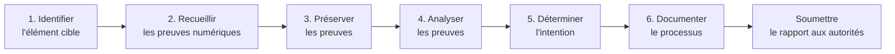

# Module 1 - Fondamentaux de l'investigation numérique

## Introduction

!!! quote "Analogie pédagogique — Le légiste et le chirurgien"
    Un pentester (chirurgien) cherche à exploiter une vulnérabilité pour soigner ou alerter. Un analyste forensic (légiste) cherche à reconstruire une chronologie d'événements à partir de traces résiduelles post-mortem. Les deux métiers utilisent des outils communs (Linux, scripts) mais répondent à des objectifs opposés.

## 1.1 - Définition et finalité

L'investigation numérique (ou *digital forensics*) désigne l'ensemble des techniques permettant de **collecter**, **préserver**, **analyser** et **présenter** des preuves numériques dans un cadre légal. La finalité est triple :

1. **Établir les faits** : qui a fait quoi, quand, comment.
2. **Préserver l'intégrité** : garantir que les preuves n'ont pas été altérées.
3. **Produire un rapport recevable** : exploitable devant une juridiction.

 

---

## 1.2 - Cadre légal en France

L'analyste forensic intervient dans un cadre strictement encadré par le droit. Trois piliers structurent son action :

- **Article 56-1 du Code de procédure pénale** : régit la perquisition et la saisie.
- **Article 230-1 et suivants du Code de procédure pénale** : encadrent l'analyse technique des données saisies.
- **RGPD (Règlement UE 2016/679)** : impose le respect de la vie privée même lors d'une investigation.

Le non-respect de ces textes entraîne **l'irrecevabilité des preuves** devant le tribunal, ce qui anéantit l'utilité de l'investigation.

!!! warning "Conséquence pratique"
    Toute manipulation directe sur le système original peut altérer des métadonnées critiques (dates d'accès, journaux système). Cette altération suffit à faire rejeter les preuves. **L'analyste travaille systématiquement sur une copie**.

 

---

## 1.3 - Les six étapes du processus forensic

Le processus d'investigation suit une séquence rigoureuse, dont chaque étape doit être documentée.

| Étape | Action | Outils typiques |
|---|---|---|
| **1. Identifier** | Repérer l'objet de l'investigation (fichier, machine, compte) | Mandat judiciaire, contexte |
| **2. Recueillir** | Saisir le matériel sous procès-verbal | Sacs Faraday, formulaires de scellés |
| **3. Préserver** | Cloner et hasher pour figer l'état | `dc3dd`, `sha256sum`, FTK Imager |
| **4. Analyser** | Examiner mémoire, disque, journaux | Volatility 3, Autopsy, Sleuth Kit |
| **5. Déterminer** | Croiser les indices pour conclure | Corrélation manuelle, timeline |
| **6. Documenter** | Rédiger un rapport horodaté | Markdown, LaTeX, Word |

 

---

## 1.4 - Principes intangibles

Quatre principes ne souffrent **aucune exception** :

1. **Ne jamais travailler sur l'original** : toute analyse se fait sur un clone bit à bit.
2. **Tracer chaque action** : horodatage précis, identifiant de cas, hash avant/après.
3. **Vérifier l'intégrité** : comparer les empreintes cryptographiques à chaque étape.
4. **Préserver la chaîne de garde** (*chain of custody*) : qui a manipulé la preuve, quand, pour quoi.

 

---

## Conclusion

!!! quote "Ce qu'il faut retenir"
    L'investigation numérique n'est pas qu'une discipline technique : c'est avant tout une discipline juridique. Le non-respect de la chaîne de garde invalide la meilleure des découvertes techniques.

> Maintenant que le cadre théorique est posé, découvrons le scénario sur lequel nous allons travailler dans le **[Module 2 : Étude de cas (Le détournement comptable) →](./02-etude-de-cas.md)**
