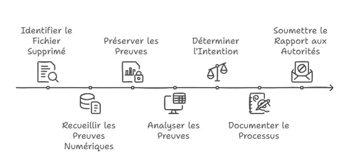
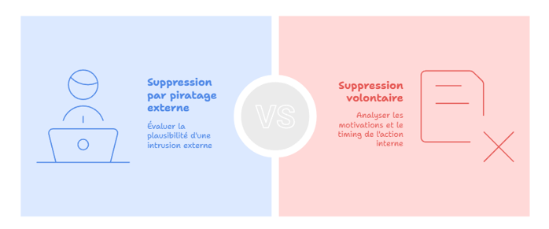

# Module 2 - Étude de cas : Le détournement comptable

<div
  class="omny-meta"
  data-level="🔴 Avancé"
  data-version="Périmètre & Scénario"
  data-time="~15 min">
</div>

## Introduction

!!! quote "Analogie pédagogique — L'art du doute"
    L'analyste forensic ne cherche pas à accabler le suspect, il cherche la vérité. Il doit aborder chaque cas avec l'esprit ouvert et examiner toutes les hypothèses, même celles qui paraissent improbables. C'est le principe du "doute raisonnable".

## 2.1 - Le scénario

Une entreprise fait l'objet d'une suspicion de détournement de fonds. Le **3 mars 2025**, l'administration fiscale annonce un contrôle. 

Le **6 mars 2025**, soit deux jours avant le contrôle, le dirigeant **M. Scro** se connecte à son poste de travail Ubuntu, copie un fichier comptable critique (`comptabilité_2025.xlsx`) sur une clé USB, puis le supprime du disque local. Quelques minutes plus tard, il déclare au fisc avoir été victime d'un piratage.


<p><em>Chronologie des événements : l'annonce du contrôle fiscal précède étrangement la "cyberattaque".</em></p>

Le juge est saisi. Un mandat de perquisition est émis. Le matériel est confisqué et confié à un laboratoire forensic. **Votre mission** : déterminer si la suppression résulte d'une attaque externe ou d'un acte intentionnel de M. Scro.

<br>

---

## 2.2 - Les hypothèses contradictoires

L'enjeu de l'investigation est de **trancher** entre deux narratifs incompatibles :


<p><em>Le rôle de l'analyste n'est pas d'avoir un avis, mais de prouver factuellement quelle branche de cet arbre est la bonne.</em></p>

| Hypothèse | Indices à rechercher | Indices contraires |
|---|---|---|
| **Suppression par piratage externe** (La version de M. Scro) | Connexions SSH suspectes, processus malveillants, élévation de privilèges, modification d'horodatage. | Activité utilisateur normale au moment des faits, commandes locales tracées. |
| **Suppression volontaire interne** (L'accusation) | Commandes `rm` tracées dans l'historique, copie préalable vers un support externe, timing corrélé avec l'annonce du contrôle. | Absence d'historique, journaux altérés cohérents avec une intrusion complexe. |

<br>

---

## 2.3 - Périmètre d'investigation

Le périmètre définit **ce que l'analyste a le droit d'examiner**. Il est fixé par le mandat judiciaire et ne peut être élargi sans nouvelle autorisation.

```mermaid
flowchart TB
    A[Périmètre autorisé] --> B[Machine Ubuntu de M. Scro]
    A --> C[Journaux système et logs]
    A --> D[Mémoire vive RAM et stockage]
    A --> E[Environnement réseau]

    B --> B1[Disque dur clone]
    C --> C1[/var/log<br>~/.bash_history]
    D --> D1[Dump RAM<br>Carving disque]
    E --> E1[Logs SSH<br>Connexions sortantes]
```

!!! danger "Sortir du périmètre"
    Examiner un compte personnel non couvert par le mandat (par exemple la boîte mail privée du conjoint sur le même ordinateur) constitue une **violation de domicile numérique**. Les preuves obtenues seraient irrecevables et l'analyste s'exposerait pénalement.

<br>

---

## 2.4 - Questions auxquelles répondre

L'investigation doit produire des réponses **factuelles** aux questions suivantes :

1. La suppression du fichier `comptabilité_2025.xlsx` était-elle intentionnelle ou non ?
2. Existe-t-il des traces système confirmant ou invalidant la version d'un piratage externe avancée par M. Scro ?
3. Le fichier supprimé peut-il être récupéré dans son intégralité ?
4. L'analyse des journaux permet-elle d'identifier l'auteur technique de la suppression ?

<br>

---

## 2.5 - Méthodologie retenue

L'investigation suivra une approche en cinq axes, alignée sur les recommandations de l'**ANSSI** et du **NIST SP 800-86** (*Guide to Integrating Forensic Techniques into Incident Response*).

| Axe | Description | Outil principal |
|---|---|---|
| **Acquisition et préservation** | Copie forensique avec hachage simultané | `dc3dd`, `sha256sum` |
| **Examen mémoire vive** | Recherche d'indices laissés en RAM | Volatility 3 |
| **Analyse fichiers supprimés** | Carving sur le système de fichiers (ext4) | PhotoRec |
| **Investigation des journaux** | Reconstruction de la chronologie | Bash History, Syslog |
| **Corrélation des preuves** | Recoupement des indices dans une chronologie | Timeline manuelle |

<br>

---

## Conclusion

!!! quote "Ce qu'il faut retenir"
    Avoir un bon scénario en tête est essentiel pour savoir ce que l'on cherche. Les outils ne donnent pas de réponses toutes faites, ils extraient des données brutes qu'il faut contextualiser.

> Les enjeux étant définis, nous allons maintenant monter l'infrastructure technique qui permettra de mener l'enquête en toute sécurité dans le **[Module 3 : Construction du laboratoire forensic →](./03-laboratoire-forensic.md)**
