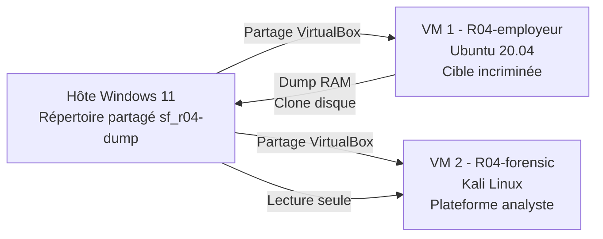
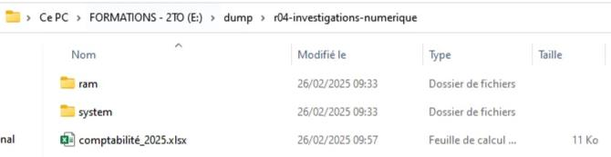
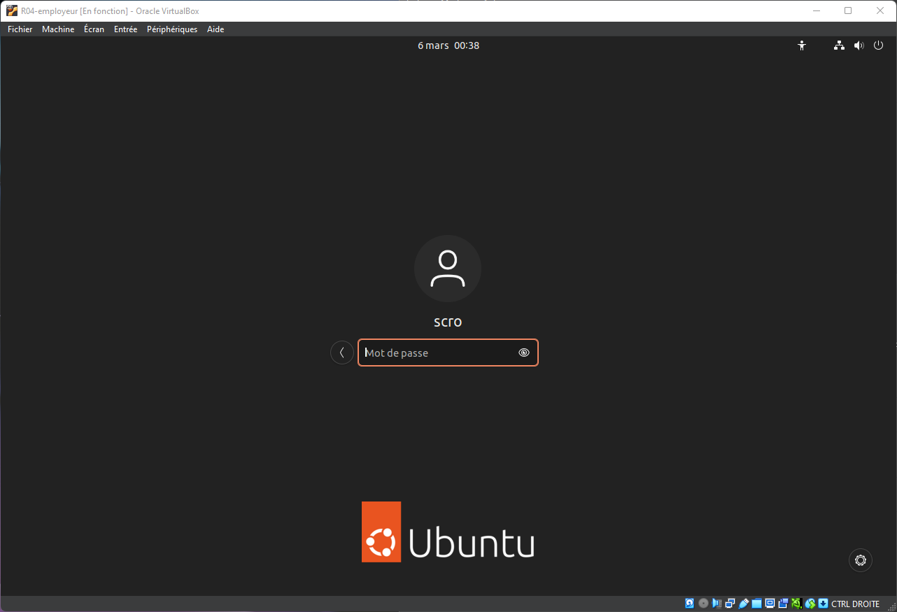
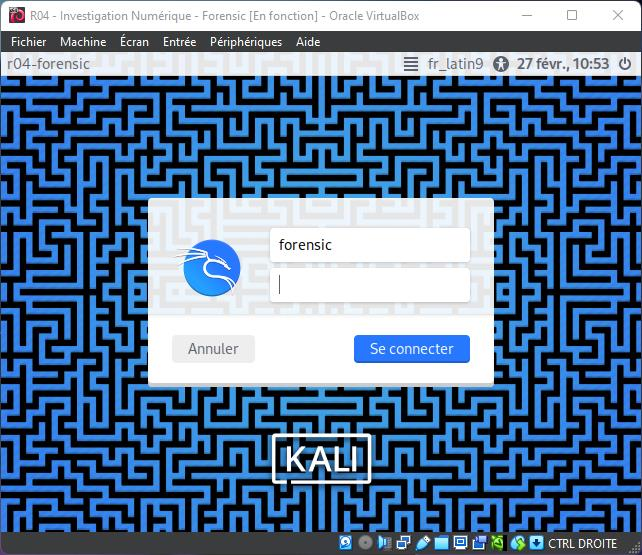
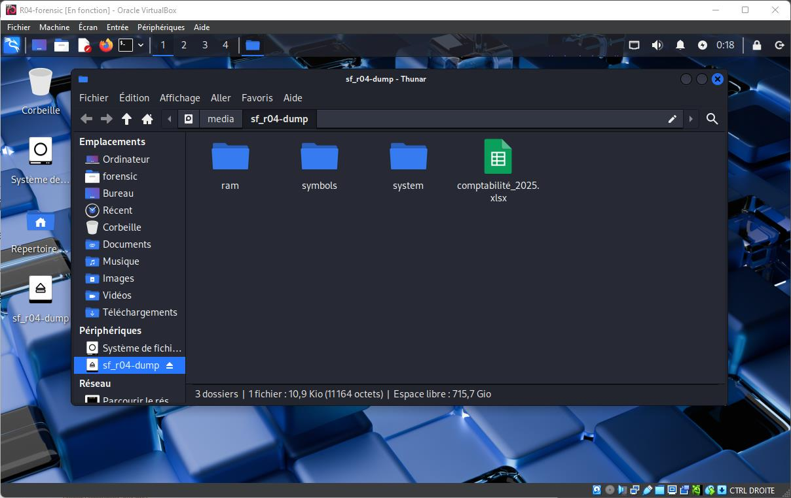

# Module 3 - Construction du laboratoire forensic

<div
  class="omny-meta"
  data-level="🔴 Avancé"
  data-version="Vagrant, VirtualBox"
  data-time="~30 min">
</div>

## Introduction

!!! quote "Analogie pédagogique — La chambre stérile"
    Analyser une preuve sur sa propre machine, c'est comme opérer avec des mains sales : on contamine la scène de crime. Un laboratoire forensic est un environnement "stérile", isolé du monde extérieur, où l'on contrôle strictement les flux entrants et sortants pour garantir que les outils d'analyse ne modifieront jamais la preuve.

## 3.1 - Architecture cible

Le laboratoire repose sur trois entités logiques, hébergées dans VirtualBox :



**Pourquoi cette séparation ?** La VM employeur est mise en pause uniquement pour capturer la mémoire. Toute analyse se fait depuis la VM forensic, qui ne touche jamais directement aux disques de la cible. Le répertoire partagé sert de **zone tampon** entre les deux mondes.

<br>

---

## 3.2 - Spécifications matérielles recommandées

L'utilisateur dispose d'un poste hôte avec 8 Go de RAM consommée par le système et 48 Go de RAM totale. Voici la répartition réaliste :

| Composant | Hôte | VM employeur (Ubuntu) | VM forensic (Kali) |
|---|---|---|---|
| **RAM allouée** | 12 Go | 4 Go | 8 Go |
| **CPU vCPU** | 4 | 2 | 4 |
| **Disque virtuel** | - | 25 Go | 60 Go |
| **Réseau** | - | NAT isolé | NAT isolé |

!!! tip "Optimisation pour postes modestes"
    Si vous disposez de 16 Go de RAM seulement, allouez 2 Go à la VM employeur et 4 Go à la VM forensic. Lancez les VM **séquentiellement** : capture RAM sur l'employeur, arrêt, puis démarrage de la forensic. Vous pouvez aussi utiliser Kali Linux en version *Light* (XFCE) pour réduire la consommation.

<br>

---

## 3.3 - Préparation du répertoire partagé sur l'hôte

Le répertoire partagé est la **zone d'échange** entre l'hôte et les deux VM. Il contient les artefacts à analyser et les sorties de l'analyse.

```text
E:\dump\r04-investigations-numerique\
├── ram\                          # Dumps mémoire vive (.elf, .raw)
├── system\                       # Clones disque
├── symbols\                      # Symboles noyau pour Volatility
└── comptabilite_2025.xlsx        # Fichier piège copié initialement
```


<p><em>Vue depuis l'explorateur Windows : Ce dossier servira de pont étanche entre les deux machines virtuelles.</em></p>

**Configuration VirtualBox du dossier partagé** (dans PowerShell Administrateur) :

```powershell title="Configuration des dossiers partagés (PowerShell)"
# Pour la VM employeur - ajout du dossier partagé en LECTURE/ÉCRITURE
VBoxManage sharedfolder add "R04-employeur" `
    --name "r04-dump" `
    --hostpath "E:\dump\r04-investigations-numerique" `
    --automount

# Pour la VM forensic - ajout du dossier partagé en LECTURE SEULE
VBoxManage sharedfolder add "R04-forensic" `
    --name "r04-dump" `
    --hostpath "E:\dump\r04-investigations-numerique" `
    --readonly `
    --automount
```

!!! warning "Lecture seule sur le poste forensic"
    Imposer le `--readonly` côté analyste est une **bonne pratique de chaîne de garde**. Si la VM forensic est compromise par un malware embarqué dans une preuve, ce dernier ne pourra pas réécrire les artefacts originaux.

<br>

---

## 3.4 - Configuration de la VM employeur (Ubuntu)

La VM représente le poste de travail du suspect. Elle simule un usage standard.

### Vagrantfile pour reproductibilité

Pour rendre le laboratoire reproductible, voici un `Vagrantfile` minimaliste pour la VM employeur.

```ruby title="Vagrantfile - R04-employeur"
# Vagrantfile - VM employeur (Ubuntu 22.04 LTS)
Vagrant.configure("2") do |config|
  config.vm.box = "ubuntu/jammy64"
  config.vm.hostname = "r04-employeur"
  config.vm.define "r04-employeur"

  # Réseau privé interne (isolation totale)
  config.vm.network "private_network", ip: "192.168.56.10"

  # Dossier partagé synchronisé avec l'hôte
  config.vm.synced_folder "E:/dump/r04-investigations-numerique",
                          "/media/r04-dump",
                          create: true

  # Configuration du provider VirtualBox
  config.vm.provider "virtualbox" do |vb|
    vb.name   = "R04-employeur"
    vb.memory = 4096
    vb.cpus   = 2
    vb.gui    = true # Interface graphique pour simuler l'utilisateur

    # Création d'un disque secondaire simulant une clé USB
    file_to_disk = "./usb-employeur.vdi"
    unless File.exist?(file_to_disk)
      vb.customize ["createhd", "--filename", file_to_disk, "--size", 1024]
    end
    vb.customize ["storageattach", :id,
                  "--storagectl", "SATA Controller",
                  "--port", 1, "--device", 0,
                  "--type", "hdd", "--medium", file_to_disk]
  end

  # Provisioning : création du compte scro
  config.vm.provision "shell", inline: <<-SHELL
    apt-get update && apt-get install -y ubuntu-desktop-minimal
    useradd -m -s /bin/bash scro
    echo "scro:Forensic2025!" | chpasswd
    usermod -aG sudo scro
  SHELL
end
```


<p><em>Création du compte suspect "scro" sur la VM Ubuntu, avec des droits sudo pour pouvoir commettre des actes malveillants profonds.</em></p>

<br>

---

## 3.5 - Configuration de la VM forensic (Kali Linux)

La VM forensic est la plateforme depuis laquelle l'analyste mène toutes les opérations. **Kali Linux** embarque nativement la majorité des outils requis.

### Vagrantfile pour la VM forensic

```ruby title="Vagrantfile - R04-forensic"
# Vagrantfile - VM forensic (Kali Linux)
Vagrant.configure("2") do |config|
  config.vm.box = "kalilinux/rolling"
  config.vm.hostname = "r04-forensic"
  config.vm.define "r04-forensic"

  # Isolation totale du réseau
  config.vm.network "private_network", ip: "192.168.56.20"

  # Dossier partagé en LECTURE SEULE (chaîne de garde)
  config.vm.synced_folder "E:/dump/r04-investigations-numerique",
                          "/media/sf_r04-dump",
                          mount_options: ["ro"]

  config.vm.provider "virtualbox" do |vb|
    vb.name   = "R04-forensic"
    vb.memory = 8192 # Volatility est très gourmand en RAM
    vb.cpus   = 4
    vb.gui    = true
  end

  # Outils essentiels
  config.vm.provision "shell", inline: <<-SHELL
    apt-get update
    apt-get install -y python3-pip dc3dd testdisk sleuthkit autopsy foremost
    useradd -m -s /bin/bash forensic
    echo "forensic:Analyse2025!" | chpasswd
  SHELL
end
```


<p><em>Démarrage de notre plateforme d'investigation propre et isolée.</em></p>


<p><em>Vérification cruciale : Le dossier contenant les preuves (sf_r04-dump) est bien monté en lecture seule sur Kali, préservant ainsi la chaîne de garde (Chain of Custody).</em></p>

<br>

---

## Conclusion

!!! quote "Ce qu'il faut retenir"
    Un bon laboratoire d'investigation isole techniquement la cible (le suspect) de l'analyste, tout en permettant un transfert sécurisé et en lecture seule des preuves vers la plateforme d'analyse (Kali).

> Maintenant que l'infrastructure est prête, nous allons jouer le rôle du suspect et commettre "le crime parfait" dans le **[Module 4 : Simulation de l'acte malveillant →](./04-simulation-malveillante.md)**
