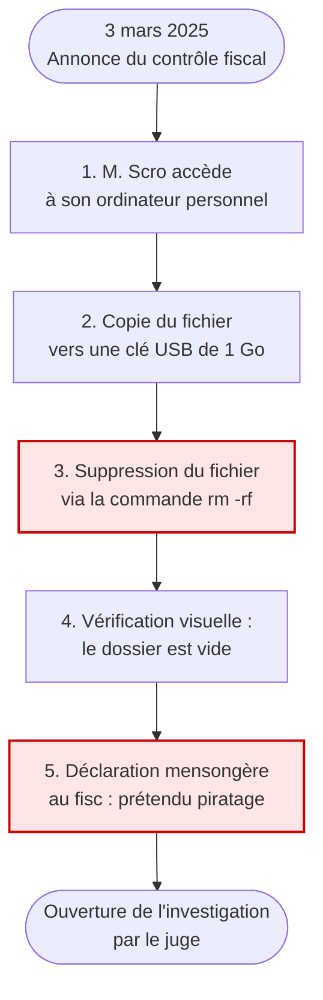
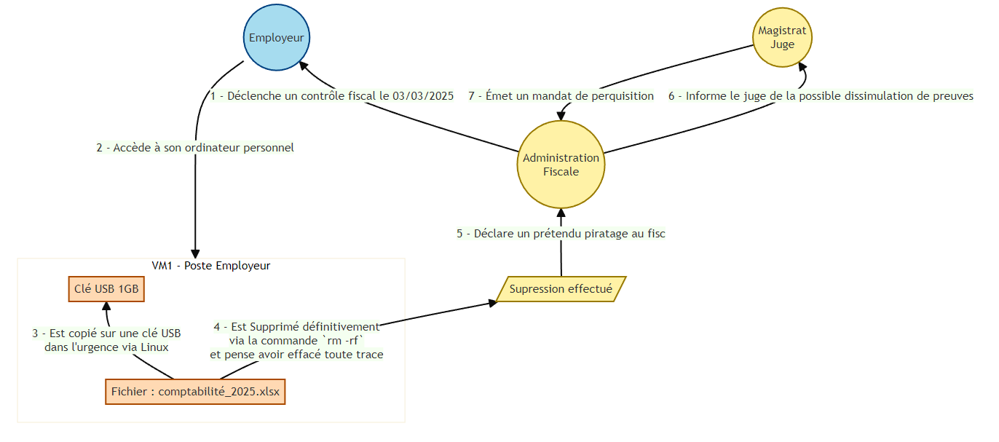
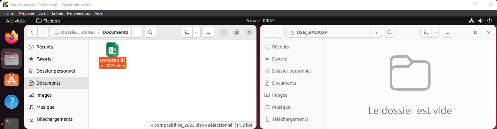
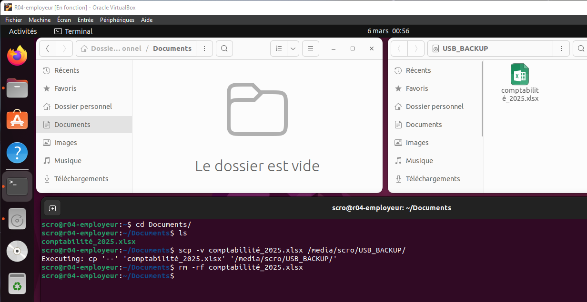

# Module 4 - Simulation de l'acte malveillant

<div
  class="omny-meta"
  data-level="🟠 Intermédiaire"
  data-version="Python, Bash"
  data-time="~20 min">
</div>

## Introduction

!!! quote "Analogie pédagogique — L'acteur en répétition"
    Pour comprendre le parcours d'un cambrioleur, le meilleur moyen est souvent de cambrioler soi-même la pièce pour voir où l'on pose les mains. Ce module n'est pas de l'analyse, mais de la **génération d'artefacts**. Nous allons jouer le rôle du suspect pour semer volontairement les traces que nous chercherons plus tard.

## 4.1 - Schéma global de la simulation

Avant de manipuler les outils, visualisez la chronologie complète des événements. Elle servira de fil conducteur pour interpréter chaque artefact retrouvé.




<p><em>Rappel contextuel du déroulement logique tel qu'il doit être reconstruit par le laboratoire.</em></p>

<br>

---

## 4.2 - Création du fichier piège (Python)

Pour les besoins de la simulation, un fichier Excel fictif est généré avec **Python** et **pandas**. Ce fichier contient des transactions normales et frauduleuses, ces dernières étant les éléments à dissimuler.

```python title="Générateur de base de données factice (Python)"
# Importation des bibliothèques nécessaires
import pandas as pd
import random
from datetime import datetime, timedelta

# Fixation de la graine pour reproductibilité (Ne jamais faire en prod !)
random.seed(42)

start_date = datetime(2025, 1, 1)
dates = [start_date + timedelta(days=random.randint(1, 365)) for _ in range(50)]

clients = ["Société A", "Société B", "Entreprise C", "Particulier D", "SARL E"]
comptes_bancaires = [
    "FR76 1234 5678 9012 3456 7890 123",
    "FR76 9876 5432 1098 7654 3210 987"
]

# Génération : 10 fraudes (5000-25k) et 40 normales (500-5000)
fraudulent_amounts = [random.randint(5000, 25000) for _ in range(10)]
regular_amounts = [random.randint(500, 5000) for _ in range(40)]

all_amounts = fraudulent_amounts + regular_amounts
random.shuffle(all_amounts)

df = pd.DataFrame({
    "Date": dates,
    "Client": [random.choice(clients) for _ in range(50)],
    "Compte Bancaire": [random.choice(comptes_bancaires) for _ in range(50)],
    "Montant (€)": all_amounts,
    "Type": ["Virement" if amount > 5000 else "Achat CB" for amount in all_amounts],
    "Référence": [f"REF{random.randint(100000, 999999)}" for _ in range(50)],
    "Statut": ["Validé"] * 50
})

df.to_excel("comptabilite_2025.xlsx", index=False)
```

!!! example "Personnalisation du cas"
    Pour un cas d'étude plus réaliste, ajoutez des colonnes comme **Pays de destination** ou **Bénéficiaire réel**, qui sont les indicateurs cherchés par les contrôleurs fiscaux dans les affaires de blanchiment.

<br>

---

Voici la séquence exacte des commandes saisies par M. Scro sur la machine cible `R04-employeur` :


<p><em>Vue du répertoire personnel de l'utilisateur : le fichier comptable est présent et visible.</em></p>

```bash title="Simulation de la destruction par l'utilisateur (Bash)"
# Vérification que le fichier est présent
cd Documents/
ls

# Copie sécurisée vers la clé USB montée automatiquement (-v = mode verbeux)
scp -v comptabilité_2025.xlsx /media/scro/USB_BACKUP/

# Suppression récursive et forcée du fichier original
rm -rf comptabilité_2025.xlsx

# Vérification visuelle que le fichier a disparu
ls
```


<p><em>Le fichier a été "supprimé" (ou plutôt désindexé) de l'interface, laissant croire au succès de l'opération.</em></p>

### Empreinte temporelle des actions

Les horodatages capturés lors de cette simulation seront les éléments-clés du futur rapport :

| Heure (Simulée) | Action | Trace attendue |
|---|---|---|
| **08:46:18 UTC** | `scp -v comptabilité_2025.xlsx ...` | Historique bash, métadonnées clé USB |
| **08:46:28 UTC** | `rm -rf comptabilité_2025.xlsx` | Historique bash, inode libéré |
| **08:46:30 UTC** | `ls` (vérification visuelle) | Historique bash |

!!! danger "Pourquoi `rm` ne suffit pas ?"
    La commande `rm` se contente de **supprimer l'inode** et de marquer les blocs disque comme libres. Le contenu réel reste sur le disque jusqu'à réécriture. Pour un effacement définitif, le suspect aurait dû utiliser `shred` ou `wipe`. C'est cette erreur qui va permettre à l'analyste de récupérer les données plus tard !

<br>

---

## Conclusion

!!! quote "Ce qu'il faut retenir"
    Les traces sont semées. L'ordinateur cible contient désormais dans sa mémoire vive (historique de terminal non écrit sur disque) et sur ses secteurs effacés les preuves irréfutables du délit.

> L'acte malveillant étant commis et la machine confisquée par la justice, il est temps d'entrer en scène en tant qu'analyste forensic pour extraire ces preuves dans le **[Module 5 : Acquisition et préservation des preuves →](./05-acquisition-preuves.md)**
