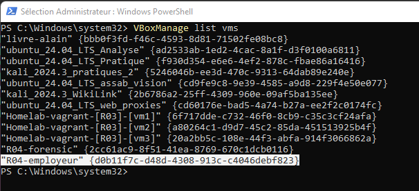
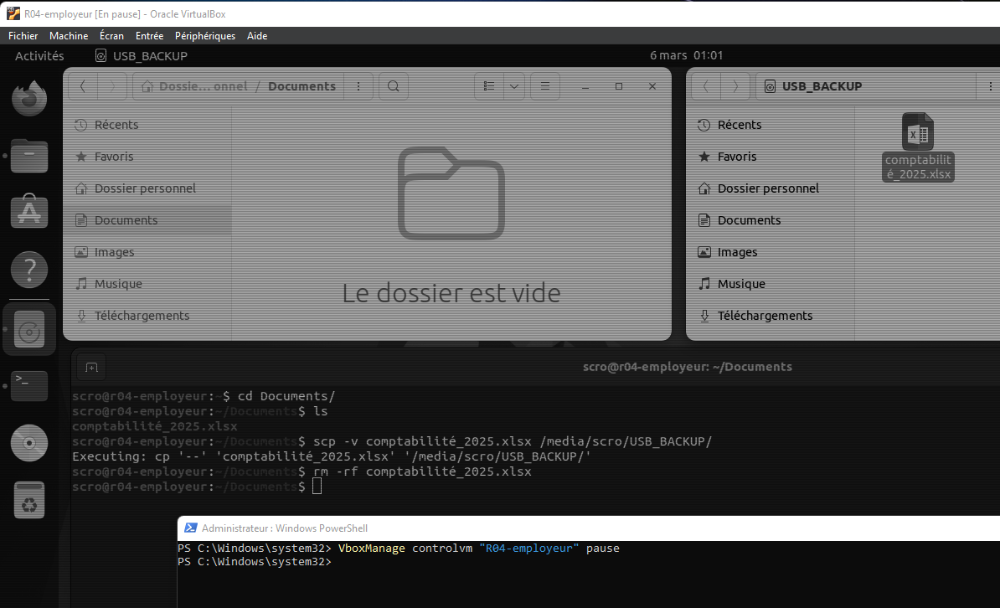
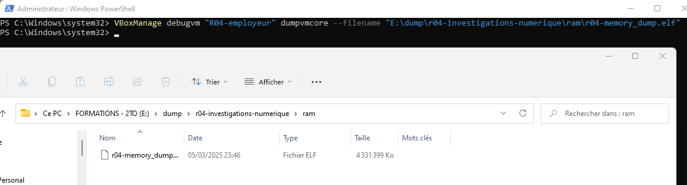
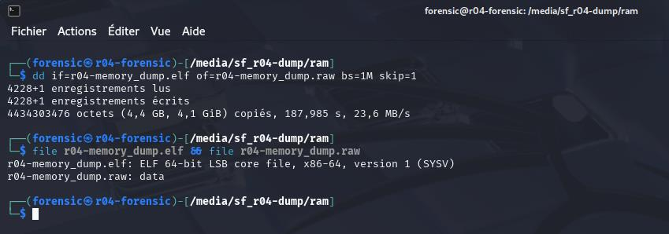
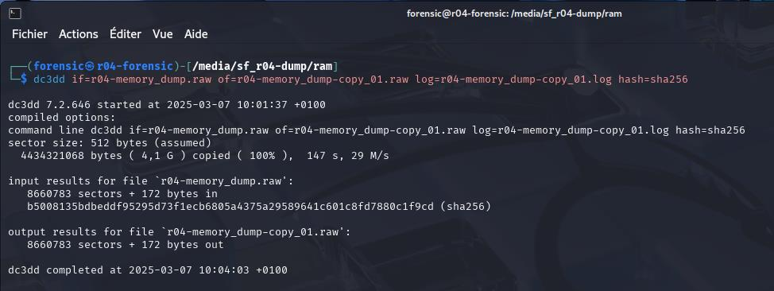
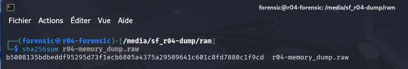

# Module 5 - Acquisition et préservation

<div
  class="omny-meta"
  data-level="🔴 Avancé"
  data-version="dc3dd, VirtualBox, SHA-256"
  data-time="~20 min">
</div>

## Introduction

!!! quote "Analogie pédagogique — L'empreinte de la scène de crime"
    Acquérir une preuve numérique, c'est comme figer une scène de crime dans l'ambre. L'analyste forensic ne travaille jamais sur la machine du suspect, il fait un moulage parfait de cette machine. S'il casse le moulage lors de l'analyse, ce n'est pas grave : la machine d'origine, elle, reste intacte et scellée sous la garde du tribunal.

## 5.1 - Le principe du clonage forensique

C'est **le principe fondamental** de tout le métier d'investigateur numérique.

| Risque sans clone | Conséquence juridique |
|---|---|
| Modification accidentelle d'un fichier | Altération des dates d'accès, preuves rejetées |
| Crash du système original | Perte définitive des artefacts |
| Outils forensic destructifs | Le simple `mount` modifie certains journaux ext4 |
| Erreur d'analyse | Impossible de recommencer sur l'original |

L'analyste fait **systématiquement deux niveaux de copie** :

1. Le **clone maître** depuis l'original, immédiatement scellé après vérification du hash.
2. Une **copie de travail** issue du clone maître. C'est sur cette copie que toutes les analyses sont faites.

<br>

---

## 5.2 - Acquisition de la mémoire vive (RAM)

La RAM est un artefact volatile. Si la VM est encore en cours d'exécution au moment de la saisie par la police, c'est la **première étape absolue** à réaliser, avant même d'éteindre la machine.

### 5.2.1 Mise en pause sans extinction

**Pourquoi pause et non suspend ?** `pause` fige l'état mémoire **sans le sérialiser sur disque** ni le modifier.

```powershell title="Figer l'état de la machine (PowerShell)"
# Lister toutes les VM enregistrées
VBoxManage list vms

# Mise en pause de la VM cible
VBoxManage controlvm "R04-employeur" pause
```


<p><em>Identification de l'ID de la machine virtuelle incriminée.</em></p>


<p><em>La VM est figée (Paused). Le système invité ne sait pas que le temps s'est arrêté pour lui.</em></p>

### 5.2.2 Capture du dump mémoire (ELF)

VirtualBox propose nativement une commande pour extraire la RAM d'une VM en cours d'exécution.

```powershell title="Extraction du Core Dump mémoire (PowerShell)"
# Capture du dump mémoire au format ELF
VBoxManage debugvm "R04-employeur" dumpvmcore `
    --filename "E:\dump\r04-investigations-numerique\ram\r04-memory_dump.elf"

# On peut maintenant rétablir la VM ou l'éteindre
VBoxManage controlvm "R04-employeur" resume
```


<p><em>Extraction réussie du fichier ELF contenant la mémoire vive brute.</em></p>

### 5.2.3 Conversion ELF vers RAW (Kali)

Le format **ELF** n'est pas directement exploitable par notre outil d'analyse (Volatility). Il faut le convertir au format de données brutes (**RAW**).

```bash title="Extraction des données brutes (Bash)"
cd /media/sf_r04-dump/ram/

# Conversion avec dd (skip=1 enlève l'en-tête ELF pour ne garder que la data pure)
dd if=r04-memory_dump.elf of=r04-memory_dump.raw bs=1M skip=1

# Vérification
file r04-memory_dump.raw
# Doit renvoyer : "data"
```


<p><em>Extraction de la "data pure" avec la commande dd, pour la rendre lisible par Volatility.</em></p>

!!! warning "Attention au flag skip"
    Le `skip=1` (saut de 1 Mo) part du principe que l'en-tête ELF de VirtualBox tient sur un bloc de 1 Mo. Pour des serveurs de plus de 32 Go de RAM, l'en-tête peut déborder. Dans le doute, l'outil `readelf` permet de vérifier la taille exacte.

<br>

---

## 5.3 - Chaîne de garde cryptographique (SHA-256)

La chaîne de garde repose sur le **hachage SHA-256** des artefacts. À chaque manipulation, on calcule une empreinte unique. Si elle correspond à celle de référence, le fichier est juridiquement valide.

### Création de la copie de travail avec `dc3dd`

L'outil **dc3dd** (issu du *DoD Cyber Crime Center*) est conçu pour l'investigation : il calcule le hash **pendant** la copie.

```bash title="Copie forensique certifiée (Bash)"
# if : fichier original
# of : copie de travail
# log : horodatage pour le rapport
dc3dd if=r04-memory_dump.raw \
      of=r04-memory_dump-copy_01.raw \
      log=r04-memory_dump-copy_01.log \
      hash=sha256
```


<p><em>Remarquez que dc3dd vérifie l'intégrité secteur par secteur et calcule le hash à la volée.</em></p>

### Vérification de l'intégrité

L'analyste calcule le hash du fichier d'origine de manière indépendante :

```bash
sha256sum r04-memory_dump.raw
```


<p><em>Le hash du fichier original correspond parfaitement au hash de la copie calculé précédemment par dc3dd. La validité juridique est établie.</em></p>

**Tableau de correspondance pour le rapport final :**

| Artefact | Hash (SHA-256) | Horodatage | Validité |
|---|---|---|---|
| `r04-memory_dump.raw` (Original) | `b5008135bdbeddf9...c1f9cd` | 07/03/2025 10:06 | ✅ Référence |
| `r04-memory_dump-copy_01.raw` (Copie) | `b5008135bdbeddf9...c1f9cd` | 07/03/2025 10:01 | ✅ Intacte |

<br>

---

## Conclusion

!!! quote "Ce qu'il faut retenir"
    Vous disposez désormais d'un "cliché" parfait de la mémoire de l'ordinateur de M. Scro au moment précis de l'intervention. L'empreinte cryptographique garantit que ce fichier n'a pas été retouché.

> Maintenant que la preuve volatile est préservée, nous allons l'analyser pour découvrir ce que le suspect était en train de faire sur son terminal grâce à **[Module 6 : Analyse de la mémoire avec Volatility 3 →](./06-analyse-volatility.md)**
