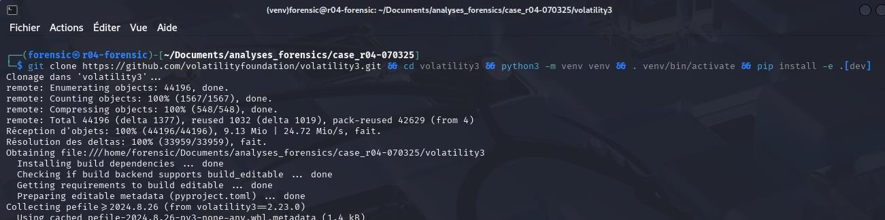
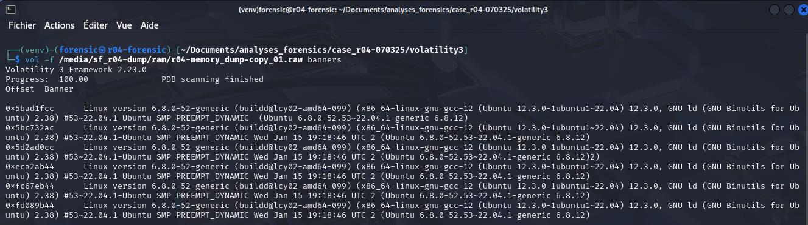
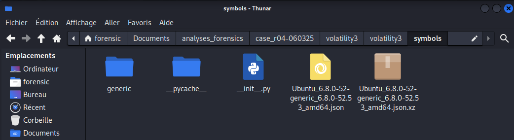
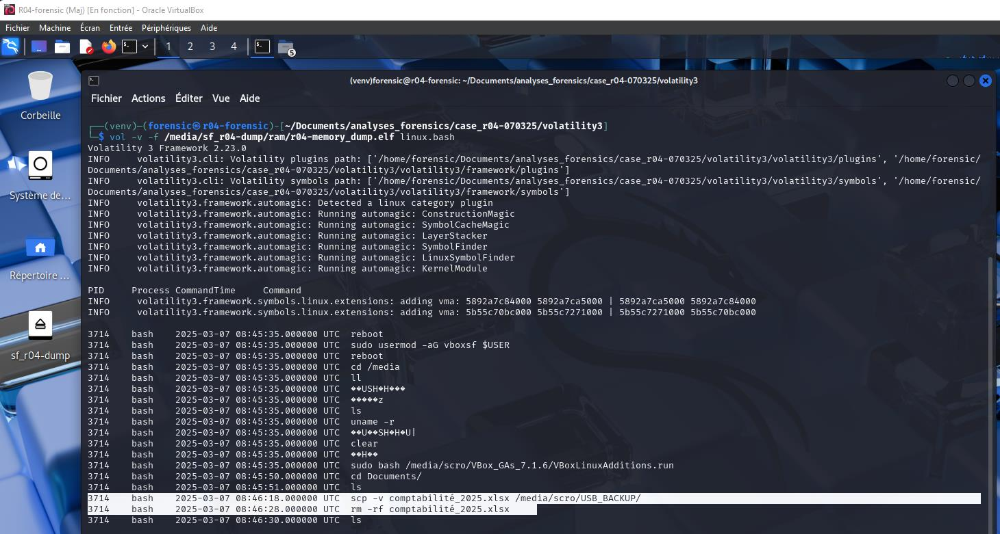

# Module 6 - Analyse de la mémoire avec Volatility 3

<div
  class="omny-meta"
  data-level="🔴 Avancé"
  data-version="Volatility 3, Python 3"
  data-time="~30 min">
</div>

## Introduction

!!! quote "Analogie pédagogique — Le traducteur et le dictionnaire"
    Lire un fichier brut de mémoire vive (RAW), c'est comme lire un texte en égyptien ancien. Il y a de l'information, mais elle n'est pas structurée pour un humain. **Volatility 3** est le traducteur, et le fichier de **Symboles Noyau** est sa pierre de Rosette. Sans le bon dictionnaire (la bonne version exacte du noyau Linux), Volatility ne pourra rien traduire.

## 6.1 - Installation de Volatility 3

Volatility est le framework standard de facto pour l'analyse de mémoire. Sa version 3 est entièrement réécrite en Python 3 et gère les architectures modernes via un système de plugins (`linux.bash`, `windows.pslist`, etc.).

```bash title="Installation isolée de Volatility (Kali Linux)"
# Création du dossier d'investigation
mkdir -p ~/Documents/analyses_forensics/case_r04-070325/
cd ~/Documents/analyses_forensics/case_r04-070325/

# Clonage officiel
git clone https://github.com/volatilityfoundation/volatility3.git
cd volatility3

# Création d'un environnement virtuel Python (bonne pratique)
python3 -m venv venv
source venv/bin/activate

# Installation avec dépendances
pip install -e ".[dev]"

# Vérification
vol --version
```


<p><em>Vérification de l'installation réussie du framework Volatility dans notre environnement virtuel Python.</em></p>

<br>

---

## 6.2 - Identification du noyau cible

Pour décoder la mémoire d'un système Linux, Volatility doit savoir exactement comment le noyau cible (celui de l'ordinateur de M. Scro) organisait ses données.

```bash title="Recherche de la signature noyau en mémoire (Bash)"
# Le plugin 'banners' extrait les chaînes d'identification en mémoire brute
vol -f /media/sf_r04-dump/ram/r04-memory_dump-copy_01.raw banners

# Sortie extraite :
# Offset      Banner
# 0x5bad1fcc  Linux version 6.8.0-52-generic (buildd@lcy02-amd64-099) ...
```


<p><em>Le plugin banners retrouve la chaîne de caractères exacte du kernel. Sans cela, impossible de continuer l'investigation.</em></p>

**Information clé** : La machine cible tournait sous Ubuntu 22.04 avec le noyau `6.8.0-52-generic`.

<br>

---

## 6.3 - Gestion des symboles noyau

Maintenant que l'on connaît la version, il faut télécharger le fichier JSON de symboles correspondant et le placer dans l'arborescence de Volatility.

```bash title="Téléchargement du pack de symboles (Bash)"
mkdir -p volatility3/symbols/linux/
cd /tmp

# Les packs pré-compilés par la fondation
wget https://downloads.volatilityfoundation.org/volatility3/symbols/linux.zip
unzip linux.zip -d ~/Documents/analyses_forensics/case_r04-070325/volatility3/volatility3/symbols/

# Vérification
ls ~/Documents/analyses_forensics/case_r04-070325/volatility3/volatility3/symbols/linux/ | grep "6.8.0-52"
```


<p><em>Le fichier JSON de notre noyau cible est bien présent dans l'arborescence des symboles de Volatility.</em></p>

!!! tip "Génération manuelle"
    Si le noyau n'est pas dans le pack officiel, il faut utiliser l'outil `dwarf2json` sur une machine saine ayant la même version d'Ubuntu, pour compiler le dictionnaire soi-même à partir des paquets de débogage (`linux-image-*-dbgsym`).

<br>

---

## 6.4 - L'arbre des processus (linux.pstree)

Avant de regarder les commandes tapées, l'analyste doit vérifier l'arbre généalogique des processus. Le plugin `linux.pstree` permet de confirmer comment le terminal a été lancé et par qui.

```bash title="Affichage de l'arborescence des processus (Bash)"
vol -f /media/sf_r04-dump/ram/r04-memory_dump-copy_01.raw linux.pstree
```

**Résultat extrait (simplifié) :**

```text
PID    PPID   Process
...
1042   1      sshd
 2150  1042     sshd: scro
  3714 2150       bash
```

**Interprétation :** Le processus `bash` (PID 3714) est un enfant direct du processus `sshd` de l'utilisateur `scro`. Cela prouve que les commandes n'ont pas été exécutées par une tâche automatisée (comme `cron`), ni par une application graphique locale (`gnome-terminal`), mais bien lors d'une connexion SSH authentifiée avec le compte de M. Scro.

<br>

---

## 6.5 - Le plugin décisif : linux.bash

C'est le **plugin clé** pour l'accusation. Il extrait toutes les commandes saisies dans un terminal bash, **même celles qui n'ont jamais été écrites sur le disque** dans `~/.bash_history` (parce que l'utilisateur a éteint la machine brutalement, ou parce qu'il a vidé l'historique de force).

```bash title="Extraction des commandes saisies par l'utilisateur (Bash)"
# -f : fichier mémoire brut
# linux.bash : nom du plugin à utiliser
vol -f /media/sf_r04-dump/ram/r04-memory_dump-copy_01.raw linux.bash
```


<p><em>Le coup de grâce : l'historique Bash entier est récupéré de la mémoire vive, avec horodatages précis.</em></p>

**Résultat extrait du rapport d'analyse :**

```text
PID    Process  CommandTime              Command
3714   bash     2025-03-07 08:46:18 UTC  scp -v comptabilité_2025.xlsx /media/scro/USB_BACKUP/
3714   bash     2025-03-07 08:46:28 UTC  rm -rf comptabilité_2025.xlsx
3714   bash     2025-03-07 08:46:30 UTC  ls
```

### Interprétation des résultats pour le juge

| Horodatage UTC | Action locale | Conclusion d'investigation |
|---|---|---|
| 08:46:18 | Copie vers la clé USB | M. Scro **savait** exactement où aller et où sauvegarder le fichier. |
| 08:46:28 | Suppression forcée (`rm -rf`) | Action volontaire, 10 secondes seulement après la copie de sécurité. |
| 08:46:30 | Vérification (`ls`) | Confirme l'intention absolue de s'assurer de la disparition locale du fichier. |

!!! danger "L'effondrement de la théorie du piratage"
    M. Scro affirme avoir été piraté par un attaquant externe. Cependant, un malware externe automatisé ou un pirate réseau ne produit **jamais** une telle séquence (copie locale sur clé USB suivie d'une vérification visuelle) depuis la session interactive locale. **Le scénario d'intrusion externe est techniquement réfuté par le dump mémoire.**

<br>

---

## Conclusion

!!! quote "Ce qu'il faut retenir"
    La mémoire ne ment pas. Nous avons prouvé **l'intentionnalité** de la suppression. Mais pour boucler le dossier, la justice a besoin de savoir **ce qu'il y avait dans ce fichier** pour justifier une telle manœuvre de dissimulation.

> L'historique des commandes prouve le geste, mais pas le contenu du fichier. Nous allons donc utiliser des techniques de "File Carving" avancées pour récupérer les données effacées du disque dur dans le **[Module 7 : Récupération du fichier avec PhotoRec →](./07-recuperation-photorec.md)**
