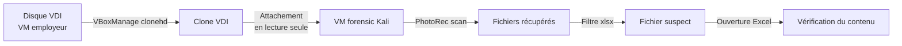
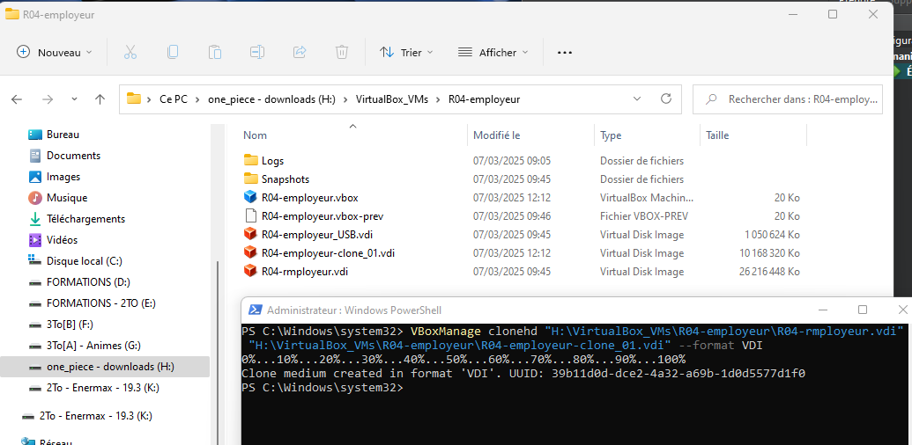
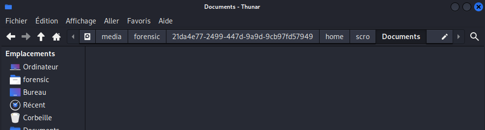
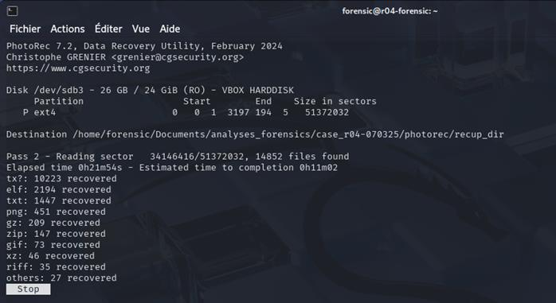
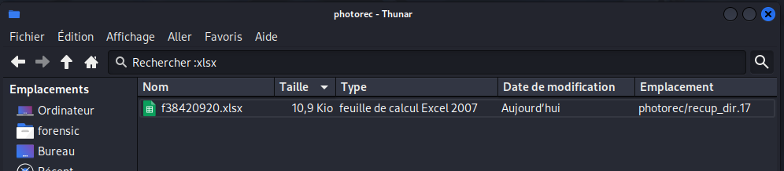
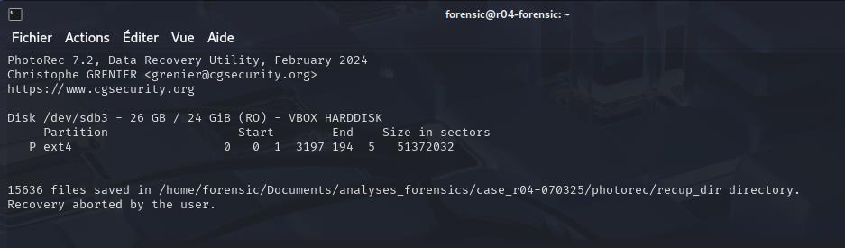
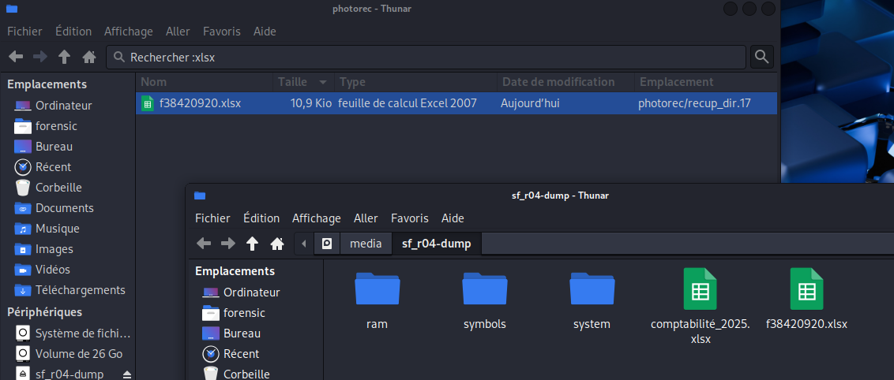
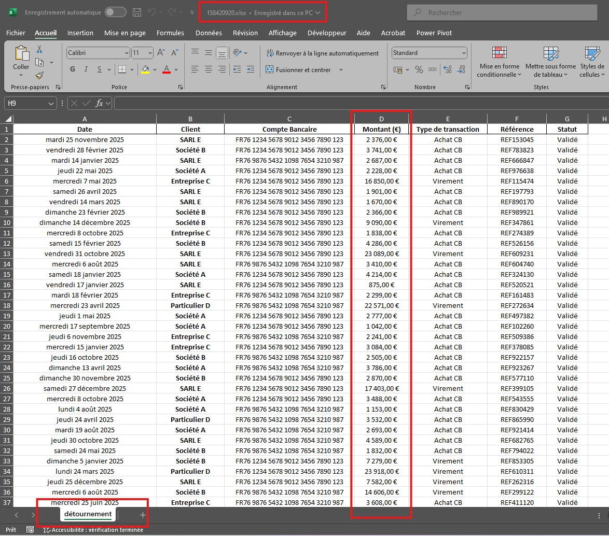
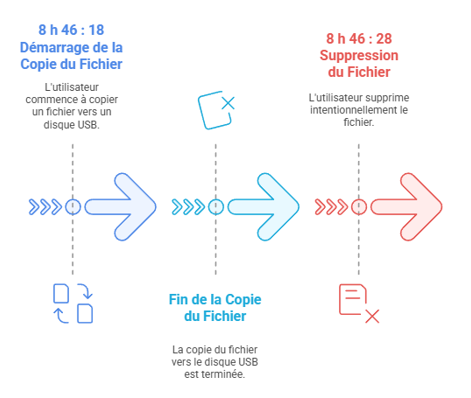

# Module 7 - Récupération du fichier avec PhotoRec

<div
  class="omny-meta"
  data-level="🟠 Intermédiaire"
  data-version="VirtualBox, PhotoRec 7"
  data-time="~25 min">
</div>

## Introduction

!!! quote "Analogie pédagogique — Le livre sans sommaire"
    Quand vous supprimez un fichier, l'ordinateur ne l'efface pas vraiment. Il arrache simplement la ligne dans l'index (le sommaire) du disque dur. Le texte est toujours là, sur les pages, mais le système ne sait plus où le trouver. **PhotoRec** est un outil qui lit le livre page par page, ligne par ligne, jusqu'à reconnaître la "grammaire" d'un fichier Excel. On appelle ça le *File Carving*.

L'analyse de la mémoire vive (Module 6) prouve l'**intention** frauduleuse de M. Scro. Pour prouver la nature du délit financier, il faut maintenant récupérer le fichier physique et son contenu.

<br>

---

## 7.1 - Stratégie de récupération



### 7.1.1 - Clonage du disque virtuel (VDI)

Comme pour la RAM, on ne scanne **jamais** le disque original en direct. La VM employeur doit impérativement être **éteinte** (`poweroff`) avant le clonage.

```powershell title="Clonage du disque dur (PowerShell - Hôte Windows)"
# Arrêt forcé si nécessaire
VBoxManage controlvm "R04-employeur" poweroff

# Clonage du disque avec maintien du format natif (VDI)
VBoxManage clonehd `
    "H:\VirtualBox_VMs\R04-employeur\R04-employeur.vdi" `
    "H:\VirtualBox_VMs\R04-employeur\R04-employeur-clone_01.vdi" `
    --format VDI
```


<p><em>Exécution du clonage VDI. C'est sur ce clone que travaillera PhotoRec, l'original restant scellé.</em></p>

### 7.1.2 - Attachement du clone à la station Kali

On attache ce clone fraîchement généré à la VM d'analyse (Kali Linux) en **lecture seule stricte**.

```powershell title="Attachement en lecture seule absolue (PowerShell)"
VBoxManage storageattach "R04-forensic" `
    --storagectl "SATA Controller" `
    --port 1 `
    --device 0 `
    --type hdd `
    --medium "H:\VirtualBox_VMs\R04-employeur\R04-employeur-clone_01.vdi" `
    --mtype readonly
```

<br>

---

## 7.2 - Constat légal : fichier absent

Avant d'utiliser les outils magiques, on dresse le constat de base : le fichier a bien disparu pour un utilisateur normal.

```bash title="Montage sécurisé (Kali Linux)"
sudo mkdir -p /mnt/clone_employeur

# Montage ultra-sécurisé empêchant toute écriture et exécution
sudo mount -o ro,noatime,nodev,noexec,nosuid /dev/sdb3 /mnt/clone_employeur

# Vérification du répertoire cible
ls -la /mnt/clone_employeur/home/scro/Documents/
# Résultat attendu : (vide)
```


<p><em>L'index du système de fichiers confirme que le document a été "supprimé". Il n'apparaît plus avec la commande ls.</em></p>

<br>

---

## 7.3 - Carving avec PhotoRec

**PhotoRec** scanne le disque bloc par bloc à la recherche d'en-têtes connus (signatures "Magic Numbers").

```bash title="Lancement du File Carving (Bash)"
# IMPORTANT : On lance le scan sur le périphérique brut (/dev/sdb), pas sur le montage
sudo photorec /dev/sdb
```

### Configuration optimale de l'assistant interactif :

| Étape | Choix recommandé | Justification |
|---|---|---|
| 1. Disque | `/dev/sdb` (entier) | Ne pas limiter à une partition pour un carving exhaustif. |
| 2. Partition | `Intel/PC partition` | MBR/GPT standard. |
| 3. Cible | `P ext4` | Ciblage de la partition système Linux. |
| 4. Type | `[Other]` | Pour tout ce qui n'est pas FAT/NTFS (donc ext4). |
| 5. Périmètre | `Free` (espace libre) | Plus rapide : on cherche un fichier effacé, il est forcément dans l'espace marqué "libre". |
| 6. Options (File Opt) | Désactiver tout, cocher `xlsx` | Gain de temps massif, on ne récupérera que les fichiers Excel/ZIP. |

### Arrêt anticipé
Dès qu'un fichier de la bonne taille (environ 11 Ko pour un petit Excel) apparaît dans le dossier de restauration de Kali, vous pouvez interrompre le scan (`Stop`).


<p><em>L'interface ncurses de PhotoRec scanne les secteurs bruts à la recherche d'en-têtes connus.</em></p>


<p><em>PhotoRec a identifié la signature d'un fichier Microsoft Office/ZIP.</em></p>


<p><em>Interruption du scan une fois le fichier désiré récupéré, pour gagner du temps.</em></p>

!!! warning "Perte des noms originaux"
    PhotoRec restaure le contenu, mais **l'inode (et donc le nom du fichier) est perdu**. Les fichiers sont renommés génériquement : `f38420920.xlsx`.

<br>

---

## 7.4 - Vérification de la charge de preuve

Une fois le fichier récupéré, on en fait immédiatement une copie saine sur le répertoire partagé (en calculant son Hash SHA-256 pour la chaîne de garde).


<p><em>Le fichier récupéré (`f38420920.xlsx`) est exfiltré vers la zone d'échange pour être analysé.</em></p>

L'ouverture du fichier dans **LibreOffice Calc** ou Excel va faire éclater la vérité au grand jour :
M. Scro avait créé un onglet caché nommé `détournement` contenant des virements vers des IBAN personnels, totalisant des dizaines de milliers d'euros de fraude. Le motif de la dissimulation est désormais établi !


<p><em>Le fichier accablant. L'intention (prouvée par la RAM) croise ici le mobile (la fraude financière).</em></p>


<p><em>Reconstruction finale du puzzle : tout concorde.</em></p>

<br>

---

## Conclusion

!!! quote "Ce qu'il faut retenir"
    Un fichier supprimé par un utilisateur non technique est presque toujours récupérable si la machine est arrêtée rapidement. C'est l'essence même du File Carving.

> Les preuves comportementales et matérielles sont désormais solidement rassemblées. Il est temps de rédiger la conclusion qui sera remise au juge dans le **[Module 8 : Rapport d'investigation et Synthèse →](./08-rapport-synthese.md)**
