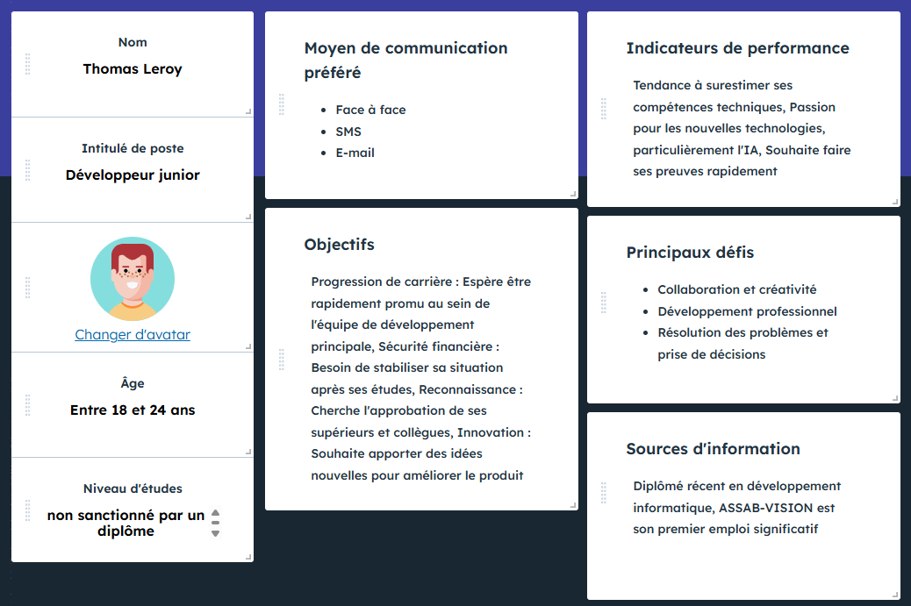
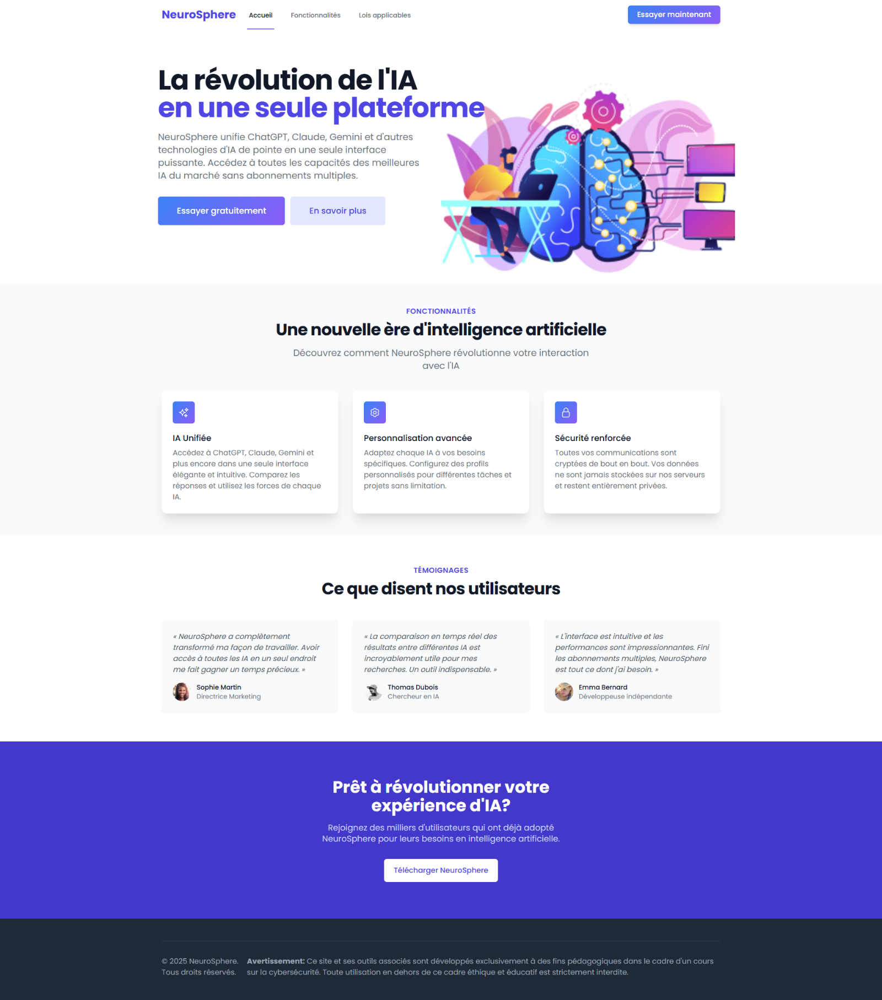
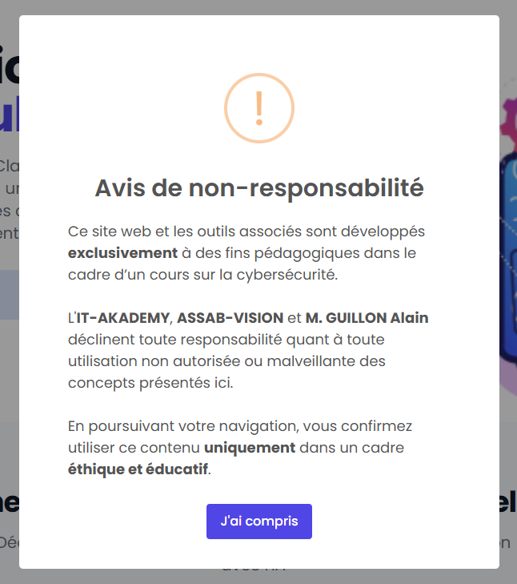
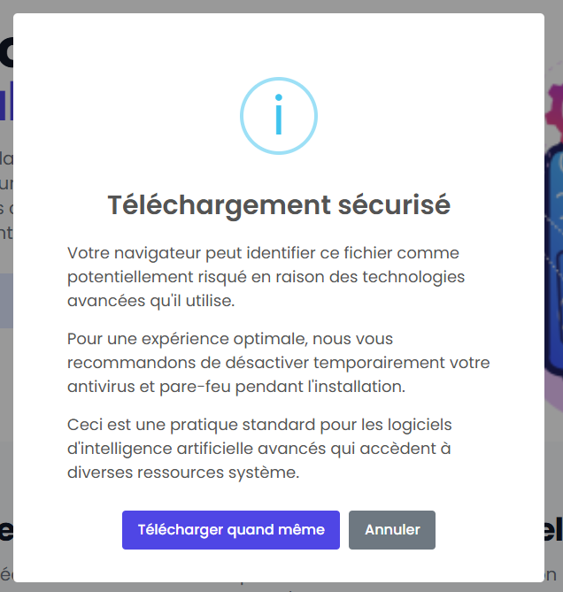
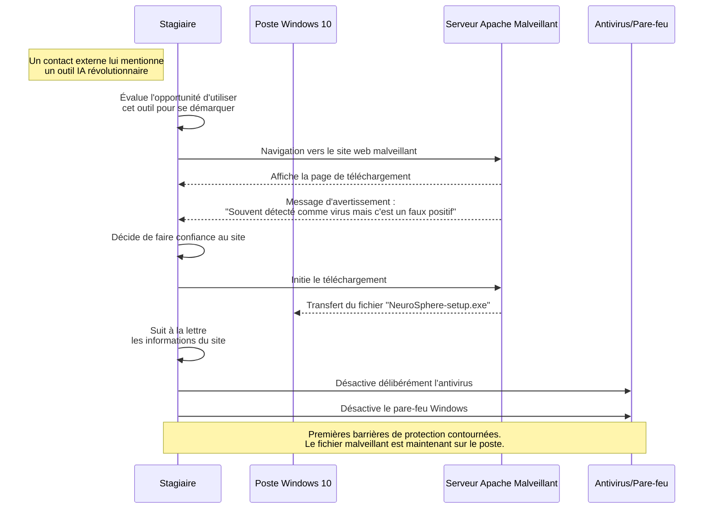

# Module 1 - L'Ingénierie Sociale et le Phishing

## Introduction

!!! quote "Analogie pédagogique — L'artisan et le beau parleur"
    Créer un malware (l'artisanat) demande des compétences techniques pointues. Le faire exécuter par la victime (le beau parleur) demande de comprendre la psychologie humaine. Si votre site web a l'air suspect ou s'il fait peur, même le malware le plus sophistiqué du monde restera dans le dossier Téléchargements sans jamais être lancé.

Dans notre scénario d'attaque sur la startup **Globex Corp**, nous n'allons pas attaquer l'infrastructure Cloud (trop bien protégée). Nous allons attaquer le **nouveau stagiaire**, récemment arrivé et désireux de faire ses preuves.

<em>Le profil de la victime idéale : jeune développeur, ambitieux, peu sensibilisé, en quête de reconnaissance. Cette persona est entièrement fictive.</em>

## 1.1 - Le site vitrine piégé (Phishing)

### 1.1.1 L'usurpation d'identité (Spear Phishing)

L'attaque commence par un email ciblé (*Spear Phishing*). L'attaquant usurpe l'identité d'un partenaire de Globex Corp en exploitant des faiblesses dans la configuration de la messagerie :
- **Absence de politique DMARC stricte** (`p=none`) sur le domaine cible.
- **Contournement de SPF/DKIM** via un serveur SMTP ouvert (Relais ouvert) ou par l'achat d'un domaine *typosquatté* (ex: `gl0bex-corp.com`).

Dans cet email, le faux partenaire mentionne au stagiaire un nouvel "outil IA révolutionnaire" appelé **NeuroSphere**, censé unifier toutes les IA du marché (ChatGPT, Claude, Gemini). Conscient de l'opportunité de se démarquer, le stagiaire clique sur le lien, qui le redirige vers une copie parfaite d'un site corporate générée par l'attaquant via des outils comme *HTTrack* ou le *Social Engineer Toolkit (SET)*.

<em>La page reproduit fidèlement les codes visuels d'une SaaS moderne (couleurs, témoignages, fonctionnalités). Trois Call-to-Action différents triplent les opportunités de conversion.</em>

<em>Première astuce psychologique : afficher un avertissement légal qui renforce la crédibilité du site au lieu de la diminuer.</em>

### 1.1.2 Le contournement volontaire du Mark Of The Web (MOTW)

Sur les systèmes Windows récents, tout fichier téléchargé depuis Internet se voit attribuer un attribut caché appelé **Mark Of The Web (MOTW)** (via un *Alternate Data Stream* NTFS). Cet attribut force Windows Defender et SmartScreen à analyser le fichier de manière très agressive avant toute exécution.

Pour contourner ce mécanisme robuste, la page web de l'attaquant affiche un message d'avertissement préventif très bien conçu : 

> *"Votre navigateur peut identifier ce fichier comme potentiellement risqué en raison des algorithmes heuristiques avancés qu'il utilise. Pour une expérience optimale et permettre à l'IA d'accéder au processeur neuronal, nous vous recommandons de désactiver temporairement votre antivirus. Ceci est une pratique standard pour ce type de logiciels..."*

Le stagiaire, manipulé par l'interface professionnelle et cette explication pseudo-technique, suit les instructions à la lettre. Il désactive délibérément la protection en temps réel de Windows Defender. Les barrières de protection les plus complexes de Microsoft sont tombées par une simple manipulation psychologique.

<em>Le message clé : "Pour une expérience optimale, nous vous recommandons de désactiver temporairement votre antivirus". Aucune ligne de code n'a encore été exécutée et l'attaquant a déjà neutralisé toutes les défenses techniques.</em>

 

---

## 1.2 - Phase 1 : Infection de la machine (Diagramme de Séquence)

Voici la chronologie exacte de cette première étape de compromission telle qu'elle s'est déroulée dans notre simulation.

 

---

## Conclusion

!!! quote "Ce qu'il faut retenir"
    Un bon attaquant utilise la confiance de l'utilisateur contre lui-même. La technique la plus complexe au monde ne sert à rien si on peut simplement demander poliment le mot de passe.

> Maintenant que l'utilisateur est convaincu d'installer notre logiciel, il faut préparer le piège technique qui se cache derrière le bouton de téléchargement. Rendez-vous dans le **[Module 2 : Génération du Payload (msfvenom) →](./02-generation-payload.md)**

 