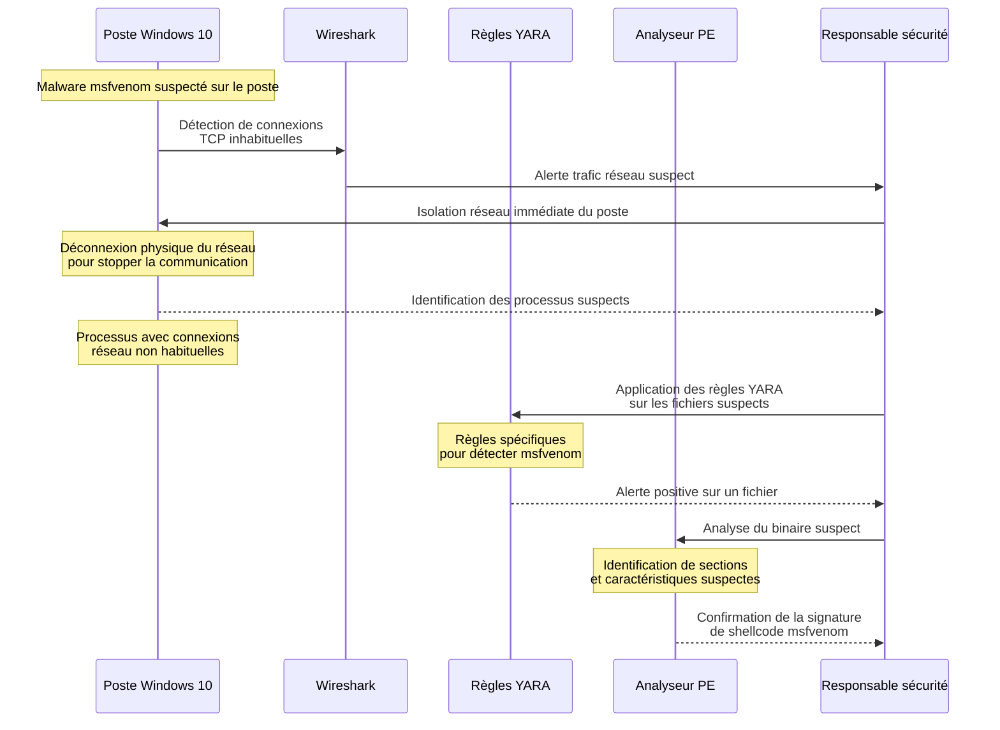
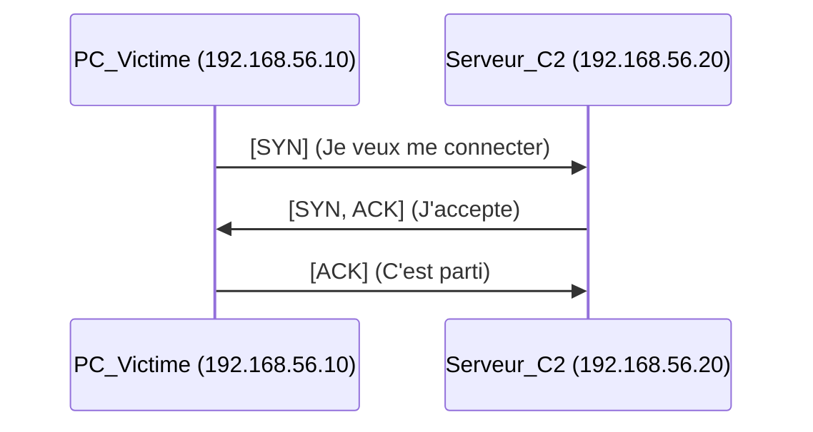
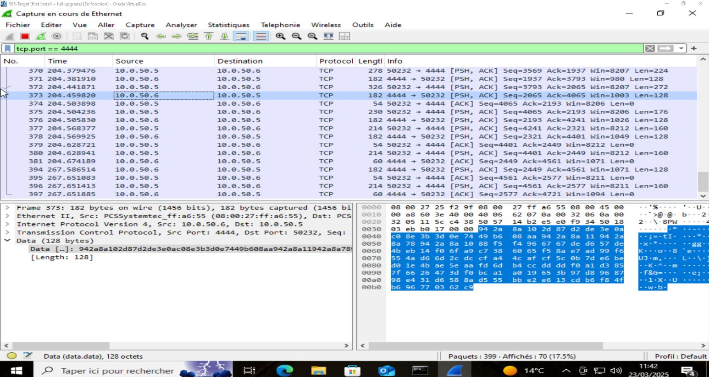
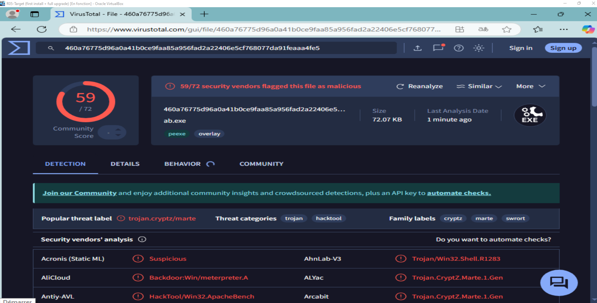
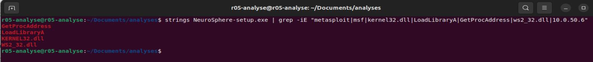
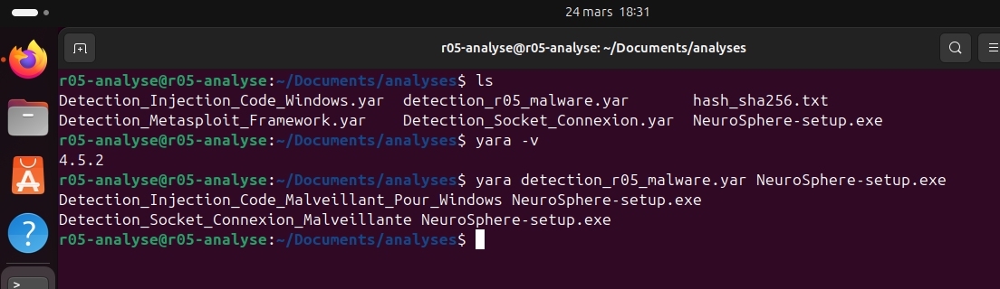
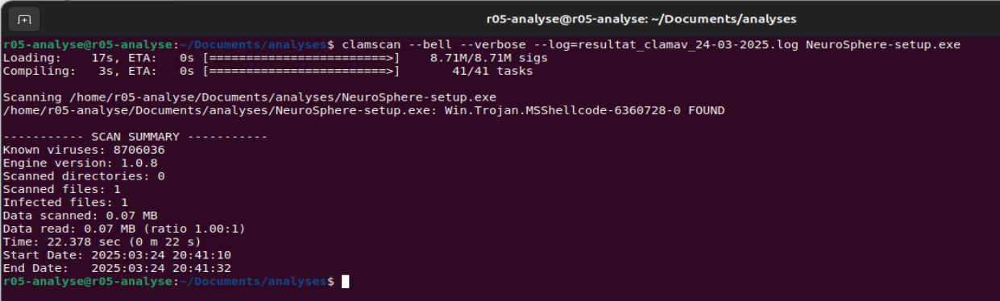

# Module 4 - Analyse Post-Infection et Détection

<div
  class="omny-meta"
  data-level="🔴 Avancé"
  data-version="Wireshark, YARA"
  data-time="~20 min">
</div>

## Introduction

!!! quote "Analogie pédagogique — L'empreinte et le radar"
    Un malware indétectable par l'antivirus (parce qu'il est obfusqué) devient soudainement très bruyant dès qu'il tente de communiquer avec son maître. C'est comme un voleur invisible qui téléphonerait avec un mégaphone. En analysant le réseau (Wireshark) ou la mémoire du binaire (YARA), l'analyste Blue Team trouve les preuves matérielles de la compromission.

## 4.1 - Phase 5 : Identification de l'intrusion

Le malware pensait agir dans l'ombre, mais ses actions laissent des traces sur le réseau et sur le disque. Voici la séquence d'événements de notre équipe de défense (Blue Team / Responsable Sécurité) pour détecter la compromission.



*(La suite de la phase 5, concernant la communication ANSSI et l'analyse forensique, sera détaillée dans le module 5).*

<br>

### 4.1.1 Les filtres d'affichage Wireshark

Pour repérer la communication sortante, l'analyste ne filtre pas uniquement sur l'adresse IP (car l'IP de l'attaquant est théoriquement inconnue au début de l'incident). Il va rechercher les caractéristiques d'un trafic TCP qui initie une connexion (SYN) vers l'extérieur.

```text title="Filtres d'affichage Wireshark"
# Trouver la poignée de main initiale (Le tout premier paquet envoyé)
tcp.flags.syn == 1 and tcp.flags.ack == 0

# Si le port par défaut de Metasploit (4444) a été conservé par erreur :
tcp.port == 4444

# Suivre la conversation complète d'une session suspecte
tcp.stream eq 5
```

### 4.1.2 Le TCP 3-Way Handshake (La poignée de main)

Dans les premiers paquets capturés, l'analyste observe l'initialisation de la connexion.



!!! important "Qui est à l'initiative ?"
    Regardez bien le sens des flèches : c'est le **PC Victime (192.168.56.10)** qui envoie le paquet `[SYN]` vers le serveur externe. C'est la signature absolue du *Reverse Shell*. Si c'était un serveur web classique ou un piratage entrant direct, le trafic viendrait de l'extérieur vers l'intérieur.

Ensuite, Wireshark affiche des dizaines de paquets `[PSH, ACK]`. Le flag "Push" indique que de la donnée (Payload) est poussée immédiatement à l'application. C'est le flux continu de notre session Meterpreter !


<p><em>La capture confirme le trafic sortant. L'inversion des IPs source/destination montre que le malware renvoie activement des données (les paquets de 128 octets sont caractéristiques du Meterpreter).</em></p>
<br>

---

## 4.2 - Investigation Statique (Création d'une règle YARA)

Maintenant que nous savons que la machine est compromise, nous trouvons le fichier responsable dans le dossier Téléchargements : `NeuroSphere-setup.exe`.
Même s'il est obfusqué, certains comportements (importation de librairies réseau) restent visibles pour un expert.


<p><em>En soumettant le Hash du fichier (et non le fichier lui-même) à VirusTotal, le verdict est sans appel. L'obfuscation ne trompe pas l'analyse heuristique des moteurs modernes.</em></p>


<p><em>La commande strings révèle l'utilisation de KERNEL32.dll, LoadLibraryA, GetProcAddress et WS2_32.dll. Ce combo est la signature d'une injection de code avec connexion réseau.</em></p>

**YARA** est un outil de reconnaissance de patterns (motifs) textuels ou binaires, considéré comme le "couteau suisse" des chercheurs en malwares.

### Écriture de la signature

Nous allons créer un fichier `rules.yar` pour cibler la librairie réseau Windows indispensable aux Reverse Shells (`ws2_32.dll`) et les fonctions de chargement en mémoire.

```yara title="Signature YARA : Détection du Stub Shikata_ga_nai (rules.yar)"
rule Detect_Metasploit_ShikataGaNai
{
    meta:
        description = "Détecte la boucle de déchiffrement (Stub) de l'encodeur x86/shikata_ga_nai de Metasploit"
        author = "Analyste SOC OmnyDocs"
        date = "2026-04-26"
        severity = "CRITICAL"
        reference = "Analyse Reverse Shell Globex Corp"

    strings:
        // Recherche des API de bas niveau Windows souvent importées
        $dll_kernel = "kernel32.dll" nocase
        $func_load = "LoadLibraryA" nocase
        
        // Empreinte hexadécimale exacte du décodeur FPU de Shikata_ga_nai
        // Explication : d9 eb (fnstenv), 9b (fwait), d9 74 24 f4 (fnstenv [esp-0xc])
        $shikata_stub = { d9 eb 9b d9 74 24 f4 5? 81 7? ?? ?? ?? ?? ?? 83 e? ?? 03 ?? }

    condition:
        // Le fichier doit être un exécutable Windows (MZ header : 0x5A4D)
        uint16(0) == 0x5A4D 
        and 
        // ET contenir la routine de déchiffrement polyphormique
        $shikata_stub
}
```

La puissance de YARA réside ici dans la recherche hexadécimale (`$shikata_stub`). Au lieu de chercher la charge malveillante (qui est chiffrée et changeante), nous cherchons le code en langage assembleur utilisé par Metasploit pour déchiffrer la charge en mémoire.

### Détection en direct

```bash title="Lancement du scan YARA"
yara rules.yar NeuroSphere-setup.exe
```

**Résultat attendu :**
```text
Detect_NeuroSphere_ReverseShell NeuroSphere-setup.exe
```


<p><em>Yara lève l'alerte locale ! Les règles identifient formellement les API réseau (Socket) et l'injection (LoadLibrary). Le fichier NeuroSphere n'est pas une IA, c'est un agent réseau malveillant.</em></p>


<p><em>L'antivirus open source ClamAV vient apporter la troisième confirmation indépendante : Win.Trojan.MSShellcode. L'incident est confirmé, il faut réagir.</em></p>

<br>

---

## Conclusion

!!! quote "Ce qu'il faut retenir"
    L'obfuscation trompe les signatures statiques simples (Antivirus traditionnels). Mais l'analyse du trafic réseau et l'analyse de dépendances API (YARA) démasquent invariablement le véritable comportement d'un programme.

> La menace est formellement identifiée. Le poste est compromis, et les données fuient. Il faut agir vite et selon une procédure stricte dans le **[Module 5 : Réponse à Incident →](./05-reponse-incident.md)**

<br>
