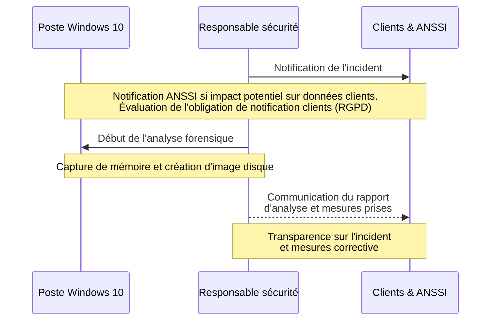
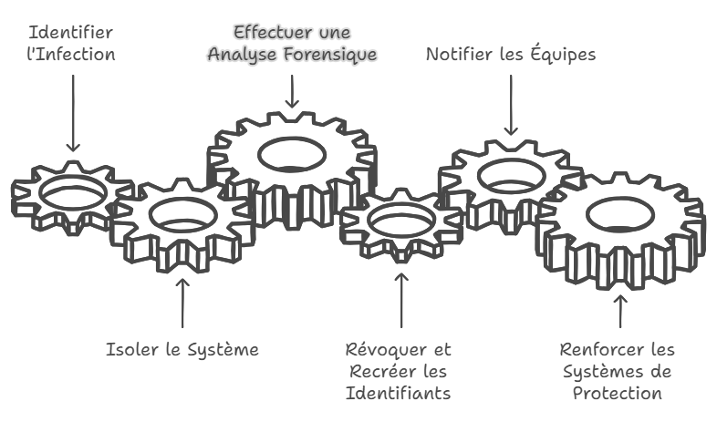
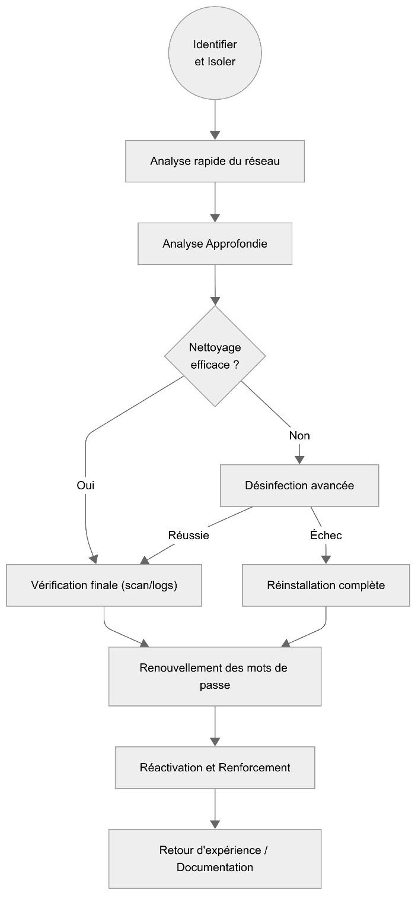
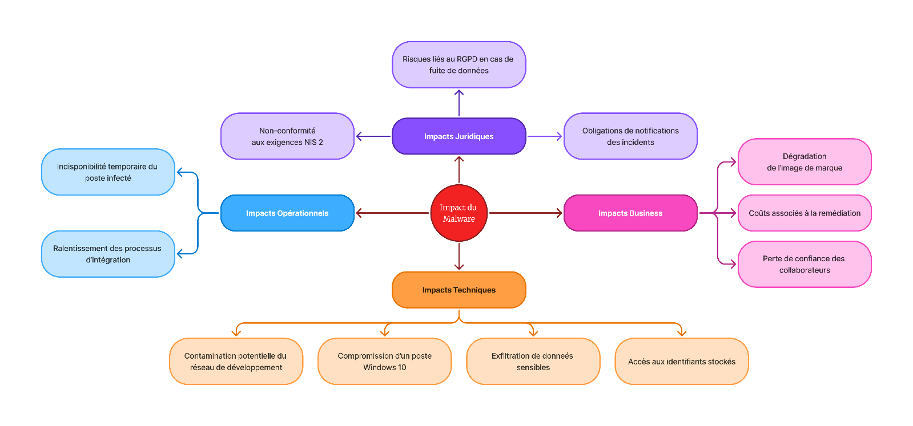
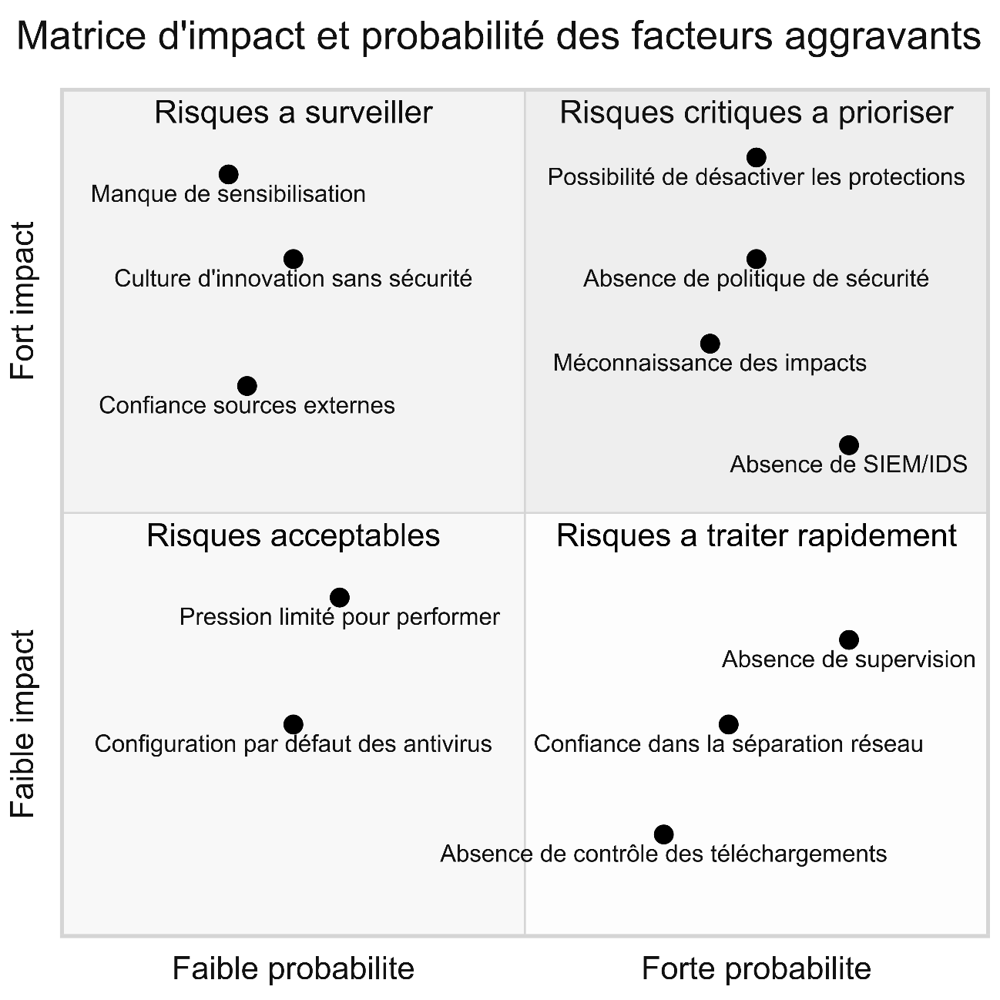
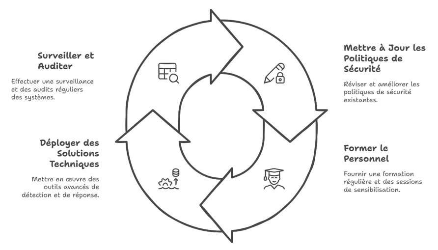
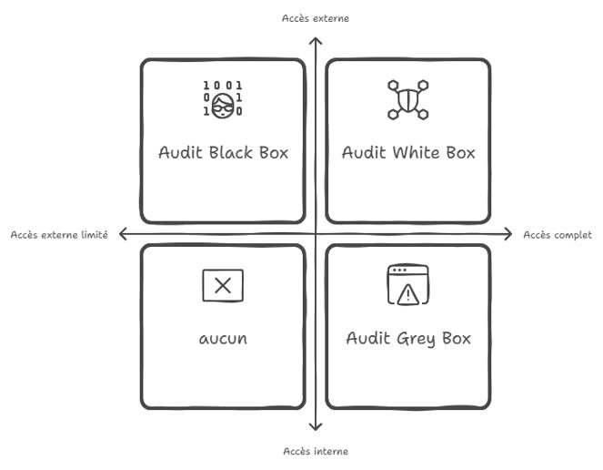

# Module 5 - Réponse à Incident

## Introduction

!!! quote "Analogie pédagogique — Le garrot et le chirurgien"
    Face à une hémorragie (fuite de données / exfiltration), on ne commence pas par chercher à comprendre la trajectoire de la balle. On pose d'abord un garrot pour stopper la fuite vitale. En réponse à incident, la première étape est l'**endiguement** (isolation). L'éradication ne vient qu'après.

## 5.1 - La chaîne d'actions immédiates et de Notification (Phase 5)

Lorsqu'une compromission est confirmée, l'équipe de réponse à incident (CSIRT) déclenche une procédure stricte basée sur le framework standard de l'industrie : le **SANS PICERL** (Préparation, Identification, Confinement, Éradication, Récupération, Leçons apprises).

Les phases de préparation et d'identification étant terminées, l'équipe entre en phase d'endiguement et de notification légale.

<em>La réponse immédiate fonctionne comme un engrenage. Pendant que l'analyste forensic travaille, le RSSI notifie déjà la direction. La coordination est la clé.</em>

### 1. Le Confinement (Containment)
- **Déconnexion réseau immédiate** de la machine compromise (isolation VLAN, port-security au niveau du switch). La coupure physique ou logique du réseau stoppe immédiatement le Reverse Shell et la fuite de données en cours.
- **Blocage tactique** : Au niveau de l'EDR ou du firewall, le port C2 (4444) et l'adresse IP de l'attaquant (192.168.56.20) sont placés sur liste de blocage (*Blacklist* / *IoC*).
- **Attention** : On n'éteint **JAMAIS** la machine compromise ! Si l'ordinateur est mis hors tension, la mémoire vive (RAM) est vidée, effaçant ainsi les preuves de la méthode d'injection DLL réflective de Meterpreter.

### 2. L'Investigation (Forensique)
- C'est ici que l'analyste procède au **Dump de la RAM** (via des outils comme FTK Imager ou DumpIt) et à la **création d'une image disque bit-à-bit**. L'objectif est d'extraire la mémoire vive pour cartographier les actions exactes de l'attaquant et identifier précisément les données exfiltrées.

### 3. La Notification (Légal)
- Les obligations légales sont strictes (conformément aux lois européennes). Le règlement RGPD impose de **notifier la CNIL dans un délai maximal de 72 heures** suivant la prise de connaissance de l'incident si celui-ci présente un risque pour les droits et libertés des personnes physiques (ici, l'exfiltration de données bancaires).
- S'il s'agit d'un Opérateur de Service Essentiel (OSE), l'ANSSI doit être alertée sans délai.

### 4. L'Éradication et le Rétablissement (Recovery)
- La machine infectée est totalement écrasée (Wipe sécurisé) et réinstallée à zéro (Re-image). On ne désinfecte jamais un système ayant subi un accès *System/Root* car la persistance peut être trop profondément ancrée (Rootkit/Bootkit).
- Réinitialisation **immédiate** de tous les mots de passe de l'utilisateur, des clés d'API et révocation des certificats exposés sur ce poste.

<em>En cas de doute ou d'escalade de privilèges confirmée (SYSTEM), la règle est absolue : on réinstalle. Nettoyer un rootkit est trop incertain.</em>

 

---

## 5.2 - Stratégie de Défense (Amélioration Continue)

L'incident doit servir de leçon pour Globex Corp. La startup, qui était 100% remote sans aucune sécurité, doit mettre en place une défense en profondeur (*Defense in Depth*).

<em>Le malware déclenche une cascade de conséquences bien au-delà de la technique : juridique, image, opérationnel.</em>

<em>Pour prioriser les budgets et remédiations, les risques sont classés selon leur probabilité d'occurrence et leur impact métier.</em>

| Solution | Rôle technique | Couverture du risque |
|---|---|---|
| **EDR** (Endpoint Detection & Response) | Analyse comportementale sur la machine de l'employé. | Bloque l'exécution de payloads en mémoire, même obfusqués. |
| **SIEM** (Security Information and Event Management) | Centralisation et corrélation des journaux. | Détecte qu'un PC de l'entreprise parle avec une IP étrangère non répertoriée (Serveur C2). |
| **VPN Obligatoire** | Forcer le trafic des employés à passer par un point de contrôle centralisé. | Permet à l'IDS (Suricata) de couper la connexion instantanément s'il repère la signature Metasploit. |

<em>La roue de Deming appliquée à la cybersécurité (ISO 27001). Planifier, Faire, Contrôler, Agir.</em>

<em>Pour valider sa nouvelle architecture, l'entreprise devra planifier des audits (Black, Grey, White box) pour simuler différents profils d'attaquants.</em>

 

---

## Conclusion

!!! quote "Ce qu'il faut retenir"
    Un incident de sécurité n'est pas un échec, c'est une fatalité statistique. Ce qui définit la maturité d'une entreprise, ce n'est pas le fait de ne jamais être piratée, c'est la vitesse à laquelle elle détecte l'intrusion et l'isole.

> Ce laboratoire Red/Blue Team touche à sa fin. Gardez toujours en tête la mécanique des outils offensifs, car c'est en comprenant l'attaque que l'on construit la meilleure des défenses. Vous retrouverez les lois et les ressources annexes dans le **[Module 6 : Annexes et Cadre Légal →](./06-annexes.md)**

 
