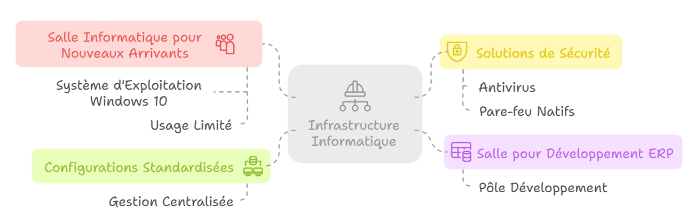

# Analyse Malware & Ingénierie Sociale

## Présentation du projet

!!! quote "L'analogie du cheval de Troie"
    Un château fortifié (pare-feu) résiste aux armées extérieures. Mais si les gardes (l'utilisateur) ouvrent eux-mêmes la porte pour faire entrer une gigantesque statue en bois (le malware) parce qu'ils la trouvent jolie, la forteresse tombe de l'intérieur. C'est l'essence de l'ingénierie sociale couplée aux malwares modernes.

La cybersécurité ne se résume pas à configurer des firewalls. Aujourd'hui, **le maillon faible est humain**. Dans ce projet, vous allez endosser les deux rôles :
1. **Red Team (L'Attaquant)** : Vous allez construire une fausse page web, générer un payload malveillant indétectable par les antivirus basiques, et piéger un utilisateur.
2. **Blue Team (Le Défenseur)** : Vous allez analyser le trafic réseau généré par le malware, créer des signatures de détection (YARA) et isoler la menace.

 

---

## Le Scénario : L'affaire Globex Corp

!!! abstract "Note d'intention"
    **Globex Corp** est une entreprise purement fictive inventée pour les besoins de ce laboratoire. Toute ressemblance avec une entreprise existante serait fortuite.

Nous prenons pour cible l'entreprise fictive **Globex Corp**, une startup développant un ERP B2B. L'environnement de l'entreprise est le suivant :
- **100% Remote** : Tous les employés sont en télétravail.
- **BYOD (Bring Your Own Device)** : Les employés utilisent leurs ordinateurs personnels (souvent sous Windows 10/11) pour accéder aux ressources de l'entreprise.
- **Aucune politique de sécurité centralisée** : Pas d'EDR, pas de VPN imposé, les employés sont administrateurs locaux de leurs machines.

### Le vecteur d'attaque

<em>Topologie de l'environnement de Globex Corp : une segmentation théorique qui va s'effondrer à cause du facteur humain.</em>

L'attaquant a développé un faux logiciel miracle nommé **NeuroSphere**, prétendument dopé à l'IA pour augmenter la productivité. En réalité, le fichier `NeuroSphere-setup.exe` contient un *Reverse Shell* (un accès distant à l'insu de l'utilisateur).

!!! warning "Avertissement Légal"
    Ce laboratoire est conçu à des fins **strictement pédagogiques**. Les commandes fournies (génération de payload, obfuscation) sont réelles et fonctionnelles. Leur utilisation en dehors d'un environnement contrôlé et sans le consentement explicite du propriétaire du système ciblé constitue un délit pénal.

 

---

## Objectifs pédagogiques

À l'issue de ce projet, vous saurez :

- Comprendre les biais cognitifs exploités par l'ingénierie sociale.
- Générer un payload furtif avec `msfvenom` (Metasploit Framework).
- Obfusquer une charge active pour contourner des défenses basiques (encodeur *shikata_ga_nai*).
- Déployer un serveur C2 (*Command and Control*) pour réceptionner une connexion inversée (*Reverse Shell*).
- Analyser un flux TCP suspect avec **Wireshark**.
- Rédiger une règle **YARA** pour détecter la signature du malware.

 

---

## Sommaire du cours

1. **[L'Ingénierie Sociale et le Phishing](./01-ingenierie-sociale.md)**
2. **[Génération du Payload (msfvenom)](./02-generation-payload.md)**
3. **[Exploitation et Serveur C2](./03-exploitation-c2.md)**
4. **[Analyse Post-Infection et Détection](./04-analyse-post-infection.md)**
5. **[Réponse à Incident (Forensic & Remédiation)](./05-reponse-incident.md)**
6. **[Annexes et Cadre Légal](./06-annexes.md)**

> Entrons directement dans la peau de l'attaquant en analysant le site web piégé dans le **[Module 1 : L'Ingénierie Sociale →](./01-ingenierie-sociale.md)**
