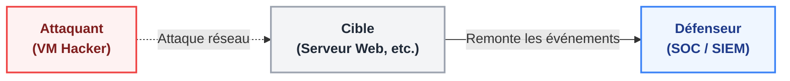
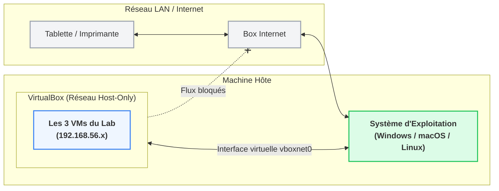

# Module 3 - Architecture et topologie du HomeLab

<div
  class="omny-meta"
  data-level="🟢 Débutant"
  data-version="VirtualBox, Réseau Privé"
  data-time="~30 min">
</div>

## Introduction

!!! quote "Analogie pédagogique — Le bac à sable sécurisé"
    Imaginez que vous vouliez étudier le comportement d'un virus biologique très contagieux. Vous n'allez pas ouvrir la fiole au milieu du salon. Vous construisez une boîte en verre étanche (le réseau privé), avec des gants intégrés (l'hôte). Dans ce module, nous allons construire la boîte en verre. Si elle est mal conçue, le virus (notre attaque) ne pourra pas circuler entre les éprouvettes (les VMs), ou pire, s'échappera sur votre réseau domestique.

## 3.1 - Objectifs pédagogiques

À la fin de ce module, l'apprenant doit être capable de :

- Dessiner le schéma logique des 3 VMs et expliquer le rôle de chacune.
- Justifier l'utilisation d'un réseau "Host-Only" (Réseau privé hôte) plutôt qu'un réseau NAT ou Bridge.
- Attribuer les bonnes adresses IP selon le plan d'adressage défini pour éviter les conflits réseau.

<br>

---

## 3.2 - Pourquoi 3 VMs et pourquoi Ubuntu 24.04 ?


<p><em>Vue abstraite des trois acteurs nécessaires à toute simulation d'attaque/défense.</em></p>

Pour qu'une simulation d'attaque ait une valeur pédagogique, il faut isoler les rôles. Si l'attaquant et la cible sont sur la même machine, le trafic réseau n'existe pas, et l'IDS (Suricata) n'aura rien à écouter sur la carte réseau.

1. **La Cible (VM-Victime)** : Elle héberge l'agent Wazuh et représente le serveur de l'entreprise (ex: un serveur web interne).
2. **L'Attaquant (VM-Attaquant)** : Machine compromise sur le réseau interne (mouvement latéral) qui va scanner ou attaquer la cible.
3. **Le Défenseur (VM-SIEM)** : Le cerveau central (Wazuh Manager) qui observe silencieusement les événements remontés par la cible.

!!! note "Le choix de l'OS"
    Nous utilisons **Ubuntu 24.04 LTS (Noble Numbat)** partout. Avoir le même OS réduit la friction cognitive : les commandes réseau, la gestion des paquets et les chemins de logs sont identiques. En entreprise, l'attaquant serait sur Kali Linux et la cible potentiellement sur Windows Server, mais pour comprendre la logique SIEM, un environnement homogène évite de perdre du temps sur des soucis de compatibilité d'OS.

<br>

---

## 3.3 - Topologie réseau et adressage

```mermaid
flowchart TD
    subgraph Host["Machine Hôte (Votre PC)"]
        H["IP : 192.168.56.1
(Navigateur & Client SSH)"]:::host
    end

    subgraph Switch["Switch Virtuel (Host-Only Network : 192.168.56.0/24)"]
        direction LR
        VM1["VM 1 : SIEM
(wazuh-server)
192.168.56.10"]:::blue
        VM2["VM 2 : Cible
(ubuntu-target)
192.168.56.20"]:::grey
        VM3["VM 3 : Attaquant
(ubuntu-hacker)
192.168.56.30"]:::red
    end

    Host <-->|Accès Web & SSH| Switch
    VM3 -.->|Attaque ICMP| VM2
    VM2 ==>|Envoi des Logs (Port 1514)| VM1

    classDef host fill:#dcfce7,stroke:#22c55e,stroke-width:2px,color:#14532d,font-weight:bold;
    classDef blue fill:#eff6ff,stroke:#3b82f6,stroke-width:2px,color:#1e3a8a,font-weight:bold;
    classDef grey fill:#f3f4f6,stroke:#9ca3af,stroke-width:2px,color:#1f2937,font-weight:bold;
    classDef red fill:#fef2f2,stroke:#ef4444,stroke-width:2px,color:#7f1d1d,font-weight:bold;
```
<p><em>Topologie logique du HomeLab : 1 Hôte, 3 VMs, 1 Switch virtuel isolé.</em></p>

Nous allons créer un réseau privé de classe C : `192.168.56.0/24`. C'est le réseau historique par défaut de VirtualBox pour le mode Host-Only.

| Machine | Nom Vagrant | IP Statique (eth1) | RAM (Recommandée) | Rôle dans la simulation |
|---|---|---|---|---|
| Hôte (Votre PC) | N/A | `192.168.56.1` | - | Accès au dashboard Web du SIEM et pilotage Vagrant |
| VM 1 | `wazuh-server` | `192.168.56.10` | 6 Go | Héberge Wazuh Manager, Indexer, Dashboard |
| VM 2 | `ubuntu-target`| `192.168.56.20` | 1 Go | Cible. Héberge Wazuh Agent et Suricata |
| VM 3 | `ubuntu-hacker`| `192.168.56.30` | 1 Go | Attaquant. Lancera le flood ICMP (ping) |

<br>

---

## 3.4 - Les trois règles d'or du Private Network


<p><em>Isolation des flux : le mode Host-Only protège le LAN domestique tout en permettant la communication inter-VMs.</em></p>

Pourquoi ne pas utiliser le mode "Accès par pont" (Bridge) ou "NAT" simple ?

- **Bridge** : Vos VMs récupèrent une IP de votre box Internet (Freebox, Livebox). C'est dangereux, car votre VM Attaquant pourrait attaquer par erreur la tablette du salon ou l'imprimante Wi-Fi.
- **NAT simple** : Les VMs peuvent aller sur Internet (pour télécharger les paquets `apt`), mais elles ne peuvent pas communiquer entre elles par défaut.

La solution est la **carte réseau Host-Only (Private Network dans Vagrant)**, qui crée un switch virtuel isolé à l'intérieur de votre PC.

1. **Règle 1** : Les VMs communiquent entre elles sur la plage `192.168.56.x`.
2. **Règle 2** : Votre PC (Hôte) peut discuter avec les VMs (pour afficher l'interface Web du SIEM sur votre navigateur local).
3. **Règle 3** : Les autres appareils de votre maison ignorent totalement l'existence de ces VMs.

<br>

---

## 3.5 - Points de vigilance

- **Le conflit d'IP** : Si vous utilisez déjà VirtualBox pour d'autres projets, assurez-vous que l'interface virtuelle `vboxnet0` (ou équivalent Windows) ne chevauche pas un autre DHCP VirtualBox. Vagrant gère cela généralement bien, mais c'est une source d'erreur courante.
- **Le pare-feu Windows** : Si vous êtes sous Windows, assurez-vous que VirtualBox est autorisé dans le Pare-feu Windows Defender, sinon la communication entre votre PC hôte (navigateur) et le SIEM (192.168.56.10) sera bloquée.
- **Hyper-V** : Si vous êtes sous Windows 10/11 Pro, VirtualBox peut entrer en conflit avec Hyper-V. Désactivez Hyper-V si les VMs refusent de démarrer.

<br>

---

## 3.6 - Axes d'amélioration vs projet original

| Constat dans le projet 2025 | Amélioration recommandée |
|---|---|
| L'architecture mélange les cartes réseaux NAT et Bridge sans justification claire, créant de la confusion chez le lecteur. | Imposer l'interface `private_network` de Vagrant, qui crée une carte Host-Only propre et garantit la reproductibilité absolue, peu importe le réseau domestique de l'apprenant. |
| La VM "SIEM" n'avait que 4 Go de RAM allouée, provoquant des plantages silencieux de l'Indexer Elastic. | Passage strict à 6 Go de RAM minimum dans la définition Vagrant (Module 4) pour éviter les corruptions de base de données. |

<br>

---

## Conclusion

!!! quote "Ce qu'il faut retenir"
    Un bon laboratoire d'attaque/défense repose sur l'isolation réseau absolue. En utilisant le réseau privé (Host-Only) `192.168.56.0/24`, nous garantissons que nos attaques simulatrices ne déborderont pas sur notre réseau personnel, tout en permettant aux 3 VMs de communiquer entre elles.

> Maintenant que le plan de la maison est validé, nous allons passer à la construction automatisée avec le **[Module 4 : Provisioning via Vagrant →](./04-provisioning-vagrant.md)**
