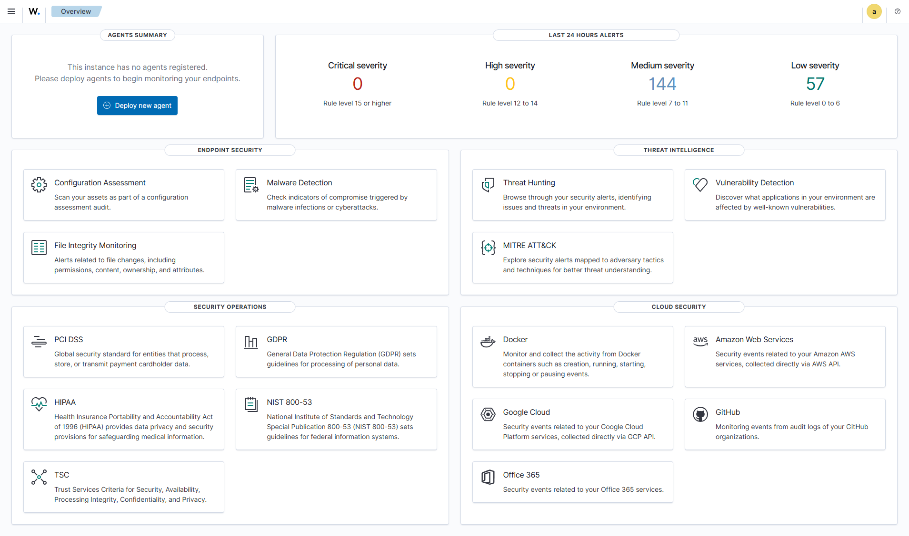
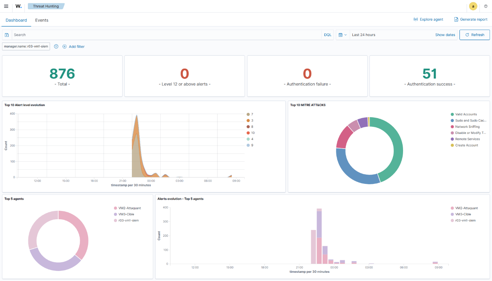

# Module 5 - Installation du SIEM Wazuh

<div
  class="omny-meta"
  data-level="🟠 Intermédiaire"
  data-version="Wazuh 4.14.5"
  data-time="~1 h">
</div>

## Introduction

!!! quote "Analogie pédagogique — Le centre de vidéosurveillance"
    Wazuh est le cerveau de notre SOC. L'Agent Wazuh est la caméra de sécurité placée dans les couloirs de l'entreprise (la VM Cible). L'Indexer est le serveur qui enregistre les vidéos. Le Manager est le logiciel qui analyse les vidéos pour repérer les comportements suspects (quelqu'un court ?), et le Dashboard est l'écran sur lequel le gardien (vous) regarde les alertes. Dans ce module, nous allons construire la salle de contrôle entière et brancher notre première caméra.

## 5.1 - Objectifs pédagogiques

À la fin de ce module, l'apprenant doit être capable de :

- Distinguer le Manager, l'Indexer et le Dashboard dans l'écosystème Wazuh.
- Exécuter le script d'installation automatisé `wazuh-install.sh`.
- Extraire les mots de passe générés dynamiquement lors de l'installation.
- Déployer un Agent Wazuh sur une machine distante (Cible) via une ligne de commande préconfigurée.
- Naviguer dans l'interface web de Wazuh pour confirmer la connexion de l'agent.

<br>

---

## 5.2 - Architecture interne de Wazuh (Ce qu'on installe)

Wazuh n'est pas un seul logiciel monolithique, c'est une pile applicative complexe (inspirée de la pile ELK - Elasticsearch, Logstash, Kibana) modifiée pour la sécurité. L'installation "All-in-one" (Tout-en-un) que nous allons faire installe trois briques sur la même VM :

1. **Wazuh Indexer** (La base de données) : Moteur de recherche et d'indexation ultra-rapide basé sur OpenSearch. C'est lui qui consomme les 6 Go de RAM de notre VM.
2. **Wazuh Manager** (Le cerveau) : Il reçoit les logs des agents, les décode, et les compare à ses milliers de règles (Exemple: "Si je vois 5 échecs de mot de passe en 1 minute = Alerte Brute Force").
3. **Wazuh Dashboard** (L'interface) : L'interface web accessible depuis le navigateur de votre hôte.

<br>

---

## 5.3 - Installation du Serveur (Sur la VM SIEM)

Connectez-vous à la machine `wazuh-server` (VM 1) créée au module précédent.

```bash title="Connexion SSH à la VM SIEM depuis l'hôte"
# Exécuté sur l'hôte (Windows/Mac)
vagrant ssh wazuh-server
```

Une fois connecté dans la VM (l'invite de commande affiche `vagrant@wazuh-server`), nous lançons l'installation via le script officiel Quickstart.

```bash title="Installation All-in-one de Wazuh 4.14.5"
# Téléchargement silencieux (-s) du script d'installation officiel
curl -sO https://packages.wazuh.com/4.14/wazuh-install.sh

# Exécution avec l'argument "-a" (All-in-one)
# L'installation télécharge environ 1 Go de paquets et prend 5 à 10 minutes.
sudo bash ./wazuh-install.sh -a
```

!!! warning "Sauvegarde des mots de passe"
    À la fin de l'installation, le script affichera dans la console un nom d'utilisateur (`admin`) et un mot de passe généré aléatoirement (ex: `aZ3rTy_7UioP`). **Copiez-le immédiatement dans un fichier texte sur votre hôte**. Si vous fermez le terminal, récupérer ce mot de passe demande de lancer un script d'extraction complexe.

Une fois l'installation terminée, ouvrez un navigateur sur votre PC Hôte et allez sur `https://192.168.56.10`. Ignorez l'alerte de certificat SSL (le certificat est auto-signé). Connectez-vous avec `admin` et le mot de passe sauvegardé.


<p><em>Le Dashboard Wazuh affiche "0 Agents", car le serveur est sourd et aveugle pour l'instant.</em></p>

<br>

---

## 5.4 - Déploiement de l'Agent (Sur la VM Cible)

Le SIEM tourne, mais il ne surveille rien. Nous allons installer une "caméra" sur notre serveur vulnérable (VM 2).

Ouvrez un **deuxième terminal** sur votre PC hôte, et connectez-vous à la VM cible :

```bash title="Connexion SSH à la VM Cible"
# Exécuté sur l'hôte
vagrant ssh ubuntu-target
```

Dans le Dashboard Wazuh web, cliquez sur **"Add agent"**. Remplissez les champs comme suit :
- Operating System : `Debian/Ubuntu`
- Wazuh server address : `192.168.56.10` (L'IP de notre SIEM)
- Agent name : `ubuntu-target` (Optionnel)

Le Dashboard va générer une commande `curl` complète. Copiez-la et collez-la dans le terminal de votre `ubuntu-target`.

```bash title="Installation de l'Agent Wazuh (Générée par le Dashboard)"
# /!\ Ne copiez pas ce bloc aveuglément, utilisez la commande générée par votre Dashboard
wget -qO - https://packages.wazuh.com/key/GPG-KEY-WAZUH | sudo gpg --dearmor -o /usr/share/keyrings/wazuh.gpg
echo "deb [signed-by=/usr/share/keyrings/wazuh.gpg] https://packages.wazuh.com/4.x/apt/ stable main" | sudo tee -a /etc/apt/sources.list.d/wazuh.list
sudo apt-get update
# Installation et configuration de l'IP du manager
WAZUH_MANAGER="192.168.56.10" sudo apt-get install wazuh-agent
```

L'installation télécharge les paquets. Mais l'agent est inactif. Il faut le démarrer et l'activer (pour qu'il se relance au redémarrage de la VM).

```bash title="Démarrage du service Agent"
# Recharger la configuration système
sudo systemctl daemon-reload

# Activer au démarrage
sudo systemctl enable wazuh-agent

# Démarrer le service maintenant
sudo systemctl start wazuh-agent
```

Retournez sur le Dashboard Web. Au bout de 30 secondes, l'agent `ubuntu-target` devrait apparaître en statut **"Active"**.


<p><em>Vue "Threat Hunting" : Les premiers événements système de la cible remontent déjà vers le Manager.</em></p>

<br>

---

## 5.5 - Points de vigilance

- **La RAM** : Si le script d'installation échoue à l'étape "Wazuh Indexer", c'est à 99% un manque de RAM. L'Indexer a besoin de 4 Go à lui seul pour démarrer. Revoyez votre `Vagrantfile`.
- **Le Pare-feu (UFW)** : Sur Ubuntu 24.04, `ufw` est souvent inactif par défaut. S'il est actif sur votre VM SIEM, vous devez ouvrir les ports 1514 (TCP/UDP) pour les agents et 443 pour le Dashboard.
- **Erreur SSL sur l'agent** : Si l'agent n'arrive pas à se connecter, vérifiez le fichier `/var/ossec/logs/ossec.log` sur la VM cible. Une erreur classique est une erreur de frappe sur l'IP du Manager (`192.168.56.10`).

<br>

---

## 5.6 - Axes d'amélioration vs projet original

| Constat dans le projet 2025 | Amélioration recommandée |
|---|---|
| Installation step-by-step complexe via `apt` manuel. | Utilisation du script Quickstart `wazuh-install.sh -a`. Le but pédagogique d'un SOC n'est pas de compiler des bases de données Elastic, mais d'analyser des alertes. Le Quickstart permet de gagner 2h. |
| Utilisation de clés GPG obsolètes (méthode `apt-key`). | Mise à jour de la commande d'installation de l'agent pour utiliser `/usr/share/keyrings/` (méthode standard sur Ubuntu 24.04). |

<br>

---

## Conclusion

!!! quote "Ce qu'il faut retenir"
    Un SIEM est un collecteur. Tant qu'aucun agent n'est connecté, il ne sert à rien. La relation entre l'Agent (qui lit les logs locaux et les envoie) et le Manager (qui les reçoit et les décode) est la colonne vertébrale technique du SOC.

> Nous avons maintenant un système capable de surveiller les logs système (échecs de mot de passe, création d'utilisateurs). Mais pour surveiller les flux réseau malveillants, nous avons besoin d'une sonde spécialisée. C'est le rôle de l'IDS dans le **[Module 6 : Suricata et les règles locales →](./06-suricata-ids.md)**
