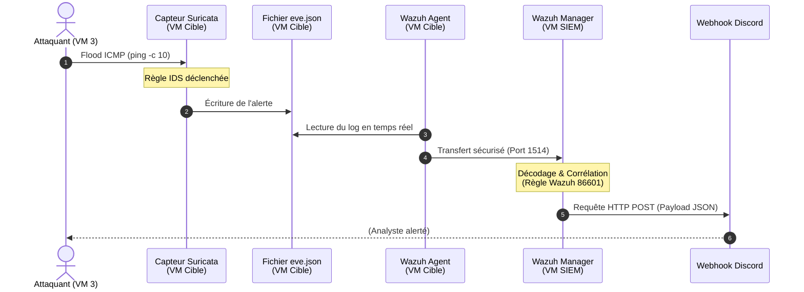

# Module 8 - Scénario d'attaque et analyse

<div
  class="omny-meta"
  data-level="🔴 Avancé"
  data-version="MITRE ATT&CK, Analyse causale"
  data-time="~30 min">
</div>

## Introduction

!!! quote "Analogie pédagogique — L'exercice d'évacuation incendie"
    Construire un système de détection d'incendie sans jamais allumer un briquet sous le capteur pour voir s'il sonne, c'est s'en remettre à la pensée magique. Ce module est l'exercice d'évacuation. Nous allons déclencher volontairement l'alarme, non pas pour le plaisir de la voir clignoter, mais pour chronométrer le temps de réaction et vérifier que la chaîne d'information (Capteur -> Centrale -> Biper) n'est pas rompue.

## 8.1 - Objectifs pédagogiques

À la fin de ce module, l'apprenant doit être capable de :

- Séparer mentalement son rôle d'Attaquant et son rôle d'Analyste SOC (séparation des casquettes).
- Générer un trafic réseau déclenchant artificiellement une règle IDS.
- Retracer la chaîne de causalité complète d'un événement (De la trame réseau brute jusqu'à la notification JSON).
- Mapper une alerte spécifique à une tactique de la matrice MITRE ATT&CK.

<br>

---

## 8.2 - Casquette de l'Attaquant : L'assaut

Ouvrez un terminal sur votre machine hôte et connectez-vous à la machine `ubuntu-hacker` (VM 3).

```bash title="Connexion à l'attaquant et lancement de l'attaque"
# Sur l'hôte
vagrant ssh ubuntu-hacker

# Dans la VM Attaquant :
# Lancer un ping massif (1 paquet tous les 0.2 secondes) vers la cible
# -c 10 : Envoyer exactement 10 paquets
# -i 0.2 : Intervalle très court pour simuler un scan agressif
ping -c 10 -i 0.2 192.168.56.20
```

Dès que la commande affiche les statistiques de retour, la tâche de l'attaquant est terminée. Quittez cette fenêtre. L'attaque (très bruyante) est en cours dans les câbles (virtuels) du réseau Host-Only.

<br>

---

## 8.3 - Casquette de l'Analyste (N1/N2) : L'investigation

En tant qu'analyste, vous devez retracer le parcours de cette attaque dans vos systèmes, étape par étape, pour garantir l'intégrité de votre chaîne de défense.


<p><em>Cinématique complète d'une détection : de la trame réseau brute à la notification.</em></p>

### Étape 1 : Le capteur IDS (Suricata)
Connectez-vous à la machine cible (`ubuntu-target`) et vérifiez le journal brut du douanier :

```bash title="Vérification du log généré par Suricata"
# Sur la cible
tail -n 2 /var/log/suricata/fast.log

# Résultat attendu :
# [**] [1:1000001:1] ALERTE SOC - Scan ICMP Detecte [**] [Classification: (null)] [Priority: 3] {ICMP} 192.168.56.30:8 -> 192.168.56.20:0
```
_Ceci prouve que Suricata a bien vu l'attaque réseau et l'a classée selon notre règle._

### Étape 2 : L'Agent (Wazuh Agent)
L'agent a lu ce fichier (grâce au bloc XML ajouté au module 6) et l'a envoyé au Manager. 

### Étape 3 : Le Cerveau (Wazuh Manager / Indexer)
Vérifiez sur votre téléphone ou sur le canal Web : la notification Discord a dû arriver. Mais surtout, allez sur le **Dashboard Web** (https://192.168.56.10).

- Allez dans **Security events**.
- Filtrez avec `rule.id: 86601` (L'ID interne générique Wazuh pour les alertes Suricata).
- Vous devriez voir 10 événements (un par ping).

Si vous ouvrez un événement JSON dans le Dashboard, vous trouverez ce champ :
```json title="Extrait du payload JSON dans le Dashboard Wazuh"
"data": {
  "src_ip": "192.168.56.30",
  "dest_ip": "192.168.56.20",
  "alert": {
    "signature_id": 1000001,
    "signature": "ALERTE SOC - Scan ICMP Detecte"
  }
}
```
L'analyste Niveau 2 (Investigation) vient de confirmer l'adresse IP de l'attaquant (`192.168.56.30`). La remédiation (bloquer l'IP dans le pare-feu de la cible) peut commencer.

<br>

---

## 8.4 - Mapping MITRE ATT&CK (Analyste Niveau 3)

La matrice MITRE ATT&CK est le référentiel mondial des techniques des attaquants. À quelle étape correspond notre "ping massif" ?

- **Tactique** : Discovery (Découverte) - L'attaquant cherche à comprendre l'environnement dans lequel il se trouve.
- **Technique** : T1046 - Network Service Discovery (Découverte des services réseau). Le ping permet de vérifier si une machine est "vivante" (up) avant de lancer des outils d'exploitation lourds comme Metasploit.

!!! note "L'intérêt du MITRE ATT&CK"
    Associer une alerte brute ("ALERTE SOC - Scan ICMP") à une étiquette universelle ("T1046") permet d'automatiser la réponse, de partager l'information avec d'autres entreprises, et de prouver au management que votre SOC suit des standards internationaux.

<br>

---

## 8.5 - Points de vigilance

- **La frustration du silence** : L'attaque part de la VM 3, mais rien ne se passe sur Discord. C'est l'essence du débogage SOC. Il faut vérifier la chaîne à l'envers. Est-ce que Wazuh Dashboard montre l'alerte ? Si oui, le problème vient du script Python (Discord). Si non, Suricata a-t-il écrit dans `eve.json` ? Si non, Suricata écoute-t-il la mauvaise carte réseau ? Ce débogage est **plus formateur** que si tout marchait du premier coup.
- **Le déluge d'alertes** : Envoyer 10 paquets ICMP génère 10 requêtes HTTP POST vers Discord. Si vous laissez tourner un `ping` infini (sans `-c`), Discord vous bannira temporairement l'IP (Rate Limiting). En production, on active une option de "grouping" dans Wazuh pour ne pas spammer l'astreinte.

<br>

---

## 8.6 - Axes d'amélioration vs projet original

| Constat dans le projet 2025 | Amélioration recommandée |
|---|---|
| Le scénario manquait de séparation des rôles. | L'introduction explicite des "Casquettes" (Attaquant vs Analyste) oblige l'apprenant à changer de point de vue, évitant l'effet "je tape des commandes magiques et j'attends de voir la fin". |
| La chaîne causale était survolée. | Le découpage "Étape 1 (Capteur) -> Étape 2 (Agent) -> Étape 3 (Cerveau)" force l'apprenant à comprendre où chercher l'information quand le processus casse au milieu. |

<br>

---

## Conclusion

!!! quote "Ce qu'il faut retenir"
    Un événement de sécurité suit une route précise : Action de l'attaquant -> Capture par la sonde réseau -> Fichier plat local -> Agent de collecte -> Décodage par le moteur central -> Interface Web / Webhook. Maîtriser cette chaîne permet d'identifier immédiatement le maillon faible lorsqu'une détection échoue en production.

> Notre SOC détecte, alerte et fonctionne. Mais pour justifier le maintien du budget l'année prochaine à la direction, un simple message Discord ne suffit pas. Il faut produire de l'intelligence métier et des métriques (KPI), ce que nous allons faire dans le **[Module 9 : Extraction et Analyse des KPI →](./09-analyse-kpi.md)**
