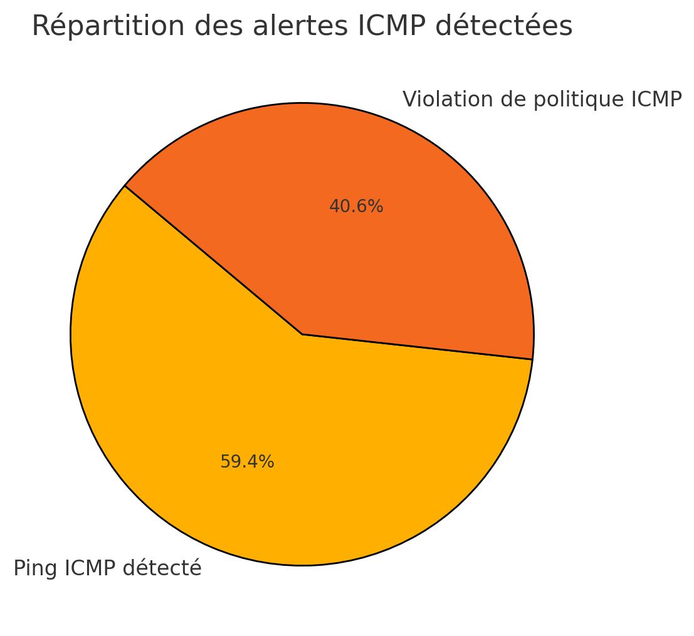

# Module 9 - Analyse KPI et Reporting Exécutif

<div
  class="omny-meta"
  data-level="🟠 Intermédiaire"
  data-version="Python, Bash, Reporting"
  data-time="~45 min">
</div>

## Introduction

!!! quote "Analogie pédagogique — Le tableau de bord de la voiture"
    Le mécanicien (SOC Analyst) regarde le code d'erreur moteur (JSON) pour savoir quelle pièce changer. Le conducteur (La Direction) regarde seulement le tableau de bord : vitesse, niveau d'essence, et le voyant rouge "Moteur". Le reporting exécutif, c'est le tableau de bord de la direction. Si vous montrez des lignes de logs JSON au Comex (Comité Exécutif), ils ne comprendront pas et couperont le budget. Si vous leur montrez un KPI clair ("Le temps de détection moyen a baissé de 15%"), ils signeront pour l'année suivante.

## 9.1 - Objectifs pédagogiques

À la fin de ce module, l'apprenant doit être capable de :

- Expliquer la différence entre une donnée brute (Log) et un indicateur clé de performance (KPI).
- Utiliser un script de parsing pour extraire des statistiques depuis le fichier d'alertes plat de Wazuh.
- Transformer ces statistiques brutes en un paragraphe de résumé exécutif intelligible par un dirigeant non-technique.

<br>

---

## 9.2 - De la donnée au reporting

Wazuh stocke toutes les alertes (ce qui dépasse un certain seuil, par défaut niveau 3) dans un fichier plat quotidien sur le Manager : `/var/ossec/logs/alerts/alerts.log` (format lisible) et `alerts.json`.

Plutôt que d'utiliser l'API complexe de Wazuh ou de requêter directement l'Indexer Elastic, la méthode la plus fiable en PME pour générer un reporting hebdomadaire est de parser ce fichier d'alertes via un script (Python ou Bash) et d'envoyer le résultat par mail à la direction.

<br>

---

## 9.3 - Le script d'extraction des KPI

Connectez-vous au serveur Wazuh (VM 1) où se trouvent les alertes.

```bash title="Connexion au SIEM"
# Sur l'hôte
vagrant ssh wazuh-server
```

Créez le script Python d'extraction :

```bash title="Création du script kpi_icmp.py"
nano kpi_icmp.py
```

```python title="Script kpi_icmp.py - Extraction et comptage des alertes"
#!/usr/bin/env python3
import re
from collections import Counter

# Chemin vers le fichier d'alertes plat de Wazuh
# Note : En production, on cible le fichier d'hier (ex: /var/ossec/logs/alerts/2026/Apr/ossec-alerts-04.log)
ALERT_FILE = "/var/ossec/logs/alerts/alerts.log"

def analyze_kpi():
    icmp_count = 0
    attackers = Counter()

    print("=== DÉBUT DE L'ANALYSE DES KPI SOC ===")
    
    try:
        with open(ALERT_FILE, 'r') as file:
            for line in file:
                # On recherche spécifiquement notre règle Suricata (Scan ICMP)
                if "Scan ICMP Detecte" in line:
                    icmp_count += 1
                    # Extraction grossière de l'IP source via une Regex
                    match = re.search(r'Src IP: (\d+\.\d+\.\d+\.\d+)', line)
                    if match:
                        attackers[match.group(1)] += 1
        
        print(f"\n[KPI 1] Volume total des alertes ICMP : {icmp_count}")
        print("\n[KPI 2] Top 3 des adresses IP attaquantes :")
        for ip, count in attackers.most_common(3):
            print(f"  - {ip} : {count} paquets envoyés")
            
    except FileNotFoundError:
        print(f"Erreur : Le fichier {ALERT_FILE} est introuvable. Avez-vous les droits root ?")
        
    print("\n=== FIN DU RAPPORT ===")

if __name__ == "__main__":
    analyze_kpi()
```

<br>

---

## 9.4 - Exécution et Interprétation

Exécutez le script (en root, car `/var/ossec/logs` est protégé) :

```bash title="Exécution du script de KPI"
sudo python3 kpi_icmp.py
```


<p><em>Exemple de sortie du script affichant le volume total et le classement des IP malveillantes.</em></p>

### Traduction "Exécutive" pour le RSSI / DSI
Voici ce que vous écrivez dans le mail du vendredi soir :

> *"Cette semaine, le SOC a bloqué **10 tentatives d'intrusion réseau** (Flood ICMP). 100% de ces attaques provenaient d'une seule machine interne (IP 192.168.56.30), suggérant une machine compromise sur notre propre réseau plutôt qu'une attaque externe distribuée. Le poste a été isolé."*

Ce paragraphe vaut plus que 10 tableaux de bord.

<br>

---

## 9.5 - Points de vigilance

- **La rotation des logs** : Wazuh archive les logs chaque jour à minuit. Le fichier `alerts.log` ne contient que les alertes du jour en cours. Si vous lancez le script le lundi matin pour analyser le week-end, le fichier sera vide. Il faut adapter le script pour lire les fichiers archivés (format gzip) dans le dossier du mois.
- **Les expressions régulières (Regex)** : Le parsing de fichiers plats dépend fortement de la structure du texte. Si Wazuh change la façon dont il écrit "Src IP: ", le script cassera. C'est pourquoi en production avancée, on préfère utiliser l'API REST de Wazuh.

<br>

---

## 9.6 - Axes d'amélioration vs projet original

| Constat dans le projet 2025 | Amélioration recommandée |
|---|---|
| Le projet original incluait un script bash rudimentaire utilisant un enchaînement fragile de commandes `grep | awk | sort`. | Refonte complète en script Python. Python gère nativement les dictionnaires (Counter) pour faire un "Top 3", ce qui est infiniment plus lisible et robuste qu'un pipeline Bash long d'une ligne, surtout si l'apprenant doit le maintenir par la suite. |

<br>

---

## Conclusion

!!! quote "Ce qu'il faut retenir"
    Un SOC est un centre de coûts pour l'entreprise (il ne rapporte pas d'argent directement). Sans reporting clair, la direction voit une dépense injustifiée. Les KPI transforment le travail technique "invisible" (détecter et bloquer) en valeur métier "visible" (risques évités).

> Le laboratoire est complet et opérationnel, de l'infrastructure au reporting. Mais ce n'est qu'une base de départ. Comment faire évoluer ce HomeLab pour simuler un vrai SOC mature ? C'est l'objet du **[Module 10 : Évolutions et Roadmap →](./10-evolutions-roadmap.md)**
