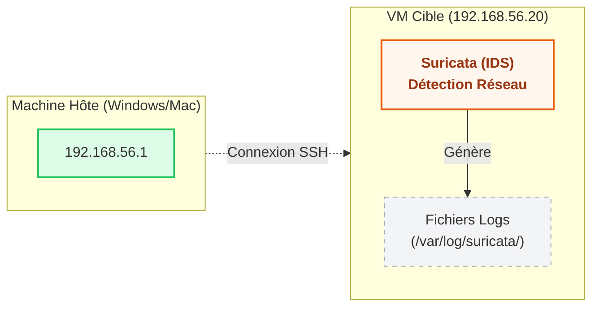
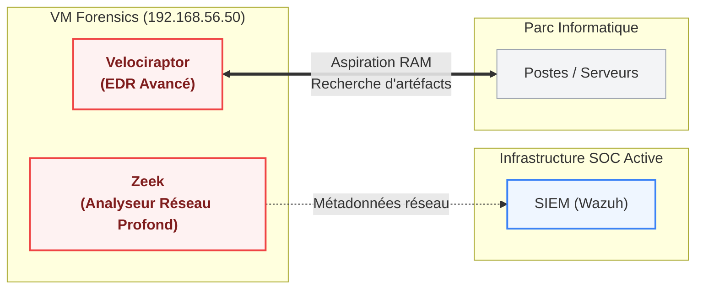

# Module 10 - Évolutions et Roadmap

<div
  class="omny-meta"
  data-level="🔴 Avancé"
  data-version="Ansible, SOAR, EDR"
  data-time="~30 min">
</div>

## Introduction

!!! quote "Analogie pédagogique — L'escalier de la maturité"
    On ne construit pas un château fort en commençant par installer les balistes automatiques. On creuse des douves, on monte des murs, on poste des gardes, et seulement à la fin, on automatise la défense. La cybersécurité obéit à la même règle : la maturité s'acquiert par paliers stricts. Sauter un palier, c'est comme automatiser le tir d'une baliste sans avoir vérifié si c'était l'ennemi ou le facteur qui s'approchait.

## 10.1 - Objectifs pédagogiques

À la fin de ce module, l'apprenant doit être capable de :

- Décrire les 5 paliers technologiques d'évolution d'un SOC.
- Argumenter pourquoi un SOAR (Palier 3) ne peut pas être implémenté avant un SIEM (Palier 2).
- Comprendre l'intérêt de la gestion de configuration (Ansible) pour le passage à l'échelle.

<br>

---

## 10.2 - Les 5 paliers de maturité d'un SOC

Le HomeLab que nous venons de construire couvre les paliers 1 et 2. Voici la feuille de route pour faire évoluer ce laboratoire vers un niveau "Entreprise".

### Palier 1 : La visibilité réseau (Fait)

<p><em>Mise en place de Suricata pour comprendre ce qui traverse le réseau.</em></p>

On commence par poser le "douanier" (Suricata). L'objectif est simplement de savoir ce qui entre et sort, sans corrélation complexe. 

### Palier 2 : La corrélation système et réseau (Fait)
```mermaid
flowchart LR
    subgraph VMTarget["VM Cible (192.168.56.20)"]
        direction TB
        Suricata["Suricata (IDS)"]:::orange
        WazuhAgent["Wazuh Agent"]:::blue
        Suricata -->|Écriture Logs| WazuhAgent
    end
    subgraph VMSIEM["VM SIEM (192.168.56.10)"]
        direction TB
        WazuhManager["Wazuh Manager
(Analyse & Corrélation)"]:::blue
        WazuhIndexer["Wazuh Indexer
(Stockage)"]:::grey
        WazuhDashboard["Wazuh Dashboard
(Visualisation)"]:::grey
        WazuhManager --> WazuhIndexer
        WazuhIndexer --> WazuhDashboard
    end
    WazuhAgent ==>|Envoi chiffré (Port 1514)| WazuhManager

    classDef orange fill:#fff7ed,stroke:#ea580c,stroke-width:2px;
    classDef blue fill:#eff6ff,stroke:#3b82f6,stroke-width:2px,color:#1e3a8a,font-weight:bold;
    classDef grey fill:#f3f4f6,stroke:#9ca3af,stroke-width:1px;
```
<p><em>Wazuh fusionne les données de l'IDS (réseau) et des agents (système).</em></p>

C'est l'état actuel de notre projet. Wazuh lie l'alerte réseau (le scan ICMP) avec l'état système de la machine. Si l'attaque réseau était une tentative de connexion SSH (brute-force), Wazuh pourrait corréler cette attaque avec la création d'un utilisateur suspect sur la machine cible 10 secondes plus tard.

### Palier 3 : L'automatisation de la réponse (Le SOAR)
```mermaid
flowchart LR
    subgraph SIEM["VM SIEM (192.168.56.10)"]
        WazuhManager["Wazuh Manager"]:::blue
    end
    subgraph SOAR["VM SOAR (192.168.56.30)"]
        direction TB
        TheHive["TheHive
(Gestion des incidents)"]:::purple
        Cortex["Cortex
(Analyseurs & Répondeurs)"]:::purple
        TheHive <-->|Enrichissement| Cortex
    end
    SIEM ==>|Alerte via API Webhook| TheHive
    Cortex -.->|Action automatique
(ex: Bloquer IP)| FW["Pare-feu / Routeur"]:::grey

    classDef blue fill:#eff6ff,stroke:#3b82f6,stroke-width:2px;
    classDef purple fill:#faf5ff,stroke:#a855f7,stroke-width:2px,color:#581c87,font-weight:bold;
    classDef grey fill:#f3f4f6,stroke:#9ca3af,stroke-width:1px,stroke-dasharray: 5 5;
```
<p><em>Intégration d'outils d'orchestration pour réduire le temps de traitement (MTTR).</em></p>

Actuellement, l'analyste reçoit le message Discord, lit l'IP source, et doit se connecter manuellement au pare-feu pour bloquer l'IP. Le **SOAR** (ex: Shuffle, ou TheHive + Cortex) automatise ça : 
1. Wazuh lève l'alerte de brute-force.
2. Le SOAR reçoit l'alerte, se connecte tout seul via API à l'Active Directory, et désactive le compte utilisateur compromis en 2 secondes, sans intervention humaine.

### Palier 4 : L'intelligence sur la menace (Le CTI)
```mermaid
flowchart LR
    subgraph CTI["VM Threat Intel (192.168.56.40)"]
        direction TB
        OpenCTI["OpenCTI
(Plateforme CTI)"]:::teal
        MISP["Flux externes
(MISP, OTX, MITRE)"]:::grey
        MISP -->|Ingestion| OpenCTI
    end
    subgraph SOC["Infrastructure SOC Active"]
        SOAR["SOAR (TheHive)"]:::purple
        SIEM["SIEM (Wazuh)"]:::blue
    end
    OpenCTI ==>|Fournit le contexte
IOC (IP, Hash)| SOAR
    OpenCTI -.->|Mise à jour listes noires| SIEM

    classDef teal fill:#f0fdfa,stroke:#14b8a6,stroke-width:2px,color:#115e59,font-weight:bold;
    classDef purple fill:#faf5ff,stroke:#a855f7,stroke-width:2px;
    classDef blue fill:#eff6ff,stroke:#3b82f6,stroke-width:2px;
    classDef grey fill:#f3f4f6,stroke:#9ca3af,stroke-width:1px;
```
<p><em>OpenCTI ou MISP prévient le SOC des menaces avant même qu'elles n'attaquent.</em></p>

Plutôt que d'attendre qu'une IP nous attaque, on s'abonne à des bases de données mondiales (OpenCTI, MISP) qui recensent les IP des hackers connus. Le SOC bloque ces IP préventivement. C'est le passage de la défense réactive à la défense proactive.

### Palier 5 : L'investigation avancée (L'EDR Actif)

<p><em>Investigation de la mémoire vive (RAM) et récupération de la charge virale (Forensic à chaud).</em></p>

Wazuh a des capacités EDR, mais limitées au blocage basique (Active Response). Un outil spécialisé comme **Velociraptor** permet à l'analyste de niveau 3 (Forensic) d'aspirer la mémoire vive d'une machine infectée à distance pour étudier le code du malware, sans devoir se déplacer physiquement.

<br>

---

## 10.3 - Le passage à l'échelle : Ansible

Aujourd'hui, si vous devez déployer l'agent Wazuh sur 500 serveurs cibles, vous n'allez pas faire 500 fois `vagrant ssh` puis copier-coller la commande d'installation (Module 5).

L'étape suivante de l'évolution de l'Infrastructure as Code (IaC) est d'utiliser **Ansible** (Gestionnaire de configuration).

1. Vagrant crée les 500 coquilles vides.
2. Ansible se connecte en SSH aux 500 machines simultanément.
3. Ansible exécute un `Playbook` (fichier YAML) qui installe Wazuh Agent, Suricata, et pousse le fichier de configuration `ossec.conf` automatiquement.

*Voir le chapitre complet sur Ansible dans le module Administration Système d'OmnyDocs.*

<br>

---

## 10.4 - Points de vigilance

- **Le syndrome du jouet brillant** : Vouloir installer OpenCTI (Palier 4) alors que les alertes de base de Wazuh (Palier 2) ne sont pas encore traitées proprement. C'est l'erreur la plus coûteuse en entreprise.
- **L'automatisation aveugle** : Configurer le SOAR pour bloquer automatiquement une IP source dès qu'une alerte sonne. Si le hacker usurpe l'adresse IP de votre propre serveur DNS, votre SOAR va bloquer votre propre serveur DNS, coupant l'accès Internet à toute l'entreprise. C'est le hacker qui a utilisé vos propres défenses pour vous mettre hors ligne.

<br>

---

## 10.5 - Axes d'amélioration vs projet original

| Constat dans le projet 2025 | Amélioration recommandée |
|---|---|
| La conclusion du projet original listait ces paliers de manière brute, comme un catalogue d'outils à installer. | Structurer l'évolution sous forme d'échelle de maturité chronologique stricte. On n'installe pas le palier N+1 si le palier N n'est pas maîtrisé. |
| Aucune notion des risques liés à l'automatisation. | Ajout de la notion critique "d'auto-déni de service" (Le SOAR qui bloque la propre infrastructure légitime de l'entreprise) pour temporiser l'enthousiasme de la remédiation automatique. |

<br>

---

## Conclusion

!!! quote "Ce qu'il faut retenir"
    Un SOC n'est jamais "terminé". Il évolue avec la taille de l'entreprise et la sophistication des attaquants. Le HomeLab créé dans ce cours est une fondation solide : il maîtrise la collecte et l'alerte. Tout le reste n'est que de l'enrichissement.

> Le cours principal est désormais achevé. Vous trouverez dans le document suivant l'**[Annexe A à D : Audit critique, Résumé des commandes, et Ressources →](./11-annexes.md)** pour aller plus loin et conserver une trace des apprentissages.
