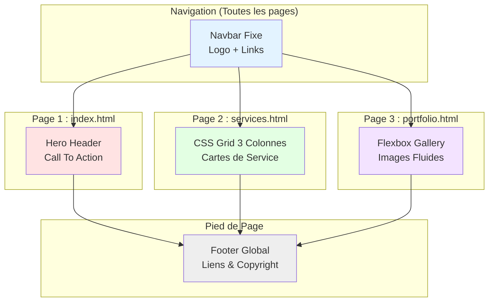

# Site Vitrine

<div
  class="omny-meta"
  data-level="🟢 Débutant (Synthèse)"
  data-version="1.0"
  data-time="4-6 heures (5 phases)">
</div>


!!! quote "Analogie pédagogique"
    _Travailler sur un projet complet est comparable à l'assemblage final d'une voiture sur une ligne de production. C'est ici que toutes les pièces individuelles (concepts appris précédemment) doivent s'emboîter parfaitement pour créer un produit fonctionnel et sécurisé._

## Introduction du projet - DigitalCraft Agency

Bienvenue dans le premier projet majeur de votre cursus : la création complète d'un **Site Vitrine professionnel** pour l'agence fictive *DigitalCraft*. Ce projet a une contrainte industrielle stricte : atteindre un résultat visuel exceptionnel, responsive, et interactif (menus, survols) **exclusivement avec du HTML Sémantique et du CSS Vanilla**.

!!! note "Ce projet exploite la puissance du CSS moderne : utilisation de Variables CSS (`:root`) pour un Design System maintenable, `Flexbox` et `CSS Grid` pour des layouts fluides, et des astuces CSS avancées (Checkbox Hack) pour remplacer le comportement JavaScript traditionnel."

Cette phase **zéro vous présente** :

- Les objectifs pédagogiques de l'intégration web pure.
- L'architecture du Document Object Model (DOM) attendue.
- La modélisation visuelle des composants (Header, Hero, Services, Portfolio).
- Les règles du Mobile-First et de la hiérarchie CSS.
- La structure logique des 5 Phases de construction.
- Les compétences d'intégrateur Front-End validées.

!!! quote "Pourquoi s'interdire le JavaScript dans ce projet ?"
    En tant que professionnel du web, la maîtrise des fondations (HTML/CSS) est non-négociable. Le JavaScript est souvent utilisé à tort pour pallier des lacunes en CSS (comme l'alignement ou l'état d'un menu). Ce laboratoire vous force à **exploiter 100% des capacités natives du navigateur** : rapidité d'exécution, accessibilité d'écran, et SEO (Search Engine Optimization) parfait. C'est l'essence du métier d'Intégrateur Web.

## Objectifs d'Apprentissage

!!! abstract "Avant le début de la Phase 1, **vous serez capable de** :"

    - [ ] Appliquer la philosophie **Mobile-First** (concevoir d'abord pour smartphone).
    - [ ] Identifier la **sémantique HTML5** appropriée (`<header>`, `<main>`, `<article>`, `<section>`).
    - [ ] Comprendre le fonctionnement d'un **Design System** via les Variables CSS (`--primary-color`).
    - [ ] Choisir entre **Flexbox** (1D) et **CSS Grid** (2D) selon le besoin du composant.
    - [ ] Implémenter le comportement asynchrone d'un menu mobile sans JS (**Checkbox Hack**).
    - [ ] Anticiper les breakpoints pour rendre le site **Totalement Responsive**.

## Finalité Pédagogique et Professionnelle

### Pourquoi construire ce site statique de zéro ?

!!! quote "Ce projet n'est **pas** une copie de template. C'est un **livrable métier concret** que tout freelance ou développeur en agence doit être capable de "from scratcher" (créer de zéro) en un temps record, avec un code parfait."

**Cas d'usage professionnels directs :**

- **Développeur Freelance** → Création de landing pages ultra-rapides pour des clients.
- **Intégrateur Web en Agence** → Traduction fidèle de maquettes Figma en code pixel-perfect.
- **Audit SEO / Accessibilité** → Structuration de la donnée pour le référencement Google.
- **Socle pour applications futures** → Ce code HTML/CSS servira de fondation exacte pour vos futurs projets JavaScript et Laravel.

**Compétences intégration + design transférables :**

- [x] Structuration sémantique du DOM (SEO Friendly)
- [x] Architecture de fichiers claire (Dossier `css/`, `assets/`, pages HTM)
- [x] Maîtrise absolue du Box Model (Padding, Margin, Border)
- [x] Gestion des images fluides (`object-fit`, optimisation)
- [x] Création d'états interactifs (`:hover`, `:focus`, `:active`)
- [x] Animations CSS fluides (`transition: all 0.3s ease`)

## Architecture Globale du Projet

### Le Rendu Visuel Ciblé



<small>*L'architecture simule un site statique multi-pages. La navigation et le footer sont unifiés graphiquement. Chaque page cible une compétence technique précise : le flux normal (Accueil), la grille bi-dimensionnelle (Services), et les alignements Flexbox conditionnels (Portfolio).*</small>

### Modélisation du DOM et du Layout

=== "Structure Sémantique HTML5"

    !!! quote "**Arbre Document Object Model (DOM)** représentant l'imbrication stricte des balises selon les standards du W3C."

    ```mermaid
    flowchart TD
        BODY[body] --> HEADER[header.main-header]
        HEADER --> NAV[nav.navbar]
        NAV --> LOGO[a.logo]
        NAV --> MENU[ul.nav-links]
        
        BODY --> MAIN[main.content]
        
        MAIN --> SEC1[section.hero]
        SEC1 --> H1[h1]
        SEC1 --> CTA[a.btn]
        
        MAIN --> SEC2[section.features]
        SEC2 --> ART1[article.card]
        SEC2 --> ART2[article.card]
        
        BODY --> FOOTER[footer.main-footer]
        FOOTER --> COP[p.copyright]
        FOOTER --> SOC[ul.socials]
        
        style BODY fill:#f9f9f9,stroke:#333,stroke-width:2px
        style HEADER fill:#e3f3ff,stroke:#333
        style MAIN fill:#ffe3e3,stroke:#333
        style FOOTER fill:#eeeeee,stroke:#333
    ```

    <small>*La sémantique est primordiale. Les balises comme `<header>`, `<main>`, et `<footer>` remplacent les `<div class="header">` obsolètes. Cela garantit l'accessibilité pour les liseuses d'écran et maximise le score SEO.*</small>

=== "Système de Grille & Flexbox"

    !!! quote "**Stratégies de Layout CSS** : Comparaison de l'application Flexbox (Navigation) vs CSS Grid (Cartes de services)."

    ```mermaid
    classDiagram
        class FlexboxLayout {
            <<Navbar & Menu>>
            display: flex
            justify-content: space-between
            align-items: center
            flex-wrap: wrap
        }
        
        class GridLayout {
            <<Services Cards>>
            display: grid
            grid-template-columns: repeat(auto-fit, minmax(300px, 1fr))
            gap: 2rem
        }
        
        class BoxModel {
            <<Global Object>>
            box-sizing: border-box
            padding: 1.5rem
            margin: 0 auto
            max-width: 1200px
        }
        
        BoxModel <-- FlexboxLayout : Application de dimension
        BoxModel <-- GridLayout : Application de dimension
    ```
    <small>*Le layout de la barre de navigation se prête parfaitement à **Flexbox** (distribution sur 1 axe horizontal). La liste des services bénéficie de la puissance magique du module **Grid** : une seule ligne de code `auto-fit` et `minmax` permet un passage à la ligne 100% automatique sans Media Queries.*</small>

=== "Le Hack du Menu Burger (Sans JS)"

    !!! quote "**Astuce CSS du Checkbox Hack** : Contrôler l'état (ouvert/fermé) d'une popup exclusivement avec du CSS."

    ```mermaid
    sequenceDiagram
        actor User
        participant Label as Label (Icône Burger)
        participant Check as Input Checkbox (Caché)
        participant Menu as UL (Menu Mobile)
        
        Note over Label,Menu: HTML: input + label + ul
        User->>Label: Clic sur l'icône (CSS: cursor pointer)
        Label->>Check: Transmet l'action (for="toggle")
        Note over Check: input change d'état (checked)
        Check->>Menu: Sibling Selector CSS (input:checked ~ ul)
        Note over Menu: Le CSS applique "transform: translateX(0)"
        Menu-->>User: Le menu glisse sur l'écran !
    ```

    <small>*Dans un contexte sans JavaScript, le navigateur permet de stocker un état "booléen" (Vrai/Faux) en utilisant la balise `<input type="checkbox">`. En couplant cela au sélecteur CSS de frère adjacent (`~` ou `+`), nous pouvons styliser notre menu.*</small>

## Rôle des Fondations CSS Modernes

### Pourquoi un "Design System" (Variables CSS) ?

Les variables natives (`--var`) transforment un fichier CSS mort en un système dynamique paramétrable.

```css
/* Fichier : style.css */
:root {
  /* Design Tokens - Couleurs */
  --color-primary: #2563eb;
  --color-secondary: #0f172a;
  --color-accent: #f43f5e;
  --color-bg: #ffffff;
  --color-text: #334155;

  /* Typography & Spacing */
  --font-main: 'Inter', system-ui, sans-serif;
  --spacing-md: 1.5rem;
  --radius-sm: 8px;
}

.btn {
  background-color: var(--color-primary);
  border-radius: var(--radius-sm);
  padding: var(--spacing-md);
}

/* Magie de la maintenance ! Le client veut que le site passe au Rouge ?
   Il suffit de modifier --color-primary en une seule et unique ligne. */
```

### Le comportement "Mobile-First"

Au lieu de coder un site pour ordinateur puis de le "réparer" pour téléphone, vous coderez toutes vos règles CSS de base en pensant d'abord aux smartphones, puis vous ajouterez les améliorations avec les requêtes `@media` de largeur minimale.

```css
/* 1. Base : Ciblage naturel des mobiles (Empilement en colonne) */
.service-cards {
  display: flex;
  flex-direction: column;
  gap: 1rem;
}

/* 2. Breakpoint Tablette / Ordinateur (> 768px) */
@media (min-width: 768px) {
  .service-cards {
    flex-direction: row; /* On passe sur une ligne */
  }
}
```

## Structure des 5 Phases

!!! quote "Progression logique : Du reset fondamental jusqu'au redimensionnement final des colonnes."

<div class="cards grid" markdown>

- :fontawesome-solid-folder-tree: **Phase 1 : Architecture & Design System**

    ---

    **Temps :** 1h  
    **Objectif :** Poser les fondations statiques du projet.
    **Livrables :**

    - Création des 3 fichiers `.html` vides.
    - Création de `css/style.css` lié aux 3 pages.
    - Reset CSS complet (`box-sizing: border-box`).
    - Injection des Variables CSS complexes au `:root`.
    - Typographie intégrée via Google Fonts.

    ---

    🟢 Débutant

- :fontawesome-solid-compass: **Phase 2 : Navbar & Mobile Menu**

    ---

    **Temps :** 1h30  
    **Objectif :** Créer l'entête global du site résistant à tout écran.  
    **Livrables :**

    - Structure HTML sémantique (`<nav>`).
    - Flexbox pour espacer la navigation.
    - État `:hover` sur les liens avec transitions fines.
    - **Le défi :** Implémentation du menu Hamburger caché fonctionnant avec le sélecteur `input:checked`.

    ---

    🟡 Intermédiaire

- :fontawesome-solid-image: **Phase 3 : Accueil & Call To Acton (Hero)**

    ---

    **Temps :** 1h  
    **Objectif :** Obtenir l'effet "Wahou" à l'arrivée sur le site.  
    **Livrables :**

    - Section Hero couvrant l'écran (`min-height: 80vh`).
    - Image d'arrière-plan via CSS (`background-image`, `background-size: cover`).
    - Centrage absolu du texte de présentation.
    - Conception d'un bouton CTA (.btn) très propre et réutilisable.

    ---

    🟢 Débutant

- :fontawesome-solid-table-cells-large: **Phase 4 : Grilles & Cartes (Services)**

    ---

    **Temps :** 1h  
    **Objectif :** Manipuler le module Grid pour des composants modulaires.  
    **Livrables :**

    - Conception du bloc `article.card` indépendant (Ombres, Radius, Paddings).
    - Enveloppement dans un Grid Container CSS.
    - Utilisation de `grid-template-columns` magique.
    - Gestion asymétrique des Cards selon la taille de texte.

    ---

    🟡 Intermédiaire

- :fontawesome-solid-mobile-screen-button: **Phase 5 : Portfolio & Résolution Finale**

    ---

    **Temps :** 1h  
    **Objectif :** Flexibilité finale et ajustements Media Queries.  
    **Livrables :**

    - Galerie d'images réagissant à la compression.
    - Sécurisation absolue des ratios grâce à `object-fit: cover`.
    - Création du Footer avec maillage réseau.
    - **Validation :** Inspection DevTools sur les formats `iPhone SE`, `iPad`, et `Ecran 4K`. Aucun débordement n'est toléré.

    ---

    🟢 Débutant

</div>

## Prérequis et Outils

<div class="cards grid" markdown>

- :fontawesome-solid-circle-check: **Indispensables**

    ---

    - [x] **Éditeur VS Code** + Extension *Live Server* configurée.
    - [x] Connaissance des balises sémantiques (Div, Header, Main).
    - [x] Compréhension théorique de Flexbox (Row vs Column).
    - [x] Compréhension théorique des sélecteurs CSS (Classes `.`, Ids `#`).

- :fontawesome-solid-circle-half-stroke: **Recommandées**

    ---

    - 🟡 Connaissance de base de CSS Grid.
    - 🟡 Inspection d'éléments (F12) sur Google Chrome / Firefox.

- :fontawesome-solid-graduation-cap: **Apprises durant le projet**

    ---

    - [x] Combinateur fraternel CSS (`~` et `+`)
    - [x] Fonction calc() et var()
    - [x] Pseudo-classes d'état complexes (`:checked`)
    - [x] L'état mental du "Mobile-First"

</div>

## Checklist de Validation & Fin de Mission

1. Ouvre ton environnement Visual Studio Code.
2. Démarre en instanciant ton design system au `root`.
3. Code chaque balise. N'utilise pas un seul framework CSS type Tailwind ou Bootstrap, c'est interdit ici.
4. **Validation Professionnelle** : 
   - [ ] Mon design ne casse pas lorsque je redimensionne sauvagement la fenêtre à la souris.
   - [ ] Aucun ascenseur horizontal (scroll x) n'apparaît sur mobile.
   - [ ] Mon balisage HTML est sémantiquement parfait (0 `div` superflue).

> *Note cruciale : Archive ce répertoire avec un soin extrême une fois terminé. Ce code HTML pur sera importé, découpé, et transformé en interface vivante lors du prochain Lab : **Dynamisation Vitrine (JavaScript)***. Vous allez bientôt souffler la vie dans votre code inerte.

<br>

---

## Conclusion

!!! quote "Ce qu'il faut retenir"
    La validation de cette étape confirme votre capacité à intégrer des concepts avancés dans un flux de travail professionnel. L'architecture globale prend maintenant tout son sens.

> [Retour à l'index du projet →](../index.md)
