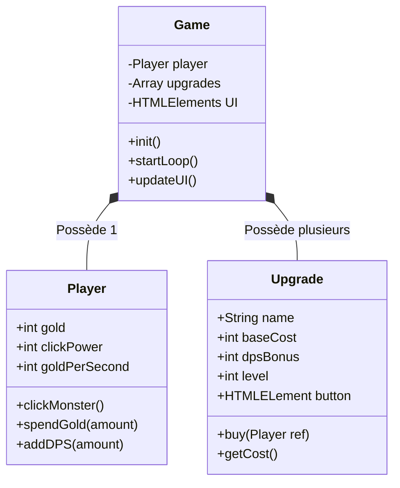

# Clicker Hero (POO)

!!! quote "Analogie pédagogique"
    _Travailler sur un projet complet est comparable à l'assemblage final d'une voiture sur une ligne de production. C'est ici que toutes les pièces individuelles (concepts appris précédemment) doivent s'emboîter parfaitement pour créer un produit fonctionnel et sécurisé._

!!! quote "Le Pitch"
    Le paradigme procédural (des fonctions qui appellent d'autres fonctions) atteint ses limites quand une application grandit. Comment gérer un jeu où le joueur, les 15 bâtiments achetables virtuels, et le moteur temporel doivent interagir sans créer un code spaghettis colossal ? En encapsulant la logique à travers la **Programmation Orientée Objet (POO)**. Vous allez coder un jeu incrémental où chaque élément est une 'Instance' autonome.

!!! abstract "Objectifs Pédagogiques"
    1.  **Architecture de Classes (ES6)** : Créer des plans de fabrication `class Player`, `class Upgrade` et `class Game`.
    2.  **L'encapsulation et le mot clé `this`** : Comprendre pourquoi le contexte (this) est vital pour lier les données propres à un objet.
    3.  **Le Design Pattern Singleton** : S'assurer qu'il n'existe qu'une seule et unique copie du Game Engine.
    4.  **Le Game Loop (Boucle Temporelle)** : Construire un `setInterval` maître qui distribue de l'or automatiquement chaque seconde en fonction des bâtiments possédés.

## 🏛️ Architecture du Projet

Le jeu Clicker Hero (Inspiré de *Cookie Clicker*) sépare radicalement les entités. Le modèle mental passe de "Que fait cette fonction ?" à **"Que sait faire cet Objet ?"**.

### Concepts Clés Abordés

#### 1. L'Instanciation (Le moule et le gâteau)
Une `class` n'est pas une donnée, c'est un "Plan d'Architecte". Quand vous appelez `new Upgrade('Mine', 100, 5)`, vous utilisez le plan pour construire un vrai bâtiment en RAM. Vous pourrez en construire 50 autres avec ce même plan.

#### 2. La Formule d'Inflation Mathématique
Un jeu incrémental n'a d'intérêt que si les prix montent exponentiellement. Une méthode privée évaluera le prix du prochain achat : `baseCost * (1.15 ^ level)`.

## 🚀 Le Plan de Vol (Phases)

La création de cet écosystème POO est fragmentée en 4 phases rigoureuses.

  <a href="./phase1/" class="block p-6 bg-white border border-gray-200 rounded-xl hover:border-blue-500 hover:shadow-md transition-all">
    

      

        <svg xmlns="http://www.w3.org/2000/svg" width="24" height="24" viewBox="0 0 24 24" fill="none" stroke="currentColor" stroke-width="2" stroke-linecap="round" stroke-linejoin="round"><path d="M12 2v20"/><path d="M17 5H9.5a3.5 3.5 0 0 0 0 7h5a3.5 3.5 0 0 1 0 7H6"/></svg>
      

      <h3 class="font-bold text-gray-900 m-0">Phase 1 : Le Joueur (Player Class)</h3>
    

    
Création de la classe isolée du Joueur, contenant sa bourse d'Or, et la logique pure du Clic manuel.

  </a>

  <a href="./phase2/" class="block p-6 bg-white border border-gray-200 rounded-xl hover:border-blue-500 hover:shadow-md transition-all">
    

      

        <svg xmlns="http://www.w3.org/2000/svg" width="24" height="24" viewBox="0 0 24 24" fill="none" stroke="currentColor" stroke-width="2" stroke-linecap="round" stroke-linejoin="round"><path d="M3 3v18h18"/><path d="m19 9-5 5-4-4-3 3"/></svg>
      

      <h3 class="font-bold text-gray-900 m-0">Phase 2 : L'Usine (Upgrade Class)</h3>
    

    
Création des bâtiments achetables. Introduction aux méthodes mathématiques d'inflation des prix (ScaleCost).

  </a>

  <a href="./phase3/" class="block p-6 bg-white border border-gray-200 rounded-xl hover:border-blue-500 hover:shadow-md transition-all">
    

      

        <svg xmlns="http://www.w3.org/2000/svg" width="24" height="24" viewBox="0 0 24 24" fill="none" stroke="currentColor" stroke-width="2" stroke-linecap="round" stroke-linejoin="round"><circle cx="12" cy="12" r="10"/><polyline points="12 6 12 12 16 14"/></svg>
      

      <h3 class="font-bold text-gray-900 m-0">Phase 3 : Game Engine & Loop</h3>
    

    
Générer le Chef d'Orchestre (Classe Game) qui lie le Joueur aux Boutiques. Création de la Horloge Interne.

  </a>

  <a href="./phase4/" class="block p-6 bg-white border border-gray-200 rounded-xl hover:border-blue-500 hover:shadow-md transition-all">
    

      

        <svg xmlns="http://www.w3.org/2000/svg" width="24" height="24" viewBox="0 0 24 24" fill="none" stroke="currentColor" stroke-width="2" stroke-linecap="round" stroke-linejoin="round"><rect width="18" height="18" x="3" y="3" rx="2" ry="2"/><line x1="3" x2="21" y1="9" y2="9"/><line x1="9" x2="9" y1="21" y2="9"/></svg>
      

      <h3 class="font-bold text-gray-900 m-0">Phase 4 : UI Reactive</h3>
    

    
Transformer la donnée brute POO en interface graphique (Mise à jour du DOM asynchrone, griser les boutons trop chers).

  </a>

## 🛠️ Outils & Prérequis

- Le projet peut être réalisé en architecture de Fichiers Modulaires (Vite.js) ou en un seul très gros fichier `app.js` pour bien comprendre les hiérarchies (Notre méthode du jour).
- Une compréhension très claire de l'orienté objet des Langages C (Java, C#, JS) et de sa syntaxe à base d'accolades et de Constructeurs.

  <h4 class="text-lg font-bold text-gray-900 mt-0 mb-4">✅ Objectif de Validation</h4>
  <ul class="space-y-2 mb-0">
    <li class="flex items-start gap-2">
      ✓
      Le joueur clique sur un monstre gigantesque et gagne de l'or manuellement.
    </li>
    <li class="flex items-start gap-2">
      ✓
      S'il a assez d'or, il peut acheter une "Mine" ou une "Usine". L'usine ajoute son rendement au revenu global du joueur.
    </li>
    <li class="flex items-start gap-2">
      ✓
      Chaque seconde réelle qui passe (Game Loop), le patrimoine du joueur s'incrémente automatiquement des rendements de ses bâtiments.
    </li>
  </ul>

---

## Conclusion

!!! quote "Ce qu'il faut retenir"
    La validation de cette étape confirme votre capacité à intégrer des concepts avancés dans un flux de travail professionnel. L'architecture globale prend maintenant tout son sens.

> [Retour à l'index du projet →](../index.md)
