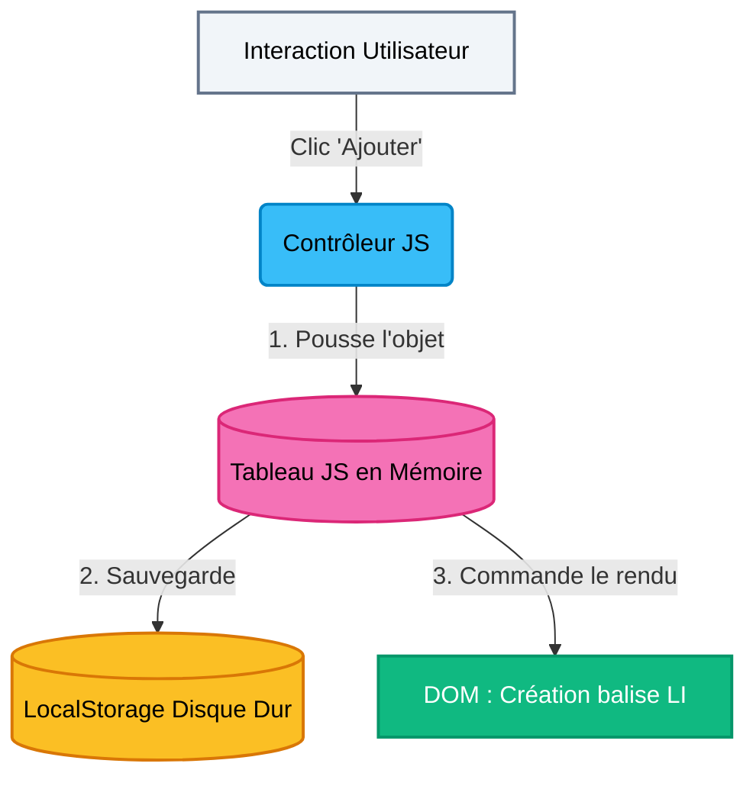

# Liste de Courses

!!! quote "Le Pitch"
    Avant d'attaquer des applications connectées aux serveurs du monde entier, il faut maîtriser la gestion de données en circuit fermé. Ce projet vous demande de concevoir une liste de courses intelligente : l'utilisateur peut ajouter un article, le rayer (barré), ou le supprimer. Le point crucial ? Si l'on ferme le navigateur, la liste doit réapparaître intacte à la réouverture.

!!! abstract "Objectifs Pédagogiques"
    1.  **DOM Level 2** : Maîtriser `document.createElement` et `appendChild` pour construire l'interface depuis le JavaScript, sans écrire le HTML à la main.
    2.  **Web Storage API** : Comprendre pourquoi les objets JavaScript disparaissent au rafraîchissement et comment les sauvegarder avec `localStorage.setItem`.
    3.  **JSON Parsing** : Sérialiser et désérialiser des tableaux complexes d'objets (Stringify / Parse).
    4.  **Délégation d'événements** : Gérer les clics sur des éléments qui n'existent pas encore au chargement de la page.

## 🏛️ Architecture du Projet

Contrairement à la pure intégration statique, une application avec "État" (State) nécessite de séparer la donnée (Le Cerveau) de l'affichage (L'Écran).

### Concepts Clés Abordés

#### 1. Le Single Source of Truth
L'erreur classique est de lire le DOM (compter les balises `<li>`) pour savoir combien d'articles sont dans la liste. Dans ce projet, le JavaScript maintient un tableau `let courses = []`. C'est **LUI** la seule vérité. Si l'HTML disparaît, le tableau recrée l'HTML. S'il n'est pas dans le tableau, il n'existe pas.

#### 2. Sérialisation JSON
Le `LocalStorage` du navigateur est stupide : il ne sait sauvegarder que du "Texte" (String). Vous ne pouvez pas lui donner un Tableau Javascript `[ {nom: "Pomme"} ]`. Vous devez apprendre à utiliser `JSON.stringify()` pour transformer ce tableau en phrase de texte que le navigateur comprend.

## 🚀 Le Plan de Vol (Phases)

Ce projet est découpé en 3 phases d'ingénierie stricte.

  <a href="./phase1/" class="block p-6 bg-white border border-gray-200 rounded-xl hover:border-blue-500 hover:shadow-md transition-all">
    

      

        <svg xmlns="http://www.w3.org/2000/svg" width="24" height="24" viewBox="0 0 24 24" fill="none" stroke="currentColor" stroke-width="2" stroke-linecap="round" stroke-linejoin="round"><rect width="18" height="18" x="3" y="3" rx="2" ry="2"/><line x1="3" x2="21" y1="9" y2="9"/><line x1="9" x2="9" y1="21" y2="9"/></svg>
      

      <h3 class="font-bold text-gray-900 m-0">Phase 1 : Interface et Layout</h3>
    

    
Construction du squelette HTML et du style CSS de l'application de courses.

  </a>

  <a href="./phase2/" class="block p-6 bg-white border border-gray-200 rounded-xl hover:border-blue-500 hover:shadow-md transition-all">
    

      

        <svg xmlns="http://www.w3.org/2000/svg" width="24" height="24" viewBox="0 0 24 24" fill="none" stroke="currentColor" stroke-width="2" stroke-linecap="round" stroke-linejoin="round"><path d="M12 20h9"/><path d="M16.5 3.5a2.12 2.12 0 0 1 3 3L7 19l-4 1 1-4 Z"/></svg>
      

      <h3 class="font-bold text-gray-900 m-0">Phase 2 : Algorithme CRUD</h3>
    

    
Création des fonctions d'Ajout, Suppression et bascule d'état des objets Javascript.

  </a>

  <a href="./phase3/" class="block p-6 bg-white border border-gray-200 rounded-xl hover:border-blue-500 hover:shadow-md transition-all md:col-span-2">
    

      

        <svg xmlns="http://www.w3.org/2000/svg" width="24" height="24" viewBox="0 0 24 24" fill="none" stroke="currentColor" stroke-width="2" stroke-linecap="round" stroke-linejoin="round"><path d="M21 15v4a2 2 0 0 1-2 2H5a2 2 0 0 1-2-2v-4"/><polyline points="17 8 12 3 7 8"/><line x1="12" x2="12" y1="3" y2="15"/></svg>
      

      <h3 class="font-bold text-gray-900 m-0">Phase 3 : Persistance JSON</h3>
    

    
Câblage critique avec le disque dur (LocalStorage) pour sauvegarder les courses à vie.

  </a>

## 🛠️ Outils & Prérequis

- Un éditeur de code (VS Code).
- L'extension **Live Server** (Vite.js est optionnel ici car l'application tient dans un unique fichier `script.js` propre).
- Compréhension acquise des variables (`let` / `const`), des objets `{}` et des tableaux `[]`.

  <h4 class="text-lg font-bold text-gray-900 mt-0 mb-4">✅ Objectif de Validation</h4>
  <ul class="space-y-2 mb-0">
    <li class="flex items-start gap-2">
      ✓
      Je peux ajouter 5 articles à ma liste en appuyant sur "Entrée".
    </li>
    <li class="flex items-start gap-2">
      ✓
      Je peux cliquer sur un article pour le rayer (Grisé et barré).
    </li>
    <li class="flex items-start gap-2">
      ✓
      Je peux fermer le navigateur, le rouvrir, et ma liste est intacte.
    </li>
  </ul>

