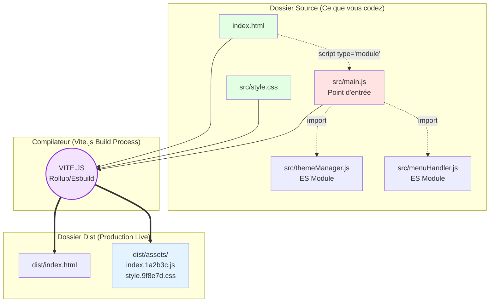

# Site Vitrine

<div
  class="omny-meta"
  data-level="🟡 Intermédiaire"
  data-version="1.0"
  data-time="1 - 2 heures">
</div>


!!! quote "Analogie pédagogique"
    _Travailler sur un projet complet est comparable à l'assemblage final d'une voiture sur une ligne de production. C'est ici que toutes les pièces individuelles (concepts appris précédemment) doivent s'emboîter parfaitement pour créer un produit fonctionnel et sécurisé._

## Introduction du projet - Le réveil de DigitalCraft

Félicitations, vous avez livré un site statique parfait pour l'agence **DigitalCraft**. Mais le Web de 2026 n'est plus inerte. Le client revient vers vous avec de nouvelles exigences : "Nos utilisateurs veulent consulter le site la nuit sans s'abîmer les yeux (Dark Mode), et notre directeur souhaite que le menu disparaisse sans recharger la page. Nous voulons aussi un filtre interactif pour le Portfolio."

!!! note "Ce projet marque votre transition de l'Intégration Statique (HTML/CSS) vers l'Ingénierie Front-End. Vous n'écrivez plus des pages mortes ; vous programmez des **interfaces logicielles vivantes**, capables de mémoriser les choix utilisateur et de réagir instantanément au clic."

Cette phase **zéro vous présente** :

- L'architecture d'un projet industriel moderne avec **Vite.js**.
- L'arbre du **Document Object Model (DOM)** et sa manipulation en mémoire.
- Le cycle de vie d'un Événement asynchrone (Event Loop, Listeners).
- Le rôle central de l'API `LocalStorage`.
- La structure logique des 5 Phases de dynamisation.
- Les compétences d'Ingénieur JavaScript acquises.

!!! quote "Pourquoi migrer vers Vite.js pour du Vanilla JS ?"
    Jusqu'à présent, vous ouvriez vos fichiers `index.html` directement dans le navigateur ou via Live Server. Mais dans l'industrie, on écrit du code modulaire (des dizaines de petits fichiers JS isolés). Le navigateur ne sait pas lire 50 fichiers JS découpés efficacement. **Vite.js est un Bundler**. Il compile instantanément vos dizaines de fichiers JS/CSS en un seul paquet ultra-rapide et vous offre le Hot Module Replacement (HMR). C'est le standard industriel (moteur de Vue, React, Svelte).

## Objectifs d'Apprentissage

!!! abstract "Avant le début de la Phase 1, **vous serez capable de** :"

    - [ ] Déployer un environnement de développement professionnel (**Terminal, npm, Vite**).
    - [ ] Découper la logique JavaScript en fichiers isolés (**Modules ES6**, `import/export`).
    - [ ] Sélectionner tout élément HTML via les méthodes de l'objet global `document`.
    - [ ] Écouter les interactions du visiteur via `addEventListener`.
    - [ ] Altérer instanément le CSS et l'HTML sans recharger la page.
    - [ ] Construire une persistance asynchrone native (**Web Storage API / LocalStorage**).

## Finalité Pédagogique et Professionnelle

### Pourquoi l'architecture modulaire Vanilla ?

!!! quote "Ce projet n'est **pas** un apprentissage de framework (React/Vue). C'est la maîtrise absolue des **Web APIs natives**. Sans cette maîtrise, aucun développeur ne peut comprendre ce que font concrètement les frameworks lourds sous le capot."

**Cas d'usage professionnels directs :**

- **Dynamisation e-commerce** → Gérer l'ajout au panier sans coupure serveur.
- **Micro-interactions** → Créer des modales, alertes toast, et menus complexes en entreprise.
- **Performance pure** → Construire des Landing Pages SEO sans le poids (payload) de React.
- **Maîtrise de l'état (State)** → Comprendre comment retenir un choix utilisateur (RGPD, Dark Mode).

**Compétences JavaScript transférables :**

- [x] Initialisation de paquet (`package.json`) via `npm init`.
- [x] Compilation Front-End via Vite.js (Rollup/Esbuild).
- [x] Portée des variables (`let` vs `const`, Block Scoping).
- [x] Manipulation des Objets et Tableaux JS (`[{ id: 1 }, { id: 2 }]`).
- [x] Interaction Web Storage (`setItem`, `getItem`, `JSON.stringify()`).
- [x] Délégation d'événements pour l'optimisation mémoire.

## Architecture Globale du Projet

### Migration et Structure Vite.js



<small>*Fini le code spaghetti de 2005. L'approche ES Modules vous oblige à découper vos actions. Vite.js aspire tous ces petits composants et livre un unique fichier JavaScript (Minifié, Obfusqué, Optimisé) prêt pour la production (Hébergement Vercel / Netlify).*</small>

### Pattern de Dynamisation DOM

=== "Le DOM et les Events"

    !!! quote "**Structure Mémoire du Navigateur** : Comment le JavaScript intercepte l'humain."

    ```mermaid
    sequenceDiagram
        actor User as Utilisateur
        participant Vue as Interface (DOM Visuel)
        participant Engine as V8 (Moteur JS)
        participant Render as Moteur Rendu (CSSOM)
        
        User->>Vue: Clic sur le bouton Burger
        Vue->>Engine: Event 'click' déclenché
        Note over Engine: Recherche d'un EventListener assigné
        Engine->>Engine: Fonction de Callback exécutée
        Engine->>Render: DOM.classList.toggle('active')
        Render-->>Vue: Re-calcul de la grille CSS (Display Block)
        Note over User,Vue: L'expérience semble instantanée, la page n'a pas rechargé.
    ```

    <small>*C'est le principe fondamental de la **Single Page Application (SPA)** comportementale. On court-circuite le serveur distant pour modifier l'écran localement, en quelques millisecondes.*</small>

=== "L'Architecture du ThemeManager (Dark Mode)"

    !!! quote "**Concept de State Persistant** : Sauvegarder la couleur physiquement sur l'ordinateur de l'utilisateur."

    ```mermaid
    classDiagram
        class WebStorageAPI {
            <<Interface Native>>
            +setItem(key, value)
            +getItem(key)
        }
        
        class ThemeManager {
            <<Module src/theme.js>>
            -checkboxState : Boolean
            +initFeature()
            +toggleTheme()
            -applyToDOM(themeName)
            -saveToLocalStorage(themeName)
        }
        
        class Document {
            <<DOM>>
            +querySelector(selector)
            +classList.add(class)
        }
        
        ThemeManager --> WebStorageAPI : Sauvegarde 'dark' ou 'light'
        ThemeManager --> WebStorageAPI : Lecture au démarrage
        ThemeManager --> Document : Injection <body class="dark">
    ```
    <small>*Le localStorage permet de stocker des chaînes de caractères (Strings) sur le disque dur du visiteur (jusqu'à 5MB). L'intelligence de l'Ingénieur est d'interroger ce composant AVANT même que le navigateur ne dessine le site blanc, évitant ainsi le fameux flash blanc nocturne.*</small>

=== "Portfolio : Injection depuis la Data"

    !!! quote "**Manipulation de Données** : Transformer un tableau JSON en structure HTML."

    ```mermaid
    graph LR
        subgraph "Base de Données Émulée (JS)"
            ARRAY[Tableau d'Objets<br/>{id:1, title:'Projet', cat:'design'}]
        end
        
        subgraph "Logique Métier"
            MAP[Array.map() / forEach()<br/>Filtrage Catégorie]
        end
        
        subgraph "Rendu Visuel"
            DOM[innerHTML<br/>< article class='card'>...]
        end
        
        ARRAY --> MAP
        MAP --> DOM
        
        style ARRAY fill:#e3f3ff
        style MAP fill:#ffe3e3
        style DOM fill:#e3ffe3
    ```

    <small>*Refactorisation majeure : Dans le projet statique précédent, vous aviez dupliqué 6 fois l'article de portfolio en dur dans le fichier HTML. En JS, vous supprimez ce HTML, vous créez un tableau de "fausses données", et vous demandez à JavaScript de créer lui-même le HTML via une boucle. C'est l'anti-chambre de React.js !*</small>

## Rôle des Technologies Fondamentales

### L'Objet `document` (Le Maître de l'Univers Visuel)
En JavaScript Front-End, l'objet global `window.document` est la passerelle entre votre code invisible et la page visible.

```javascript
/* 1. Sélection Ciblée */
const menuBtn = document.querySelector('.hamburger-btn');
const navLinks = document.querySelector('.nav-links');

/* 2. Écoute Asynchrone (Je me mets en attente de l'humain) */
menuBtn.addEventListener('click', () => {
    /* 3. Modification instantanée */
    navLinks.classList.toggle('nav-active');
});
```

### Le JSON et le Web Storage
Le LocalStorage ne comprend que du "texte". Si un visiteur a des configurations complexes (Objet Array), il faut convertir (sérialiser) cette donnée en chaine de caractères avant sauvegarde, puis la désérialiser au réveil.
`JSON.stringify(monObjet)` -> Sauvegarde dans l'ordinateur.
`JSON.parse(localStorage.monItem)` -> Restauration en Objet JavaScript.

## Structure des 5 Phases

!!! quote "Progression logique : Sécurisation de l'environnement, manipulation basique (menu), moyenne (filtres), avancée (Dark mode asynchrone)."

<div class="cards grid" markdown>

- :fontawesome-solid-box-open: **Phase 1 : Migration & Environnement Vite.js**

    ---

    **Temps :** 1h  
    **Objectif :** Déplacer un site statique obsolète vers une usine moderne.
    **Livrables :**

    - Lancement de `npm create vite@latest`.
    - Importation rigoureuse du projet HTML/CSS créé précédemment.
    - Configuration du port et démarrage du script HMR (`npm run dev`).
    - Point d'entrée sécurisé : Un unique `main.js` importé en `type="module"`.

    ---

    🟡 Intermédiaire

- :fontawesome-solid-bars: **Phase 2 : Refactoring du Menu Mobile**

    ---

    **Temps :** 1h  
    **Objectif :** S'affranchir des limitations CSS (Checkbox Hack).  
    **Livrables :**

    - Suppression du label et input checkbox hackés en CSS.
    - Écriture d'un module propre `menuHandler.js`.
    - Sélection des éléments DOM (Burger, Liens de navigation).
    - Basculement (`toggle`) d'une classe d'animation CSS lors du clic.
    - Sécurité : Fermeture automatique du menu lors d'un clic sur un des liens.

    ---

    🟡 Intermédiaire

- :fontawesome-solid-moon: **Phase 3 : Theme Manager (Dark Mode Persistant)**

    ---

    **Temps :** 1h30  
    **Objectif :** Altérer la racine CSS et mémoriser l'action sur le SSD du visiteur.  
    **Livrables :**

    - Câblage d'un Switch / Bouton lune dans la Navbar.
    - Modification JavaScript de la classe globale document (`document.body.classList`).
    - Injection du choix (`setItem`) dans le `localStorage`.
    - Algorithme d'initialisation : Au chargement de la page, interroger le LocalStorage AVANT de dessiner la page pour rétablir la classe.

    ---

    🔴 Avancé

- :fontawesome-solid-filter: **Phase 4 : Portfolio Injection & Data Structure**

    ---

    **Temps :** 1h30  
    **Objectif :** Simuler un appel à une Base de Données Front-End.  
    **Livrables :**

    - Fichier `src/data/projects.js` contenant un Tableau (Array) de 6 Objets de portfolio (Design, Web, App).
    - Vider intégralement la grille HTML Portfolio.
    - Boucle `forEach` ou `map` pour fabriquer le HTML (Template Literals) dynamiquement.
    - **Bonus absolu :** 3 boutons "Filtres". Au clic, le tableau JS filtre par catégorie, vide la grid, et ré-injecte uniquement les bons projets (Single Page Application Behaviour !).

    ---

    🔴 Avancé

- :fontawesome-solid-rocket: **Phase 5 : Compilation & Déploiement**

    ---

    **Temps :** 30m  
    **Objectif :** Transformer le code métier en paquet de mise en production.  
    **Livrables :**

    - Lancement de `npm run build`.
    - Analyse du dossier `dist/` (JavaScript minifié, Assets compressés).
    - Test de production local (`npm run preview`).
    - *Optionnel* : Déploiement Drag & Drop complet et gratuit sur Vercel ou Netlify.

    ---

    🟢 Débutant

</div>

## Prérequis et Outils

<div class="cards grid" markdown>

- :fontawesome-solid-circle-check: **Indispensables**

    ---

    - [x] Node.js installé (LTS).
    - [x] Projet HTML/CSS Vitrine (Phase 1) complété avec perfection.
    - [x] Connaissance des Variables (`const`, `let`) et Fonctions fléchées.
    - [x] Maîtrise avancée de la Console Chrome (DevTools / F12 -> Onglet Consoles & Application / LocalStorage).

- :fontawesome-solid-circle-half-stroke: **Recommandées**

    ---

    - 🟡 Conscience des performances (éviter de faire 25 fois `.querySelector` dans une boucle).
    - 🟡 Notions de sécurité (ne jamais faire confiance à ce qui revient du localStorage).

- :fontawesome-solid-graduation-cap: **Apprises durant le projet**

    ---

    - [x] L'interpréteur V8 (Chrome) et Node.js en ligne de commande.
    - [x] L'architecture par ES Modules industriels.
    - [x] Le principe fondamental de la modification d'état (State Mutation).
    - [x] Template Literals (Les Backticks `` ` `` pour concaténer du HTML pur).

</div>

## Checklist de Validation & Fin de Mission

1. Ouvre ton terminal, initialise Vite Vanilla. Transfère tes fichiers soigneusement.
2. Découpe ton cerveau : "Je clique = Je déclenche une fonction = L'écran change".
3. L'onglet Application (DevTools) est ton meilleur ami pour le Dark Mode.
4. **Validation Professionnelle** : 
   - [ ] Mon menu mobile s'ouvre ET se ferme de manière fluide grâce au JS, je n'ai plus de Input Checkbox caché.
   - [ ] Je change mon site en Dark Mode, je ferme complètement l'onglet de mon navigateur, je le rouvre 1 mois plus tard : le site **DOIT** s'afficher directement en sombre, sans flash blanc.
   - [ ] Je suis capable de filtrer le nom de métiers de mon portfolio (ex: "Mes créations design") sans clignotement de l'URL. L'expérience est instantanée.

> *Note cruciale : Archive ce répertoire de production avec le respect dû à votre travail d'ingénieur Front-End natif. Vous maîtrisez le DOM local, mais le Web est interconnecté. Votre prochaine mission monumentale vous poussera à faire dialoguer votre JavaScript avec des serveurs situés à l'autre bout de la planète via le réseau HTTP : **Le Hub Applicatif Asynchrone**.*

<br>

---

## Conclusion

!!! quote "Ce qu'il faut retenir"
    La validation de cette étape confirme votre capacité à intégrer des concepts avancés dans un flux de travail professionnel. L'architecture globale prend maintenant tout son sens.

> [Retour à l'index du projet →](../index.md)
