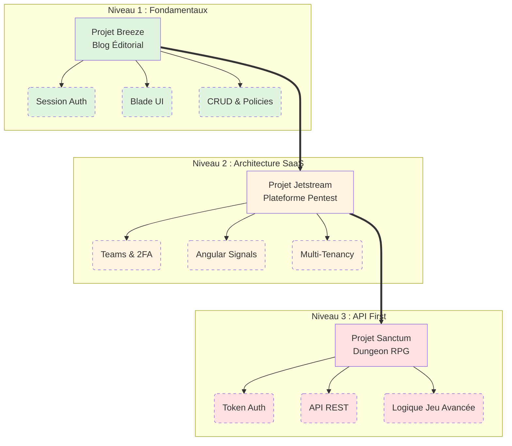

# Laravel Lab : Parcours d'Apprentissage

!!! quote "La pratique comme moteur d'apprentissage"
    _La théorie est essentielle, mais c'est par la pratique que l'on forge une véritable expertise. Ce "Laravel Lab" est conçu comme un **parcours progressif en 3 niveaux**. Plutôt que d'apprendre des concepts isolés, vous allez construire trois projets complets, du plus simple (authentification classique) au plus complexe (API REST SaaS et Jeu Vidéo temps réel)._

Ce hub regroupe les trois projets majeurs du parcours Laravel. Chaque projet utilise une technologie d'authentification différente (Breeze, Jetstream, Sanctum) et introduit des concepts d'architecture de plus en plus avancés.

## Les 3 Niveaux du Parcours

-   :lucide-wind:{ .lg .middle } **Niveau 1 — Laravel Breeze**

    ---
    **Blog Éditorialiste Professionnel**  
    Découvrez les fondamentaux de Laravel avec une application classique. Gestion CRUD, rôles (Admin/Auteur), machine à états de publication et interface Blade simple. Idéal pour commencer.

    **Niveau** : 🟢 Débutant | **Phases** : 7

    [:lucide-arrow-right: Démarrer le Projet Breeze](./projet-breeze/index.md)

-   :lucide-plane-takeoff:{ .lg .middle } **Niveau 2 — Laravel Jetstream**

    ---
    **Plateforme SaaS Pentest (B2B)**  
    Passez à la vitesse supérieure. Architecture Multi-Tenancy (Teams), Authentification 2FA renforcée, génération de rapports PDF (DOMPDF) et intégration d'un Frontend moderne en Angular 21 + Signals.

    **Niveau** : 🟡 Intermédiaire à 🔴 Avancé | **Phases** : 8

    [:lucide-arrow-right: Démarrer le Projet Jetstream](./projet-jetstream/index.md)

-   :lucide-shield-check:{ .lg .middle } **Niveau 3 — Laravel Sanctum**

    ---
    **Dungeon RPG Temps Réel**  
    Maîtrisez les API REST pures. Authentification par Tokens API (Sanctum), logique de jeu vidéo complexe (Combat tour par tour, Leaderboard) et Frontend riche réactif (Angular Animations + Signals).

    **Niveau** : 🔴 Avancé | **Phases** : 8

    [:lucide-arrow-right: Démarrer le Projet Sanctum](./projet-sanctum/index.md)

## Architecture de Progression

Le schéma ci-dessous illustre l'évolution de vos compétences à travers les trois projets :

!!! tip "Recommandation"
    Même si vous avez déjà des bases en Laravel, il est fortement conseillé de suivre les projets **dans l'ordre**. Le projet Jetstream s'appuie sur des concepts vus dans Breeze, et le projet Sanctum pousse la logique API REST encore plus loin.
