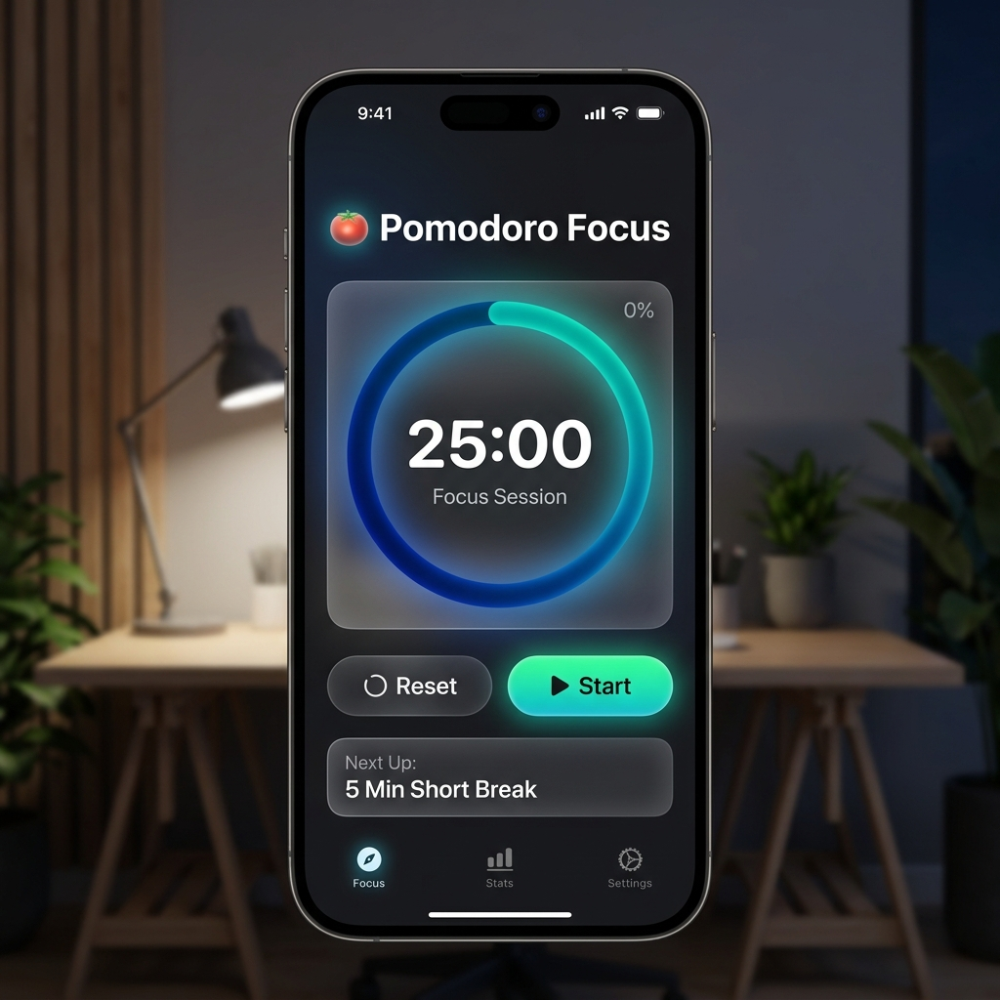
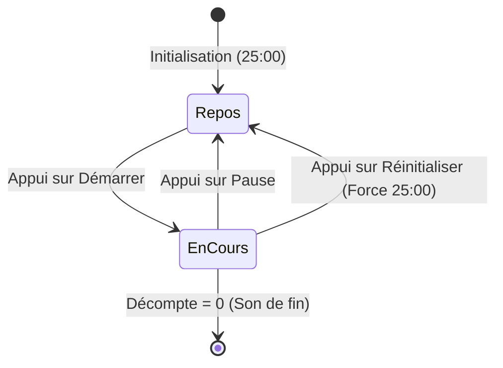

# Pomodoro Focus

<div
  class="omny-meta"
  data-level="🟢 Débutant"
  data-version="Swift 6 / iOS 17+"
  data-time="2 Heures">
</div>


!!! quote "Analogie pédagogique"
    _Travailler sur un projet complet est comparable à l'assemblage final d'une voiture sur une ligne de production. C'est ici que toutes les pièces individuelles (concepts appris précédemment) doivent s'emboîter parfaitement pour créer un produit fonctionnel et sécurisé._

!!! quote "Le temps est relatif..."
    Si Albert Einstein utilisait SwiftUI, il aurait vite compris qu'entre une variable `@State` qui décompte et une vue qui se rafraîchit, la relativité prend un sens très concret. Dans ce premier projet de la bibliothèque, l'objectif est visuel et immédiat : créer une boucle d'interface liée au balancier irréductible de l'horloge système (le composant `Timer`). On fait du beau, de l'utile, et du temps réel.

<br>



<br>
---

## 1. Cahier des Charges et Objectifs

La méthode "Pomodoro" est une technique de gestion du temps basée sur l'alternance d'une session de **Concentration** (25 minutes) et d'une session de **Pause** (5 minutes).

### Enjeux du rendu

- Avoir un cercle d'avancement graphique (qui se vide ou se remplit avec le temps).
- Avoir un affichage compte-à-rebours textuel "MM:SS".
- Avoir un bouton de contrôle "Démarrer / Pause / Réinitialiser".

### Concepts SwiftUI utilisés

- La directive de mise à jour vivante : Le "publisher" `Timer.publish`.
- Les modificateurs géométriques virtuels : La puissante commande `Circle().trim()`.
- La machine à état simple (`enum TimerState`).

<br>

---

## 2. Modélisation : Le Diagramme d'État

Avant d'écrire une seule ligne de code, il faut comprendre le **comportement** de notre timer. Le logiciel ne "décrémente" pas simplement un chiffre, il vit selon 3 états immuables.



_Ce diagramme illustre qu'une entité (`Enum`) contenant ces 3 comportements possibles sera nécessaire pour piloter le texte de notre interface et nos activations de boutons._

<br>

---

## 3. Implémentation de la Vue

Nous allons construire ce projet dans une vue conteneur unique simple.

### Étape 3.1 : Structurer l'état (State)

```swift title="Structurer l'état global du Timer"
import SwiftUI

// L'énumération stricte représentant l'état de notre Timer
enum PomodoroMode {
    case work
    case breakTime
}

struct PomodoroView: View {
    // Variables de configuration
    private let workTimeDuration: Int = 25 * 60 // 25 minutes en secondes
    private let breakTimeDuration: Int = 5 * 60 // 5 minutes en secondes
    
    // États de l'interface qui vont déclencher un re-rendu
    @State private var timeRemaining: Int
    @State private var isRunning: Bool = false
    @State private var currentMode: PomodoroMode = .work
    
    // Le "moteur" du timer (se déclenche chaque 1 seconde)
    // .main.runloop garantit l'exécution sur le thread de l'interface
    let timer = Timer.publish(every: 1, on: .main, in: .common).autoconnect()
    
    // Initialisateur pour injecter le temps de base au lancement
    init() {
        _timeRemaining = State(initialValue: 25 * 60)
    }
    
    var body: some View {
        VStack(spacing: 40) {
            // L'interface graphique ira ici
        }
    }
}
```

_En étiquetant nos variables majeures avec `@State`, nous garantissons que chaque modification mathématique provoquera un redessin visuel instantané et automatique de l'interface._

!!! tip "Pourquoi des secondes ?"
    Il est toujours préférable de manipuler la donnée (Time) dans l'unité mathématique système la plus pure (l'Entier ou le Float représentant des secondes), et de ne transformer cette donnée en "String avec des 00:" que visuellement lors du `Text()`. Cela empêche d'innombrables bugs.

<br>

### Étape 3.2 : Formater le temps (La couche Vue)

Pour transformer `1500` (secondes) en `"25:00"`, nous allons créer une petite fonction utilitaire à l'intérieur de la `struct`.

```swift title="Fonction de formatage visuel"
    // Fonction utilitaire de formatage (Convertit des secondes en string propre)
    func timeString(time: Int) -> String {
        let minutes = time / 60
        let seconds = time % 60
        return String(format: "%02d:%02d", minutes, seconds)
    }
```

_Cette fonction prend n'importe quel entier et s'assure qu'il s'affiche toujours sur deux caractères avec `%02d` (ex: 01 au lieu de 1)._

<br>

### Étape 3.3 : L'Interface (Le Cercle de progression)

Voici le composant de base, le visuel.
La magie de SwiftUI réside dans l'appel à `.trim()`, qui permet de "couper" un vecteur selon un pourcentage mathématique allant de `0.0` à `1.0`.

```swift title="Dessiner le cercle dynamique"
    var body: some View {
        VStack(spacing: 40) {
            
            // TITRE DU MODE ACTUEL
            Text(currentMode == .work ? "Concentration" : "Pause")
                .font(.largeTitle)
                .fontWeight(.bold)
                .foregroundColor(currentMode == .work ? .red : .teal)
            
            // LA ZONE DU COMPTEUR
            ZStack {
                // Anneau de Fond (Le rail inactif)
                Circle()
                    .stroke(lineWidth: 20)
                    .opacity(0.3)
                    .foregroundColor(.gray)
                
                // Calcul de l'avancement (Progression = Restant / Total)
                let totalTime = currentMode == .work ? workTimeDuration : breakTimeDuration
                let progress = CGFloat(timeRemaining) / CGFloat(totalTime)
                
                // Anneau Dynamique (Celui qui s'anime)
                Circle()
                    .trim(from: 0.0, to: progress)
                    .stroke(style: StrokeStyle(lineWidth: 20, lineCap: .round, lineJoin: .round))
                    .foregroundColor(currentMode == .work ? .red : .teal)
                    .rotationEffect(Angle(degrees: 270.0)) // Départ esthétique prévu à 12h (En Haut)
                    .animation(.linear, value: progress) // Animation fluide à chaque décrémentation
                
                // Le Texte Central
                Text(timeString(time: timeRemaining))
                    .font(.system(size: 60, weight: .bold, design: .rounded))
            }
            .padding()
            
            // ... Moteur d'exécution au point 3.4
        }
    }
```

_Le modificateur `.trim(from: 0.0, to: progress)` agit exactement comme un masque SVG. Accouplé au `.animation()`, il assure une transition très fluide et professionnelle du cercle qui se ferme._

<br>

### Étape 3.4 : Le Moteur d'exécution

Comment faire pour que notre Timer système dicte sa cadence à l'interface ? En SwiftUI, on "écoute" un publisher grâce au modificateur `.onReceive()`. 
Si le timer est actif (`isRunning`), on retire 1 au `timeRemaining` chaque seconde.

```swift title="Contrôles et l'écoute asynchrone du temps"
            // BOUTONS DE CONTRÔLES
            HStack(spacing: 30) {
                // Bouton Start / Pause
                Button(action: {
                    isRunning.toggle()
                }) {
                    Image(systemName: isRunning ? "pause.circle.fill" : "play.circle.fill")
                        .resizable()
                        .frame(width: 80, height: 80)
                        .foregroundColor(currentMode == .work ? .red : .teal)
                }
                
                // Bouton Reset
                Button(action: resetTimer) {
                    Image(systemName: "arrow.clockwise.circle.fill")
                        .resizable()
                        .frame(width: 80, height: 80)
                        .foregroundColor(.gray)
                }
            }
        } // Fin de VStack
        // Modificateur clé de "l'écoute"
        .onReceive(timer) { _ in
            guard isRunning else { return } // Si pause, on ne fait rien
            
            if timeRemaining > 0 {
                // S'il reste du temps, on enlève 1 sec
                timeRemaining -= 1
            } else {
                // Si tombé à 0, on change le mode et on sonne
                switchMode()
            }
        }
```

_L'enveloppe `.onReceive(timer)` garantit la communication synchrone parfaite entre le coeur de l'iPhone (Hardware) et notre boucle de calcul SwiftUI._

<br>

### Étape 3.5 : Les Logiques de fin (Fonctions métier)

Il manque les méthodes pour redémarrer ou intervertir les tâches. Elles sont écrites sous la variable `body`.

```swift title="Les mouvements d'état (Reset & Switch)"
    // Méthode pour retourner à zéro
    func resetTimer() {
        isRunning = false
        timeRemaining = currentMode == .work ? workTimeDuration : breakTimeDuration
    }
    
    // Méthode lors de la fin d'un timer
    func switchMode() {
        isRunning = false
        // Interversion : Si Work, on passe en Pause (Mouvement de bascule)
        if currentMode == .work {
            currentMode = .breakTime
            timeRemaining = breakTimeDuration
        } else {
            currentMode = .work
            timeRemaining = workTimeDuration
        }
        
        // Bonus (Idées d'implémentation future pour l'apprenant) :
        // AudioServicesPlaySystemSound(1005) -> Pour émettre un bruit d'alarme système
    }
```

_Ce bloc isole radicalement la logique métier de l'interface graphique. C'est l'essence des bons patterns d'architecture._

<br>

---

## 4. Optionnel : Habillage et Esthétique

!!! warning "L'art du « Bruit Visuel »"
    Attention, le code ci-dessous n'ajoute **aucune logique métier supplémentaire**. Le projet est déjà fonctionnel à la fin de l'étape 3.
    L'ajout massif de modificateurs visuels va alourdir drastiquement la lecture du code (ce qu'on appelle le "bruit visuel"). Cet exemple est fourni pour vous montrer à quoi ressemble un rendu "Gamifié", mais il est fortement recommandé de créer votre propre style pour obtenir une application unique.

```swift title="Pomodoro avec rendu Neo-Morphism"
struct AestheticPomodoroView: View {
    // ... Logique métier masquée ...
    
    var body: some View {
        ZStack {
            // Un fond radial sombre ultra-moderne
            RadialGradient(gradient: Gradient(colors: [Color.black, Color.gray.opacity(0.8)]), center: .center, startRadius: 200, endRadius: 600)
                .ignoresSafeArea()
            
            VStack(spacing: 50) {
                // Le texte façon Néon
                Text(currentMode == .work ? "TRANCE MODE" : "RELAX")
                    .font(.system(size: 30, weight: .black, design: .monospaced))
                    .foregroundColor(.white)
                    .shadow(color: currentMode == .work ? .red : .mint, radius: 10, x: 0, y: 0)
                
                // Le compteur principal encapsulé dans un glassmorphism
                ZStack {
                    Circle()
                        .fill(Color.white.opacity(0.1))
                        .frame(width: 300, height: 300)
                        .background(.ultraThinMaterial, in: Circle())
                        .shadow(color: .black.opacity(0.5), radius: 20, x: 10, y: 10)
                    
                    // L'horloge dynamique
                    Text(timeString(time: timeRemaining))
                        .font(.system(size: 75, weight: .heavy, design: .rounded))
                        .foregroundColor(.white)
                        .shadow(radius: 2)
                }
                
                // Bouton Start surélevé en 3D
                Button(action: { isRunning.toggle() }) {
                    Image(systemName: isRunning ? "pause.fill" : "play.fill")
                        .font(.system(size: 40))
                        .foregroundColor(.white)
                        .frame(width: 100, height: 100)
                        .background(
                            Circle()
                                .fill(LinearGradient(gradient: Gradient(colors: [.red, .orange]), startPoint: .topLeading, endPoint: .bottomTrailing))
                                .shadow(color: .red.opacity(0.5), radius: 10, x: 5, y: 5)
                        )
                }
            }
        }
    }
}
```

_L'intégration des `RadialGradient` et du modificateur natif `.background(.ultraThinMaterial)` suffit à transformer une simple ligne de code grisâtre en un panneau holographique de science-fiction._

<br>

---

## Conclusion

!!! quote "Ce qu'il faut retenir"
    Cette application Pomodoro pose les fondements du développement iOS avec SwiftUI. La gestion des timers, des états réactifs (`@State`) et du cycle de vie de l'application sont des piliers de l'écosystème Apple.

!!! quote "Maîtriser le temps et l'espace visuel"
    En un seul fichier condensé, l'alchimie entre la donnée abstraite (des secondes écoulées) et son impact visuel immersif (cercle rouge fluide) s'est produite. L'interface ne ment jamais : l'apprenant vient d'absorber toute la puissance des modificateurs autonomes du framework Apple. 

> Dans l'exercice suivant, "Disney Vault", nous abandonnerons l'horloge système pour s'attaquer au défi central des développeurs modernes : structurer, trier et afficher élégamment des collections entières de données complexes.

<br>
