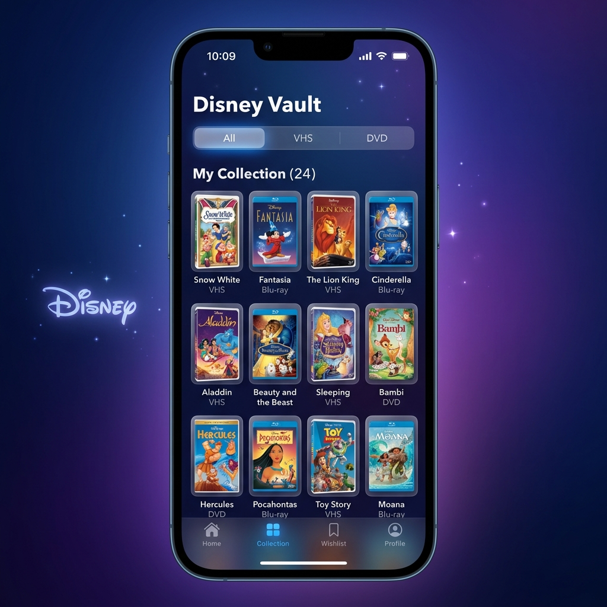
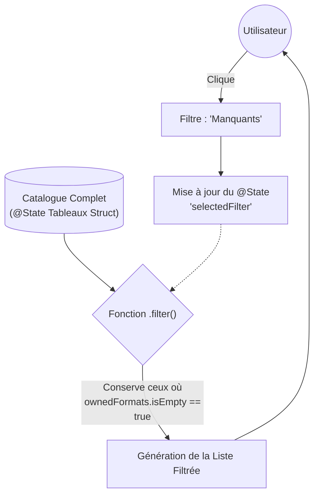

# Disney Vault

<div
  class="omny-meta"
  data-level="🟢 Débutant"
  data-version="Swift 6 / iOS 17+"
  data-time="3 Heures">
</div>

!!! quote "Gérer la data, c'est trier le monde"
    Si le Projet 1 nous a appris à manipuler le temps et les variables simples, ce Projet 2 va nous apprendre à dompter les `Collections`. La vaste majorité des applications de l'App Store sont en réalité d'immenses listes de données filtrables (Instagram, Twitter, Amazon). Avec le **Disney Vault**, nous allons créer un gestionnaire de collection des Grands Classiques d'animation, et surtout, apprendre à filtrer les données pour générer des vues dynamiques (ex: l'onglet des "Films Manquants").

<br>



<br>
---

## 1. Cahier des Charges et Objectifs

L'objectif est de recréer l'expérience d'un grand collectionneur.

### Enjeux du rendu

- Avoir une liste défilante comportant le catalogue Disney numéroté (1. Blanche-Neige, 2. Pinocchio...).
- Pouvoir sélectionner le format possédé (DVD, Blu-Ray).
- Gérer une **règle métier stricte (L'Easter Egg)** : Seul le film "Mélodie du Sud" a le droit de proposer le format "VHS". Ce format ne doit pas apparaître pour les autres films.
- Avoir un composant de **Filtrage** général (Menu ou Picker) : "Tous les films", "Ma Collection", "Films Manquants".

### Concepts SwiftUI & Swift utilisés

- La modélisation avec les `struct` et les énumérations `enum`.
- Le rendu multicellulaire : `List` et `ForEach`.
- Le composant `Picker` pour modifier une variable `@State` contrôlant l'affichage de notre liste ("Trier par...").
- La fonction de haut niveau Swift : `.filter { }`.

<br>

---

## 2. Modélisation de la Donnée et du Filtrage

Avant de faire du design, il faut sculpter notre "Cerveau" applicatif. Que se passe-t-il quand l'utilisateur change le filtre vers "Films Manquants" ?



_Ce graphe rappelle une constante en SwiftUI : on ne crée jamais 3 listes différentes dans notre code. On utilise une Fonction qui retourne, à la volée, le résultat calculé selon l'état du filtre._

<br>

---

## 3. Implémentation du Code

### Étape 3.1 : Les Modèles de Données

On crée la charpente de notre objet métier : le film. On utilise le protocole `Identifiable` pour que la liste SwiftUI sache différencier instantanément *Aladdin* du *Roi Lion*.

```swift title="Création des Modèles et Enums"
import SwiftUI

// Les formats possibles
enum MediaFormat: String, CaseIterable, Identifiable {
    case dvd = "DVD"
    case bluray = "Blu-Ray"
    case vhs = "VHS"
    
    var id: String { self.rawValue }
}

// Les options de notre Menu de tri
enum FilterOption: String, CaseIterable {
    case all = "Tous"
    case owned = "Possédés"
    case missing = "Manquants"
}

// Le Modèle du Film
struct DisneyMovie: Identifiable {
    let id: Int // Le numéro officiel du Classique (1, 2, 3...)
    let title: String
    var ownedFormats: Set<MediaFormat> // Un Set évite les doublons (on a ou on a pas)
    
    // Propriété calculée = Vrai si l'utilisateur possède au moins un format
    var isOwned: Bool {
        return !ownedFormats.isEmpty
    }
}
```

_Le protocole `Identifiable` exige qu'une variable `id` soit présente afin de garantir au système l'unicité technologique de l'élément._

<br>

### Étape 3.2 : Construire "Le Cerveau" de la Vue

Notre vue aura besoin d'une liste de films (un tableau mocké) et de notre fameux sélecteur de tri.

```swift title="La vue principale et la logique de filtre"
struct VaultView: View {
    // 1. L'état du filtre sélectionné ("Tous" par défaut)
    @State private var selectedFilter: FilterOption = .all
    
    // 2. Notre Base de données fictive (Mutable pour qu'on puisse cocher les DVD)
    @State private var movies: [DisneyMovie] = [
        DisneyMovie(id: 1, title: "Blanche-Neige et les Sept Nains", ownedFormats: [.dvd]),
        DisneyMovie(id: 2, title: "Pinocchio", ownedFormats: []),
        DisneyMovie(id: 11, title: "Mélodie du Sud", ownedFormats: [.vhs]), // L'Easter Egg !
        DisneyMovie(id: 32, title: "Le Roi Lion", ownedFormats: [.bluray, .dvd])
    ]
    
    // 3. Propriété Dynamique d'affichage (La magie de l'Array.filter)
    var filteredMovies: [DisneyMovie] {
        switch selectedFilter {
        case .all:
            return movies
        case .owned:
            return movies.filter { $0.isOwned } // Garde que les films avec au moins un format
        case .missing:
            return movies.filter { !$0.isOwned } // Garde les films avec tableau format vide
        }
    }
    
    var body: some View {
        // L'UI vient ensuite
        Text("Chargement...")
    }
}
```

_La puissance d'une variable dynamique `var filteredMovies` est qu'elle est recalculée à chaque dixième de seconde immédiatement après qu'une variable `@State` ait été manipulée._

<br>

### Étape 3.3 : L'Interface (Le Picker et la Liste)

Plaçons notre Menu de triage (`Picker`) au-dessus de notre `List`. La beauté de SwiftUI se révèle ici : dès que l'utilisateur va toucher le `Picker`, `selectedFilter` va changer. *Automatiquement*, SwiftUI va recalculer `filteredMovies`, et donc reconstruire la liste instantanément sans qu'on ait besoin d'écrire de fonction de rechargement.

```swift title="Interface de tri par SegmentedPicker"
    var body: some View {
        NavigationStack {
            VStack {
                // LE MENU DE FILTRAGE
                Picker("Filtrer par", selection: $selectedFilter) {
                    ForEach(FilterOption.allCases, id: \.self) { option in
                        Text(option.rawValue).tag(option)
                    }
                }
                .pickerStyle(SegmentedPickerStyle())
                .padding()
                
                // LA LISTE DES FILMS
                List {
                    // On itère sur la liste FILTRÉE, et on passe un Binding ($movies) 
                    // pour pouvoir modifier la base de données quand on coche la croix.
                    ForEach($movies) { $movie in
                        
                        // Sécurité basique (on affiche uniquement si ça passe le filtre)
                        if filteredMovies.contains(where: { $0.id == movie.id }) {
                            MovieRowView(movie: $movie)
                        }
                    }
                }
                .listStyle(.plain)
            }
            .navigationTitle("Disney Vault")
        }
    }
```

_Le `Picker` ne demande pas de développer des boîtes de dialogues complexes, il est intrinsèquement lié à l'Enum des options que nous lui injectons via la boucle ForEach._

<br>

### Étape 3.4 : Le Composant Cellule et l'Easter Egg "Mélodie du Sud"

Pour éviter de surcharger notre vue principale, nous avons appelé un `MovieRowView` au-dessus. Créons-le à part ! C'est ce composant qui va contenir la règle stricte de la VHS.

```swift title="Comportement conditionnel complexe (Easter Egg)"
struct MovieRowView: View {
    @Binding var movie: DisneyMovie // Reçoit un pointeur direct (Pour écrire)
    
    var body: some View {
        VStack(alignment: .leading, spacing: 10) {
            
            // Partie Supérieure : Titre et numéro
            HStack {
                Text("#\(movie.id)")
                    .font(.caption)
                    .foregroundColor(.gray)
                    .padding(5)
                    .background(Color.gray.opacity(0.2))
                    .cornerRadius(5)
                
                Text(movie.title)
                    .font(.headline)
                    .strikethrough(!movie.isOwned, color: .gray) // Barre le titre si on l'a pas
            }
            
            // Partie Inférieure : Les Toggles de Formats
            HStack {
                // Toggle DVD
                FormatToggle(format: .dvd, isOwned: hasFormat(.dvd)) {
                    toggleFormat(.dvd)
                }
                
                // Toggle BluRay
                FormatToggle(format: .bluray, isOwned: hasFormat(.bluray)) {
                    toggleFormat(.bluray)
                }
                
                // L'EASTER EGG (Logique métier conditionnelle)
                // Le bouton n'existe dans le DOM que si le film s'appelle "Mélodie du Sud"
                if movie.title == "Mélodie du Sud" {
                    FormatToggle(format: .vhs, isOwned: hasFormat(.vhs)) {
                        toggleFormat(.vhs)
                    }
                }
            }
        }
        .padding(.vertical, 5)
    }
    
    // Fonctions utilitaires du Binding
    private func hasFormat(_ format: MediaFormat) -> Bool {
        movie.ownedFormats.contains(format)
    }
    
    private func toggleFormat(_ format: MediaFormat) {
        if hasFormat(format) {
            movie.ownedFormats.remove(format)
        } else {
            movie.ownedFormats.insert(format)
        }
    }
}

// Mini-composant pour harmoniser le design du bouton de "Coche"
struct FormatToggle: View {
    let format: MediaFormat
    let isOwned: Bool
    let action: () -> Void
    
    var body: some View {
        Button(action: action) {
            Text(format.rawValue)
                .font(.caption2)
                .fontWeight(.bold)
                .padding(.horizontal, 10)
                .padding(.vertical, 5)
                .background(isOwned ? Color.blue : Color.gray.opacity(0.2))
                .foregroundColor(isOwned ? .white : .gray)
                .cornerRadius(10)
        }
        .buttonStyle(.plain) // Empêche le clic dans la List de tout activer
    }
}
```

_La fonction native native de SwiftUI `if movie.title == "x" { ... }` injectée sans artifice permet d'avoir des composants qui n'existent physiquement en mémoire que si la condition est validée._

<br>

---

## 4. Optionnel : Habillage et Esthétique

!!! warning "L'art du « Bruit Visuel »"
    Attention, le code ci-dessous n'ajoute **aucune logique métier supplémentaire**. Le projet est déjà fonctionnel à la fin de l'étape 3.
    L'ajout massif de modificateurs visuels va alourdir drastiquement la lecture du code (ce qu'on appelle le "bruit visuel"). Cet exemple est fourni pour vous montrer à quoi ressemble un rendu avec de belles "Cartes", mais il est fortement recommandé de créer votre propre style pour obtenir une application unique.

```swift title="Disney Vault avec rendu 'Card Collection'"
struct PremiumVaultRowView: View {
    @Binding var movie: DisneyMovie
    
    var body: some View {
        HStack(spacing: 20) {
            // Vignette façon affiche de cinéma
            ZStack {
                RoundedRectangle(cornerRadius: 15)
                    .fill(LinearGradient(colors: [.indigo, .purple], startPoint: .topLeading, endPoint: .bottomTrailing))
                    .frame(width: 80, height: 120)
                    .shadow(color: .indigo.opacity(0.5), radius: 5, x: 0, y: 5)
                
                Text("# \(movie.id)")
                    .font(.title2)
                    .fontWeight(.black)
                    .foregroundColor(.white)
            }
            
            VStack(alignment: .leading, spacing: 15) {
                Text(movie.title)
                    .font(.headline)
                    .foregroundColor(.primary)
                    .fixedSize(horizontal: false, vertical: true)
                
                // Toggles design premium
                HStack {
                    FormatBadge(title: "DVD", color: .blue, isActive: hasFormat(.dvd))
                    FormatBadge(title: "BLU-RAY", color: .cyan, isActive: hasFormat(.bluray))
                }
            }
            Spacer()
        }
        .padding()
        // Encapsulation totale de l'item dans une carte blanche ombrée
        .background(Color(.systemBackground))
        .cornerRadius(20)
        .shadow(color: .black.opacity(0.1), radius: 10, x: 0, y: 5)
        .padding(.horizontal)
    }
}
```

_Transformer une vulgaire `List` en une galerie de cartes nécessite simplement d'englober un objet dans un `background()` avec un `cornerRadius()` et un fort ombrage `.shadow()`._

<br>

---

## Conclusion

!!! quote "Les collections maîtrisées"
    Ce projet aura mis en évidence le mantra principal des UI Data-Driven modernes : **l'interface n'est que la projection de la donnée.** Ce n'est pas le programmeur qui force l'apparition du bouton VHS ; l'interface l'affiche naturellement car la condition du modèle le justifie. Le Picker de sélection fonctionne main dans la main avec l'état global de l'application.

> Si structurer et afficher les données locales vous paraît dompté, il est l'heure de nous pencher sur un nouveau mystère technologique : la Persistance sur Disque. Rendez-vous dans le laboratoire des Idle Games : Hero Tap Clicker !

<br>
