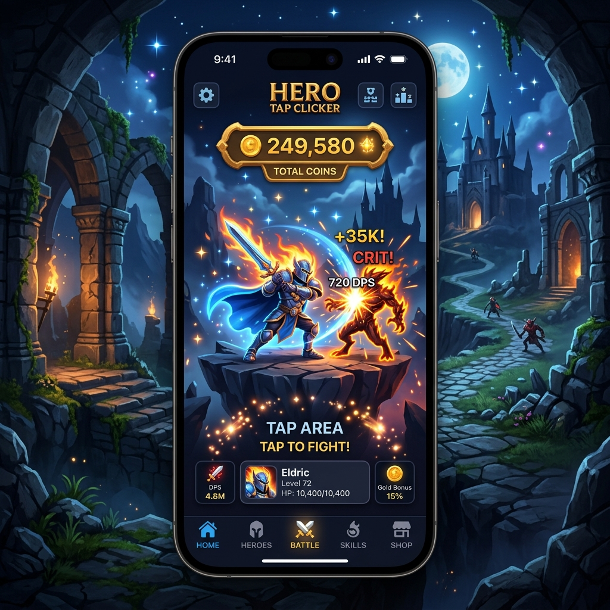

# Hero Tap Clicker

<div
  class="omny-meta"
  data-level="🟢 Débutant"
  data-version="Swift 6 / iOS 17+"
  data-time="2 Heures">
</div>


!!! quote "Analogie pédagogique"
    _Travailler sur un projet complet est comparable à l'assemblage final d'une voiture sur une ligne de production. C'est ici que toutes les pièces individuelles (concepts appris précédemment) doivent s'emboîter parfaitement pour créer un produit fonctionnel et sécurisé._

!!! quote "Le pouvoir de la Persistance Locale"
    Pensez au pire cauchemar d'un joueur : réaliser un score incroyable, fermer l'application, et découvrir que l'on repart à zéro. Dans ce projet, le but n'est pas d'apprendre à faire un gros jeu vidéo (pour cela, il y a SpriteKit), mais c'est le prétexte idéal pour découvrir ``@AppStorage``. Une seule ligne de code qui lie intimement une variable de l'interface graphique avec la mémoire dure du téléphone (`UserDefaults`). Et en bonus, on apprend à animer un bouton à 60fps !

<br>



<br>
---

## 1. Cahier des Charges et Objectifs

### Enjeux du rendu

- Avoir un bouton central massif représentant le "Monstre" ou le "Générateur d'Or".
- Afficher un score total en haut de l'écran.
- Avoir un "Magasin" en dessous pour acheter un *Automate* (qui clique à notre place chaque seconde).
- **Le plus important :** Si je tue l'application dans le multitâche de l'iPhone, je dois conserver mon or au démarrage suivant.

### Concepts SwiftUI & Swift utilisés

- `@AppStorage` : Le wrapper miracle de persistance.
- `withAnimation` et `.scaleEffect` : Pour créer le retour visuel (feedback) sur un bouton.
- `Timer.publish` : Pour la boucle d'auto-click de notre magasin.

<br>

---

## 2. L'Architecture du Jeu (Boucle de Gameplay)

Un Idle Game repose sur une boucle infinie de ressources = pouvoir = plus de ressources.

```mermaid
flowchart TB
    U(("Utilisateur")) -->|Tape (Tap)| B["Generateur (+1 Or)"]
    B --> S[("Score (AppStorage)")]
    S --> UI["Mise à jour de l'Affichage"]
    
    U -->|Achète avec 50 Or| M["Magasin (Automate +1/sec)"]
    M -->|Diminue le Score| S
    M -->|Active Timer| T(("Timer (1s)"))
    
    T -->|Génère Auto (+1 Or)| S
    
    style S fill:#ff9900,stroke:#333,stroke-width:2px
```

_Le bloc orange démontre l'emplacement critique du stockage local : il doit représenter l'unique source de vérité qui redistribue la richesse aux composants._

<br>

---

## 3. Implémentation du Code

### Étape 3.1 : Les Variables de Sauvegarde Magique

Créons la vue principale. Les variables `@State` basiques renaissent à zéro au démarrage. Celles notées `@AppStorage` se rappellent de leur dernière vie !

```swift title="Stockage permanent des valeurs du joueur"
import SwiftUI

struct ClickerGameView: View {
    // PERSISTANCE : La clé "playerGold" est sauvegardée sur le disque dur
    @AppStorage("playerGold") private var gold: Int = 0
    @AppStorage("autoClickerCount") private var autoClickers: Int = 0
    
    // VARIABLES D'ANIMATION (Éphémères, on ne veut pas les sauvegarder)
    @State private var isTapped: Bool = false
    
    // Le Coût de la prochaine amélioration
    var clickerCost: Int {
        return 50 + (autoClickers * 25)
    }
    
    // Le Moteur d'Automate
    let timer = Timer.publish(every: 1, on: .main, in: .common).autoconnect()
    
    var body: some View {
        // Interface décrite dans 3.2
        Text("Chargement du Héros...")
    }
}
```

_La puissance d'`AppStorage` justifie sa syntaxe : fournir un nom de "clé" (string) sous le capot pour permettre au système de la récupérer dans n'importe quel composant plus tard, même après un reboot._

<br>

### Étape 3.2 : L'Interface Réactive (Le Monstre et l'Or)

Voici la conception de l'écran principal, avec le retour visuel indispensable : quand je clique, le monstre rétrécit, et de l'or est généré.

```swift title="Bouton d'interaction asynchrone (HUD)"
    var body: some View {
        VStack(spacing: 50) {
            
            // HUD (Head-Up Display)
            VStack {
                Text("Trésor")
                    .font(.headline)
                    .foregroundColor(.gray)
                
                Text("\(gold) 💰")
                    .font(.system(size: 60, weight: .black, design: .rounded))
                    .foregroundColor(.yellow)
            }
            .padding(.top, 50)
            
            Spacer()
            
            // LA CIBLE (Le Monstre/Coffre à cliquer)
            Button(action: {
                handleTap() // Fonction appelée au clic
            }) {
                Image(systemName: "cube.box.fill")
                    .resizable()
                    .scaledToFit()
                    .frame(width: 200, height: 200)
                    .foregroundColor(.orange)
                    .shadow(color: .orange.opacity(0.5), radius: 20)
            }
            .buttonStyle(.plain) // Retire le fading par défaut d'iOS
            // ANIMATION DE FRAPPE
            .scaleEffect(isTapped ? 0.8 : 1.0)
            .animation(.spring(response: 0.2, dampingFraction: 0.3), value: isTapped)
            
            Spacer()
            
            // ... (Le Magasin au 3.3)
        }
    }
```

_Le modificateur `.scaleEffect` couplé à `.animation` permet de reproduire le fameux phénomène de tension (Spring) donnant l'illusion tactile qu'un objet rebondit physiquement sous le doigt._

<br>

### Étape 3.3 : Le Magasin D'Amélioration & L'Auto-Clicker

Nous plaçons un panneau en bas de l'écran pour acheter les esclaves numériques (Automates) et nous écoutons le `.onReceive` de notre Timer système.

```swift title="Panneau de Boutiques et Moteur Async"
            // LE MAGASIN
            VStack(spacing: 15) {
                Text("Boutique")
                    .font(.title2)
                    .fontWeight(.bold)
                
                Button(action: {
                    buyAutoClicker()
                }) {
                    HStack {
                        VStack(alignment: .leading) {
                            Text("Acheter un Automate")
                                .font(.headline)
                                .foregroundColor(.primary)
                            Text("Possédés : \(autoClickers) (+1 Or/sec)")
                                .font(.caption)
                                .foregroundColor(.gray)
                        }
                        Spacer()
                        Text("\(clickerCost) 💰")
                            .fontWeight(.bold)
                            .foregroundColor(gold >= clickerCost ? .yellow : .red)
                    }
                    .padding()
                    .background(Color.gray.opacity(0.1))
                    .cornerRadius(15)
                }
                // Désactiver le bouton si je suis pauvre
                .disabled(gold < clickerCost)
                .opacity(gold < clickerCost ? 0.5 : 1.0)
            }
            .padding()
        } // Fin du VStack principal
        // MOTEUR DU JEU
        .onReceive(timer) { _ in
            // Se déclenche chaque seconde
            if autoClickers > 0 {
                gold += autoClickers // Ajouter l'or magique automatiquement !
            }
        }
```

_L'ajout du `.disabled(condition)` protège structurellement votre application, et l'opacité réduit l'interactivité pour enseigner au joueur qu'il n'a pas les fonds requis._

<br>

### Étape 3.4 : Les Fonctions de Mécanique

Voici les logiques qui gèrent l'animation et l'économie du jeu :

```swift title="Machine des transactions métier"
    // Méthode de frappe
    private func handleTap() {
        gold += 1 // Cha-Ching !
        
        // Animation du rebond
        isTapped = true
        
        // On remet le bouton à sa taille d'origine 0.1sec plus tard
        DispatchQueue.main.asyncAfter(deadline: .now() + 0.1) {
            isTapped = false
        }
    }
    
    // Méthode d'achat
    private func buyAutoClicker() {
        guard gold >= clickerCost else { return } // Double vérification de sécurité
        
        gold -= clickerCost // On paie
        autoClickers += 1   // On livre
    }
```

_Le `DispatchQueue.main.asyncAfter` est l'outil parfait pour créer des boucles d'animation transitoires sans devoir mettre à jour des Variables depuis des Timers complexes._

<br>

---

## 4. Optionnel : Habillage et Esthétique

!!! warning "L'art du « Bruit Visuel »"
    Attention, le code ci-dessous n'ajoute **aucune logique métier supplémentaire**. Le projet est déjà fonctionnel à la fin de l'étape 3.
    L'ajout massif de modificateurs visuels va alourdir drastiquement la lecture du code (ce qu'on appelle le "bruit visuel"). Cet exemple est fourni pour vous montrer à quoi ressemble un rendu de type "Jeu vidéo Mobile", mais il est fortement recommandé de créer votre propre style pour obtenir une application unique.

```swift title="Clicker Hero avec effets visuels intenses"
struct GameAestheticView: View {
    var body: some View {
        ZStack {
            // Fond cosmique animé style Hearthstone
            LinearGradient(
                colors: [Color(red: 0.1, green: 0, blue: 0.2), .black],
                startPoint: .top,
                endPoint: .bottom
            )
            .ignoresSafeArea()
            
            VStack {
                Text("\(gold) 🪙")
                    .font(.system(size: 70, weight: .black, design: .rounded))
                    .foregroundColor(.yellow)
                    // Faux effet de surbrillance dorée magique
                    .shadow(color: .yellow, radius: isTapped ? 20 : 5, x: 0, y: 0)
                
                Button(action: handleTap) {
                    // Image d'un cristal majestueux (Utilisant Font Awesome ou SF Symbols)
                    Image(systemName: "diamond.inset.filled")
                        .resizable()
                        .scaledToFit()
                        .frame(width: 250, height: 250)
                        // Changement de couleur dynamique pendant la frappe
                        .foregroundStyle(
                            LinearGradient(
                                colors: isTapped ? [.white, .teal] : [.cyan, .blue],
                                startPoint: .top,
                                endPoint: .bottom
                            )
                        )
                        .shadow(color: .cyan.opacity(0.8), radius: isTapped ? 50 : 20)
                }
                .scaleEffect(isTapped ? 0.9 : 1.0)
                .animation(.interpolatingSpring(stiffness: 300, damping: 10), value: isTapped)
            }
        }
    }
}
```

_Le cumul de `LinearGradient` en tant que `foregroundStyle()` (Pinceau de remplissage) avec des `shadow` liés au bouton de la variable du clic métamorphose radicalement l'ambiance._

<br>

---

## Conclusion

!!! quote "Ce qu'il faut retenir"
    Le développement de ce jeu permet de consolider la gestion d'états et d'interactions répétées en Swift, tout en se familiarisant avec la mise en page (Layout) et les micro-animations (Animations) cruciales pour l'expérience utilisateur mobile.

!!! quote "La Persistance sans effort"
    Avez-vous remarqué l'absence d'instructions manuelles complexes ? 
    Grâce au design de la surcouche `@AppStorage`, SwiftUI s'occupe de **tout** sous le capot. À la nanoseconde où vous modifiez `gold += 1`, iOS l'inscrit dans son fichier système binaire `UserDefaults`.

> L'apprentissage de la persistance ultra-légère maitrisée, il est temps d'ouvrir les valves du matériel. Le hardware attend la modélisation et la récupération d'image avec l'intégration d'un Vrai Scanner local avec SwiftData : Rendez-vous à OmnyScan.

<br>
