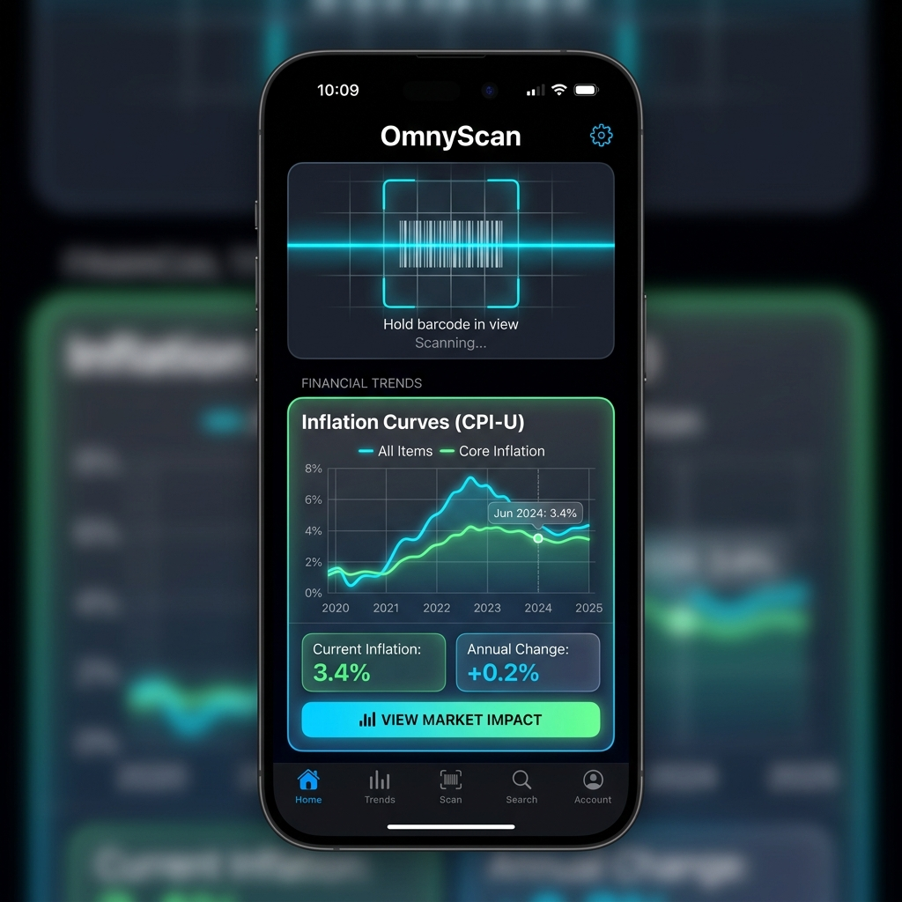
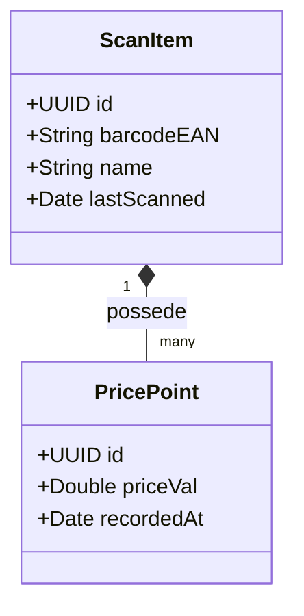
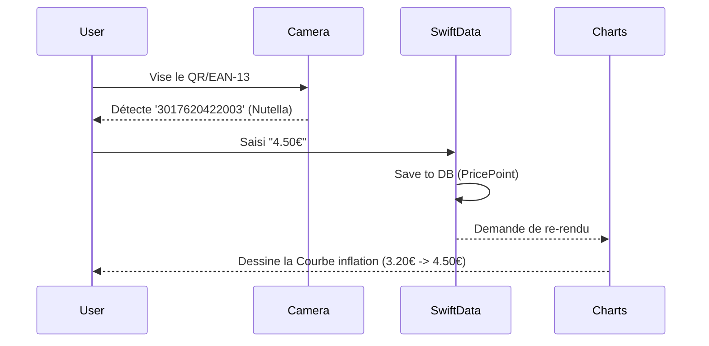

# OmnyScan

<div
  class="omny-meta"
  data-level="🟡 Intermédiaire"
  data-version="Swift 6 / iOS 17+"
  data-time="4 Heures">
</div>


!!! quote "Analogie pédagogique"
    _Travailler sur un projet complet est comparable à l'assemblage final d'une voiture sur une ligne de production. C'est ici que toutes les pièces individuelles (concepts appris précédemment) doivent s'emboîter parfaitement pour créer un produit fonctionnel et sécurisé._

!!! quote "Quand l'Hardware rencontre la Data"
    Finis les jouets avec des compteurs de secondes et des monstres imaginaires. On attaque la création d'un outil grand public critique pour le portefeuille de l'utilisateur. En alliant les **capacités physiques de l'iPhone** (L'appareil photo numérique pour lire des EAN-13) avec un moteur de données robuste (**SwiftData** pour mémoriser l'évolution du prix d'une boîte de céréales depuis 2 ans), nous créons une arme redoutable. Et en bonus ? Nous allons dessiner une courbe de l'inflation via le framework graphique maison d'Apple : **Swift Charts**.

<br>



<br>
---

## 1. Cahier des Charges et Objectifs

L'application doit permettre aux consommateurs de scanner eux-mêmes les articles qu'ils mettent dans le caddie pour traquer l'écart entre le prix étiqueté en rayon, et le passage en caisse.

### Enjeux du rendu

- Avoir un bouton "Scanner un produit".
- Saisir manuellement le prix observé depuis une interface rapide (Pavé numérique).
- Stocker les prix du même code-barre dans une "Bourse des valeurs de la Pâte Feuilletée" pour dessiner son évolution au fil des mois.
- Avoir un "Caddie de la journée" = `Total Scanné` vs `Total Ticket de Caisse`.

### Concepts Apple utilisés

- `AVFoundation` : Appeler le hardware photo et interpréter des Barcodes.
- L'injection du pattern `UIViewControllerRepresentable` pour intégrer une couche d'anciens codes UIKit dans SwiftUI.
- **SwiftData** : Le nouveau framework de pointe d'Apple (qui remplace CoreData) pour stocker les produits, les dates et les monnaies.
- **Swift Charts** : Visualiser les données de manière exceptionnelle.

<br>

---

## 2. Modélisation de l'Application

Nous avons 2 tables (dans un MCD classique) : Un `Produit` qui peut posséder beaucoup d'historiques de `Prix`.



_Le motif de classe au-dessus montre clairement que l'historicat des prix est stocké dans un ensemble propre, relié de façon "Many" vers "One" vis à vis de l'entité Produit parent._

!!! note "*Note: En SwiftData moderne (iOS 17+), le schéma relationnel ci-dessus s'écrit avec une simple macro `@Model`.*"

Le flux UI de notre utilisateur au supermarché sera le suivant :



_Cette interopérabilité de la capture brute Hardware jusqu'à la modélisation Mathématique est le flux vital d'une application utilitaire._

<br>

---

## 3. Implémentation du Code

L'intégration d'un scanner `AVFoundation` étant assez lourde en code (nécessitant des Delegate UIKit), nous allons l'importer en tant que boite noire conceptuelle et nous concentrer sur le code moteur en SwiftData.

### Étape 3.1 : Définir le Modèle SwiftData

Avec iOS 17, finies les interfaces complexes de CoreData. La macro `@Model` gère la structuration SQL derrière le rideau !

```swift title="SQL transparent avec @Model"
import Foundation
import SwiftData

// Le conteneur du produit
@Model
class ScannedProduct {
    @Attribute(.unique) var barcode: String
    var name: String
    
    // Relation One-To-Many (1 Produit -> N Prix)
    @Relationship(deleteRule: .cascade, inverse: \PriceHistory.product)
    var prices: [PriceHistory] = []
    
    init(barcode: String, name: String) {
        self.barcode = barcode
        self.name = name
    }
}

// L'historique des prix localisés
@Model
class PriceHistory {
    var priceValue: Double
    var scanDate: Date
    var product: ScannedProduct? // Pointeur parent
    
    init(priceValue: Double, scanDate: Date = .now) {
        self.priceValue = priceValue
        self.scanDate = scanDate
    }
}
```

_L'apport majeur de la macro `@Model` est l'extinction totale de code "Boilerplate", convertissant un fichier C pur structuré en une instance locale SQLite sans une unique requête réseau HTTP._

<br>

### Étape 3.2 : Implémenter "Swift Charts" pour la Courbe

La magie d'Apple, c'est l'arrivée de Swift Charts (`import Charts`). La seule chose requise pour dessiner des graphiques époustouflants, c'est de lui donner un tableau d'objets SwiftData !

```swift title="Chart Rendering (Graphiques des prix)"
import SwiftUI
import Charts

struct ProductInflationChart: View {
    // Reçoit un produit de la base de données
    var product: ScannedProduct
    
    // Variable métier : Ranger par date
    var sortedPrices: [PriceHistory] {
        product.prices.sorted(by: { $0.scanDate < $1.scanDate })
    }
    
    var body: some View {
        VStack(alignment: .leading) {
            Text("Évolution Historique (\(product.name))")
                .font(.headline)
            
            // MAGIE : Création du graphique en 4 lignes !
            Chart {
                ForEach(sortedPrices) { history in
                    // Trace une ligne entre toutes les dates / valeurs
                    LineMark(
                        x: .value("Date", history.scanDate),
                        y: .value("Prix TTC", history.priceValue)
                    )
                    .foregroundStyle(Color.red.gradient)
                    .interpolationMethod(.monotone) // Ligne courbée harmonieuse
                    
                    // Ajoute un petit rond noir sur chaque point de passage !
                    PointMark(
                        x: .value("Date", history.scanDate),
                        y: .value("Prix TTC", history.priceValue)
                    )
                }
            }
            .frame(height: 250)
            .chartYAxis {
                // Pour formater l'axe Y (Vertical) avec le symbole Euro
                AxisMarks(position: .leading) { value in
                    AxisGridLine()
                    if let price = value.as(Double.self) {
                        AxisValueLabel("\(String(format: "%.2f", price)) €")
                    }
                }
            }
        }
        .padding()
        .background(Color(.systemBackground))
        .cornerRadius(12)
        .shadow(radius: 5)
    }
}
```

_Le composant natif iOS `LineMark` simplifie drastiquement le tracé en absorbant en natif les données et la coordonnée vectorielle de votre ViewFrame._

<br>

### Étape 3.3 : La Vue Principale (Saisir un prix au panier)

C'est ici qu'on ajoute l'article au "Panier virtuel" du caddie. 
On utilise la macro `@Query` : cette ligne scrute en permanence la base de données SQLite sous-jacente gérée par SwiftData.

```swift title="Saisie de l'Article"
import SwiftUI
import SwiftData

struct CaddieManagerView: View {
    // Récupère le contexte global de la BD
    @Environment(\.modelContext) private var modelContext
    
    // Requête "Live" de tous les produits, classés par nom
    @Query(sort: \ScannedProduct.name) private var catalog: [ScannedProduct]
    
    var body: some View {
        NavigationStack {
            List {
                ForEach(catalog) { product in
                    Section(header: Text(product.name)) {
                        // Affiche le graphique si on a plus d'1 historique
                        if product.prices.count > 1 {
                            ProductInflationChart(product: product)
                        } else {
                            Text("Prix Unique: \(product.prices.last?.priceValue ?? 0) €")
                        }
                    }
                }
            }
            .navigationTitle("Mon Caddie")
            .toolbar {
                ToolbarItem(placement: .navigationBarTrailing) {
                    Button(action: addFakeScanData) {
                        Label("Scanner", systemImage: "barcode.viewfinder")
                    }
                }
            }
        }
    }
    
    // Simulation : Qu'est-ce qu'on fait quand le code barre dit "Bip" ?
    private func addFakeScanData() {
        let fakeProduct = ScannedProduct(barcode: "EAN123", name: "Jus de Pomme Bio")
        
        // On crée deux historiques factices (Il l'achète d'abord à 2€, puis en 2026 à 3€)
        let price1 = PriceHistory(priceValue: 2.15, scanDate: Date().addingTimeInterval(-86400 * 30)) // Il y a 1 mois
        let price2 = PriceHistory(priceValue: 3.10, scanDate: Date()) // Aujourd'hui
        
        fakeProduct.prices.append(price1)
        fakeProduct.prices.append(price2)
        
        // On "Commit" à la base de données SwiftData
        modelContext.insert(fakeProduct)
    }
}
```

_Le constructeur `@Query(sort: \.name)` force la liste (`ForEach`) à se mettre à jour instantanément, dans le même temps que le SDK injecte les données au thread local SQLLite._

<br>

---

## 4. Optionnel : Habillage et Esthétique

!!! warning "L'art du « Bruit Visuel »"
    Attention, le code ci-dessous n'ajoute **aucune logique métier supplémentaire**. Le projet est déjà fonctionnel à la fin de l'étape 3.
    L'ajout massif de modificateurs visuels va alourdir drastiquement la lecture du code (ce qu'on appelle le "bruit visuel"). Cet exemple est fourni pour vous montrer à quoi ressemble un rendu "Dashboard Financier", mais il est fortement recommandé de créer votre propre style pour obtenir une application unique.

```swift title="OmnyScan avec rendu 'Dashboard Pro'"
struct AestheticChartContainer: View {
    var product: ScannedProduct
    var sortedPrices: [PriceHistory] // ...
    
    var body: some View {
        // Un classique d'Apple : Le GroupBox pour structurer l'information
        GroupBox(
            label: HStack {
                Image(systemName: "chart.line.uptrend.xyaxis")
                    .foregroundColor(.blue)
                Text(product.name)
                    .font(.headline)
                    .foregroundColor(.primary)
                Spacer()
                Text("Dernier scan: \(Date().formatted(date: .numeric, time: .omitted))")
                    .font(.caption2)
                    .foregroundColor(.gray)
            }
        ) {
            Chart {
                ForEach(sortedPrices) { history in
                    // Aire courbée transparente sous la ligne d'inflation !
                    AreaMark(
                        x: .value("Date", history.scanDate),
                        y: .value("Prix", history.priceValue)
                    )
                    .interpolationMethod(.monotone)
                    .foregroundStyle(
                        LinearGradient(colors: [.red.opacity(0.4), .clear], startPoint: .top, endPoint: .bottom)
                    )
                    
                    LineMark(
                        x: .value("Date", history.scanDate),
                        y: .value("Prix", history.priceValue)
                    )
                    .interpolationMethod(.monotone)
                    .lineStyle(StrokeStyle(lineWidth: 3))
                    .foregroundStyle(Color.red)
                }
            }
            .frame(height: 200)
            .padding(.top, 10)
        }
        .groupBoxStyle(.plain)
        .padding()
        .background(Color(.secondarySystemBackground))
        .cornerRadius(15)
        .shadow(radius: 2)
    }
}
```

_L'utilisation d'un `AreaMark` transparent couplé au composant `GroupBox` traditionnel permet de rejoindre immédiatement les standards de design d'application boursière (Stocks) sans ajouter la moindre complexité SQL._

<br>

---

## Conclusion

!!! quote "Le Standard de la Gestion Métier"
    Vous avez maintenant l'architecture parfaite de l'application iOS la plus utilisée commercialement : Un scanner d'entrée de stock -> Une base de données relationnelle locale (`SwiftData` avec `One-To-Many`) -> Et une restitution sous forme de tableaux de bord financiers (`Swift Charts`). Contrairement aux API distantes, **SwiftData est 100% Hors-Ligne**. Concevoir votre app ainsi garantit qu'elle fonctionnera au fond du rayon congélateur, sans perte de paquet !

> Le stockage et le matériel maitrisés, la dernière dimension à étudier reste l'échange d'informations internationales. Entrons dans le réseau de données massive `URLSession` avec le projet 5 : OmnyNews.

<br>

---

## Conclusion

!!! quote "Ce qu'il faut retenir"
    La validation de cette étape confirme votre capacité à intégrer des concepts avancés dans un flux de travail professionnel. L'architecture globale prend maintenant tout son sens.

> [Retour à l'index du projet →](../index.md)
