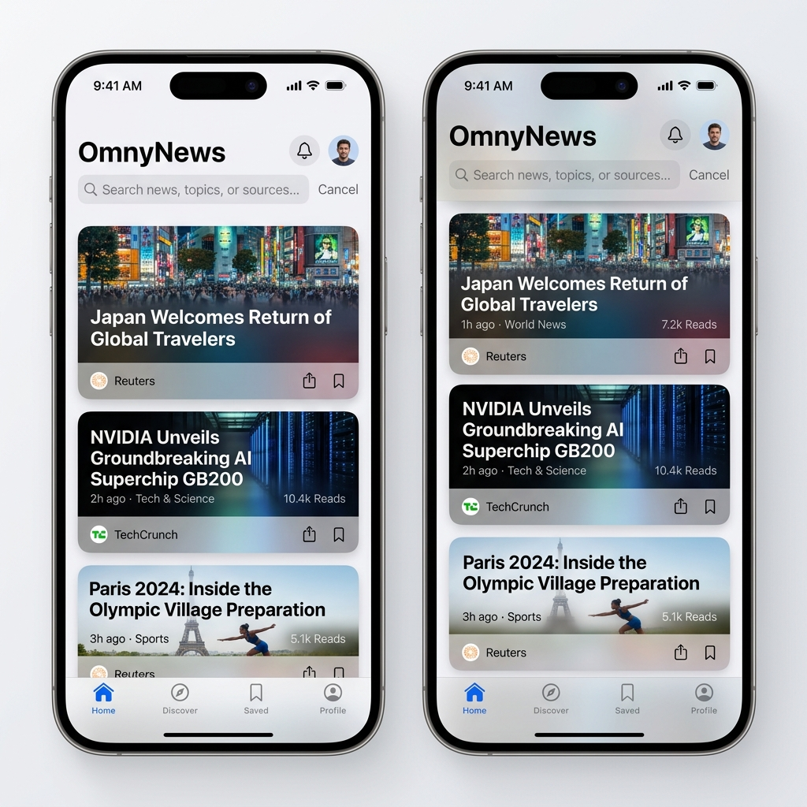
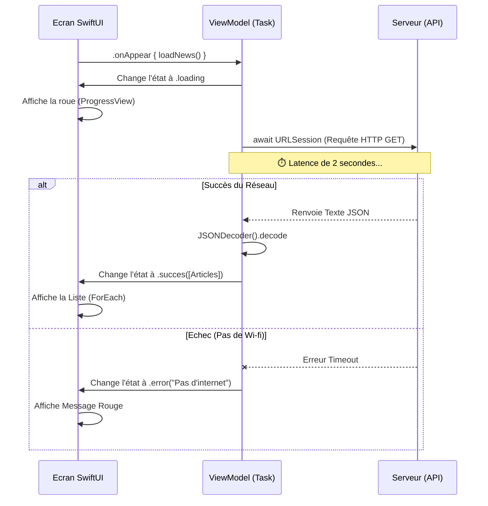

# OmnyNews

<div
  class="omny-meta"
  data-level="🟡 Intermédiaire"
  data-version="Swift 6 / iOS 17+"
  data-time="2 Heures">
</div>

!!! quote "Branchement sur le Cloud"
    Jusqu'à présent, toutes nos applications vivaient en autarcie sur le téléphone (même le lecteur EAN13 `OmnyScan` fonctionnait hors-ligne). Dans ce projet,  nous allons ouvrir la fenêtre sur le monde. **90% des applications** professionnelles ne sont que des "visualiseurs JSON". Elles lisent une adresse web, téléchargent du texte structuré, et le transforment en belles listes interactives avec des images. C'est exactement l'objectif de notre agrégateur d'informations `OmnyNews`.

<br>



<br>
---

## 1. Cahier des Charges et Objectifs

L'objectif est d'utiliser une API publique gratuite (comme *HackerNews API* ou l'API spatiale *Spaceflight News*) pour récupérer des articles.

### Enjeux du rendu

- Afficher une page avec un indicateur de chargement rotatif (`ProgressView`) lors de l'attente du réseau (qui peut être lent, on n'est jamais sûr d'avoir la 5G).
- Gérer l'état d'erreur de façon élégante (si le mode avion est activé, on affiche "Vérifiez votre connexion" au lieu que l'app crash).
- Afficher la liste des articles avec leur titre, résumé et, si disponible, charger leur image de couverture de manière asynchrone (`AsyncImage`).

### Concepts Swift utilisés

- **Réseau :**  `URLSession.shared.data(from:)`.
- **Concurrence Moderne :** Les mots clés `async`, `await` et les blocs `Task { }`.
- **Parsing :** Le protocole magique `Codable` couplé au `JSONDecoder`.

<br>

---

## 2. L'Architecture Asynchrone

Récupérer une donnée sur internet est une opération "Asynchrone". L'application iPhone continue de faire clignoter le bouton "Retour" à 60fps pendant que l'antenne radio du téléphone attend patiemment la réponse du serveur.



_L'utilisation d'une énumération structurée pour gérer l'**État de la requête** est la fondation même des interfaces réseau professionnelles, empêchant l'écran de freeze durant le transport_

<br>

---

## 3. Implémentation du Code

### Étape 3.1 : Le Modèle et le Parsing (La Traduction)

L'API nous renvoie du texte (JSON). Le protocole `Codable` est le dictionnaire traducteur automatique de Swift. Si les clés de notre `struct` correspondent exactement aux clés du JSON reçu, Swift fera la traduction automatiquement.

```swift title="Mapping du Json en Swift"
import Foundation

// Exemple d'un article retourné par Spaceflight News API
struct Article: Identifiable, Codable {
    let id: Int
    let title: String
    let summary: String
    let imageUrl: String
    
    // Si la clé JSON est "image_url", on dit à Swift de mapper ça sur notre variable "imageUrl"
    enum CodingKeys: String, CodingKey {
        case id, title, summary
        case imageUrl = "image_url"
    }
}
```

_Le protocole `Codable` gère implicitement la sérialisation, un processus qui nécessitait auparavant des dizaines de lignes de code de dictionnaire et de casting manuel._

<br>

### Étape 3.2 : Le Moteur Asynchrone (ViewModel)

C'est ici qu'on définit la fameuse Machine à État dont l'interface va dépendre.

```swift title="Logique HTTP et async/await"
import Foundation
import SwiftUI

// L'Énumération miracle de la gestion de vue
enum FetchState {
    case loading
    case success([Article])
    case error(String)
}

@Observable // (iOS 17+) Remplace ObservableObject
class NewsViewModel {
    // Par défaut, l'application s'ouvre sur un état de chargement
    var state: FetchState = .loading
    
    func fetchArticles() async {
        // Validation basique de l'URL
        guard let url = URL(string: "https://api.spaceflightnewsapi.net/v4/articles/") else {
            self.state = .error("URL Invalide")
            return
        }
        
        do {
            // L'appel Suspendu (AWAIT). La fonction s'arrête ici jusqu'au retour serveur.
            let (data, response) = try await URLSession.shared.data(from: url)
            
            // Vérification stricte du code HTTP 200
            guard let httpResponse = response as? HTTPURLResponse, httpResponse.statusCode == 200 else {
                self.state = .error("Le serveur a retourné une erreur.")
                return
            }
            
            // Le Décodage via notre dictionnaire natif Codable
            let decodedData = try JSONDecoder().decode(APIResponse.self, from: data)
            
            // On met à jour l'état avec la lumière verte finale
            self.state = .success(decodedData.results)
            
        } catch {
            // S'il y a un timeout / Coupure 4G
            self.state = .error("Impossible de récupérer les articles (\(error.localizedDescription))")
        }
    }
}

// Un petit conteneur requis car l'API de Spaceflight enveloppe ses résultats dans {"results": [...]}
private struct APIResponse: Codable {
    let results: [Article]
}
```

_Le label `async` prévient le système que la ligne `await` va temporairement geler l'exécution pure de ce bloc de code. Cela assure que l'écran global continue de tourner à vitesse maximale._

<br>

### Étape 3.3 : L'Interface Déclarative (Branchée sur l'Etat)

Avez-vous remarqué ? Quand la logique de "l'état" réseau est bien faite (Le fameux Enum), la vue SwiftUI s'écrit de la façon dont on parle en Français. Par ex: "Affiche ça, 'switch' l'état, 'if' erreur, affiche rouge".

```swift title="Rendu Data-Driven de Feed"
struct NewsFeedView: View {
    @State private var viewModel = NewsViewModel()
    
    var body: some View {
        NavigationStack {
            Group {
                switch viewModel.state {
                
                case .loading:
                    // 1. ECRAN DE CHARGEMENT
                    VStack {
                        ProgressView("Recherche spatiale en cours...")
                            .scaleEffect(1.5)
                    }
                    
                case .error(let message):
                    // 2. ECRAN D'ERREUR (Très important pour le mode Avion)
                    VStack(spacing: 20) {
                        Image(systemName: "wifi.slash")
                            .font(.system(size: 50))
                            .foregroundColor(.red)
                        Text("Oops, problème serveur.")
                            .font(.headline)
                        Text(message)
                            .font(.caption)
                            .foregroundColor(.gray)
                            .multilineTextAlignment(.center)
                        
                        Button("Réessayer") {
                            viewModel.state = .loading
                            Task { await viewModel.fetchArticles() }
                        }
                        .buttonStyle(.borderedProminent)
                    }
                    .padding()
                    
                case .success(let articles):
                    // 3. ECRAN DE SUCCES
                    List(articles) { article in
                        NewsRow(article: article)
                    }
                    .listStyle(.plain)
                    .refreshable {
                        // Offre le geste natif du "Tirer vers le bas pour rafraîchir" !
                        await viewModel.fetchArticles()
                    }
                }
            }
            .navigationTitle("Omny Space")
        }
        // Lancer la roquette asynchrone dès l'affichage de l'écran
        .task { 
            await viewModel.fetchArticles() 
        }
    }
}
```

_Le mot clé `.task {}` encapsule l'invocation de la fonction réseau, rendant son exécution asynchrone nativement supportée par le cycle de vie de l'UI._

<br>

### Étape 3.4 : Le Sous-composant Image Asynchrone

L'objet `AsyncImage` est un cadeau d'Apple en iOS 15. Auparavant, télécharger et cacher une image web dans une Liste était un enjeu de performance majeur. Aujourd'hui, c'est natif.

```swift title="Le composant liste et AsyncImage"
struct NewsRow: View {
    let article: Article
    
    var body: some View {
        HStack(spacing: 15) {
            
            // Récupérateur d'image ultra puissant de SwiftUI
            AsyncImage(url: URL(string: article.imageUrl)) { phase in
                if let image = phase.image {
                    image
                        .resizable()
                        .scaledToFill()
                        .frame(width: 80, height: 80)
                        .clipShape(RoundedRectangle(cornerRadius: 8))
                } else if phase.error != nil {
                    // Erreur image (Image cassée)
                    Color.red.frame(width: 80, height: 80).cornerRadius(8)
                } else {
                    // Chargement image (Placeholder grisé)
                    Color.gray.opacity(0.3).frame(width: 80, height: 80).cornerRadius(8)
                }
            }
            
            VStack(alignment: .leading, spacing: 5) {
                Text(article.title)
                    .font(.headline)
                    .lineLimit(2)
                
                Text(article.summary)
                    .font(.caption)
                    .foregroundColor(.gray)
                    .lineLimit(3)
            }
        }
        .padding(.vertical, 5)
    }
}
```

_En exposant l'état de `phase` dans le rendu d'une image distante, toute l'application évite les saccades de listes qui surviennent généralement au défilement frénétique des cellules._

<br>

---

## 4. Optionnel : Habillage et Esthétique

!!! warning "L'art du « Bruit Visuel »"
    Attention, le code ci-dessous n'ajoute **aucune logique métier supplémentaire**. Le projet est déjà fonctionnel à la fin de l'étape 3.
    L'ajout massif de modificateurs visuels va alourdir drastiquement la lecture du code (ce qu'on appelle le "bruit visuel"). Cet exemple est fourni pour vous montrer à quoi ressemble le rendu d'un vrai "Magazine Digital", mais il est fortement recommandé de créer votre propre style pour obtenir une application unique.

```swift title="Article avec rendu immersif (Magazine)"
struct PremiumNewsRow: View {
    let article: Article
    
    var body: some View {
        ZStack(alignment: .bottomLeading) {
            // L'image gagne 100% de la place disponible
            AsyncImage(url: URL(string: article.imageUrl)) { phase in
                if let image = phase.image {
                    image
                        .resizable()
                        .scaledToFill()
                        .frame(height: 300) // Très grandes images
                        .clipped()
                } else {
                    // Chargement stylisé
                    Rectangle()
                        .fill(Color.gray.opacity(0.2))
                        .frame(height: 300)
                        .overlay(ProgressView())
                }
            }
            
            // Faux dégradé d'ombre pour faire ressortir le texte
            LinearGradient(
                colors: [.clear, .black.opacity(0.8)],
                startPoint: .center,
                endPoint: .bottom
            )
            .frame(height: 300)
            
            // Les textes sont positionnés PAR DESSUS l'image grâce à ZStack
            VStack(alignment: .leading, spacing: 8) {
                Text(article.title)
                    .font(.title2)
                    .fontWeight(.bold)
                    .foregroundColor(.white)
                    .lineLimit(2)
                
                Text(article.summary)
                    .font(.subheadline)
                    .foregroundColor(.gray)
                    .lineLimit(2)
            }
            .padding()
        }
        .cornerRadius(15) // On coupe les angles tranchants
        .shadow(color: .black.opacity(0.2), radius: 10, x: 0, y: 5)
        .padding(.horizontal)
        .padding(.vertical, 8)
    }
}
```

_La bascule d'un `HStack` (Texte à côté de l'image) vers un `ZStack` (Texte _par-dessus_ l'image noircie par le bas) est le secret industriel de la création de flux d'informations spectaculaires (comme Apple News)._

<br>

---

## Conclusion

!!! quote "La Force du Déclaratif"
    Ce projet est fondamental. C'est l'essence même du développement iOS moderne.  
    En gérant vos "Etats Web" avec une `enum (chargement, erreur, succes)`, vous éliminez définitivement les interfaces instables où l'on montre une liste vide ("Vous n'avez pas de données") parce que le serveur n'a pas encore répondu.
   
> Vos applications savent maintenant lire n'importe quel site internet de la planète tant que son format respecte le JSON. Le prochain niveau ? Quitter l'API de Spaceflight et appeler... **Votre propre Serveur Backend (Le Saint Graal).**

<br>
