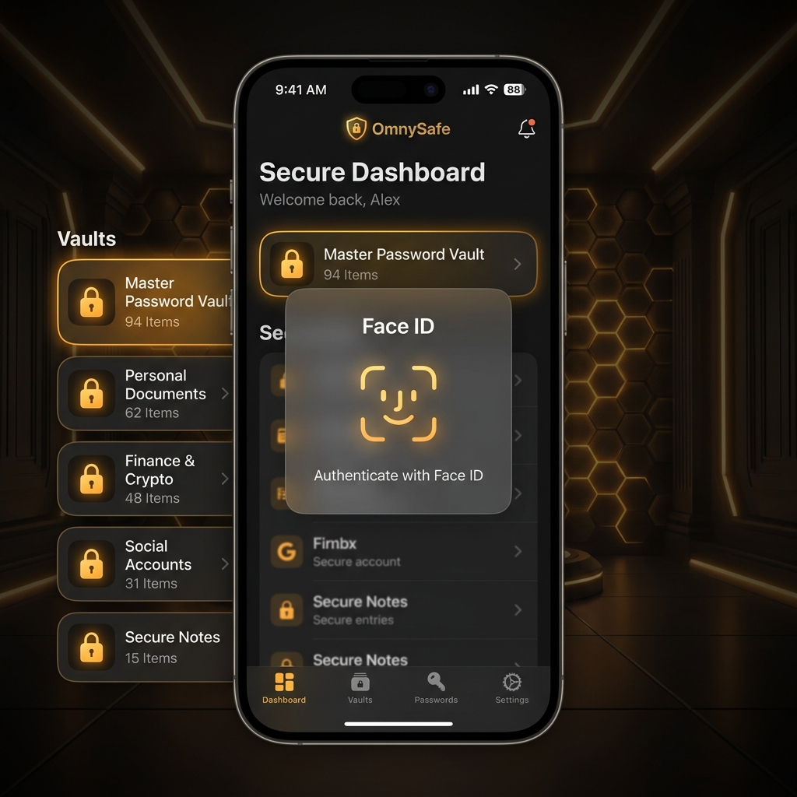
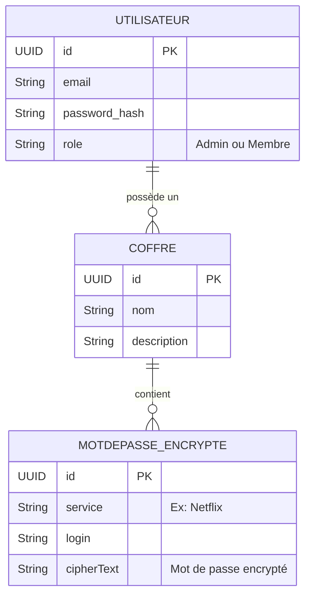

# OmnySafe (Le Saint Graal)

<div
  class="omny-meta"
  data-level="🔴 Avancé (Fullstack)"
  data-version="Swift 6 / Vapor 4"
  data-time="10 Heures">
</div>

!!! quote "L'Harmonie du Code Indépendant"
    Nous y sommes. Le Saint Graal. Dans tous les projets précédents, nous captions des API tierces ou sauvegardions les données localement. Mais développer en "Freelance" ou pour une entreprise majeure demande d'être maître total de l'outil. Avec OmnySafe, nous allons construire le coffre-fort de la Base de Données, écrire un serveur Linux (Backend Vapor) qui valide des jetons JWT, et rédiger le client iOS qui exige la lecture de votre visage (FaceID) pour s'ouvrir et conserver de manière militaire vos mots-de-passe.

<br>



<br>
---

## 1. Cahier des Charges & Modélisation (MCD / MLD)

**Le Concept :** OmnySafe est un gestionnaire d'équipe et coffre-fort numérique similaire à 1Password Family.

### 1.1 Le MCD (Modèle Conceptuel de Données - Méthode Merise)

Afin d'architecturer `Vapor/Fluent`, nous devons d'abord penser la donnée.



_Le formalisme Merise souligne parfaitement l'isolation logique des données : The Coffre protège les données encapsulées, tandis que l'Utilisateur possède un simple lien de cardinalité (0,n) sur un Coffre._

<br>

### 1.2 Le MLD et Spécificités Vapor

Pour la traduction en SQL (PostgreSQL), la spécificité "Sécuritaire" demande l'abandon du texte clair.

1. La table `Utilisateur` contiendra le hash généré par **BCrypt**, pas le mot de passe !
2. La table `Secret` contiendra des **ciphertext**, pas la clé 1234 d'un site.

<br>

---

## 2. Le Serveur Backend (Vapor)

Le serveur ne fait confiance à personne, pas même à notre propre application iPhone. Toute requête doit prouver son identité.

### Étape 2.1 : Authentification et Sécurisation (JWT)

Tout passe par l'implémentation de Fluent et du package JWT.

```swift title="Construction du Payload JWT Authentique"
import Vapor
import Fluent
import JWT

// 1. Définition du Payload (Ce qui est caché a l'intérieur du token iOS)
struct VaultPayload: JWTPayload {
    var subject: SubjectClaim // Le ID de l'utilisateur
    var expiration: ExpirationClaim // Date de mort du jeton (Ex: dans 15min)
    var isAdmin: Bool // Le fameux "Role-Based Access Control" (RBAC)

    func verify(using signer: JWTSigner) throws {
        // Le serveur refuse catégoriquement un token dont la date est dépassée !
        try self.expiration.verifyNotExpired()
    }
}
```

_L'intégration d'un JWT Payload dans Vapor est immédiate. Elle dicte formellement quels composants métiers transitent via l'encryption de type "Bearer"._

<br>

### Étape 2.2 : Les Routes Sécurisées

Vapor dispose des `RouteCollection` et des `Middleware`. Au lieu de sécuriser manuellement CHAQUE page, on place des grilles (middlewares) au-dessus de groupes de route complets.

```swift title="Paramétrage du Routeur et Hachage Bcrypt"
// Configuration du contrôleur (boot)
func boot(routes: RoutesBuilder) throws {
    let api = routes.grouped("api", "v1")
    
    // ----------------------------------------------------
    // Zone Publique - Aucune vérification nécessaire
    // ----------------------------------------------------
    api.post("login", use: loginHandler)
    
    // ----------------------------------------------------
    // Zone Strictement Sécurisée par JWT
    // ----------------------------------------------------
    let secureZone = api.grouped(VaultPayload.authenticator(), VaultPayload.guardMiddleware())
    
    secureZone.get("coffres", use: getMyVaults)
    secureZone.post("coffres", use: createVault)
    
    // ----------------------------------------------------
    // Zone Administrative (Nécessite JWT + Être Admin)
    // ----------------------------------------------------
    let adminZone = secureZone.grouped(EnsureAdminMiddleware())
    
    adminZone.delete("utilisateurs", ":userID", use: deleteUser)
}

// Handler de Login (L'endroit où la magie BCrypt opère)
func loginHandler(req: Request) async throws -> String {
    let credentials = try req.content.decode(LoginDTO.self)
    
    // 1. Cherche en BD
    guard let user = try await User.query(on: req.db).filter(\.$email == credentials.email).first() else {
        throw Abort(.unauthorized, reason: "Mauvais identifiant.")
    }
    
    // 2. Vérification Mathématique du Mot De Passe
    let isValid = try Bcrypt.verify(credentials.password, created: user.passwordHash)
    if !isValid {
        throw Abort(.unauthorized, reason: "Mauvais mot de passe.")
    }
    
    // 3. Signature et création du JWT valable 15 minutes
    let payload = VaultPayload(
        subject: SubjectClaim(value: user.id!.uuidString),
        expiration: ExpirationClaim(value: Date().addingTimeInterval(15 * 60)),
        isAdmin: user.role == .admin
    )
    
    return try req.jwt.sign(payload) // Renvoie un gros String illisible au client iOS
}
```

_Ce système de middlewares garantit qu’il est physiquement impossible pour un attaquant d’appeler `.get("coffres")` sans avoir au préalable franchi la barrière cryptographique de vérification de signature Vapor._

<br>

---

## 3. Le Client FrontEnd (SwiftUI / iOS)

Du côté du téléphone, nous avons deux missions extrêmes :
1. Prouver cryptographiquement l'intégrité de l'humain tenant le téléphone (Biométrie Face ID).
2. Protéger le Jetont JWT délivré par le serveur contre le hacking (Stockage ultra-sécurisé `Keychain`).

### Étape 3.1 : Face ID avec `LocalAuthentication`

Rien de plus professionnel que l'ergonomie biométrique. SwiftUI requiert ici une enveloppe car c'est un module système (LAContext).

```swift title="Vérification Biométrique Hardware"
import SwiftUI
import LocalAuthentication

@Observable
class BiometricAuthManager {
    var isAuthenticated = false
    var authError: String?

    func authenticate() {
        let context = LAContext()
        var error: NSError?
        
        // 1. Le téléphone possède-t-il FaceID/TouchID ?
        guard context.canEvaluatePolicy(.deviceOwnerAuthenticationWithBiometrics, error: &error) else {
            authError = "Appareil non compatible."
            return
        }

        let reason = "Veuillez vous identifier pour déverrouiller le coffre-fort."

        // 2. On lance la demande asynchrone sécurisée Apple
        context.evaluatePolicy(.deviceOwnerAuthenticationWithBiometrics, localizedReason: reason) { success, authenticationError in
            DispatchQueue.main.async {
                if success {
                    self.isAuthenticated = true
                } else {
                    self.authError = "Empreinte ou visage non reconnu."
                }
            }
        }
    }
}
```

_Le contexte `LAContext()` encapsule l'incroyable complexité du hardware Secure Enclave pour nous le livrer via une variable booléenne asynchrone simplissime `success`._

<br>

### Étape 3.2 : Intégration du Trousseau d'Accès système (Keychain)

Si nous versions le "JWT Token" de serveur dans `@AppStorage("user_jwt")`, n'importe quelle application système vérolée (jailbreak) pourrait le lire. On utilise le **Keychain** (la puce d'enclave sécurisée de l'iPhone).

```swift title="Accès cryptographique natif (Keychain)"
import Security
import Foundation

// Wrapper simple pour la forteresse iOS
class KeychainHelper {
    static let standard = KeychainHelper()
    
    func save(_ data: Data, service: String, account: String) {
        let query = [
            kSecValueData: data,
            kSecClass: kSecClassGenericPassword,
            kSecAttrService: service,
            kSecAttrAccount: account
        ] as CFDictionary
        
        // On détruit l'ancienne clé s'il y en a une, et on écrit
        SecItemDelete(query)
        SecItemAdd(query, nil)
    }
    
    func read(service: String, account: String) -> Data? {
        let query = [
            kSecClass: kSecClassGenericPassword,
            kSecAttrService: service,
            kSecAttrAccount: account,
            kSecReturnData: true,
            kSecMatchLimit: kSecMatchLimitOne
        ] as CFDictionary
        
        var dataTypeRef: AnyObject?
        let status: OSStatus = SecItemCopyMatching(query, &dataTypeRef)
        
        if status == errSecSuccess {
            return dataTypeRef as? Data
        }
        return nil
    }
}
```

_Manipuler le Keychain nécessite l'usage des `CFDictionary` venant de l'architecture historique d'Objective-C, encapsulé heureusement par le wrapper de notre classe._

<br>

### Étape 3.3 : L'Intercepteur Central Asynchrone

Le vrai professionnel du web/mobile ne recode pas "ajoute le jeton JWT à l'entête HTTP" pour les 50 appels réseaux d'une appli. Il centralise le travail.

```swift title="Réseau Intercepteur Automatique"
func safeLafuncAPIRequest(endpoint: String) async throws -> Data {
    guard let url = URL(string: "https://votre-projet-vapor.railway.app/api/v1/\(endpoint)") else {
        throw URLError(.badURL)
    }
    
    var request = URLRequest(url: url)
    request.httpMethod = "GET"
    
    // Extraction Magique et Sécurisée !
    if let jwtData = KeychainHelper.standard.read(service: "OmnySafe", account: "user_jwt"),
       let token = String(data: jwtData, encoding: .utf8) {
        // Signature de notre requête
        request.setValue("Bearer \(token)", forHTTPHeaderField: "Authorization")
    }
    
    let (data, response) = try await URLSession.shared.data(for: request)
    
    // Si Vapor nous rejette (Token Expiré ! - HTTP 401)
    if let httpResp = response as? HTTPURLResponse, httpResp.statusCode == 401 {
        // Ici interviendra l'architecture du RefreshToken dans le monde pro.
        // L'intercepteur met silencieusement la requête GET en pause, 
        // ping le backend pour un nouveau Token frais (s'il en a le droit),
        // puis relance l'ancienne requête "GET". User Experience Transparente !
        print("Authentification Expirée")
    }
    
    return data
}
```

_Un bon `URLSession` est un intercepteur invisible. Il s'accapare l'entête réseau à la volée avant son départ pour y attacher la fameuse signature exigée par le Backend Vapor (_`Bearer`_)._

<br>

---

## 4. Optionnel : Habillage et Esthétique

!!! warning "L'art du « Bruit Visuel »"
    Attention, le code ci-dessous n'ajoute **aucune logique métier supplémentaire**. Le projet est déjà fonctionnel à la fin de l'étape 3.
    L'ajout massif de modificateurs visuels va alourdir drastiquement la lecture du code (ce qu'on appelle le "bruit visuel"). Cet exemple est fourni pour vous montrer à quoi ressemble un rendu "Écran d'authentification pro", mais il est fortement recommandé de créer votre propre style pour obtenir une application unique.

```swift title="Zone d'authentification biométrique (Security Screen)"
struct LockScreenView: View {
    var body: some View {
        ZStack {
            // Mode Sombre forcé (Loi n°1 des coffre-fort)
            Color.black.ignoresSafeArea()
            
            // Effet d'ondulation subtile en arrière-plan
            Circle()
                .fill(Color.blue.opacity(0.1))
                .frame(width: 400, height: 400)
                .blur(radius: 50)
            
            VStack(spacing: 40) {
                // Icône native FaceID
                Image(systemName: "faceid")
                    .font(.system(size: 80))
                    .foregroundColor(.blue)
                    .shadow(color: .blue, radius: 15) // Brillance Holographique
                
                VStack(spacing: 10) {
                    Text("OmnySafe")
                        .font(.largeTitle)
                        .fontWeight(.black)
                        .foregroundColor(.white)
                        .tracking(2.0) // Espace entre les lettres
                    
                    Text("L'accès au coffre est verrouillé.")
                        .font(.body)
                        .foregroundColor(.gray)
                }
                
                // Bouton de déverrouillage massif
                Button(action: { /* Appelle le LAContext Biométrique */ }) {
                    HStack {
                        Image(systemName: "lock.open.fill")
                        Text("Déverrouiller avec Face ID")
                    }
                    .font(.headline)
                    .foregroundColor(.white)
                    .padding()
                    .frame(maxWidth: .infinity)
                    .background(
                        RoundedRectangle(cornerRadius: 15)
                            .fill(Color.blue)
                    )
                    .padding(.horizontal, 40)
                }
            }
        }
    }
}
```

_Le forcing du Mode Sombre via \`Color.black.ignoresSafeArea()\` et l'ajout d'une aura lumineuse blurrée derrière l'icône \`faceid\` transmet immédiatement à l'utilisateur le sentiment psychologique de haute sécurité matérielle._

<br>

---

## Conclusion

!!! quote "Vous êtes Fullstack Master"
    Félicitations. Vous venez de parcourir le spectre complet de l'écosystème Cloud et Mobile d'Apple. Vous avez architecturé un MCD. Vous l'avez modélisé dans une base de données PostgreSQL. Vous l'avez sécurisé derrière un serveur Linux piloté par SwiftNIO (Vapor). Vous avez crypté vos requêtes, interfacé l'intégrité biologique de la machine (FaceID) pour sceller ce bunker de code.
    
> Ce socle n'est plus un "composant pédagogique". C'est l'Architecture d'Entreprise, celle utilisée par les grandes banques et les super-applications mondiales. Le cursus Mobile s'achève ici dans sa version absolue.
