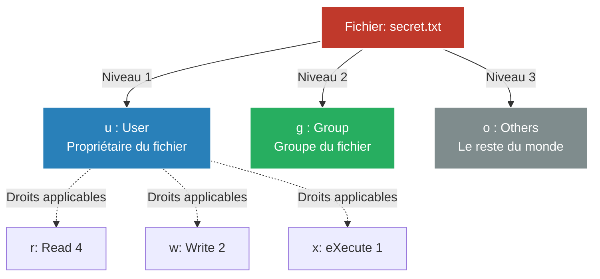

# Administration Système

<div
  class="omny-meta"
  data-level="🟡 Intermédiaire"
  data-version="1.0"
  data-time="30 - 45 minutes">
</div>

!!! quote "Garder le contrôle"
    _Un serveur Linux est intrinsèquement multi-utilisateurs. Plusieurs personnes (ou services applicatifs) peuvent s'y connecter et y exécuter des tâches simultanément. L'administration système, c'est l'art de compartimenter ces utilisateurs, de définir strictement qui a le droit de lire ou d'écrire quel fichier, et d'automatiser les tâches de maintenance récurrentes._

## 1. Gestion des Utilisateurs et Groupes

Dans Linux, tout processus est exécuté par un **utilisateur** (User), qui appartient à un ou plusieurs **groupes** (Groups). Le super-utilisateur absolu, qui a tous les droits, s'appelle `root`.

### Créer et supprimer
```bash
# Ajouter un nouvel utilisateur (crée son dossier /home/ et lui demande un mot de passe)
adduser john

# Ajouter un utilisateur à un groupe spécifique (ex: groupe 'docker')
usermod -aG docker john

# Supprimer un utilisateur et son dossier personnel
userdel -r john
```

### Le privilège `sudo`
Il est extrêmement dangereux de se connecter directement en tant que `root`. La bonne pratique consiste à se connecter avec un utilisateur standard, puis d'emprunter temporairement les droits administrateur via la commande `sudo` (SuperUser DO).

Pour qu'un utilisateur ait le droit d'utiliser `sudo`, il faut l'ajouter au groupe `sudo` (sur Debian/Ubuntu) ou `wheel` (sur RHEL/CentOS).
```bash
usermod -aG sudo john
```

---

## 2. Les Permissions POSIX (Le modèle ugo)

La sécurité d'un système Linux repose historiquement sur ce modèle de permissions très simple mais redoutable. Chaque fichier et dossier possède trois niveaux d'accès (ugo) :



- **u (User)** : Le propriétaire du fichier.
- **u (User)** : Le propriétaire du fichier.
- **g (Group)** : Le groupe propriétaire du fichier.
- **o (Others)** : Le reste du monde (tous les autres).

Pour chacun de ces niveaux, il existe 3 droits fondamentaux :
- **r (Read)** : Droit de lecture (valeur numérique : 4)
- **w (Write)** : Droit d'écriture/modification (valeur numérique : 2)
- **x (eXecute)** : Droit d'exécution (pour un script) ou droit de traverser (pour un dossier) (valeur numérique : 1)

### La commande `ls -l`
Lorsque vous listez les fichiers, vous voyez ces permissions :
```text
-rwxr-xr-- 1 root www-data  1024 Apr 22 script.sh
```
Décryptons le `rwxr-xr--` :
1. Le premier caractère (`-`) indique que c'est un fichier (un `d` indiquerait un dossier).
2. Les 3 suivants (`rwx`) : Le propriétaire (`root`) peut Lire(4) + Écrire(2) + Exécuter(1) = **7**.
3. Les 3 suivants (`r-x`) : Le groupe (`www-data`) peut Lire(4) + Exécuter(1) = **5**.
4. Les 3 derniers (`r--`) : Les autres peuvent seulement Lire(4) = **4**.

C'est ce qu'on appelle les permissions **754**.

### Modifier les Permissions (`chmod`)
Vous pouvez utiliser la méthode symbolique ou numérique (octale).
```bash
# Méthode Octale (Très courante)
chmod 644 fichier.txt  # r-- r-- r-- (Standard pour un fichier)
chmod 755 script.sh    # rwx r-x r-x (Standard pour un exécutable)

# Méthode Symbolique (Plus lisible)
chmod u+x script.sh    # Ajoute (+) le droit d'exécution (x) au propriétaire (u)
chmod o-r secret.txt   # Retire (-) le droit de lecture (r) aux autres (o)
```

### Modifier les Propriétaires (`chown`)
Change *qui* possède le fichier.
```bash
# Assigne le fichier à l'utilisateur 'john' et au groupe 'developers'
chown john:developers projet.zip

# L'option -R l'applique récursivement à tout un dossier
chown -R www-data:www-data /var/www/html/
```

!!! danger "L'erreur fatale"
    Ne faites **jamais** de `chmod -R 777` pour résoudre un problème de permission ("Permission denied") sur un serveur web. Le 777 signifie que n'importe qui (même un pirate qui a exploité une faille de votre site web) a le droit d'écrire et de modifier vos fichiers système. Restez sur des dossiers en 755 et fichiers en 644, avec les bons propriétaires (souvent `www-data`).

---

## 3. Les Tâches Planifiées (Cron)

Un administrateur ne fait pas les sauvegardes à la main à 3h du matin. Il utilise le démon `cron`.

Pour éditer la table des tâches (crontab) de l'utilisateur courant :
```bash
crontab -e
```

### La syntaxe Cron
La syntaxe est composée de 5 astérisques représentant le temps, suivis de la commande à exécuter.
`* * * * * commande_a_executer`
(Minute, Heure, Jour du mois, Mois, Jour de la semaine).

Exemples :
```text
# Exécuter un script tous les jours à 03h30
30 03 * * * /opt/scripts/backup.sh

# Exécuter une commande toutes les 5 minutes
*/5 * * * * ping -c 1 8.8.8.8 >> /tmp/ping.log

# Exécuter tous les lundis à midi
00 12 * * 1 /opt/scripts/weekly_report.sh
```

## Conclusion

Ces commandes (`useradd`, `chmod`, `chown`, `cron`) constituent l'alphabet de l'administrateur système. Sans leur compréhension totale, il est impossible de sécuriser un serveur applicatif. Une fois maîtrisées, la prochaine étape logique est d'apprendre à gérer les services de longue durée qui tournent en tâche de fond.