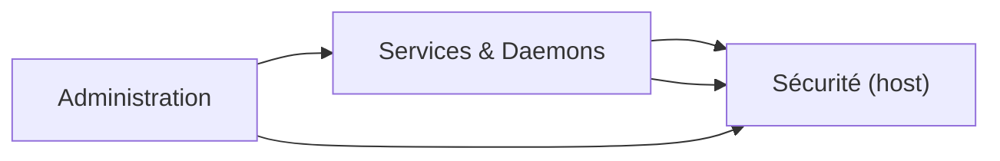

# Linux

<div
  class="omny-meta"
  data-level="🟢 Débutant à 🔴 Avancé"
  data-version="1.0"
  data-time="30-60 heures">
</div>

## Introduction

!!! quote "Analogie pédagogique"
    _Linux, c’est comme piloter un atelier. L’administration, c’est la gestion des clés et des accès. Les services & daemons, c’est la chaîne de production. La sécurité hôte, c’est la prévention des incidents, la détection, et la capacité à réagir quand quelque chose déraille._

Cette section “Linux” est construite comme un socle complet et pragmatique. L’objectif n’est pas de “connaître des commandes”, mais de comprendre comment un système fonctionne au quotidien : qui a le droit de faire quoi, quels services tournent, comment ils démarrent, où ils loggent, et comment on protège l’hôte contre les menaces courantes.


## Architecture du parcours



L’ordre n’est pas strict, mais en pratique : on administre, on comprend les services, puis on durcit la machine.

---

## Vue d’ensemble

<div class="grid cards" markdown>

* :lucide-user-cog:{ .lg .middle } **Administration**

    ---

    Gestion des utilisateurs et groupes, permissions, sudo, tâches planifiées (cron), hygiène système et opérations courantes.

    **Objectif** : administrer proprement un Linux “comme en prod”.

    [:lucide-book-open-check: Accéder](./admin.md)

* :lucide-server:{ .lg .middle } **Services & Daemons**

    ---

    systemd, unités, démarrage/arrêt, dépendances, journaux, logs, supervision de base, diagnostic.

    **Objectif** : maîtriser ce qui tourne et comment le contrôler.

    [:lucide-book-open-check: Accéder](./services-daemons.md)

</div>

<div class="grid cards" markdown>

* :lucide-shield:{ .lg .middle } **Sécurité (host)**

    ---

    Pare-feu, anti-bruteforce, audit de durcissement, détection malware/rootkit. Approche en couches : réduire l’exposition, contrôler l’accès, surveiller, auditer.

    **Objectif** : sécuriser un hôte Linux de manière mesurable et maintenable.

    [:lucide-book-open-check: Accéder](./security/index.md)

</div>

---

## Synthèse “logique métier” (ce que tu dois retenir)

Tu peux voir Linux comme un triangle opérationnel :

* Administration : identité, droits, hygiène.
* Services : disponibilité, fonctionnement, logs.
* Sécurité : réduction du risque + détection + réaction.

Si une seule brique est faible, le système entier devient fragile. La progression du guide suit donc une logique “production”.

---

## Navigation

Commencer par :
[:lucide-arrow-right: Administration](./admin.md)


```md
---
description: "Sécurité hôte Linux : pare-feu, anti-bruteforce, audit de durcissement et détection — une approche opérationnelle et maintenable"
icon: lucide/shield
tags: ["LINUX", "SECURITY", "HOST", "HARDENING", "FIREWALL", "AUDIT", "IDS"]
---

# Sécurité (host)

<div
  class="omny-meta"
  data-level="🟢 Débutant à 🔴 Avancé"
  data-version="1.0"
  data-time="6-8 heures">
</div>

---

## Introduction

!!! quote "Analogie pédagogique"
    _Sur un hôte Linux, tu ne cherches pas “l’outil magique”. Tu appliques une méthode : tu réduis l’exposition, tu contrôles l’accès, tu surveilles, et tu audites. Les outils ne sont que des leviers pour appliquer cette méthode._

Cette section couvre le durcissement et la détection au niveau de la machine. On reste volontairement concret : ce que tu installes, ce que tu configures, comment tu vérifies, et comment tu maintiens le niveau dans le temps.

---

## Objectifs

Tu vas apprendre à :

- filtrer proprement le trafic (pare-feu)
- réduire l’impact du bruteforce (bannissement automatique)
- auditer et améliorer le durcissement (baseline mesurable)
- détecter des signaux de compromission (avec limites assumées)

---

## Architecture sécurité (cycle opérationnel)

```mermaid
stateDiagram-v2
    [*] --> Exposition
    Exposition --> ControleAcces: Pare-feu + services minimaux
    ControleAcces --> AntiAbus: anti-bruteforce
    AntiAbus --> Audit: durcissement & conformité technique
    Audit --> Detection: malware/rootkit & vérifications
    Detection --> Exposition: boucle d'amélioration
````

---

## Outils et chapitres

<div class="grid cards" markdown>

* :lucide-flame:{ .lg .middle } **UFW**

  ---

  Pare-feu simple, lisible, efficace. Règles minimales, exposition maîtrisée, erreurs fréquentes.

  **Rôle** : réduire la surface d’attaque réseau.

  [:lucide-book-open-check: Accéder](./ufw.md)

* :lucide-lock-keyhole:{ .lg .middle } **fail2ban**

  ---

  Protection contre brute force et abus. Jails, filtres, bannissement, stratégie réaliste.

  **Rôle** : limiter l’exploitation des accès exposés (SSH/web).

  [:lucide-book-open-check: Accéder](./fail2ban.md)

</div>

<div class="grid cards" markdown>

* :lucide-clipboard-check:{ .lg .middle } **Lynis**

  ---

  Audit de durcissement : scoring, recommandations, baseline. Comprendre et corriger, pas juste “lancer un scan”.

  **Rôle** : améliorer le niveau de sécurité de façon mesurable.

  [:lucide-book-open-check: Accéder](./lynis.md)

* :lucide-bug:{ .lg .middle } **ClamAV**

  ---

  Antivirus open-source. Cas d’usage réalistes sur Linux (partage fichiers, mail, scans planifiés).

  **Rôle** : détecter des malwares (avec une approche pragmatique).

  [:lucide-book-open-check: Accéder](./clamav.md)

</div>

<div class="grid cards" markdown>

* :lucide-eye:{ .lg .middle } **chkrootkit**

  ---

  Détection rootkit et checks basiques. Interprétation des résultats et limites (très important).

  **Rôle** : détecter des indicateurs faibles de compromission.

  [:lucide-book-open-check: Accéder](./chkrootkit.md)

</div>

---

## Séquence typique “attaque → défense”

```mermaid
sequenceDiagram
    autonumber
    actor Attaquant
    participant FW as UFW
    participant SVC as Service (SSH/Web)
    participant F2B as fail2ban
    participant AUD as Lynis
    participant AV as ClamAV
    participant RK as chkrootkit

    Attaquant->>FW: Scan / tentative accès
    alt Non autorisé
        FW-->>Attaquant: DROP/REJECT
    else Autorisé
        FW->>SVC: Connexion tentée
        SVC-->>F2B: Échecs répétés (logs)
        F2B-->>FW: Ban IP
    end
    AUD->>SVC: Audit configuration & durcissement
    AV->>SVC: Scan fichiers / répertoires cibles
    RK->>SVC: Vérification rootkit (signaux faibles)
```

---

## Navigation

Commencer par :
[:lucide-arrow-right: UFW](./ufw.md)

```

---

Maintenant, pour être chirurgical : confirme-moi juste où se trouve l’index parent Linux dans ton arborescence (le fichier `linux/index.md` ? ou `systemes-infra/linux/index.md` ?). Dès que tu réponds, je te réécris le bloc “Accéder” avec les chemins exacts (sans suppositions).
::contentReference[oaicite:0]{index=0}
```


    # -------------------------------------------------------------------------
    # Linux
    # Administration système Linux, services, sécurité hôte
    # -------------------------------------------------------------------------

    Administration            - Gestion utilisateurs, permissions, cron
    Services & Daemons        - systemd, services, logs
    Sécurité hôte             - ClamAV etc..