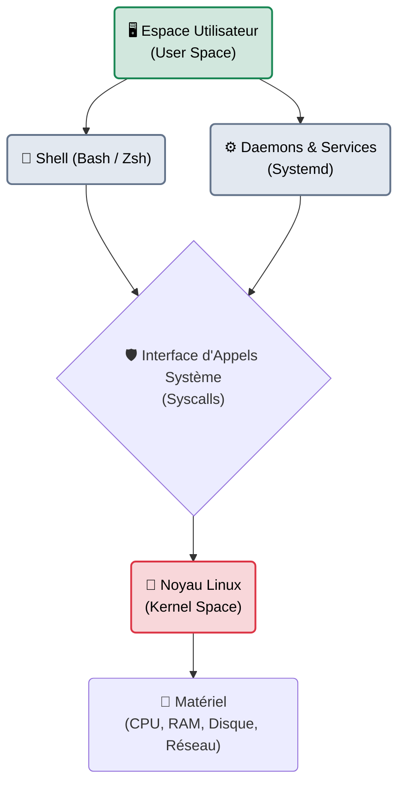

# Systèmes Linux

!!! quote "Analogie pédagogique"
    _L'environnement Linux peut être vu comme un atelier de mécanicien sur mesure. Contrairement à Windows (une voiture clé en main avec le capot soudé), Linux vous donne accès à chaque rouage et chaque écrou (tout est fichier). C'est plus complexe au début, mais cela permet une personnalisation et une automatisation infinies._

!!! quote "Le socle de l'Internet mondial"
    _Plus de 90% du cloud public et la quasi-totalité des supercalculateurs tournent sous Linux. Maîtriser l'administration d'un serveur Linux n'est pas une compétence optionnelle, c'est le prérequis fondamental pour tout ingénieur infrastructure, DevOps ou spécialiste en cybersécurité._

## Organisation de la section

Cette section couvre l'utilisation quotidienne d'un serveur Linux (sans interface graphique), sa gestion interne et son durcissement.

 

---

## 🧭 Navigation du Module

-   :lucide-terminal:{ .lg .middle } **Shell & Scripting (Bash)**

    ---
    L'automatisation et l'exploitation système par la ligne de commande.

    [:octicons-arrow-right-24: Maîtriser Bash](./bash.md)

-   :lucide-users-cog:{ .lg .middle } **Administration Système**

    ---
    Gestion des utilisateurs, des groupes, des permissions POSIX et des tâches planifiées (cron).

    [:octicons-arrow-right-24: Administrer l'OS](./admin.md)

-   :lucide-cpu:{ .lg .middle } **Services & Daemons (Systemd)**

    ---
    Comprendre le cycle de vie des processus, la journalisation système et la création de services.

    [:octicons-arrow-right-24: Gérer les processus](./services-daemons.md)

-   :lucide-shield-check:{ .lg .middle } **Sécurité & Durcissement (Host)**

    ---
    La protection de l'hôte Linux : Pare-feu (ufw), Anti-Bruteforce (fail2ban), Audit (Lynis) et Anti-malwares (ClamAV, chkrootkit).

    [:octicons-arrow-right-24: Sécuriser Linux](./security/index.md)

---

## Conclusion

!!! quote "Ce qu'il faut retenir"
    L'administration Linux repose sur la maîtrise de la ligne de commande et la compréhension de la philosophie Unix (tout est fichier). L'automatisation via des scripts Bash est la clé de la scalabilité pour gérer des parcs de serveurs.

> [Retourner à l'index Linux →](./index.md)
