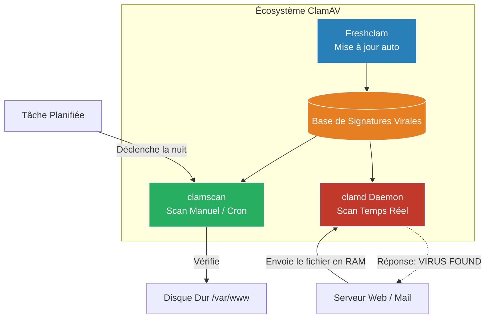

# Antivirus Open Source (ClamAV)

<div
  class="omny-meta"
  data-level="🟢 Débutant"
  data-version="1.0"
  data-time="15 - 20 minutes">
</div>


!!! quote "Analogie pédagogique"
    _Le durcissement d'un système Linux est comme la construction des fortifications d'un château. Le pare-feu (UFW) correspond aux douves extérieures, les permissions POSIX (chmod/chown) sont les clés des différentes pièces, et la supervision (Fail2Ban/Lynis) agit comme les gardes effectuant des rondes régulières._

!!! quote "Les virus sous Linux ?"
    _On entend souvent dire que Linux n'a pas besoin d'antivirus. C'est vrai dans le sens où l'immense majorité des virus (.exe) sont conçus pour Windows et ne fonctionneront jamais sous Linux. Cependant, si votre serveur héberge un service Email, un serveur de fichiers (Samba/Nextcloud) ou un site web autorisant l'upload de documents, il peut devenir un **porteur sain**. Le serveur Linux ne sera pas infecté, mais il distribuera le virus à tous vos clients Windows ! C'est pour couper cette chaîne de transmission qu'on installe **ClamAV**._

## Qu'est-ce que ClamAV ?

**Clam AntiVirus (ClamAV)** est un moteur d'antivirus open-source très populaire, particulièrement conçu pour le scannage des emails sur les passerelles de messagerie, mais aussi pour les serveurs web.



Il est composé de trois éléments principaux :
1. **clamscan** : Le scanner en ligne de commande.
2. **freshclam** : L'utilitaire de mise à jour automatique de la base de données virale.
3. **clamd** : Le démon (service) qui tourne en arrière-plan pour des scans ultra-rapides sans devoir recharger la base à chaque fichier.

---

## Installation et Mise à jour

```bash
sudo apt update
sudo apt install clamav clamav-daemon
```

### Mettre à jour les signatures (Freshclam)
Avant de lancer le moindre scan, il faut que l'antivirus connaisse les menaces récentes. Il faut arrêter le service de mise à jour automatique le temps de faire une première mise à jour manuelle.

```bash
sudo systemctl stop clamav-freshclam
sudo freshclam
sudo systemctl start clamav-freshclam
```
*Le service `clamav-freshclam` tournera ensuite en tâche de fond pour télécharger les nouvelles signatures virales plusieurs fois par jour.*

---

## Scanner le système (Clamscan)

L'utilisation de `clamscan` consomme beaucoup de CPU, il est donc conseillé de le lancer la nuit ou de limiter les répertoires scannés (ne scannez jamais le dossier `/sys` ou `/dev`).

```bash
# Scanner un seul dossier récursivement (-r)
clamscan -r /var/www/html/uploads/

# Imprimer uniquement les fichiers infectés (-i) pour éviter de polluer l'écran
clamscan -r -i /home/
```

### Gérer une infection
Par défaut, ClamAV ne fait que *signaler* le virus. Si vous voulez qu'il agisse, ajoutez des options :

```bash
# Déplacer le fichier infecté vers un dossier de quarantaine
clamscan -r -i --move=/root/quarantine /home/

# Supprimer IMPITOYABLEMENT le fichier infecté (Attention, destructeur)
clamscan -r -i --remove /var/www/html/uploads/
```

## Le cas de l'On-Access Scanning (Scan en temps réel)

Utiliser la commande `clamscan` de temps en temps est bien, mais si un utilisateur upload un virus sur votre site, vous voulez le bloquer *instantanément*.

Pour cela, on utilise le démon **`clamd`**. Les applications modernes (comme Nextcloud ou les middlewares Laravel) peuvent se connecter au port local de `clamd` et lui envoyer le fichier en mémoire vive *avant même de l'écrire sur le disque*. Le démon répond "OK" ou "VIRUS FOUND" en quelques millisecondes.

## Conclusion

ClamAV n'est pas conçu pour empêcher votre serveur Linux de se faire hacker (c'est le rôle de `UFW` ou des permissions). Son rôle est **sanitaire** : empêcher votre infrastructure de devenir une plateforme de distribution de malwares pour vos utilisateurs et clients. C'est un prérequis indispensable dès lors que vous gérez des fichiers provenant de l'extérieur.

<br>

---

## Conclusion

!!! quote "Ce qu'il faut retenir"
    Sécuriser un système Linux exige une approche en couches : du pare-feu avec UFW à la détection d'intrusions avec Fail2Ban, en passant par un durcissement régulier. Aucun outil de sécurité ne remplace une bonne configuration de base.

> [Retourner à l'index Linux →](../index.md)
