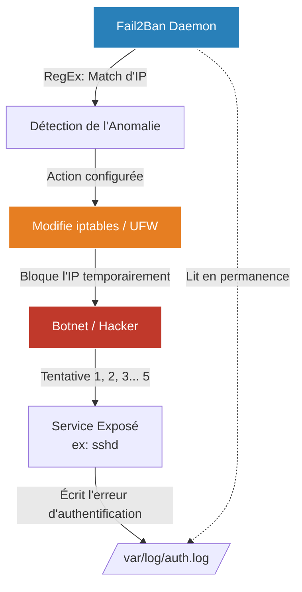

# Protection Active (Fail2Ban)

<div
  class="omny-meta"
  data-level="🟡 Intermédiaire"
  data-version="1.0"
  data-time="30 - 45 minutes">
</div>

!!! quote "La riposte automatisée"
    _Un pare-feu comme UFW est statique : soit la porte est ouverte, soit elle est fermée. Mais que se passe-t-il si la porte est ouverte (ex: le port SSH 22) et qu'un pirate essaie frénétiquement 500 mots de passe par minute pour y entrer ? C'est une attaque par Force Brute (Bruteforce). Pour contrer cela, il nous faut une défense active. **Fail2Ban** observe vos journaux (Logs) en temps réel, détecte les comportements anormaux, et modifie dynamiquement le pare-feu pour bannir l'IP de l'attaquant._

## Le Principe de Fonctionnement

Fail2Ban fonctionne selon un principe de **Jails (Prisons)**.



Une Prison est configurée pour un service spécifique (ex: SSH, Apache, Nginx) et est composée de deux éléments :
1. **Un Filtre (Filter)** : Une expression régulière (RegEx) qui dit à Fail2Ban à quoi ressemble une erreur d'authentification dans les logs de ce service.
2. **Une Action** : Ce que Fail2Ban doit faire s'il détecte "X" erreurs en "Y" minutes (généralement : ajouter une règle temporaire dans UFW/iptables pour bloquer l'IP).

Dès que vous louez un serveur public (VPS), vous subirez des attaques automatisées (Bots) essayant de se connecter en root via SSH en quelques heures. C'est inévitable.

---

## Installation et Configuration Initiale

```bash
sudo apt update
sudo apt install fail2ban
```

Le fichier de configuration principal est `/etc/fail2ban/jail.conf`.
**Cependant, il ne faut jamais modifier ce fichier directement**, car il sera écrasé lors de la prochaine mise à jour du logiciel. La bonne pratique est de créer une copie de surcharge nommée `jail.local`.

```bash
sudo cp /etc/fail2ban/jail.conf /etc/fail2ban/jail.local
sudo nano /etc/fail2ban/jail.local
```

### Configurer les règles globales (Default)

Dans la section `[DEFAULT]` de votre fichier `jail.local`, vous pouvez définir les règles de bannissement communes à toutes vos prisons :

```ini title="/etc/fail2ban/jail.local"
[DEFAULT]
# Les adresses IP qui ne doivent JAMAIS être bannies (Ajoutez votre IP fixe si vous en avez une)
ignoreip = 127.0.0.1/8 ::1

# Le temps de bannissement en secondes (ex: 3600 = 1 heure)
bantime  = 3600

# La fenêtre de temps dans laquelle les erreurs doivent se produire (ex: 10 minutes)
findtime  = 600

# Le nombre de tentatives autorisées avant bannissement
maxretry = 5

# Optionnel : L'action à effectuer. (Par défaut, bloque le port. On peut aussi envoyer un mail).
banaction = ufw
```

### Activer la Prison SSH (sshd)

Faites défiler le fichier jusqu'à trouver la section `[sshd]`. Par défaut, elle est souvent activée, mais assurez-vous de le préciser :

```ini title="/etc/fail2ban/jail.local"
[sshd]
enabled = true
port    = ssh
logpath = %(sshd_log)s
backend = %(sshd_backend)s
```

On redémarre le service pour appliquer les changements :
```bash
sudo systemctl restart fail2ban
sudo systemctl enable fail2ban
```

---

## Vérifier et Gérer les Bannissements

Pour voir l'état général de Fail2Ban et la liste des prisons actives :
```bash
sudo fail2ban-client status
```

Pour voir spécifiquement l'état de la prison SSH (et voir si des pirates ont déjà été piégés) :
```bash
sudo fail2ban-client status sshd
```

**Sortie attendue :**
```text
Status for the jail: sshd
|- Filter
|  |- Currently failed: 1
|  |- Total failed:     35
`- Actions
   |- Currently banned: 2
   |- Total banned:     5
   `- Banned IP list:   198.51.100.12  203.0.113.88
```

### Débannir une IP légitime
Il arrive qu'un collègue oublie son mot de passe 5 fois de suite et se fasse bloquer. Vous pouvez le libérer manuellement :
```bash
sudo fail2ban-client set sshd unbanip 203.0.113.88
```

## Conclusion

Fail2Ban est le compagnon indispensable d'UFW. À eux deux, ils forment la couche de sécurité périmétrique de base de tout serveur Linux. Gardez en tête que l'idéal pour protéger SSH reste la **désactivation totale de l'authentification par mot de passe** au profit d'une authentification par clé cryptographique (Clé RSA/Ed25519), ce qui rend le bruteforce mathématiquement impossible.