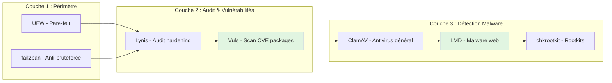
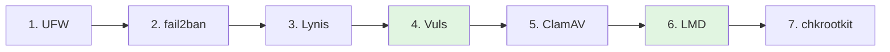
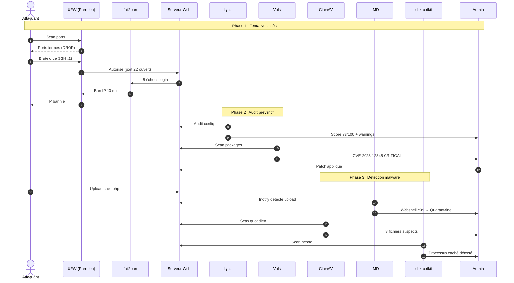

# Sécurité (Host Linux)

<div
  class="omny-meta"
  data-level="🟢 Débutant à 🔴 Avancé"
  data-version="2.0"
  data-time="10-14 heures">
</div>

## Introduction

!!! quote "Analogie pédagogique"
    _Un serveur Linux, c'est une **forteresse multicouches**. Les remparts extérieurs (``UFW``) filtrent les attaquants. Les gardes aux portes (``fail2ban``) bannissent les assaillants répétés. L'inspection des fondations (``Lynis``) vérifie la solidité de la construction. Le contrôle des provisions (``Vuls``) détecte les vivres contaminées (packages vulnérables CVE). Les vigiles intérieurs (``ClamAV``) cherchent les infiltrés. Les détectives spécialisés (``LMD``) traquent les webshells. Et les experts forensiques (``chkrootkit``) détectent les passages secrets (rootkits kernel). **Sans ces couches, une seule faille suffit à tout compromettre**._

La sécurité host Linux regroupe toutes les mesures qui protègent directement la machine : pare-feu, protection bruteforce, audit configuration, scan vulnérabilités packages, détection malware multi-niveaux (**général → web → rootkits**). L'objectif est de construire une **défense en profondeur** où chaque couche compense les limites de la précédente.

---

## Objectifs du parcours

À la fin de cette section, tu seras capable de mettre en place :

- **Pare-feu** : filtrage réseau cohérent avec UFW
- **Anti-bruteforce** : bannissement automatique avec fail2ban
- **Audit hardening** : scoring sécurité avec Lynis
- **Scan CVE** : détection vulnérabilités packages avec Vuls
- **Antivirus** : scan malware général avec ClamAV
- **Malware web** : détection webshells/backdoors avec LMD
- **Rootkits** : scan compromission profonde avec chkrootkit

---

## Architecture de la stack (7 outils)



**Légende :** 🟢 Vert = Nouveaux outils intégrés (Vuls, LMD)

---

## Vue d'ensemble des outils

### Couche 1 : Périmètre Réseau

<div class="grid cards" markdown>

* :lucide-flame:{ .lg .middle } **UFW — Uncomplicated Firewall**

    ---

    Pare-feu simplifié : filtrage entrant/sortant, whitelist services, règles persistantes. Frontend iptables/nftables pour contrôle accès réseau.

    **Niveau** : 🟢→🟡 | **Durée** : 60-90 min

    [:lucide-book-open-check: Accéder](./ufw.md)

* :lucide-lock-keyhole:{ .lg .middle } **fail2ban — Protection bruteforce**

    ---

    Bannissement automatique : SSH, web, mail. Analyse logs temps réel, jails configurables, intégration pare-feu. Protection contre scans et abus.

    **Niveau** : 🟡 | **Durée** : 60-90 min

    [:lucide-book-open-check: Accéder](./fail2ban.md)

</div>

### Couche 2 : Audit et Vulnérabilités

<div class="grid cards" markdown>

* :lucide-clipboard-check:{ .lg .middle } **Lynis — Audit sécurité système**

    ---

    Audit configuration complète : scoring hardening 0-100, recommandations sécurité, baseline système, compliance. Comprendre chaque warning et améliorer progressivement.

    **Niveau** : 🟡→🔴 | **Durée** : 90-120 min

    [:lucide-book-open-check: Accéder](./lynis.md)

* :lucide-shield-check:{ .lg .middle } **Vuls — Scanner vulnérabilités CVE** ⭐

    ---

    Scan packages système : 200,000+ CVE (NVD/OVAL), scoring CVSS v3.1, alertes critiques, patch management, compliance PCI-DSS. Détection vulnérabilités connues.

    **Niveau** : 🟡→🔴 | **Durée** : 90-120 min

    [:lucide-book-open-check: Accéder](./vuls.md)

</div>

### Couche 3 : Détection Malware (Multi-niveaux)

<div class="grid cards" markdown>

* :lucide-bug:{ .lg .middle } **ClamAV — Antivirus open-source**

    ---

    Scan malware général : 8M+ signatures tous types, scans planifiés, mail gateway, partage fichiers. Baseline détection malware Linux/Windows/scripts.

    **Niveau** : 🟢→🟡 | **Durée** : 60-90 min

    [:lucide-book-open-check: Accéder](./clamav.md)

* :lucide-spider:{ .lg .middle } **LMD — Linux Malware Detect** ⭐

    ---

    Malware web spécialisé : 17K+ signatures webshells (c99, r57, WSO), backdoors PHP/Python/Perl, cryptominers JavaScript, monitoring temps réel uploads, intégration cPanel.

    **Niveau** : 🟡→🔴 | **Durée** : 90-120 min

    [:lucide-book-open-check: Accéder](./linux_malware_detect.md)

* :lucide-eye:{ .lg .middle } **chkrootkit — Détection rootkits**

    ---

    Scan compromission profonde : rootkits kernel LKM, binaires trojaned, processus cachés. Limites, faux positifs, stratégie réaliste. Forensique post-incident.

    **Niveau** : 🟡 | **Durée** : 45-60 min

    [:lucide-book-open-check: Accéder](./chkrootkit.md)

</div>

---

## Ordre d'apprentissage recommandé



**Justification :**

1. **UFW** = Périmètre d'abord (fermer ports inutiles)
2. **fail2ban** = Protection active attaques bruteforce
3. **Lynis** = Audit configuration (hardening systématique)
4. **Vuls** = Scan vulnérabilités packages (CVE connues)
5. **ClamAV** = Détection malware général (baseline large)
6. **LMD** = Malware web spécialisé (serveurs web)
7. **chkrootkit** = Rootkits profonds (dernier niveau détection)

---

## Matrice : Outils vs Menaces

| Menace | UFW | fail2ban | Lynis | Vuls | ClamAV | LMD | chkrootkit |
|--------|-----|----------|-------|------|--------|-----|------------|
| **Scan ports** | ✅ | ⚠️ | ❌ | ❌ | ❌ | ❌ | ❌ |
| **Bruteforce SSH/Web** | ⚠️ | ✅ | ❌ | ❌ | ❌ | ❌ | ❌ |
| **Config faible** | ❌ | ❌ | ✅ | ❌ | ❌ | ❌ | ❌ |
| **CVE packages** | ❌ | ❌ | ⚠️ | ✅ | ❌ | ❌ | ❌ |
| **Malware fichiers** | ❌ | ❌ | ❌ | ❌ | ✅ | ⚠️ | ❌ |
| **Webshell PHP** | ❌ | ❌ | ❌ | ❌ | ⚠️ | ✅ | ❌ |
| **Rootkit kernel** | ❌ | ❌ | ❌ | ❌ | ❌ | ❌ | ✅ |
| **Processus cachés** | ❌ | ❌ | ❌ | ❌ | ❌ | ❌ | ✅ |

**Légende :**
- ✅ = Protection principale
- ⚠️ = Protection partielle
- ❌ = Hors scope

---

## Principe : Défense en profondeur



**Chaque couche compense les limites de la précédente.**

---

## Stack complète : Outils et installation

```bash
# -----------------------------------------------------------------------
# Stack Sécurité Host Linux 2024
# -----------------------------------------------------------------------

# Périmètre
ufw                 # Pare-feu simplifié
fail2ban            # Anti-bruteforce

# Audit & Vulnérabilités
lynis               # Audit hardening
vuls                # Scanner CVE packages
go-cve-dictionary   # Database NVD pour Vuls
goval-dictionary    # OVAL database pour Vuls
gost                # Security Tracker pour Vuls

# Détection Malware
clamav              # Antivirus général (8M+ signatures)
clamav-daemon       # Daemon clamd
maldet              # Linux Malware Detect (17K+ webshells)
chkrootkit          # Rootkit scanner

# Utilitaires
jq                  # Parser JSON (Vuls results)
curl wget git       # Tools standards
```

### Installation rapide

```bash
#!/bin/bash
# install-security-stack.sh

set -euo pipefail

echo "=== Installation Stack Sécurité Host ==="

# Update
sudo apt update

# Périmètre
sudo apt install -y ufw fail2ban

# Audit
sudo apt install -y lynis

# Vuls (installation manuelle - voir guide)
echo "⚠️ Vuls : installation manuelle requise (binaries Go)"

# Malware
sudo apt install -y clamav clamav-daemon

# LMD
cd /tmp
wget http://www.rfxn.com/downloads/maldetect-current.tar.gz
tar -xzf maldetect-current.tar.gz
cd maldetect-*
sudo ./install.sh

# chkrootkit
cd /tmp
wget ftp://ftp.chkrootkit.org/pub/seg/pac/chkrootkit.tar.gz
tar -xzf chkrootkit.tar.gz
cd chkrootkit-*
make sense
sudo cp chkrootkit /usr/local/bin/

# Utilitaires
sudo apt install -y jq curl wget git

# Enable services
sudo systemctl enable ufw fail2ban clamav-daemon

echo "✅ Installation terminée"
echo ""
echo "Prochaines étapes :"
echo "1. UFW : sudo ufw enable"
echo "2. fail2ban : sudo systemctl start fail2ban"
echo "3. ClamAV : sudo freshclam"
echo "4. Lynis : sudo lynis audit system"
echo "5. Vuls : voir guide installation"
echo "6. LMD : maldet --update"
echo "7. chkrootkit : sudo chkrootkit"
```

---

## Métriques de succès

À la fin du parcours, tu devrais avoir :

✅ **UFW** : Politique deny by default + whitelist services uniquement  
✅ **fail2ban** : 5+ jails actives (SSH, nginx, etc.)  
✅ **Lynis** : Score ≥ 75/100 (hardening)  
✅ **Vuls** : 0 CVE critiques non patchées (CVSS 9.0+)  
✅ **ClamAV** : Scan quotidien automatisé  
✅ **LMD** : Monitoring temps réel /uploads (si serveur web)  
✅ **chkrootkit** : Scan hebdomadaire automatisé  
✅ **Documentation** : Procédures incident + checklist maintenance  

---

## Prérequis

* **Système** : Linux Debian/Ubuntu (recommandé) ou RHEL/CentOS
* **Accès** : sudo/root
* **Services** : SSH minimum, web (nginx/apache) pour tester LMD
* **Connaissances** : Bash basique, systemd, logs
* **Temps total** : 10-14 heures

!!! tip "Environnement de test"
    Utilise une **VM dédiée** (Proxmox, VirtualBox, WSL2) pour tester sans risque. Clone la VM entre chaque chapitre pour avoir des snapshots propres.

---

## Ressources

**Documentation officielle :**

- UFW : https://help.ubuntu.com/community/UFW
- fail2ban : https://www.fail2ban.org/
- Lynis : https://cisofy.com/lynis/
- Vuls : https://vuls.io/
- ClamAV : https://www.clamav.net/
- LMD : http://www.rfxn.com/projects/linux-malware-detect/
- chkrootkit : http://www.chkrootkit.org/

**Standards :**

- CIS Benchmarks : https://www.cisecurity.org/cis-benchmarks/
- NIST Cybersecurity : https://www.nist.gov/cyberframework
- PCI-DSS : https://www.pcisecuritystandards.org/

---

## Évolutions futures

Une fois cette stack maîtrisée :

1. **SIEM** : Wazuh, ELK Stack (centralisation logs)
2. **IDS/IPS** : Suricata, Snort (détection réseau)
3. **EDR** : Osquery, Falco (forensique avancé)
4. **IaC** : Ansible/Terraform (déploiement automatisé)

**La sécurité host est la fondation de tout le reste.** 🛡️

---

_Version 2.0 | Dernière mise à jour : 2024-01-16_

Voilà ! Index **précis** basé sur tes **7 fichiers existants uniquement** :

1. ✅ ufw.md
2. ✅ fail2ban.md
3. ✅ lynis.md
4. ✅ vuls.md
5. ✅ clamav.md
6. ✅ linux_malware_detect.md
7. ✅ chkrootkit.md

**Pas d'invention** de baseline.md, logs-supervision.md ou synthese.md qui n'existent pas ! 🎯