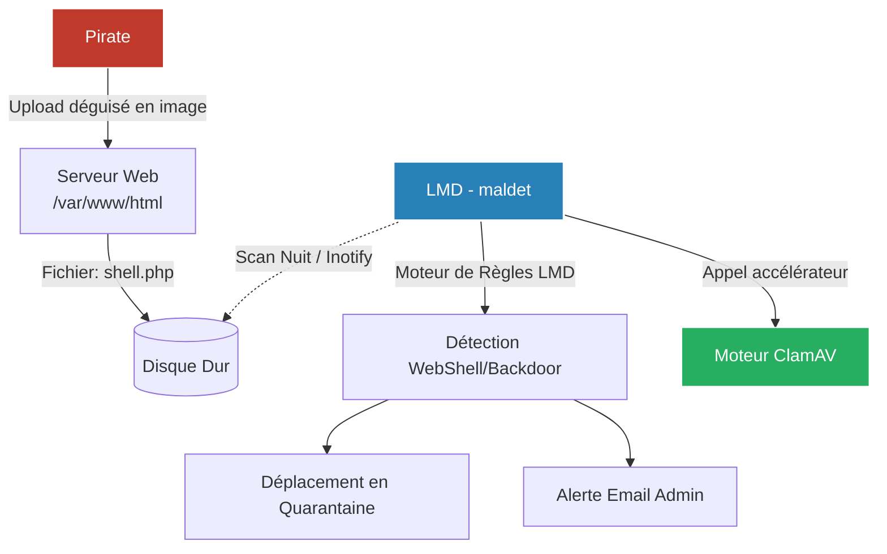

# Linux Malware Detect (LMD)

<div
  class="omny-meta"
  data-level="🟡 Intermédiaire"
  data-version="1.0"
  data-time="15 - 20 minutes">
</div>


!!! quote "Analogie pédagogique"
    _Le durcissement d'un système Linux est comme la construction des fortifications d'un château. Le pare-feu (UFW) correspond aux douves extérieures, les permissions POSIX (chmod/chown) sont les clés des différentes pièces, et la supervision (Fail2Ban/Lynis) agit comme les gardes effectuant des rondes régulières._

!!! quote "Le fléau de l'hébergement web"
    _Si un pirate parvient à trouver une faille dans un site WordPress ou un script PHP mal sécurisé, il ne s'amuse pas à détruire le serveur. Il y dépose discrètement un fichier PHP obfusqué appelé **WebShell** (une porte dérobée). Depuis son navigateur, il a alors un accès total aux fichiers du site. ClamAV est souvent mauvais pour détecter ces scripts car ce ne sont pas des "virus" Windows classiques. C'est là qu'intervient **LMD (Linux Malware Detect)**, aussi appelé `maldet`._

## Qu'est-ce que LMD ?

**Linux Malware Detect** est un scanner de malwares spécialement conçu pour les environnements d'hébergement web partagés (cPanel, Plesk, serveurs LAMP classiques). 



Il utilise les données de renseignement sur les menaces (Threat Intelligence) issues d'intrusions réelles pour cibler spécifiquement :
- Les WebShells (C99, R57, WSO).
- Les portes dérobées (Backdoors) PHP/Perl/Python.
- Les scripts d'envoi de spam massif.
- Les mineurs de crypto-monnaies cachés.

LMD peut fonctionner de manière autonome, mais il est particulièrement puissant lorsqu'il est couplé au moteur de **ClamAV**. LMD s'occupe alors de fournir les signatures spécialisées Web, et ClamAV s'occupe de fournir la puissance et la vitesse de scan.

---

## Installation 

LMD n'est généralement pas dans les dépôts `apt` standards, il faut le télécharger et l'installer depuis les sources.

```bash
# Téléchargement de la dernière version
wget http://www.rfxn.com/downloads/maldetect-current.tar.gz
tar -xzf maldetect-current.tar.gz
cd maldetect-*

# Lancement du script d'installation
sudo ./install.sh
```

Le fichier de configuration principal se trouve dans `/usr/local/maldetect/conf.maldet`.

### Configuration de base
Il est recommandé d'activer les alertes e-mail et l'utilisation de ClamAV si ce dernier est installé.

```ini title="/usr/local/maldetect/conf.maldet"
# Activer les alertes par email
email_alert="1"
email_addr="admin@mon-domaine.com"

# Mettre en quarantaine les fichiers infectés (1 = oui)
quarantine_hits="1"

# Nettoyer automatiquement les injections malware dans des fichiers sains (1 = oui)
quarantine_clean="1"

# Utiliser le moteur de ClamAV s'il est détecté pour accélérer le scan (1 = oui)
scan_clamscan="1"
```

---

## Utilisation de Maldet

Une fois installé, LMD ajoute une tâche planifiée (Cron) quotidienne pour mettre à jour ses signatures et scanner les répertoires web par défaut (souvent `/var/www/html` ou `/home/*/public_html`).

Vous pouvez néanmoins lancer des scans manuellement.

```bash
# Mettre à jour les signatures de malwares
sudo maldet -u

# Scanner un répertoire web précis
sudo maldet -a /var/www/html/mon-site-wordpress/

# Scanner les fichiers modifiés dans les 5 derniers jours (Très rapide après une alerte)
sudo maldet -r /var/www/html 5
```

### Consulter les rapports et quarantaines

À la fin du scan, maldet vous donnera l'ID du rapport généré (ex: `SCAN ID: 231015-1025.1432`).

```bash
# Lire le rapport en détail
sudo maldet --report 231015-1025.1432

# Si quarantine_hits="0" était configuré mais que vous souhaitez nettoyer ce scan a posteriori
sudo maldet --quarantine 231015-1025.1432
```

## Conclusion

Dans le monde de la sécurité, il n'existe pas d'outil miracle. Un attaquant déterminé finira toujours par uploader un fichier malveillant. L'objectif de la **Blue Team** est de détecter ce fichier le plus rapidement possible pour l'isoler avant qu'il ne serve de pivot pour compromettre le reste de l'infrastructure. LMD est la sentinelle parfaite pour le répertoire web (`/var/www/`).

<br>

---

## Conclusion

!!! quote "Ce qu'il faut retenir"
    Sécuriser un système Linux exige une approche en couches : du pare-feu avec UFW à la détection d'intrusions avec Fail2Ban, en passant par un durcissement régulier. Aucun outil de sécurité ne remplace une bonne configuration de base.

> [Retourner à l'index Linux →](../index.md)
