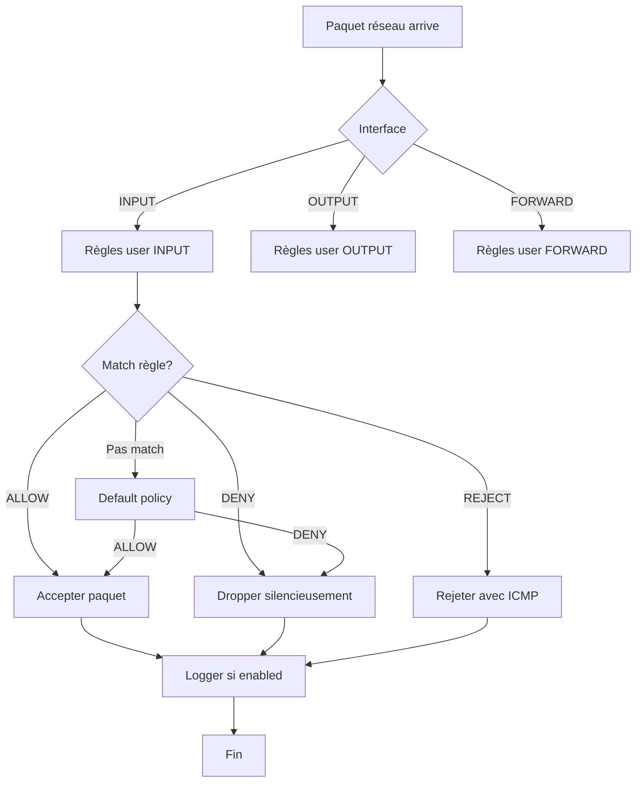

# UFW

<div
  class="omny-meta"
  data-level="🟢 Débutant → 🔴 Avancé"
  data-time="6-8 heures"
  data-version="1.0">
</div>

## Introduction au Firewall Linux

!!! quote "Analogie pédagogique"
    _Imaginez un **service sécurité immeuble ultra-sophistiqué avec portiers, badges, caméras** : UFW fonctionne comme **système contrôle accès multicouches filtrant CHAQUE visiteur (paquet réseau) selon règles strictes**. **Sécurité immeuble physique** : portier principal (firewall) vérifie identité visiteurs, liste blanche résidents autorisés (règles ALLOW), liste noire interdits accès (règles DENY), horaires accès (rate limiting), zones sécurité graduées (DMZ/LAN/WAN), caméras surveillance (logging), alarme intrusion (fail2ban), plans évacuation (default policies). **Sans firewall** : portes grandes ouvertes (tous ports accessibles), serveurs exposés Internet (scanning automatique bots), attaques brute-force SSH (milliers tentatives/minute), exploits vulnérabilités (backdoors RCE), DDoS flooding (saturation bande passante), vol données (écoute trafic non chiffré). **Avec UFW** : **Contrôle granulaire** (autoriser SEULEMENT ports nécessaires 22/80/443), **Defense-in-depth** (default deny + whitelist explicite), **Geo-blocking** (bloquer pays entiers), **Rate limiting** (max 10 connexions SSH/minute), **Logging détaillé** (audit trail complet), **Stateful inspection** (track connexions établies), **Application profiles** (règles pré-configurées Nginx/Apache/MySQL). **Architecture UFW** : Frontend simplifié → iptables/nftables backend → Netfilter kernel → Network stack. **UFW = Uncomplicated FireWall** mais PUISSANT : commandes simples style `ufw allow 80`, génère automatiquement règles iptables complexes (20+ lignes), gère IPv4+IPv6 simultanément, profiles applications intégrés, logging niveaux multiples, persistence automatique reboot. **Use cases production** : serveurs web (allow 80/443, deny reste), serveurs SSH (rate limit 22, geo-block), databases (allow LAN seulement), APIs (whitelist IPs clients), load balancers (complex NAT rules), containers (Docker integration), multi-tenant (isolation réseau). **UFW = standard Ubuntu/Debian firewall** : installé par défaut Ubuntu 18.04+, remplace iptables-persistent, simple débutants, flexible experts, production-ready millions serveurs._

**UFW en résumé :**

- ✅ **Simple** = Syntaxe intuitive vs iptables complexe
- ✅ **Puissant** = Frontend pour iptables/nftables complet
- ✅ **IPv4 + IPv6** = Support dual-stack automatique
- ✅ **Stateful** = Connexion tracking (established/related)
- ✅ **Application profiles** = Règles pré-configurées 40+ apps
- ✅ **Logging** = Niveaux logging détaillés (off/low/medium/high/full)
- ✅ **Rate limiting** = Protection brute-force intégrée
- ✅ **Persistent** = Règles sauvegardées automatiquement

**Guide structure :**

1. Introduction et concepts firewall
2. Installation et activation UFW
3. Règles basiques (allow/deny/reject)
4. Règles avancées (ports, IPs, subnets)
5. Application profiles
6. Rate limiting et protection DDoS
7. Logging et monitoring
8. IPv6 configuration
9. Règles complexes et NAT
10. Intégration fail2ban et GeoIP
11. Troubleshooting et debugging
12. Best practices par scénario

---

## Section 1 : Introduction et Concepts

### 1.1 Qu'est-ce qu'un Firewall ?

**Firewall = Barrière filtrage trafic réseau selon règles sécurité**

```
Modèle OSI et Firewall :

┌─────────────────────────────────────────────┐
│  7. Application  │ HTTP, SSH, DNS, SMTP    │
│  6. Presentation │ SSL/TLS, encryption     │
│  5. Session      │ NetBIOS, RPC            │
├──────────────────┼─────────────────────────┤
│  4. Transport    │ TCP, UDP (ports)        │ ← Firewall Layer 4
│  3. Network      │ IP addressing, routing  │ ← Firewall Layer 3
├──────────────────┼─────────────────────────┤
│  2. Data Link    │ Ethernet, MAC           │
│  1. Physical     │ Cables, signals         │
└─────────────────────────────────────────────┘

UFW filtre couches 3-4 :
- Layer 3 (IP) : source/destination IP addresses
- Layer 4 (TCP/UDP) : ports, protocol type
```

**Types de firewall :**

```
┌──────────────────────┬────────────────────────────────────┐
│ Packet Filter       │ Filtre chaque paquet individuellement │
│ (stateless)         │ Ne garde PAS mémoire connexions      │
│                     │ Exemple : iptables basique           │
├──────────────────────┼────────────────────────────────────┤
│ Stateful Firewall   │ Track connexions (established/new)  │
│ (UFW/iptables)      │ Permet réponses connexions établies │
│                     │ Plus intelligent et sécurisé         │
├──────────────────────┼────────────────────────────────────┤
│ Application Gateway │ Inspecte contenu application (L7)   │
│ (WAF)               │ Détecte attaques SQL injection, XSS │
│                     │ Exemple : ModSecurity, Cloudflare   │
├──────────────────────┼────────────────────────────────────┤
│ Next-Gen Firewall   │ IDS/IPS intégré, DPI, AI detection │
│ (NGFW)              │ Exemple : Palo Alto, Fortinet       │
└──────────────────────┴────────────────────────────────────┘

UFW = Stateful packet filter (Layer 3-4)
```

### 1.2 UFW vs iptables vs nftables

**Comparaison syntaxe :**

```bash
# Autoriser port 80 TCP

# iptables (complexe)
iptables -A INPUT -p tcp --dport 80 -j ACCEPT
iptables -A OUTPUT -p tcp --sport 80 -m state --state ESTABLISHED -j ACCEPT

# nftables (moderne mais verbeux)
nft add rule ip filter input tcp dport 80 accept
nft add rule ip filter output tcp sport 80 ct state established accept

# UFW (simple !)
ufw allow 80/tcp

# UFW génère automatiquement règles iptables/nftables complètes
# + gère IPv4 ET IPv6 simultanément
# + ajoute connection tracking (stateful)
# + sauvegarde persistence automatique
```

**Tableau comparatif :**

| Critère | iptables | nftables | UFW |
|---------|----------|----------|-----|
| **Complexité** | Haute | Moyenne | Basse |
| **Syntaxe** | Cryptique | Moderne | Intuitive |
| **IPv6** | ip6tables séparé | Intégré | Intégré |
| **Performance** | Bonne | Meilleure | Bonne (backend) |
| **Courbe apprentissage** | Raide | Moyenne | Douce |
| **Stateful** | Manuel | Manuel | Automatique |
| **Persistence** | iptables-persistent | Manuel | Automatique |
| **Use case** | Expert | Expert/Modern | Débutant/Production |

**Architecture UFW :**

```
┌─────────────────────────────────────────────────────┐
│                    UFW Frontend                     │
│  Simple commands: ufw allow 80, ufw deny from ...  │
└─────────────────┬───────────────────────────────────┘
                  │
                  ↓
┌─────────────────────────────────────────────────────┐
│              UFW Translation Layer                  │
│  /etc/ufw/*.rules (user rules + framework rules)   │
└─────────────────┬───────────────────────────────────┘
                  │
                  ↓
┌─────────────────────────────────────────────────────┐
│           iptables/nftables Backend                 │
│  Génère règles iptables/nftables complexes         │
└─────────────────┬───────────────────────────────────┘
                  │
                  ↓
┌─────────────────────────────────────────────────────┐
│              Netfilter (Linux Kernel)               │
│  Filtre paquets au niveau kernel                   │
└─────────────────────────────────────────────────────┘
```

### 1.3 Concepts Clés

**Chains (chaînes) :**

```
INPUT    : Trafic ENTRANT vers serveur
OUTPUT   : Trafic SORTANT depuis serveur
FORWARD  : Trafic TRAVERSANT serveur (routing/NAT)

Exemple flow :
Internet → [INPUT chain] → Serveur
Serveur → [OUTPUT chain] → Internet
Internet → [FORWARD chain] → LAN (si routeur)
```

**Policies (politiques par défaut) :**

```
Default DENY (recommandé production) :
- INPUT : DENY par défaut
- OUTPUT : ALLOW par défaut
- FORWARD : DENY par défaut
→ Whitelist explicite (allow seulement nécessaire)

Default ALLOW (dangereux) :
- INPUT : ALLOW par défaut
- OUTPUT : ALLOW par défaut
→ Blacklist (deny seulement connu malveillant)
```

**Stateful connection tracking :**

```
States connexion :
- NEW : Nouvelle connexion initiée
- ESTABLISHED : Connexion établie (handshake complet)
- RELATED : Connexion liée à établie (FTP data, ICMP)
- INVALID : Paquet malformé/suspect

UFW permet automatiquement ESTABLISHED+RELATED
→ Pas besoin règle explicite réponses
```

**Direction trafic :**

```
IN  : Trafic entrant interface réseau (depuis Internet)
OUT : Trafic sortant interface réseau (vers Internet)

Exemple serveur web :
- Client → Serveur (port 80) : IN
- Serveur → Client (réponse) : OUT (automatiquement autorisé si ESTABLISHED)
```

### 1.4 Flux Décision UFW



---

## Section 2 : Installation et Activation

### 2.1 Installation UFW

**Debian/Ubuntu (pré-installé Ubuntu 18.04+) :**

```bash
# Vérifier si installé
which ufw
# Output : /usr/sbin/ufw

# Installer si absent
sudo apt update
sudo apt install ufw

# Vérifier version
ufw version
# Output : ufw 0.36.2
```

**RHEL/CentOS/Rocky/Alma :**

```bash
# UFW pas dans repos officiels RHEL
# Utiliser firewalld (natif RHEL) OU installer EPEL

# Installer EPEL
sudo yum install epel-release

# Installer UFW
sudo yum install ufw

# Désactiver firewalld (conflit)
sudo systemctl stop firewalld
sudo systemctl disable firewalld
sudo systemctl mask firewalld
```

**Arch Linux :**

```bash
# Installer
sudo pacman -S ufw

# Activer service
sudo systemctl enable ufw
```

### 2.2 Vérification État Initial

```bash
# Vérifier status UFW (désactivé par défaut)
sudo ufw status
# Output : Status: inactive

# Status verbeux (plus détails)
sudo ufw status verbose
# Output :
# Status: inactive
# Logging: off
# Default: deny (incoming), allow (outgoing), deny (routed)

# Status numéroté (voir numéros règles)
sudo ufw status numbered

# Vérifier règles iptables backend (vide si UFW inactif)
sudo iptables -L -n -v
sudo ip6tables -L -n -v
```

### 2.3 Configuration Initiale Sécurisée

**IMPORTANT : Configurer AVANT activer (éviter lock-out SSH) :**

```bash
# 1. Reset configuration (si existant)
sudo ufw --force reset

# 2. Définir policies par défaut (DENY incoming, ALLOW outgoing)
sudo ufw default deny incoming
sudo ufw default allow outgoing
sudo ufw default deny routed

# Output :
# Default incoming policy changed to 'deny'
# Default outgoing policy changed to 'allow'
# Default routed policy changed to 'deny'

# 3. Autoriser SSH (CRITIQUE avant activer UFW)
sudo ufw allow 22/tcp comment 'SSH access'
# OU si port custom :
# sudo ufw allow 2222/tcp comment 'SSH custom port'

# 4. Autoriser autres services nécessaires (AVANT activation)
sudo ufw allow 80/tcp comment 'HTTP'
sudo ufw allow 443/tcp comment 'HTTPS'

# 5. Vérifier règles configurées (status still inactive)
sudo ufw show added
# Output :
# Added user rules (see 'ufw status' for running firewall):
# ufw allow 22/tcp
# ufw allow 80/tcp
# ufw allow 443/tcp
```

### 2.4 Activation UFW

```bash
# Activer UFW (APRÈS avoir autorisé SSH)
sudo ufw enable

# Output :
# Command may disrupt existing ssh connections. Proceed with operation (y|n)? y
# Firewall is active and enabled on system startup

# Vérifier status actif
sudo ufw status verbose

# Output :
# Status: active
# Logging: on (low)
# Default: deny (incoming), allow (outgoing), deny (routed)
# New profiles: skip
# 
# To                         Action      From
# --                         ------      ----
# 22/tcp                     ALLOW IN    Anywhere
# 80/tcp                     ALLOW IN    Anywhere
# 443/tcp                    ALLOW IN    Anywhere
# 22/tcp (v6)                ALLOW IN    Anywhere (v6)
# 80/tcp (v6)                ALLOW IN    Anywhere (v6)
# 443/tcp (v6)                ALLOW IN    Anywhere (v6)

# Tester connexion SSH (depuis autre terminal)
ssh user@server
# Doit fonctionner normalement

# Activer au boot (systemd)
sudo systemctl enable ufw
```

**Commandes gestion service :**

```bash
# Status service systemd
sudo systemctl status ufw

# Désactiver UFW temporairement
sudo ufw disable

# Réactiver
sudo ufw enable

# Recharger règles sans interrupt connexions
sudo ufw reload
```

---

## Section 3 : Règles Basiques

### 3.1 Allow (Autoriser)

**Syntaxe simple :**

```bash
# Autoriser port (TCP par défaut)
sudo ufw allow 80

# Autoriser port avec protocole explicite
sudo ufw allow 80/tcp
sudo ufw allow 53/udp

# Autoriser range ports
sudo ufw allow 6000:6010/tcp

# Autoriser service par nom
sudo ufw allow ssh
sudo ufw allow http
sudo ufw allow https

# Services disponibles : /etc/services
less /etc/services
```

**Avec commentaires (recommandé) :**

```bash
# Ajouter commentaire explicatif
sudo ufw allow 22/tcp comment 'SSH access'
sudo ufw allow 80/tcp comment 'HTTP web server'
sudo ufw allow 443/tcp comment 'HTTPS web server'
sudo ufw allow 3306/tcp comment 'MySQL database'

# Visualiser commentaires
sudo ufw status

# Output :
# To                         Action      From
# --                         ------      ----
# 22/tcp                     ALLOW IN    Anywhere              # SSH access
# 80/tcp                     ALLOW IN    Anywhere              # HTTP web server
```

### 3.2 Deny (Bloquer Silencieusement)

```bash
# Deny port (drop packets, pas de réponse)
sudo ufw deny 23/tcp comment 'Block Telnet'

# Deny service
sudo ufw deny smtp

# Deny tout depuis IP
sudo ufw deny from 192.168.1.100

# Deny subnet
sudo ufw deny from 10.0.0.0/8
```

**Différence DENY vs REJECT :**

```bash
# DENY : Drop silencieux (attaquant timeout)
sudo ufw deny 23/tcp

# REJECT : Envoie ICMP "port unreachable" (attaquant sait port fermé)
sudo ufw reject 23/tcp

# Recommendation production : DENY (stealth mode)
# Attaquant ne sait pas si port existe ou firewall bloque
```

### 3.3 Delete (Supprimer Règles)

```bash
# Méthode 1 : Par numéro (après ufw status numbered)
sudo ufw status numbered
# Output :
# [ 1] 22/tcp                     ALLOW IN    Anywhere
# [ 2] 80/tcp                     ALLOW IN    Anywhere
# [ 3] 443/tcp                    ALLOW IN    Anywhere

# Supprimer règle #2
sudo ufw delete 2

# Méthode 2 : Par règle exacte
sudo ufw delete allow 80/tcp

# Méthode 3 : Par règle complète
sudo ufw delete allow from 192.168.1.100 to any port 22

# Supprimer TOUTES règles (reset complet)
sudo ufw --force reset
```

### 3.4 Insert (Insérer Règle Position Spécifique)

```bash
# Règles évaluées dans ordre (top → bottom)
# Insert permet ajouter règle AVANT autres

# Status numéroté actuel
sudo ufw status numbered
# [ 1] 22/tcp                     ALLOW IN    Anywhere
# [ 2] Anywhere                   DENY IN     192.168.1.100

# Insérer règle position 1 (priorité haute)
sudo ufw insert 1 allow from 192.168.1.50 to any port 22

# Nouveau status
sudo ufw status numbered
# [ 1] 22/tcp                     ALLOW IN    192.168.1.50
# [ 2] 22/tcp                     ALLOW IN    Anywhere
# [ 3] Anywhere                   DENY IN     192.168.1.100

# Use case : Whitelist IP spécifique AVANT règle générale
```

---

## Section 4 : Règles Avancées

### 4.1 Règles par IP Source

```bash
# Allow depuis IP spécifique
sudo ufw allow from 192.168.1.100

# Allow depuis IP vers port spécifique
sudo ufw allow from 192.168.1.100 to any port 22

# Allow depuis subnet
sudo ufw allow from 192.168.1.0/24

# Allow depuis subnet vers port
sudo ufw allow from 192.168.1.0/24 to any port 3306

# Deny IP spécifique
sudo ufw deny from 203.0.113.50

# Deny subnet
sudo ufw deny from 203.0.113.0/24
```

### 4.2 Règles par Interface Réseau

```bash
# Lister interfaces
ip addr show
# eth0 : interface WAN (Internet)
# eth1 : interface LAN (réseau local)

# Allow sur interface spécifique
sudo ufw allow in on eth0 to any port 80
sudo ufw allow in on eth1 to any port 3306

# Deny sur interface
sudo ufw deny in on eth0 to any port 3306

# Use case : MySQL accessible LAN seulement
sudo ufw allow in on eth1 to any port 3306
sudo ufw deny in on eth0 to any port 3306
```

### 4.3 Règles Bidirectionnelles (IN/OUT)

```bash
# Par défaut : règles IN (incoming)
sudo ufw allow 80  # = allow IN 80

# Règle OUT explicite (outgoing)
sudo ufw allow out 53/udp comment 'DNS queries'

# Allow OUT vers IP spécifique
sudo ufw allow out to 8.8.8.8 port 53

# Deny OUT (bloquer serveur contacter Internet)
sudo ufw deny out to any port 25 comment 'Block SMTP relay'

# Use case : Empêcher serveur compromis exfiltrer données
sudo ufw default deny outgoing  # DANGEREUX : bloque updates
sudo ufw allow out 53/udp       # DNS nécessaire
sudo ufw allow out 80/tcp       # HTTP updates
sudo ufw allow out 443/tcp      # HTTPS updates
```

### 4.4 Règles Complexes Multi-Critères

```bash
# IP source + destination port + protocole
sudo ufw allow from 192.168.1.0/24 to any port 443 proto tcp

# Interface + IP + port
sudo ufw allow in on eth1 from 192.168.1.100 to any port 22

# Range ports + IP
sudo ufw allow from 10.0.0.0/8 to any port 6000:6010 proto tcp

# Multiple protocols même port (rare)
sudo ufw allow 53/tcp
sudo ufw allow 53/udp

# Règle complexe complète
sudo ufw allow in on eth0 from 192.168.1.0/24 to 192.168.1.10 port 3306 proto tcp comment 'MySQL LAN access'
```

### 4.5 Exemples Serveurs Types

**Web Server (Nginx/Apache) :**

```bash
sudo ufw default deny incoming
sudo ufw default allow outgoing
sudo ufw allow 22/tcp comment 'SSH'
sudo ufw allow 80/tcp comment 'HTTP'
sudo ufw allow 443/tcp comment 'HTTPS'
sudo ufw enable
```

**Database Server (MySQL/PostgreSQL) :**

```bash
sudo ufw default deny incoming
sudo ufw default allow outgoing
sudo ufw allow 22/tcp comment 'SSH'

# Allow MySQL depuis app servers seulement
sudo ufw allow from 192.168.1.10 to any port 3306 comment 'MySQL app1'
sudo ufw allow from 192.168.1.11 to any port 3306 comment 'MySQL app2'

# PostgreSQL
sudo ufw allow from 192.168.1.0/24 to any port 5432 comment 'PostgreSQL LAN'

sudo ufw enable
```

**Mail Server (Postfix/Dovecot) :**

```bash
sudo ufw default deny incoming
sudo ufw default allow outgoing
sudo ufw allow 22/tcp comment 'SSH'
sudo ufw allow 25/tcp comment 'SMTP'
sudo ufw allow 587/tcp comment 'SMTP submission'
sudo ufw allow 465/tcp comment 'SMTPS'
sudo ufw allow 143/tcp comment 'IMAP'
sudo ufw allow 993/tcp comment 'IMAPS'
sudo ufw allow 110/tcp comment 'POP3'
sudo ufw allow 995/tcp comment 'POP3S'
sudo ufw enable
```

**DNS Server :**

```bash
sudo ufw default deny incoming
sudo ufw default allow outgoing
sudo ufw allow 22/tcp comment 'SSH'
sudo ufw allow 53/tcp comment 'DNS TCP'
sudo ufw allow 53/udp comment 'DNS UDP'
sudo ufw enable
```

---

## Section 5 : Application Profiles

### 5.1 Profils Pré-Configurés

**Lister profils disponibles :**

```bash
# Liste complète applications
sudo ufw app list

# Output (exemple) :
# Available applications:
#   Apache
#   Apache Full
#   Apache Secure
#   Nginx Full
#   Nginx HTTP
#   Nginx HTTPS
#   OpenSSH
#   Postfix
#   Postfix SMTPS
#   Postfix Submission
#   ...
```

**Voir détails profil :**

```bash
# Info profil OpenSSH
sudo ufw app info OpenSSH

# Output :
# Profile: OpenSSH
# Title: Secure shell server, an rshd replacement
# Description: OpenSSH is a free implementation of the Secure Shell protocol.
# 
# Port:
#   22/tcp

# Info profil Nginx Full
sudo ufw app info "Nginx Full"

# Output :
# Profile: Nginx Full
# Title: Web Server (Nginx, HTTP + HTTPS)
# Description: Small, but very powerful and efficient web server
# 
# Ports:
#   80,443/tcp
```

### 5.2 Utiliser Profils

```bash
# Autoriser profil simple
sudo ufw allow OpenSSH

# Autoriser profil complexe (guillemets si espace)
sudo ufw allow "Nginx Full"

# Autoriser depuis IP avec profil
sudo ufw allow from 192.168.1.0/24 to any app "Nginx Full"

# Deny profil
sudo ufw deny Postfix
```

### 5.3 Créer Profils Custom

**Structure fichier profil (/etc/ufw/applications.d/) :**

```bash
# Créer profil custom
sudo nano /etc/ufw/applications.d/myapp

# Contenu :
[MyApp]
title=My Custom Application
description=Custom app on ports 8080-8090
ports=8080:8090/tcp

[MyApp Admin]
title=My App Admin Interface
description=Admin on port 9000
ports=9000/tcp

# Recharger profils
sudo ufw app update MyApp

# Vérifier profil créé
sudo ufw app list | grep MyApp
# MyApp
# MyApp Admin

# Utiliser profil
sudo ufw allow MyApp
```

**Exemple profil Django/Flask :**

```bash
# /etc/ufw/applications.d/django

[Django Dev]
title=Django Development Server
description=Django development server on 8000
ports=8000/tcp

[Django Prod]
title=Django Production (Gunicorn)
description=Django via Gunicorn on 8000-8003
ports=8000:8003/tcp

# Usage
sudo ufw allow "Django Prod"
```

**Exemple profil Node.js :**

```bash
# /etc/ufw/applications.d/nodejs

[Node.js App]
title=Node.js Application
description=Node.js app on port 3000
ports=3000/tcp

[Node.js Cluster]
title=Node.js Cluster
description=Node.js cluster on 3000-3003
ports=3000:3003/tcp

# Usage
sudo ufw allow "Node.js Cluster"
```

---

## Section 6 : Rate Limiting et Protection DDoS

### 6.1 Rate Limiting SSH (Anti Brute-Force)

**UFW rate limiting intégré :**

```bash
# Syntax : ufw limit <port>
# Limite : 6 connexions/30 secondes par IP
# Si dépassé : block IP pendant 30 secondes

# Enable rate limiting SSH
sudo ufw limit 22/tcp comment 'SSH rate limited'

# OU avec service name
sudo ufw limit ssh

# Tester depuis client
# Tentatives connexion rapides :
for i in {1..10}; do ssh user@server; done
# Après 6 tentatives : connexion refusée temporairement
```

**Règles générées (iptables backend) :**

```bash
# Vérifier règles iptables créées par UFW
sudo iptables -L ufw-user-input -n -v | grep 22

# Output (simplifié) :
# Chain ufw-user-input
# 0  0 tcp dpt:22 state NEW recent: SET name: DEFAULT side: source
# 0  0 tcp dpt:22 state NEW recent: UPDATE seconds: 30 hit_count: 6 name: DEFAULT side: source -j ufw-user-limit
# 0  0 tcp dpt:22 -j ufw-user-limit-accept
```

### 6.2 Rate Limiting Custom

**Limites différentes (éditer fichiers UFW) :**

```bash
# Fichier rules : /etc/ufw/user.rules (IPv4)

# Exemple : Limiter HTTP 100 req/minute par IP
sudo nano /etc/ufw/user.rules

# Ajouter avant *filter :
*filter
:ufw-user-input - [0:0]
:ufw-user-output - [0:0]
:ufw-user-forward - [0:0]
:ufw-user-limit - [0:0]
:ufw-user-limit-accept - [0:0]

# Rate limit HTTP (100 connexions/minute)
-A ufw-user-input -p tcp --dport 80 -m state --state NEW -m recent --set --name HTTP
-A ufw-user-input -p tcp --dport 80 -m state --state NEW -m recent --update --seconds 60 --hitcount 100 --name HTTP -j ufw-user-limit
-A ufw-user-input -p tcp --dport 80 -j ACCEPT

# Recharger UFW
sudo ufw reload
```

### 6.3 Protection SYN Flood

```bash
# Éditer /etc/ufw/before.rules
sudo nano /etc/ufw/before.rules

# Ajouter AVANT *filter :

# Protection SYN flood
-A ufw-before-input -p tcp --syn -m limit --limit 100/second --limit-burst 200 -j ACCEPT
-A ufw-before-input -p tcp --syn -j ufw-logging-deny
-A ufw-before-input -p tcp --syn -j DROP

# Sauvegarder et recharger
sudo ufw reload
```

### 6.4 Protection ICMP Flood (Ping)

```bash
# Par défaut UFW accepte ICMP (ping)
# Limiter ICMP flood :

sudo nano /etc/ufw/before.rules

# Chercher section ICMP
# Remplacer :
-A ufw-before-input -p icmp --icmp-type echo-request -j ACCEPT

# Par :
-A ufw-before-input -p icmp --icmp-type echo-request -m limit --limit 1/second -j ACCEPT

# OU bloquer ping complètement :
-A ufw-before-input -p icmp --icmp-type echo-request -j DROP

# Recharger
sudo ufw reload
```

### 6.5 Connection Tracking Limits

```bash
# Augmenter limites connection tracking (haute charge)
sudo nano /etc/sysctl.conf

# Ajouter :
net.netfilter.nf_conntrack_max = 262144
net.netfilter.nf_conntrack_tcp_timeout_established = 1200

# Appliquer
sudo sysctl -p

# Vérifier current connections
cat /proc/sys/net/netfilter/nf_conntrack_count
cat /proc/sys/net/netfilter/nf_conntrack_max
```

---

## Section 7 : Logging et Monitoring

### 7.1 Niveaux Logging

```bash
# Logging désactivé par défaut
sudo ufw logging off

# Logging low (recommended)
sudo ufw logging low
# Log : paquets bloqués (denied) seulement

# Logging medium
sudo ufw logging medium
# Log : bloqués + limités (rate limited)

# Logging high
sudo ufw logging high
# Log : bloqués + limités + autorisés + invalid

# Logging full (verbeux)
sudo ufw logging full
# Log : TOUT (debug seulement, I/O intense)

# Vérifier niveau actuel
sudo ufw status verbose | grep Logging
```

### 7.2 Localisation Logs

```bash
# Logs UFW dans syslog
# Debian/Ubuntu : /var/log/syslog
# RHEL/CentOS : /var/log/messages

# Tail logs UFW temps réel
sudo tail -f /var/log/syslog | grep UFW

# Ou avec journalctl (systemd)
sudo journalctl -f | grep UFW

# Grep logs récents
sudo grep UFW /var/log/syslog | tail -50
```

### 7.3 Parser Logs UFW

**Format log UFW :**

```
Jan 16 14:30:45 server kernel: [UFW BLOCK] IN=eth0 OUT= MAC=... SRC=203.0.113.50 DST=192.168.1.10 LEN=40 TOS=0x00 PREC=0x00 TTL=54 ID=12345 PROTO=TCP SPT=54321 DPT=22 WINDOW=65535 RES=0x00 SYN URGP=0

Champs importants :
- [UFW BLOCK] : Action (BLOCK/ALLOW)
- IN=eth0 : Interface entrante
- SRC=203.0.113.50 : IP source (attaquant)
- DST=192.168.1.10 : IP destination (serveur)
- PROTO=TCP : Protocole
- SPT=54321 : Source port
- DPT=22 : Destination port (service ciblé)
```

**Script parser logs :**

```bash
#!/bin/bash
# ufw-log-parser.sh

LOGFILE="/var/log/syslog"

echo "=== UFW Blocked Connections Summary ==="

# Top 10 IPs bloquées
echo ""
echo "Top 10 Blocked IPs:"
sudo grep "UFW BLOCK" $LOGFILE | \
    grep -oP 'SRC=\K[0-9.]+' | \
    sort | uniq -c | sort -rn | head -10

# Top 10 ports ciblés
echo ""
echo "Top 10 Targeted Ports:"
sudo grep "UFW BLOCK" $LOGFILE | \
    grep -oP 'DPT=\K[0-9]+' | \
    sort | uniq -c | sort -rn | head -10

# Protocols distribution
echo ""
echo "Protocols Distribution:"
sudo grep "UFW BLOCK" $LOGFILE | \
    grep -oP 'PROTO=\K[A-Z]+' | \
    sort | uniq -c | sort -rn

# Dernières 20 connexions bloquées
echo ""
echo "Last 20 Blocked Connections:"
sudo grep "UFW BLOCK" $LOGFILE | tail -20 | \
    awk '{print $1, $2, $3, $15, $17, $19}' | \
    column -t
```

### 7.4 Monitoring Temps Réel

**Dashboard simple :**

```bash
#!/bin/bash
# ufw-monitor.sh

while true; do
    clear
    echo "=== UFW Live Monitor ==="
    echo "Time: $(date)"
    echo ""
    
    # Status UFW
    echo "=== UFW Status ==="
    sudo ufw status | head -10
    echo ""
    
    # Connexions actives
    echo "=== Active Connections ==="
    sudo ss -tunap | grep -v "127.0.0.1" | head -10
    echo ""
    
    # Derniers blocks (5 minutes)
    echo "=== Recent Blocks (last 5 min) ==="
    sudo grep "UFW BLOCK" /var/log/syslog | \
        grep "$(date +"%b %e %H")" | tail -10 | \
        awk '{print $1, $2, $3, $15, $17, $19}' | \
        column -t
    
    sleep 5
done
```

### 7.5 Rotation Logs

```bash
# Configuration logrotate UFW
sudo nano /etc/logrotate.d/ufw

# Contenu :
/var/log/ufw.log {
    daily
    rotate 30
    missingok
    notifempty
    compress
    delaycompress
    postrotate
        invoke-rc.d rsyslog rotate >/dev/null 2>&1 || true
    endscript
}

# Tester rotation
sudo logrotate -f /etc/logrotate.d/ufw
```

---

## Section 8 : IPv6 Configuration

### 8.1 Activer IPv6 UFW

```bash
# Vérifier support IPv6 activé
sudo nano /etc/default/ufw

# S'assurer :
IPV6=yes

# Si modifié, recharger UFW
sudo ufw disable
sudo ufw enable
```

### 8.2 Règles IPv6 Automatiques

```bash
# UFW gère IPv4 et IPv6 simultanément par défaut

# Exemple : autoriser HTTP
sudo ufw allow 80/tcp

# Crée automatiquement 2 règles :
# 1. IPv4 : 80/tcp ALLOW IN Anywhere
# 2. IPv6 : 80/tcp (v6) ALLOW IN Anywhere (v6)

# Vérifier rules IPv6
sudo ufw status | grep v6

# Vérifier iptables IPv6 backend
sudo ip6tables -L -n -v
```

### 8.3 Règles IPv6 Spécifiques

```bash
# Autoriser IPv6 spécifique
sudo ufw allow from 2001:db8::1

# Autoriser subnet IPv6
sudo ufw allow from 2001:db8::/32

# Deny IPv6
sudo ufw deny from 2001:db8:bad::/48

# IPv6 vers port spécifique
sudo ufw allow from 2001:db8::/32 to any port 443
```

### 8.4 Désactiver IPv6 (Si Non Utilisé)

```bash
# Si pas besoin IPv6, désactiver économise ressources

# Méthode 1 : UFW config
sudo nano /etc/default/ufw
IPV6=no

sudo ufw reload

# Méthode 2 : Désactiver IPv6 système complet
sudo nano /etc/sysctl.conf

# Ajouter :
net.ipv6.conf.all.disable_ipv6 = 1
net.ipv6.conf.default.disable_ipv6 = 1
net.ipv6.conf.lo.disable_ipv6 = 1

# Appliquer
sudo sysctl -p

# Vérifier
ip addr show | grep inet6
# Ne doit rien afficher sauf ::1/128 (loopback)
```

---

## Section 9 : Règles Complexes et NAT

### 9.1 Port Forwarding (NAT)

**Rediriger port externe vers interne :**

```bash
# Éditer before.rules
sudo nano /etc/ufw/before.rules

# Ajouter AVANT *filter :

*nat
:PREROUTING ACCEPT [0:0]
:POSTROUTING ACCEPT [0:0]

# Forward port 8080 externe → 80 interne
-A PREROUTING -i eth0 -p tcp --dport 8080 -j DNAT --to-destination 192.168.1.100:80

# Masquerade (NAT sortant)
-A POSTROUTING -s 192.168.1.0/24 -o eth0 -j MASQUERADE

COMMIT

# Activer forwarding kernel
sudo nano /etc/ufw/sysctl.conf

# Décommenter :
net.ipv4.ip_forward=1

# Recharger UFW
sudo ufw disable && sudo ufw enable
```

### 9.2 Masquerading (NAT Sortant)

```bash
# Use case : Serveur routeur (gateway)
# LAN → Serveur → Internet

# 1. Activer forwarding
sudo nano /etc/ufw/sysctl.conf
net.ipv4.ip_forward=1

# 2. Configurer NAT
sudo nano /etc/ufw/before.rules

*nat
:POSTROUTING ACCEPT [0:0]

# Masquerade LAN vers WAN
-A POSTROUTING -s 192.168.1.0/24 -o eth0 -j MASQUERADE

COMMIT

# 3. Autoriser forwarding UFW
sudo ufw default allow routed

# 4. Recharger
sudo ufw reload
```

### 9.3 DMZ (Zone Démilitarisée)

```bash
# Architecture :
# Internet → Firewall → DMZ (web servers)
#                    → LAN (internal)

# DMZ accessible depuis Internet (ports 80/443 seulement)
# LAN accessible depuis DMZ (ports spécifiques)
# Internet NE peut PAS accéder LAN directement

# Interface eth0 : WAN (Internet)
# Interface eth1 : DMZ (192.168.1.0/24)
# Interface eth2 : LAN (10.0.0.0/24)

# Rules :

# Allow Internet → DMZ web
sudo ufw allow in on eth0 to 192.168.1.0/24 port 80 proto tcp
sudo ufw allow in on eth0 to 192.168.1.0/24 port 443 proto tcp

# Allow DMZ → LAN database
sudo ufw allow in on eth1 from 192.168.1.0/24 to 10.0.0.10 port 3306

# Deny Internet → LAN
sudo ufw deny in on eth0 to 10.0.0.0/24

# Allow LAN → Internet (updates, etc.)
sudo ufw allow out on eth0 from 10.0.0.0/24
```

### 9.4 Load Balancer Configuration

```bash
# Répartir trafic entre plusieurs backends

# Éditer /etc/ufw/before.rules

*nat
# Round-robin load balancing
-A PREROUTING -i eth0 -p tcp --dport 80 -m statistic --mode nth --every 3 --packet 0 -j DNAT --to-destination 192.168.1.10:80
-A PREROUTING -i eth0 -p tcp --dport 80 -m statistic --mode nth --every 2 --packet 0 -j DNAT --to-destination 192.168.1.11:80
-A PREROUTING -i eth0 -p tcp --dport 80 -j DNAT --to-destination 192.168.1.12:80

COMMIT

# Note : Pour load balancing production, utiliser HAProxy/Nginx
# Ceci est simple failover/distribution basique
```

---

## Section 10 : Intégration Fail2ban et GeoIP

### 10.1 Fail2ban + UFW

**Installation fail2ban :**

```bash
sudo apt install fail2ban

# Configuration jail
sudo nano /etc/fail2ban/jail.local

[DEFAULT]
bantime = 3600
findtime = 600
maxretry = 5
banaction = ufw

[sshd]
enabled = true
port = 22
logpath = /var/log/auth.log
maxretry = 3

# Restart fail2ban
sudo systemctl restart fail2ban

# Vérifier bans actifs
sudo fail2ban-client status sshd

# Unbanner IP
sudo fail2ban-client set sshd unbanip 203.0.113.50
```

**Action UFW pour fail2ban :**

```bash
# Vérifier action UFW existe
ls /etc/fail2ban/action.d/ufw.conf

# Contenu action (déjà configuré) :
[Definition]
actionstart = 
actionstop = 
actioncheck = 
actionban = ufw insert 1 deny from <ip> to any
actionunban = ufw delete deny from <ip> to any
```

### 10.2 GeoIP Blocking

**Installation geoip :**

```bash
# Installer geoip database
sudo apt install geoip-bin geoip-database

# Télécharger database mise à jour
sudo wget -N http://geolite.maxmind.com/download/geoip/database/GeoLiteCountry/GeoIP.dat.gz
sudo gunzip GeoIP.dat.gz
sudo mv GeoIP.dat /usr/share/GeoIP/

# Test lookup
geoiplookup 203.0.113.50
# Output : GeoIP Country Edition: US, United States
```

**Script bloquer pays :**

```bash
#!/bin/bash
# block-country.sh

COUNTRY_CODE="CN"  # Chine
IPSET_NAME="geoblock-${COUNTRY_CODE}"

# Télécharger IP ranges pays
wget -O /tmp/country-ips.txt "https://www.ipdeny.com/ipblocks/data/countries/${COUNTRY_CODE,,}.zone"

# Créer ipset
sudo ipset create $IPSET_NAME hash:net

# Ajouter IPs au set
while read ip; do
    sudo ipset add $IPSET_NAME $ip
done < /tmp/country-ips.txt

# Bloquer via UFW/iptables
sudo iptables -I INPUT -m set --match-set $IPSET_NAME src -j DROP

# Sauvegarder ipset (persistence reboot)
sudo ipset save > /etc/ipset.conf

# Cron daily update
# 0 3 * * * /usr/local/bin/block-country.sh
```

**Bloquer multiples pays :**

```bash
#!/bin/bash
# block-countries.sh

COUNTRIES=("CN" "RU" "KP")  # Chine, Russie, Corée du Nord

for COUNTRY in "${COUNTRIES[@]}"; do
    IPSET_NAME="geoblock-${COUNTRY}"
    
    echo "Blocking $COUNTRY..."
    
    # Download IP ranges
    wget -q -O /tmp/${COUNTRY}.zone \
        "https://www.ipdeny.com/ipblocks/data/countries/${COUNTRY,,}.zone"
    
    # Create ipset
    sudo ipset create $IPSET_NAME hash:net -exist
    sudo ipset flush $IPSET_NAME
    
    # Add IPs
    while read ip; do
        sudo ipset add $IPSET_NAME $ip
    done < /tmp/${COUNTRY}.zone
    
    # Block
    sudo iptables -I INPUT -m set --match-set $IPSET_NAME src -j DROP
    
    echo "✓ $COUNTRY blocked"
done

# Save
sudo ipset save > /etc/ipset.conf
```

### 10.3 Whitelist IPs Permanentes

```bash
# Créer script whitelist
sudo nano /usr/local/bin/ufw-whitelist.sh

#!/bin/bash
# IPs jamais bloquées (admins, monitoring, etc.)

WHITELIST=(
    "192.168.1.100"  # Admin office
    "203.0.113.10"   # Monitoring server
    "198.51.100.20"  # Backup server
)

for IP in "${WHITELIST[@]}"; do
    sudo ufw insert 1 allow from $IP comment "Whitelist"
done

# Exécuter au boot
sudo chmod +x /usr/local/bin/ufw-whitelist.sh

# Ajouter à crontab
sudo crontab -e
@reboot /usr/local/bin/ufw-whitelist.sh
```

---

## Section 11 : Troubleshooting et Debugging

### 11.1 Problèmes Courants

**UFW bloque tout (lockout) :**

```bash
# Si accès physique serveur :
sudo ufw disable
sudo ufw reset
sudo ufw allow 22/tcp
sudo ufw enable

# Si accès console cloud (AWS, DigitalOcean, etc.) :
# Via console web, désactiver UFW :
sudo systemctl stop ufw
sudo ufw disable
```

**Règles ne fonctionnent pas :**

```bash
# Vérifier ordre règles (numbered)
sudo ufw status numbered
# Règles évaluées top→bottom, première match gagne

# Vérifier règle existe vraiment
sudo ufw status verbose

# Vérifier iptables backend
sudo iptables -L -n -v | grep <port>

# Recharger rules
sudo ufw reload

# Si persistant, reset complet
sudo ufw disable
sudo ufw --force reset
# Reconfigurer from scratch
```

**Service accessible localement mais pas remote :**

```bash
# Vérifier service écoute bonne interface
sudo ss -tulpn | grep :<port>

# Si 127.0.0.1 seulement → changer config service
# Exemple Nginx :
listen 0.0.0.0:80;  # Pas 127.0.0.1:80

# Vérifier règle UFW existe
sudo ufw status | grep <port>

# Vérifier depuis remote
nc -zv <server-ip> <port>
```

### 11.2 Mode Debug

```bash
# Activer logging full (temporaire debug)
sudo ufw logging full

# Tail logs temps réel
sudo tail -f /var/log/syslog | grep UFW

# Tester connexion et voir logs
# Depuis client :
telnet server-ip 80

# Logs devraient montrer [UFW ALLOW] ou [UFW BLOCK]

# Désactiver logging full après debug
sudo ufw logging low
```

### 11.3 Vérifier Rules Raw

```bash
# Voir règles UFW format fichier
sudo cat /etc/ufw/user.rules
sudo cat /etc/ufw/user6.rules  # IPv6

# Voir iptables rules générées
sudo iptables-save | grep ufw
sudo ip6tables-save | grep ufw

# Compter rules actives
sudo iptables -L INPUT -n | grep -c "^Chain\|^target"
```

### 11.4 Tester Connexions

```bash
# Depuis serveur local
# Tester port ouvert localement
nc -zv 127.0.0.1 80
# Connection succeeded

# Depuis remote
nc -zv server-ip 80

# Scan ports avec nmap (depuis autre machine)
nmap -p 1-1000 server-ip

# Vérifier connexions établies
sudo ss -tunap | grep ESTAB
```

### 11.5 Performance Issues

```bash
# Si UFW cause latence/drops :

# 1. Vérifier nombre règles (>1000 = problème)
sudo iptables -L INPUT -n | wc -l

# 2. Réduire logging
sudo ufw logging off

# 3. Optimiser connection tracking
sudo nano /etc/sysctl.conf
net.netfilter.nf_conntrack_max = 524288

# 4. Vérifier CPU usage
top
# ksoftirqd/0 = kernel network processing

# 5. Considérer nftables (plus performant)
sudo apt install nftables
# Migrer UFW vers nftables backend
```

---

## Section 12 : Best Practices par Scénario

### 12.1 Serveur Web Production

```bash
#!/bin/bash
# ufw-web-server.sh

# Reset
sudo ufw --force reset

# Default policies
sudo ufw default deny incoming
sudo ufw default allow outgoing
sudo ufw default deny routed

# SSH avec rate limiting
sudo ufw limit 22/tcp comment 'SSH rate limited'

# HTTP/HTTPS
sudo ufw allow 80/tcp comment 'HTTP'
sudo ufw allow 443/tcp comment 'HTTPS'

# Allow depuis CDN (Cloudflare IPs)
CLOUDFLARE_IPS=(
    "173.245.48.0/20"
    "103.21.244.0/22"
    "103.22.200.0/22"
    "103.31.4.0/22"
    # ... (liste complète)
)

for IP in "${CLOUDFLARE_IPS[@]}"; do
    sudo ufw allow from $IP to any port 443 comment "Cloudflare"
done

# Deny direct access (force CDN)
# sudo ufw deny 443/tcp

# Monitoring (Prometheus/Grafana)
sudo ufw allow from 192.168.1.50 to any port 9100 comment 'Node Exporter'

# Enable logging
sudo ufw logging low

# Enable
sudo ufw enable

echo "✓ Web server firewall configured"
```

### 12.2 Database Server

```bash
#!/bin/bash
# ufw-database-server.sh

sudo ufw --force reset

sudo ufw default deny incoming
sudo ufw default allow outgoing

# SSH restricted to admin IPs
ADMIN_IPS=("192.168.1.100" "203.0.113.10")
for IP in "${ADMIN_IPS[@]}"; do
    sudo ufw allow from $IP to any port 22 comment "Admin SSH"
done

# MySQL depuis app servers seulement
APP_SERVERS=("192.168.1.10" "192.168.1.11" "192.168.1.12")
for IP in "${APP_SERVERS[@]}"; do
    sudo ufw allow from $IP to any port 3306 comment "App server MySQL"
done

# PostgreSQL similaire
# sudo ufw allow from 192.168.1.0/24 to any port 5432

# Deny MySQL depuis Internet
sudo ufw deny 3306/tcp

# Backup server
sudo ufw allow from 192.168.1.50 to any port 3306 comment "Backup server"

# Monitoring
sudo ufw allow from 192.168.1.60 to any port 9104 comment "MySQL Exporter"

sudo ufw logging medium
sudo ufw enable

echo "✓ Database firewall configured"
```

### 12.3 Load Balancer / Reverse Proxy

```bash
#!/bin/bash
# ufw-load-balancer.sh

sudo ufw --force reset

sudo ufw default deny incoming
sudo ufw default allow outgoing
sudo ufw default allow routed  # Important pour proxy

# SSH admin
sudo ufw limit 22/tcp

# Public web
sudo ufw allow 80/tcp
sudo ufw allow 443/tcp

# Health checks depuis monitoring
sudo ufw allow from 192.168.1.60 to any port 8080 comment 'Health check'

# Allow forwarding vers backends
BACKENDS=("192.168.2.10" "192.168.2.11" "192.168.2.12")
for IP in "${BACKENDS[@]}"; do
    sudo ufw allow out to $IP port 80
    sudo ufw allow out to $IP port 443
done

# Enable NAT forwarding
sudo nano /etc/ufw/sysctl.conf
# net.ipv4.ip_forward=1

sudo ufw logging low
sudo ufw enable

echo "✓ Load balancer firewall configured"
```

### 12.4 Multi-Tenant Container Host

```bash
#!/bin/bash
# ufw-container-host.sh

sudo ufw --force reset

sudo ufw default deny incoming
sudo ufw default allow outgoing

# SSH admin
sudo ufw limit 22/tcp

# Docker daemon (si remote access requis)
# sudo ufw allow from 192.168.1.0/24 to any port 2376

# Container ports (reverse proxy gérera routing)
sudo ufw allow 80/tcp
sudo ufw allow 443/tcp

# Isolation inter-containers (Docker gère via iptables)
# UFW ne doit PAS interférer avec Docker

# Allow Docker subnet
sudo ufw allow from 172.17.0.0/16

# Monitoring
sudo ufw allow from 192.168.1.60 to any port 9100

sudo ufw logging low
sudo ufw enable

echo "✓ Container host firewall configured"
```

### 12.5 VPN Server (WireGuard/OpenVPN)

```bash
#!/bin/bash
# ufw-vpn-server.sh

sudo ufw --force reset

sudo ufw default deny incoming
sudo ufw default allow outgoing

# SSH
sudo ufw limit 22/tcp

# WireGuard
sudo ufw allow 51820/udp comment 'WireGuard VPN'

# Enable forwarding
sudo nano /etc/ufw/sysctl.conf
net.ipv4.ip_forward=1
net.ipv6.conf.all.forwarding=1

# NAT pour VPN clients
sudo nano /etc/ufw/before.rules

# Ajouter :
*nat
:POSTROUTING ACCEPT [0:0]
-A POSTROUTING -s 10.8.0.0/24 -o eth0 -j MASQUERADE
COMMIT

# Allow VPN subnet
sudo ufw allow from 10.8.0.0/24

sudo ufw default allow routed
sudo ufw logging low
sudo ufw enable

echo "✓ VPN server firewall configured"
```

### 12.6 Checklist Production

```markdown
## UFW Production Checklist

### Pre-Deployment
- [ ] Identifier tous services/ports requis
- [ ] Documenter règles firewall (why each rule)
- [ ] Tester règles environnement staging
- [ ] Backup configuration actuelle
- [ ] Plan rollback documenté

### Configuration
- [ ] Default policies : deny incoming, allow outgoing
- [ ] SSH rate limiting activé
- [ ] Whitelist admin IPs (si possible)
- [ ] Services exposés minimum nécessaire
- [ ] Logging activé (low/medium)
- [ ] IPv6 configuré (ou désactivé si non utilisé)
- [ ] Comments sur chaque règle

### Security Hardening
- [ ] Fail2ban intégré
- [ ] GeoIP blocking (si pertinent)
- [ ] Rate limiting services publics
- [ ] SYN flood protection
- [ ] ICMP rate limited
- [ ] Whitelist IPs critiques (monitoring, backup)

### Monitoring
- [ ] Logs centralisés (syslog remote)
- [ ] Alertes blocks suspects
- [ ] Dashboard monitoring (Grafana/Prometheus)
- [ ] Healthchecks automatiques
- [ ] Audit logs régulier

### Documentation
- [ ] Règles documentées (comments + wiki)
- [ ] Procédures emergency (disable UFW)
- [ ] Contacts on-call
- [ ] Runbook troubleshooting
- [ ] Changelog modifications

### Testing
- [ ] Test accès services requis
- [ ] Test deny services interdits
- [ ] Test depuis IPs whitelistées
- [ ] Test rate limiting
- [ ] Test fail2ban integration

### Post-Deployment
- [ ] Vérifier services accessibles
- [ ] Monitorer logs premières 24h
- [ ] Review blocks suspects
- [ ] Ajuster si false positives
- [ ] Update documentation
```

---

## Ressources et Références

**Documentation officielle :**
- Ubuntu UFW : https://help.ubuntu.com/community/UFW
- Man pages : `man ufw`, `man ufw-framework`
- Wiki Arch : https://wiki.archlinux.org/title/Uncomplicated_Firewall

**Backends :**
- iptables : https://www.netfilter.org/
- nftables : https://wiki.nftables.org/

**Outils complémentaires :**
- fail2ban : https://www.fail2ban.org/
- GUFW (GUI) : https://costales.github.io/projects/gufw/
- fwbuilder : https://github.com/fwbuilder/fwbuilder

**Communauté :**
- Stack Overflow : [ufw] tag
- AskUbuntu : UFW questions
- Reddit : r/linuxadmin, r/networking

---

## Conclusion

**UFW = Firewall simplifié mais puissant pour Linux**

**Points clés :**

✅ **Simple** = Syntaxe intuitive vs iptables
✅ **Complet** = Features avancées disponibles
✅ **Production-ready** = Millions serveurs
✅ **Maintenu** = Ubuntu/Debian default
✅ **Extensible** = Scripts, automation, integration

**Workflow recommandé :**

```bash
# 1. Installation (si absent)
sudo apt install ufw

# 2. Configuration initiale AVANT activation
sudo ufw default deny incoming
sudo ufw default allow outgoing
sudo ufw allow 22/tcp  # CRITIQUE : SSH

# 3. Autoriser services requis
sudo ufw allow 80/tcp
sudo ufw allow 443/tcp

# 4. Rate limiting SSH
sudo ufw limit 22/tcp

# 5. Logging
sudo ufw logging low

# 6. Activation
sudo ufw enable

# 7. Vérification
sudo ufw status verbose

# 8. Monitoring
sudo tail -f /var/log/syslog | grep UFW

# 9. Maintenance régulière
# - Review logs hebdomadaire
# - Update rules selon besoins
# - Test accès services
# - Documentation à jour
```

**Erreurs à éviter :**

- ❌ Activer UFW AVANT autoriser SSH (lockout)
- ❌ Default allow incoming (insécure)
- ❌ Trop de ports ouverts (surface attaque)
- ❌ Pas de logging (aveugles attaques)
- ❌ Pas de rate limiting SSH (brute-force)
- ❌ Règles sans comments (maintenance difficile)
- ❌ Pas de backup config
- ❌ Pas de plan rollback


**Tu maîtrises maintenant UFW de la configuration basique aux règles avancées production !** 🛡️

---

**Guide UFW Complet terminé !** 🎉

Voilà le guide complet UFW ! Il couvre exhaustivement :

✅ **12 sections complètes** avec analogie pédagogique  
✅ Introduction concepts firewall (OSI, types, stateful)  
✅ Installation et activation sécurisée  
✅ Règles basiques (allow/deny/reject/delete)  
✅ Règles avancées (IPs, subnets, interfaces)  
✅ Application profiles (pré-configurés + custom)  
✅ Rate limiting et protection DDoS  
✅ Logging et monitoring complet  
✅ IPv6 configuration  
✅ NAT, port forwarding, DMZ  
✅ Intégration fail2ban et GeoIP blocking  
✅ Troubleshooting et debugging  
✅ Best practices par scénario (web, DB, LB, VPN, containers)  
✅ Scripts production-ready commentés  
✅ Checklist complète production  

**Même rigueur que tes autres guides avec focus firewall sécurité infrastructure !** 🔒