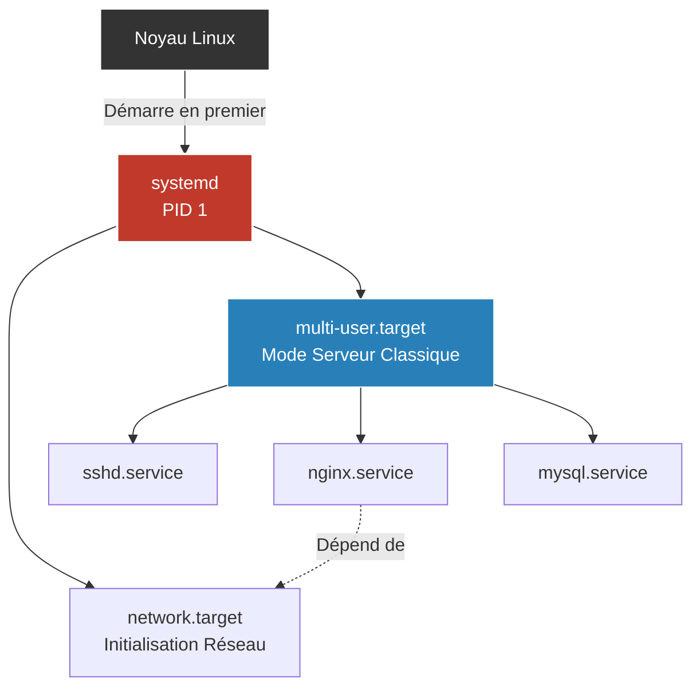

# Services & Daemons (Systemd)

<div
  class="omny-meta"
  data-level="🟡 Intermédiaire"
  data-version="1.0"
  data-time="30 - 45 minutes">
</div>

!!! quote "Le cœur battant de Linux"
    _Un "Daemon" (Démon) est un programme qui tourne en tâche de fond, sans interface utilisateur (ex: le serveur web Nginx, le serveur de base de données MySQL). Pour démarrer, arrêter, et surveiller ces centaines de démons en même temps, Linux utilise aujourd'hui un système centralisé et très puissant : **systemd**._

## 1. Introduction à Systemd

Historiquement, Linux utilisait `SysVinit` (des simples scripts bash exécutés au démarrage). C'était lent et séquentiel.
**systemd** a remplacé ce modèle. Il s'agit du processus père absolu (PID 1). Il parallélise le démarrage des services, gère leurs dépendances (ex: "Démarre mon application web SEULEMENT APRES que MySQL soit prêt"), et centralise tous leurs logs (les journaux).



L'outil principal avec lequel vous allez interagir pour contrôler systemd est **`systemctl`**.

---

## 2. Gérer les Services avec Systemctl

C'est l'une des commandes que vous taperez le plus souvent en tant qu'administrateur système.

### Les commandes de base
```bash
# Vérifier l'état d'un service (Démarré ? Planté ? Depuis quand ?)
sudo systemctl status nginx

# Démarrer un service
sudo systemctl start nginx

# Arrêter un service
sudo systemctl stop nginx

# Redémarrer un service (Coupe et relance le processus)
sudo systemctl restart nginx

# Recharger la configuration (Applique les configs sans couper le processus)
sudo systemctl reload nginx
```

### Le lancement au démarrage (Enable/Disable)
Ce n'est pas parce qu'un service est démarré (`start`) qu'il se lancera automatiquement si le serveur redémarre (reboot).
Pour s'assurer qu'un service démarre avec le système d'exploitation :
```bash
# Activer au démarrage
sudo systemctl enable nginx

# Désactiver au démarrage
sudo systemctl disable nginx
```

---

## 3. Créer son propre Service (Unité Systemd)

Si vous développez une API en Node.js, Python ou Go, vous ne voulez pas lancer `node index.js` dans votre terminal, car si vous fermez le terminal, le site s'éteint. Vous voulez créer un "Daemon".

Les fichiers de configuration de systemd (appelés Unit Files) se placent dans `/etc/systemd/system/`.

Créons un service pour notre API Node.js :
```ini title="/etc/systemd/system/mon-api.service"
[Unit]
Description=Mon API Backend Node.js
# Ne démarre que si le réseau est fonctionnel
After=network.target

[Service]
# On utilise un utilisateur standard pour des raisons de sécurité
User=nodeuser
Group=nodeuser

# Le dossier de travail
WorkingDirectory=/var/www/mon-api

# La commande principale
ExecStart=/usr/bin/node index.js

# Si l'API plante (crash), systemd la redémarre automatiquement !
Restart=on-failure

[Install]
# Niveau d'exécution (équivalent au démarrage normal multi-utilisateurs)
WantedBy=multi-user.target
```

Une fois le fichier créé, il faut dire à systemd de recharger sa liste de fichiers, puis l'activer :
```bash
sudo systemctl daemon-reload
sudo systemctl enable --now mon-api.service
```

---

## 4. Lire les Logs avec Journalctl

L'autre grande force de systemd est **`journald`**. Il capte tout ce que les services écrivent sur leur sortie standard (les `console.log()` ou `print()`) et les centralise dans une base de données binaire ultra-rapide.

Pour lire ces logs, on utilise **`journalctl`**.

```bash
# Voir les logs d'un service spécifique (Très utile pour le débuggage)
sudo journalctl -u nginx

# Voir les 50 dernières lignes (comme la commande 'tail')
sudo journalctl -n 50 -u nginx

# Suivre les logs en temps réel (Très utile pendant le développement)
sudo journalctl -f -u nginx

# Voir les erreurs (priorité "err" ou supérieure) depuis le dernier démarrage
sudo journalctl -p err -b
```

## Conclusion

L'utilisation de `systemd` (via `systemctl` et `journalctl`) est le standard de l'industrie pour déployer des applications. Il vous offre gratuitement la gestion des crashs (`Restart=on-failure`), la rotation des logs, et une supervision claire de l'état de votre serveur. Comprendre cette mécanique est essentiel avant de s'attaquer à des orchestrateurs plus vastes comme Kubernetes.