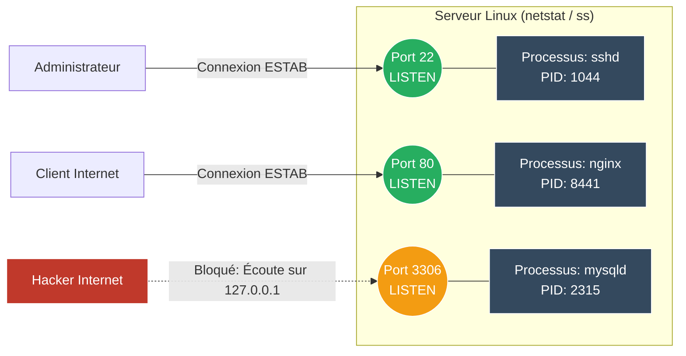

# Analyse des Ports Locaux (netstat / ss)

<div
  class="omny-meta"
  data-level="🟢 Débutant"
  data-version="1.0"
  data-time="15 minutes">
</div>

!!! quote "Qui écoute sur mon serveur ?"
    _Quand vous démarrez un serveur web, il ouvre le port 80 pour "écouter" les requêtes entrantes. L'outil **`netstat`** (et son remplaçant moderne **`ss`**) permet de lister instantanément tous les ports ouverts sur une machine, de voir les connexions actives en cours, et surtout d'identifier **quel processus** se cache derrière chaque port._

## 1. La commande magique `netstat -tulpen`

Historiquement, `netstat` est l'outil le plus connu. Ses arguments sont si couramment utilisés ensemble qu'ils forment un moyen mnémotechnique : **tulpen** (ou *tulnap*).



```bash
sudo netstat -tulpen
```

**Explication des drapeaux :**
- `-t` : Afficher les connexions **T**CP.
- `-u` : Afficher les connexions **U**DP.
- `-l` : N'afficher que les ports en écoute (**L**istening).
- `-p` : Afficher le nom et le PID du **P**rocessus qui écoute (nécessite `sudo`).
- `-e` : Afficher des informations **E**xtended (utilisateur propriétaire).
- `-n` : Ne pas résoudre les noms (**N**umeric). Affiche `80` au lieu de `http` (beaucoup plus rapide).

**Sortie typique :**
```text
Proto Recv-Q Send-Q Local Address     Foreign Address  State       User   PID/Program name
tcp        0      0 0.0.0.0:22        0.0.0.0:*        LISTEN      root   1044/sshd
tcp        0      0 127.0.0.1:3306    0.0.0.0:*        LISTEN      mysql  2315/mysqld
tcp6       0      0 :::80             :::*             LISTEN      root   8441/nginx: master
```
*Ici, on voit que `sshd` écoute sur le port 22 pour tout le monde (`0.0.0.0`), que `nginx` écoute sur le 80, mais que `mysql` n'écoute que localement (`127.0.0.1`), le protégeant d'Internet.*

---

## 2. Le remplaçant moderne : `ss` (Socket Statistics)

`netstat` est considéré comme "obsolète" sur les distributions Linux très récentes (il appartient au vieux paquet `net-tools`). Son successeur est **`ss`** (fourni par `iproute2`). Il est beaucoup plus rapide et performant, en particulier sur les serveurs qui gèrent des dizaines de milliers de connexions.

Heureusement, la syntaxe est exactement la même pour l'usage basique !

```bash
# La même commande que netstat
sudo ss -tulpen
```

### Fonctionnalités avancées de `ss`
L'outil `ss` brille par sa capacité à filtrer les résultats comme une base de données.

```bash
# Afficher toutes les connexions SSH établies (ESTAB)
ss -o state established '( dport = :ssh or sport = :ssh )'

# Afficher les connexions actives vers une IP cible spécifique
ss dst 198.51.100.45
```

## Conclusion et utilisation "Cyber"

Pour un administrateur système, `netstat`/`ss` sert à vérifier qu'un service a bien démarré ("*Pourquoi mon site ne marche pas ? Ah, Nginx n'écoute pas sur le port 80*").

Dans un contexte de Cybersécurité (Incident Response / Chasse aux menaces), c'est l'un des premiers outils utilisés. Si l'on tape `ss -tulpen` et que l'on voit un programme inconnu nommé `netcat` ou `bash` en écoute sur le port `4444`, c'est le signe évident d'une compromission (Backdoor / Reverse Shell).