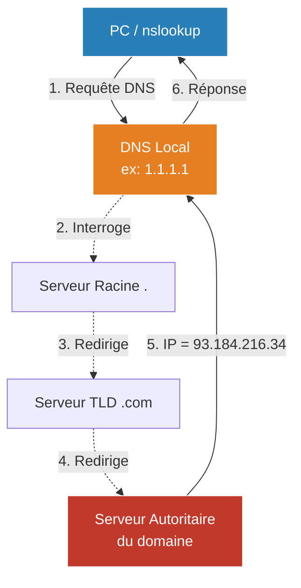

# Résolution DNS (nslookup / dig)

<div
  class="omny-meta"
  data-level="🟢 Débutant"
  data-version="1.0"
  data-time="15 minutes">
</div>

!!! quote "L'annuaire de l'Internet"
    _Le DNS (Domain Name System) traduit des noms lisibles par les humains (`google.com`) en adresses IP compréhensibles par les machines (`142.250.179.110`). Quand un utilisateur dit "Le site web est cassé", dans 50% des cas, c'est en réalité un problème de résolution DNS. **`nslookup`** et **`dig`** sont les outils pour diagnostiquer cela._

## 1. Nslookup (Name Server Lookup)

`nslookup` est l'outil historique, présent nativement sur Windows, Linux et macOS.



### Utilisation simple (Mode non interactif)
Demander à votre DNS configuré localement quelle est l'IP d'un domaine :
```bash
nslookup example.com
```
*Sortie :*
```text
Server:		1.1.1.1       <-- Le serveur DNS qui a répondu (Cloudflare)
Address:	1.1.1.1#53

Non-authoritative answer:
Name:	example.com
Address: 93.184.216.34    <-- L'IP cible
```

### Interroger un serveur spécifique
Parfois, vous venez de changer un enregistrement DNS et vous voulez vérifier si un serveur précis (ex: Google DNS `8.8.8.8`) a bien reçu la mise à jour, sans utiliser votre cache local.
```bash
nslookup example.com 8.8.8.8
```

### Chercher des enregistrements spécifiques (MX, TXT)
Pour voir quels sont les serveurs e-mail (MX) d'un domaine, ou vérifier des enregistrements texte (TXT) souvent utilisés pour la sécurité (SPF, DKIM) :
```bash
# Pour vérifier les serveurs mails (MX)
nslookup -query=mx gmail.com

# Pour vérifier les enregistrements TXT
nslookup -query=txt microsoft.com
```

---

## 2. Dig (L'outil moderne)

Sous Linux, les administrateurs réseaux préfèrent largement **`dig`** (Domain Information Groper), qui fait partie du paquet `dnsutils` (ou `bind-utils`). Il est beaucoup plus complet, standardisé et parfait pour des scripts Bash.

### Une réponse propre
```bash
dig example.com
```

Pour n'obtenir **que l'adresse IP** (idéal pour un script) :
```bash
dig +short example.com
# Résultat : 93.184.216.34
```

### Requêtes ciblées
Tout comme nslookup, vous pouvez interroger un serveur spécifique (avec `@`) et un type d'enregistrement (MX, TXT, AAAA) :
```bash
# Interroger le DNS de Google pour les enregistrements TXT de github.com
dig @8.8.8.8 github.com TXT
```

## Conclusion

Le premier réflexe face à une erreur `ERR_NAME_NOT_RESOLVED` dans un navigateur ne doit pas être de redémarrer le serveur web, mais d'ouvrir un terminal et de taper `nslookup le-domaine.com`. Maîtriser ces outils évite des heures de débogage inutiles sur la couche applicative (Niveau 7) alors que le problème se situe au niveau de la résolution de nom.