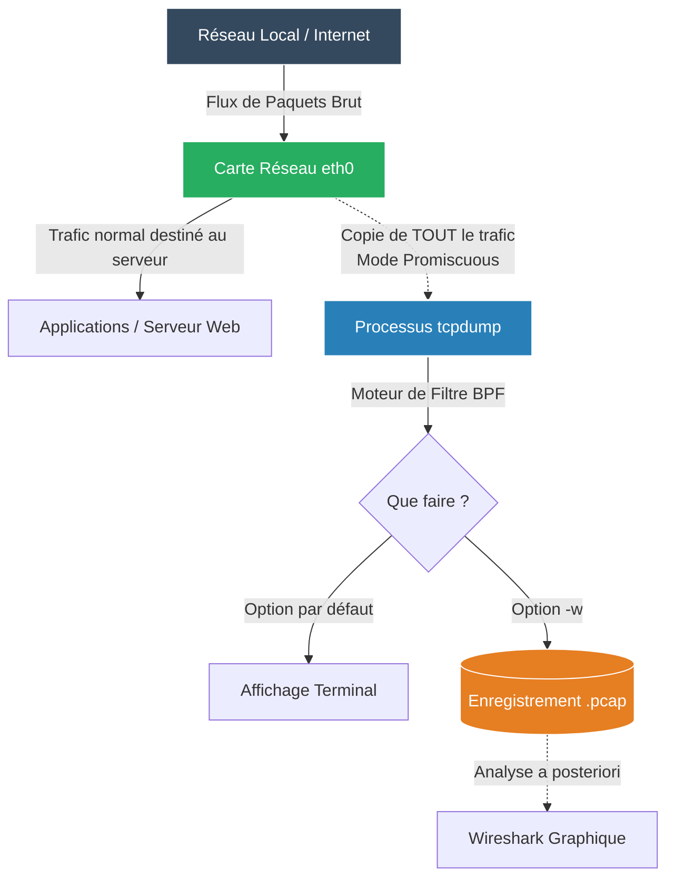

# Capture de Trafic (Tcpdump)

<div
  class="omny-meta"
  data-level="🟡 Intermédiaire"
  data-version="1.0"
  data-time="20 - 30 minutes">
</div>


!!! quote "Analogie pédagogique"
    _Utiliser des outils d'analyse réseau (comme tcpdump ou scapy), c'est comme brancher un stéthoscope sur les artères d'une ville. Vous ne regardez plus simplement si les camions arrivent à destination, mais vous examinez le contenu de chaque paquet transporté pour détecter une anomalie ou une maladie (latence, perte, malware)._

!!! quote "Plonger dans la matrice"
    _Lorsque deux machines n'arrivent pas à communiquer malgré un pare-feu en apparence ouvert, le seul moyen d'avoir la vérité absolue est de capturer les paquets sur le fil. **Tcpdump** est l'analyseur de paquets (Packet Sniffer) en ligne de commande le plus célèbre et le plus puissant d'Unix._

## Qu'est-ce que Tcpdump ?

Il fait le même travail que le célèbre logiciel graphique **Wireshark**, mais directement dans le terminal. Il "écoute" une interface réseau (comme `eth0`) et affiche ou enregistre tout ce qui y transite.



*Note : L'exécution de tcpdump nécessite toujours les droits `root` ou `sudo`, car l'écoute d'une carte réseau en mode promiscuous est une opération très sensible.*

---

## 1. La syntaxe de base

### L'écoute simple (Très bruyant)
Si vous lancez tcpdump sans filtre, vous allez être noyé sous des milliers de lignes par seconde.
```bash
# Écoute sur l'interface eth0
sudo tcpdump -i eth0
```

### Afficher le contenu des paquets (-X)
Par défaut, tcpdump n'affiche que les "en-têtes" (les adresses IP et les ports). Pour voir le vrai contenu du message (la "payload"), en ASCII et Hexadécimal :
```bash
sudo tcpdump -i eth0 -X
```

### Pas de résolution DNS (-n)
Tout comme `netstat`, tcpdump essaie par défaut de traduire les IPs en noms de domaine, ce qui ralentit énormément la capture. On utilise quasiment toujours le flag `-n` (ou `-nn` pour empêcher aussi la traduction des ports).
```bash
sudo tcpdump -i eth0 -nn
```

---

## 2. Le pouvoir des Filtres (BPF)

La vraie puissance de tcpdump réside dans sa syntaxe de filtrage (Berkeley Packet Filter), qui permet de cibler exactement l'aiguille dans la botte de foin.

### Filtrer par hôte (IP)
```bash
# Ne capturer que ce qui concerne (entrant ou sortant) cette adresse IP
sudo tcpdump -i eth0 -nn host 198.51.100.45

# Ne capturer que ce qui vient DE cette IP (Source)
sudo tcpdump -i eth0 -nn src 198.51.100.45
```

### Filtrer par port
```bash
# Capturer tout le trafic Web (HTTP)
sudo tcpdump -i eth0 -nn port 80

# Exclure le port SSH de la capture (Très utile si vous êtes connecté en SSH pour éviter de capturer votre propre session en boucle !)
sudo tcpdump -i eth0 -nn not port 22
```

### Combiner les filtres (AND / OR)
```bash
# Capturer le trafic entre mon serveur et une IP précise, MAIS ignorer le ping (ICMP)
sudo tcpdump -i eth0 -nn host 198.51.100.45 and not icmp
```

---

## 3. Enregistrer et exporter (PCAP)

Lire des trames réseaux complexes qui défilent à 100 à l'heure dans un terminal est difficile. La pratique professionnelle consiste à enregistrer la capture dans un fichier **.pcap** (Packet Capture), que l'on rapatriera ensuite sur son propre ordinateur pour l'ouvrir confortablement dans **Wireshark**.

```bash
# Écrire la capture brute dans un fichier (-w) (Ne s'affiche plus à l'écran)
sudo tcpdump -i eth0 port 80 -w capture_web.pcap

# Lire un fichier pcap précédemment enregistré (-r)
sudo tcpdump -r capture_web.pcap
```

## Lien avec la Cybersécurité (Le Sniffing)

En Ops, `tcpdump` est l'outil de diagnostic réseau ultime (Pourquoi la requête API plante ? Regardons le paquet HTTP brut).

En Cybersécurité offensive (Red Team), intercepter les paquets s'appelle le **Sniffing**. Si un pirate s'introduit sur votre réseau interne et lance un tcpdump sur des protocoles non chiffrés (HTTP, Telnet, FTP), il verra les noms d'utilisateurs et les mots de passe passer **en clair**. C'est la raison absolue pour laquelle on impose aujourd'hui le chiffrement partout (HTTPS, SSH, SFTP).

<br>

---

## Conclusion

!!! quote "Ce qu'il faut retenir"
    La visibilité réseau est primordiale pour l'analyse d'incidents et le troubleshooting. Maîtriser tcpdump, netstat ou scapy permet de diagnostiquer la majorité des anomalies avant qu'elles ne s'aggravent.

> [Retourner à l'index Réseau →](../index.md)
