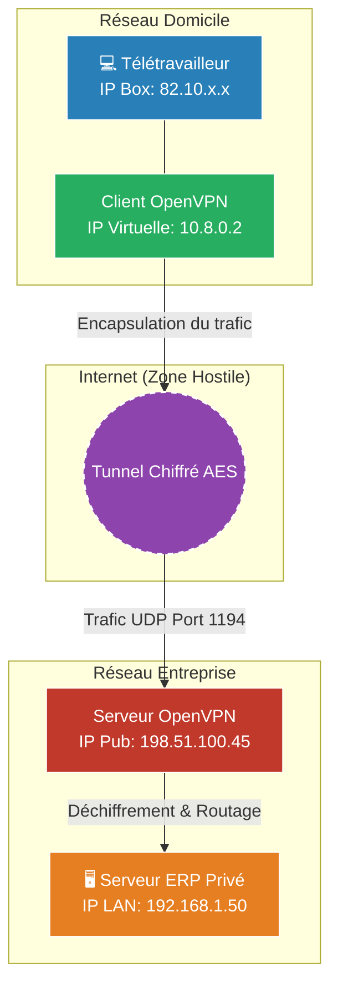

# Tunnels Sécurisés (VPN)

!!! quote "Analogie pédagogique"
    _Un VPN comme OpenVPN est un tunnel blindé privatif construit au milieu d'une autoroute publique (Internet). Peu importe qui regarde le trafic sur l'autoroute, vos camions de données voyagent de manière invisible et sécurisée jusqu'à la base de destination._

!!! quote "L'extension du réseau interne"
    _Une entreprise possède des ressources sensibles (serveur de fichiers, ERP, Intranet) qui ne doivent JAMAIS être exposées sur Internet. Si un employé en télétravail doit accéder à ces ressources, il ne peut pas passer par l'IP publique de l'entreprise. Il faut créer un tunnel direct, privé et chiffré au travers d'Internet. C'est le rôle du **Virtual Private Network (VPN)**._

## Qu'est-ce qu'un VPN d'Entreprise ?

Attention à la confusion courante. Les "VPN Grand Public" (NordVPN, CyberGhost) ont pour but de cacher votre adresse IP personnelle pour naviguer anonymement. 

Un **VPN d'Entreprise** (Remote Access VPN ou Site-to-Site VPN) a un but totalement différent : **Connecter votre ordinateur distant directement sur le réseau local (LAN) de l'entreprise**, de manière transparente, comme si vous aviez physiquement branché un câble réseau dans les locaux.

Une fois connecté, votre PC obtient une adresse IP interne (ex: `192.168.1.150`), et vous pouvez pinger les serveurs locaux.

---

## Les Solutions Leaders (OpenVPN vs WireGuard)

### 1. Le standard historique : OpenVPN
C'est la solution la plus déployée en entreprise. Il est mature, extrêmement configurable, et contourne très facilement les pare-feux (il peut simuler du trafic web HTTPS sur le port 443 pour ne pas être bloqué dans les hôtels ou aéroports).

**Fonctionnement (Authentification forte) :**
Contrairement à un simple mot de passe, un déploiement sécurisé OpenVPN utilise des **Certificats X.509** (PKI).
- L'entreprise crée une Autorité de Certification (CA).
- Elle génère un certificat numérique unique pour le PC d'Alice (souvent protégé par un mot de passe ou lié à l'Active Directory via LDAP).
- Si le PC d'Alice est volé, l'administrateur se contente de **Révoquer** (CRL) son certificat, bannissant instantanément son accès sans toucher aux autres utilisateurs.

### 2. Le challenger moderne : WireGuard
WireGuard a été intégré directement dans le noyau Linux. Il est incroyablement plus rapide, plus léger (quelques milliers de lignes de code contre des centaines de milliers pour OpenVPN) et utilise de la cryptographie de pointe asymétrique (très similaire au fonctionnement des clés SSH).

- **Inconvénient en entreprise** : WireGuard est difficile à lier à un Active Directory (LDAP), il n'a pas de gestion native de l'assignation dynamique des IPs (DHCP) et est plus complexe à déployer à grande échelle pour 500 employés sans surcouche logicielle (comme Tailscale).

---

## Les deux architectures de déploiement

### Site-to-Site VPN (De Bureau à Bureau)
Utilisé pour relier le siège social de Paris et l'agence de New York. 
Le tunnel VPN est monté **entre les deux routeurs (ex: pfSense) des deux agences**. Les employés n'installent aucun logiciel sur leur PC. Le trafic entre Paris et NY passe automatiquement dans le tunnel chiffré de façon transparente pour eux. (Souvent réalisé avec le protocole IPsec).

### Remote Access VPN (Télétravailleur)
Utilisé pour relier le PC de l'employé (à son domicile ou à l'hôtel) au siège social.
L'employé doit installer un logiciel (le client VPN) sur son PC, et le lancer manuellement.
Il existe deux sous-modes critiques en sécurité :
- **Full Tunneling (Sûr mais lourd)** : Tout le trafic internet de l'employé (même ses recherches Google personnelles) passe par l'entreprise. L'entreprise peut ainsi imposer son filtrage web et protéger l'employé même chez lui.
- **Split Tunneling (Pratique mais risqué)** : Seules les requêtes destinées aux serveurs internes de l'entreprise passent par le tunnel. Les recherches Google passent par la box personnelle de l'employé. (Si l'employé télécharge un malware chez lui, le malware a désormais un accès direct au tunnel de l'entreprise...).

## Conclusion

Le VPN est souvent le point d'entrée unique de l'entreprise. En Cybersécurité, sécuriser la porte (Endpoint) du VPN est une priorité absolue. Aujourd'hui, on n'autorise plus jamais une connexion VPN avec un simple mot de passe ; l'utilisation du **MFA (Authentification Multi-Facteurs)** via une application (Google Authenticator / Duo) est indispensable.

 

---

## Conclusion

!!! quote "Ce qu'il faut retenir"
    La sécurité réseau ne s'arrête plus au simple pare-feu périmétrique. L'implémentation de VPNs robustes (OpenVPN/WireGuard) et d'une segmentation stricte forme l'épine dorsale d'une architecture résiliente.

> [Retourner à l'index Réseau →](../index.md)
