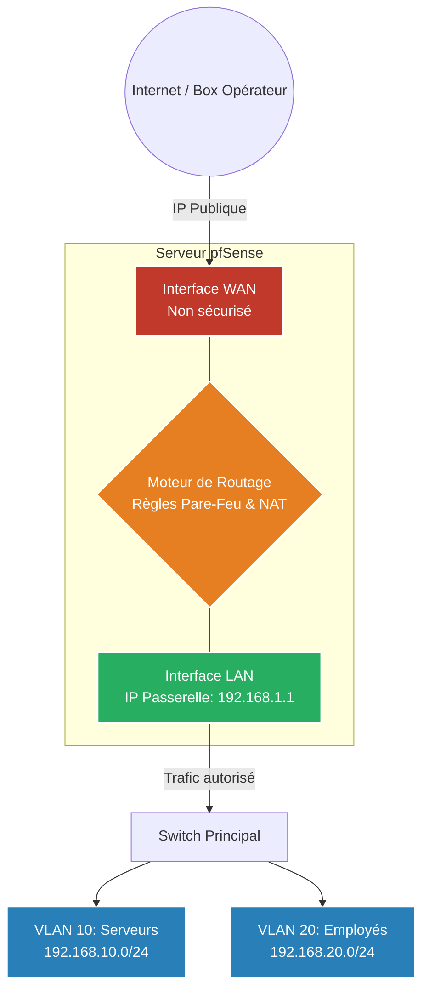

# Le Pare-Feu d'Entreprise (pfSense)

!!! quote "Analogie pédagogique"
    _La sécurité réseau moderne (Zero Trust, WAF, VPN) s'apparente aux contrôles stricts dans un aéroport international. Le pare-feu classique est la porte d'entrée, le WAF est le portique de sécurité vérifiant le contenu des bagages, et le VPN est le tunnel VIP sécurisé réservé aux employés identifiés._

!!! quote "Le gardien du temple"
    _Un pare-feu hôte (comme UFW sur Linux) protège la machine sur laquelle il est installé. Un **Pare-Feu Périmétrique** protège l'intégralité d'un réseau (qui peut contenir des milliers de machines). **pfSense** est l'un des pare-feux Open Source les plus reconnus au monde. Basé sur le robuste système FreeBSD, il transforme un simple ordinateur (ou une machine virtuelle) en un routeur de classe entreprise._

## 1. Topologie et Interfaces (WAN vs LAN)

Pour fonctionner, un pare-feu périmétrique comme pfSense doit posséder **au moins deux cartes réseau** physiques (ou virtuelles) :

1. **L'interface WAN (Wide Area Network)** : Branchée sur "l'extérieur" (Internet ou la Box de votre opérateur). Elle possède une adresse IP publique (ou fournie par l'opérateur).
2. **L'interface LAN (Local Area Network)** : Branchée sur votre réseau interne (le switch qui relie vos serveurs et ordinateurs). Elle possède l'adresse IP "Passerelle" (ex: `192.168.1.1`).

**Tout le trafic entrant et sortant** de votre entreprise est donc obligé de traverser pfSense.

---

## 2. Les fonctionnalités clés

L'avantage de pfSense réside dans son interface graphique (WebGUI) extrêmement complète, qui permet de configurer des concepts réseau avancés sans taper une seule ligne de commande.

### Le NAT (Network Address Translation)
C'est la magie qui permet à vos 500 ordinateurs (qui ont des IPs privées comme `192.168.1.x`) de surfer sur Internet en partageant une seule adresse IP publique (Celle de l'interface WAN).
- **SNAT (Source NAT / Masquerading)** : Cache les IPs internes lors d'une sortie sur le net.
- **DNAT (Destination NAT / Port Forwarding)** : Si vous avez un serveur web sur votre réseau interne, vous demandez à pfSense : "Si quelqu'un tape sur mon adresse IP publique sur le port 80 (WAN), redirige secrètement le trafic vers `192.168.1.50` sur le port 80 (LAN)".

### Le Filtrage des règles (Rules)
Par défaut (comme tout bon pare-feu), pfSense applique une politique de **Default Deny** sur l'interface WAN (tout ce qui vient d'Internet est jeté).
Sur l'interface LAN, il autorise par défaut le trafic sortant (vos employés peuvent aller sur Google).

Une règle se lit de haut en bas (First Match Wins) :
- Action (Pass / Block / Reject)
- Interface (WAN / LAN)
- Protocole (TCP / UDP / ICMP)
- Source (IP ou Alias) -> Destination (IP ou Alias) -> Port

### Les VLANs (Réseaux Virtuels)
Dans une entreprise, on ne mélange pas les ordinateurs des comptables avec les serveurs de production. pfSense excelle dans la création et le routage des **VLANs**. Vous pouvez créer une règle disant : "Le VLAN Comptabilité n'a pas le droit de communiquer avec le VLAN Production".

---

## 3. IDS / IPS (Suricata)

Un pare-feu "Stateful" (comme UFW ou le moteur de base de pfSense) ne regarde que l'en-tête du paquet (IP Source, IP Dest, Port). Si vous avez autorisé le port 80 vers votre serveur web, le pare-feu laisse passer toutes les requêtes HTTP, **même s'il s'agit d'une tentative d'Injection SQL malveillante**.

Pour contrer cela, on peut ajouter à pfSense un paquet appelé **Suricata (ou Snort)**.
C'est un **IDS/IPS (Système de Détection/Prévention d'Intrusion)**.
Lui, va ouvrir le paquet réseau en temps réel, lire la charge utile (le texte HTTP), et s'il détecte la signature d'une attaque connue (ex: une tentative d'exploit sur Apache), il peut bloquer silencieusement le pirate (Mode IPS).

## Conclusion

La maîtrise de pfSense (ou d'équipements propriétaires équivalents comme Fortinet ou Palo Alto) est la compétence numéro un demandée à un administrateur réseau (Network Engineer). C'est le point central de l'infrastructure, d'où l'on gère le routage, la sécurité, le DHCP, le DNS Resolver, et les connexions distantes (VPN).

 

---

## Conclusion

!!! quote "Ce qu'il faut retenir"
    La sécurité réseau ne s'arrête plus au simple pare-feu périmétrique. L'implémentation de VPNs robustes (OpenVPN/WireGuard) et d'une segmentation stricte forme l'épine dorsale d'une architecture résiliente.

> [Retourner à l'index Réseau →](../index.md)
