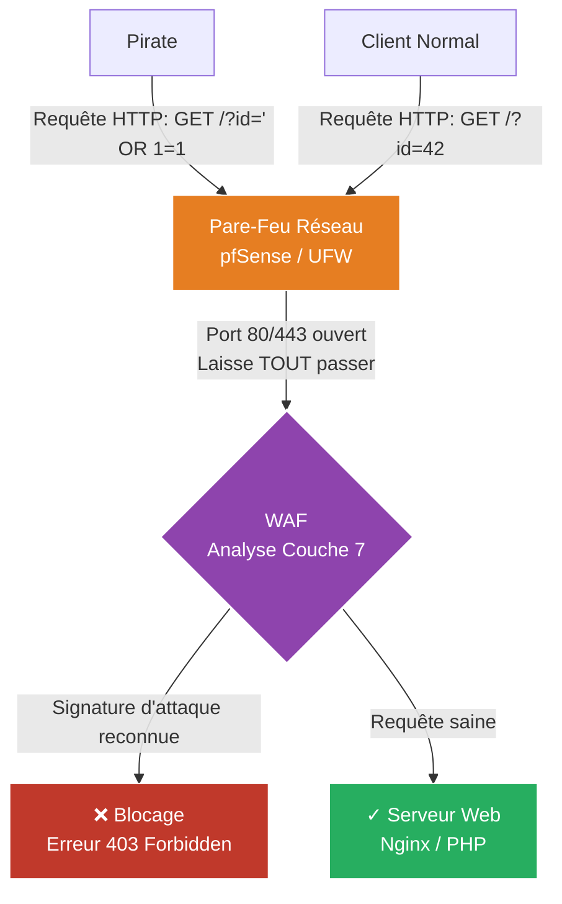

# Web Application Firewall (WAF)

!!! quote "Analogie pédagogique"
    _La sécurité réseau moderne (Zero Trust, WAF, VPN) s'apparente aux contrôles stricts dans un aéroport international. Le pare-feu classique est la porte d'entrée, le WAF est le portique de sécurité vérifiant le contenu des bagages, et le VPN est le tunnel VIP sécurisé réservé aux employés identifiés._

!!! quote "Le pare-feu intelligent"
    _Si votre site web est vulnérable à une Injection SQL, le pare-feu réseau de votre entreprise (pfSense) ne vous sauvera pas. Pourquoi ? Parce que le pare-feu voit une requête HTTP arriver sur le port 80/443, port qu'il est obligé de laisser ouvert pour que le site fonctionne. Il laisse donc passer l'attaque. Pour bloquer des attaques logiques liées au code web, il faut un **WAF** (Web Application Firewall), qui travaille au niveau de la Couche 7 (Application)._

## Qu'est-ce qu'un WAF ?

Contrairement à un pare-feu classique, le WAF "comprend" le protocole HTTP. Il intercepte chaque requête envoyée par le visiteur (`GET`, `POST`, Headers, Cookies), analyse son contenu, et décide s'il s'agit d'un trafic légitime ou d'une attaque.

### Ce qu'il bloque (Le Top 10 OWASP) :
- **Injections SQL** (Ex: tenter d'insérer `' OR 1=1 --` dans un champ de login).
- **Cross-Site Scripting (XSS)** (Tenter d'injecter du code Javascript `` dans un commentaire).
- **Local File Inclusion (LFI)** (Tenter de lire les fichiers sensibles du serveur Unix comme `/etc/passwd`).
- Les bots et le scraping massif.

---

## Les deux approches du WAF

### 1. Le WAF intégré (ModSecurity)
L'approche historique consiste à intégrer le WAF directement dans le serveur web (Apache ou Nginx) sous forme de module.
Le plus célèbre est **ModSecurity** (Souvent couplé à la base de règles open-source CRS - *Core Rule Set* de l'OWASP).

- **Avantage** : Gratuit, contrôle total, pas de latence réseau supplémentaire.
- **Inconvénient** : Complexe à paramétrer finement. Il consomme énormément de CPU sur le serveur web car il analyse chaque requête par des centaines d'expressions régulières (RegEx).

### 2. Le WAF Cloud (Cloudflare, AWS WAF)
Aujourd'hui, l'approche moderne est de placer le WAF "dans le cloud", devant votre infrastructure. Les visiteurs se connectent au WAF de Cloudflare, qui filtre le trafic, puis transmet le trafic "propre" à votre serveur.

- **Avantage** : Protège en même temps contre les attaques DDoS massives, simple à utiliser, mis à jour en temps réel contre les nouvelles menaces mondiales (Threat Intelligence partagée).
- **Inconvénient** : Coût souvent élevé pour les règles avancées, le trafic en clair est déchiffré par un tiers (problème de confidentialité/RGPD potentiel).

---

## Le Problème des Faux Positifs

Un WAF fonctionne en grande partie par analyse comportementale et recherche de chaînes de caractères "dangereuses" (Signatures).
Le cauchemar absolu de l'administrateur WAF, c'est le **Faux Positif** : bloquer un utilisateur légitime.

Par exemple, si vous développez un forum pour développeurs web. Un utilisateur essaie de poster un tutoriel dans lequel il écrit ``. Le WAF verra cela, hurlera à l'attaque XSS, bloquera l'utilisateur et affichera une erreur 403 Forbidden.

La mise en place d'un WAF sur un site existant demande donc toujours une longue phase d'**Apprentissage (Learning Mode ou Detection-Only Mode)** : Le WAF logge les attaques présumées, mais ne les bloque pas. L'administrateur ajuste ensuite les règles pour s'adapter à la réalité de son application web.

## Conclusion

Le WAF est la "rustine" de sécurité par excellence. Si le code source de l'application web a été mal développé (failles béantes), le WAF est souvent le seul rempart qui empêche le piratage immédiat de la base de données. Cependant, il ne doit jamais remplacer la pratique d'un développement sécurisé (Secure Coding).

 

---

## Conclusion

!!! quote "Ce qu'il faut retenir"
    La sécurité réseau ne s'arrête plus au simple pare-feu périmétrique. L'implémentation de VPNs robustes (OpenVPN/WireGuard) et d'une segmentation stricte forme l'épine dorsale d'une architecture résiliente.

> [Retourner à l'index Réseau →](../index.md)
