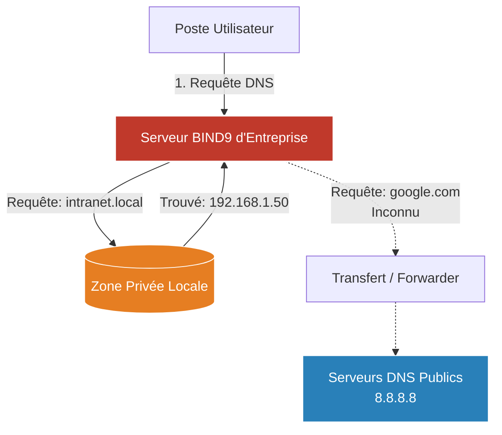

# Le Serveur DNS (Bind9)

<div
  class="omny-meta"
  data-level="🟡 Intermédiaire"
  data-version="1.0"
  data-time="20 - 30 minutes">
</div>

!!! quote "Pas de DNS, pas d'internet"
    _Sur Internet, les machines communiquent avec des adresses IP, pas avec des noms. Le serveur **DNS** (Domain Name System) est l'annuaire qui traduit `serveur-web.interne` en `192.168.1.50`. L'erreur la plus commune en informatique est la panne DNS. Gérer son propre DNS local est vital pour une infrastructure d'entreprise._

## Pourquoi un DNS Local ?

À la maison, votre box internet fait office de relais DNS (elle demande à votre fournisseur d'accès ou à Google). 
Dans une entreprise, vous avez des dizaines de serveurs internes (intranet, base de données, imprimantes). Google ne connaît pas l'IP de votre base de données locale ! Il vous faut donc **votre propre serveur DNS**.



- Il résout les noms de vos machines locales (Zone Privée).
- Il transfère (Forward) les autres requêtes (ex: `google.com`) vers l'extérieur.

---

## Le Standard de l'Industrie : BIND9

**BIND** (Berkeley Internet Name Domain) est le serveur DNS le plus utilisé au monde.

### Installation (Debian/Ubuntu)
```bash
sudo apt update
sudo apt install bind9 bind9utils bind9-doc
```

### Le concept des "Zones"
Dans BIND, un domaine (ex: `omnyvia.local`) est appelé une **Zone**.
On doit déclarer cette zone dans la configuration de BIND, puis créer un fichier (le fichier de zone) qui contiendra les correspondances Nom $\rightarrow$ IP (Les enregistrements "A").

### 1. Déclarer la zone locale
Fichier `/etc/bind/named.conf.local` :
```text
zone "omnyvia.local" {
    type master;
    file "/etc/bind/db.omnyvia.local";
};
```

### 2. Créer le fichier de zone (Les enregistrements)
Fichier `/etc/bind/db.omnyvia.local` :
```text
$TTL    604800
@       IN      SOA     ns1.omnyvia.local. admin.omnyvia.local. (
                              2         ; Serial (A incréménter à chaque modif)
                         604800         ; Refresh
                          86400         ; Retry
                        2419200         ; Expire
                         604800 )       ; Negative Cache TTL
;
; Serveurs de noms (NS)
@       IN      NS      ns1.omnyvia.local.

; Enregistrements de type A (Adresse IPv4)
ns1     IN      A       192.168.1.10
routeur IN      A       192.168.1.1
web     IN      A       192.168.1.50

; Enregistrements CNAME (Alias)
www     IN      CNAME   web
```

Une fois enregistré, on vérifie la syntaxe (car BIND est très capricieux sur les points-virgules) et on redémarre :
```bash
# Vérifie la syntaxe des fichiers de config
sudo named-checkconf

# Redémarre le service
sudo systemctl restart bind9
```

---

## Lien avec la Cybersécurité (DNS Spoofing & Tunneling)

Le protocole DNS est vieux et n'était pas chiffré.
1. **L'usurpation (DNS Spoofing / Cache Poisoning)** : Si un pirate réussit à corrompre votre serveur BIND, il peut lui faire croire que `banque.com` est à l'adresse IP `192.168.1.99` (le serveur du pirate). Vos employés seront redirigés vers un faux site (Phishing parfait).
2. **L'exfiltration (DNS Tunneling)** : Souvent, les pare-feux bloquent tout le trafic sortant, *sauf* le port 53 (DNS), car l'ordinateur en a besoin. Un attaquant peut cacher ses données volées à l'intérieur de dizaines de requêtes DNS factices pour contourner le pare-feu sans éveiller les soupçons.

C'est pour cela que la gestion et la surveillance fine (Observabilité) des requêtes DNS est l'une des tâches primordiales d'un centre de cyberdéfense (SOC).