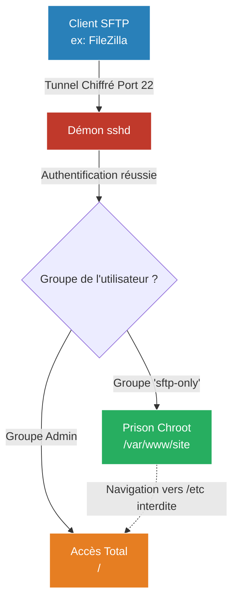

# Transferts de Fichiers (FTP vs SFTP)

<div
  class="omny-meta"
  data-level="🟢 Débutant"
  data-version="1.0"
  data-time="15 - 20 minutes">
</div>


!!! quote "Analogie pédagogique"
    _Les services réseaux (DNS, FTP, SSH) sont comme les différents guichets spécialisés d'une grande entreprise. Le DNS est l'accueil qui indique où se trouve chaque bureau, SSH est l'entrée de service hyper-sécurisée pour la maintenance, et FTP est le quai de chargement des marchandises. Chaque guichet mal surveillé est une opportunité d'intrusion._

!!! quote "Transférer en sécurité"
    _Depuis les débuts de l'Internet, le besoin de transférer des fichiers volumineux entre machines est une constante. Le **FTP** (File Transfer Protocol) a longtemps été le standard absolu. Aujourd'hui, il est considéré comme une faille de sécurité majeure, mais ses descendants (FTPS et surtout SFTP) restent les piliers de la gestion de contenu web et des sauvegardes distantes._

## 1. Le problème avec le FTP (Port 21)

Le protocole FTP classique est conçu pour la performance et la simplicité, pas pour la sécurité.

**La faille critique :** FTP transmet absolument tout "en clair" sur le réseau. Si vous vous connectez à votre serveur web via FTP (Port 21) dans un aéroport ou un café, n'importe qui sur le même réseau Wi-Fi peut utiliser un outil d'analyse réseau (comme `tcpdump` ou Wireshark) pour intercepter instantanément votre identifiant, votre mot de passe, et le contenu exact des fichiers que vous transférez.

> **Règle absolue :** Ne déployez **JAMAIS** un serveur FTP classique sur Internet aujourd'hui.

---

## 2. L'alternative 1 : FTPS (FTP over SSL)

L'une des solutions pour sécuriser le FTP a été de l'envelopper dans une couche de chiffrement SSL/TLS (comme le HTTPS pour le Web). C'est le **FTPS**.

- **Le logiciel courant** : `vsftpd` (Very Secure FTP Daemon) ou `proftpd`.
- **Avantage** : Rapide, et conserve la notion de "Comptes Virtuels" (on peut créer des accès FTP sans créer de véritables utilisateurs Linux sur le serveur).
- **Inconvénient** : Le protocole FTP est une horreur à configurer pour les pare-feux, car il ouvre des ports dynamiques imprévisibles pour le transfert de données (Mode Passif vs Actif).

### Déploiement basique (vsftpd chiffré)
```bash
sudo apt install vsftpd
```
Il faut impérativement forcer l'usage du SSL dans la configuration (`/etc/vsftpd.conf`) :
```text
rsa_cert_file=/etc/ssl/certs/ssl-cert-snakeoil.pem
rsa_private_key_file=/etc/ssl/private/ssl-cert-snakeoil.key
ssl_enable=YES
force_local_logins_ssl=YES
force_local_data_ssl=YES
```

---

## 3. L'alternative moderne : SFTP (Le Standard)

Il ne faut surtout pas confondre FTPS et SFTP. **SFTP** (SSH File Transfer Protocol) n'a absolument rien à voir avec le vieux protocole FTP. 
C'est en réalité un sous-système de **SSH**.



**Avantages du SFTP :**
1. **Zéro configuration supplémentaire** : Si vous avez SSH (Port 22) d'ouvert sur votre serveur, vous avez DÉJÀ un serveur SFTP sécurisé, robuste et fonctionnel sans installer aucun logiciel supplémentaire !
2. **Pare-feu (UFW)** : Un seul port à ouvrir (le 22). Pas de problèmes de ports dynamiques ou de mode passif.
3. **Sécurité maximale** : Bénéficie de la cryptographie asymétrique (Clés Ed25519) et de tous les durcissements déjà appliqués au démon SSH (`sshd`).

### Le concept de "Chroot Jail" (La prison)

Le seul défaut du SFTP "par défaut", c'est qu'il donne accès à tout le serveur Linux (selon les permissions de l'utilisateur). Si vous voulez donner un accès SFTP à un client développeur web pour qu'il mette à jour son site, vous ne voulez pas qu'il puisse naviguer dans `/etc` ou `/home`.

Il faut donc l'enfermer dans un dossier précis. Cela s'appelle une **Chroot Jail**, et cela se configure dans `/etc/ssh/sshd_config` :

```text title="/etc/ssh/sshd_config"
# Créer une règle spéciale pour les utilisateurs du groupe 'sftp-only'
Match Group sftp-only
    # Force l'utilisation du module SFTP natif
    ForceCommand internal-sftp
    # Enferme l'utilisateur dans ce dossier (Il ne pourra pas remonter plus haut)
    ChrootDirectory /var/www/html/son-site-web
    # Désactive la possibilité de lancer des commandes shell classiques via SSH
    AllowTcpForwarding no
    X11Forwarding no
```

## Conclusion

Dans 95% des cas modernes (développement web, sauvegardes de fichiers automatiques vers un serveur distant, administration de logs), la réponse est **SFTP**. Le vieux protocole FTP(S) n'est justifié aujourd'hui que si vous avez besoin de très hautes performances de transfert local ou de gérer des centaines de comptes virtuels (comme sur des hébergements mutualisés type cPanel).

<br>

---

## Conclusion

!!! quote "Ce qu'il faut retenir"
    Chaque service exposé est un vecteur d'attaque potentiel. La configuration sécurisée des services fondamentaux (DNS, SSH, Samba) est la première et souvent la plus critique ligne de défense de l'infrastructure.

> [Retourner à l'index Réseau →](../index.md)
