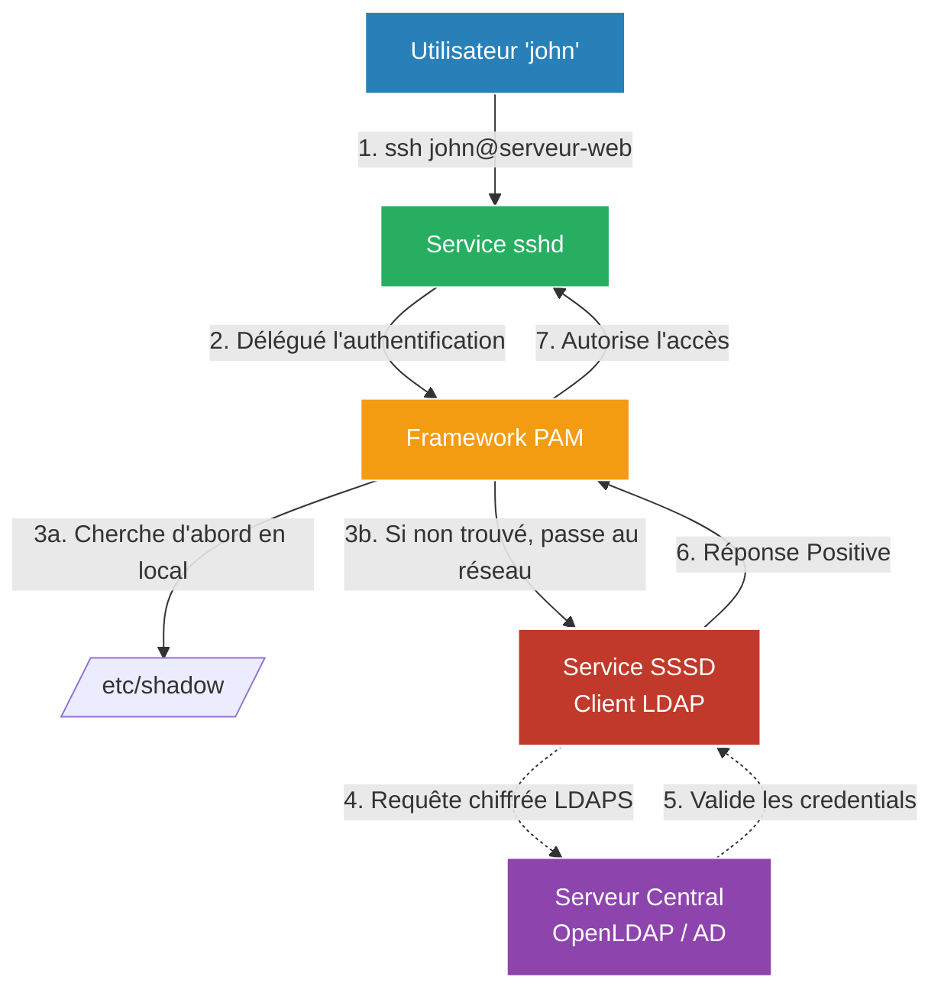

# L'Annuaire et l'Identité (LDAP / PAM)

<div
  class="omny-meta"
  data-level="🔴 Avancé"
  data-version="1.0"
  data-time="20 - 30 minutes">
</div>

!!! quote "Un pour les gouverner tous"
    _Imaginez que vous deviez gérer l'informatique d'une PME avec 50 serveurs Linux, un wiki interne, un système de chat (Mattermost), et un GitLab. Si vous devez créer le compte de l'employé "John" 54 fois, sur 54 bases de données différentes avec 54 mots de passe différents, c'est l'enfer. C'est ici qu'intervient **LDAP** : une base de données centralisée qui stocke l'identité (Single Sign-On philosophique)._

## 1. Le Protocole LDAP

**LDAP** (Lightweight Directory Access Protocol) n'est pas un logiciel, c'est un protocole standardisé pour interroger et modifier un annuaire. 
(L'Active Directory de Microsoft est d'ailleurs massivement basé sur LDAP).

L'implémentation open-source la plus courante sous Linux est **OpenLDAP**.

### L'Arbre DIT (Directory Information Tree)
Dans LDAP, on ne stocke pas les utilisateurs dans des "tables" (comme SQL), mais dans une hiérarchie, un arbre. Chaque utilisateur est un objet (une "feuille") défini par un **DN (Distinguished Name)**.

Exemple de DN pour l'utilisateur John Doe :
```text
uid=johndoe,ou=employes,dc=omnyvia,dc=local
```
- `dc` (Domain Component) : La racine de l'entreprise (omnyvia.local)
- `ou` (Organizational Unit) : Le service ou le département
- `uid` : L'identifiant de la personne

### Sécurité absolue (LDAPS)
Par nature, LDAP est un très vieux protocole (Port 389) qui interroge les mots de passe "en clair" sur le réseau (ce qui est catastrophique et facilement interceptable par Sniffing).
Un administrateur système (Ops) sérieux ne déploie **jamais** un LDAP natif. Il force l'utilisation de **LDAPS (LDAP over SSL - Port 636)** avec des certificats TLS pour chiffrer les échanges entre le serveur wiki et l'annuaire.

---

## 2. PAM (Pluggable Authentication Modules)

LDAP est l'annuaire central (le serveur). Mais comment dire à un *autre* serveur Linux (le client) : "Quand quelqu'un essaie de se connecter en SSH, ne cherche pas son mot de passe dans ton fichier local `/etc/shadow`, va le demander au serveur LDAP" ?

C'est là qu'intervient **PAM**.



PAM est le cœur de l'authentification sous Linux. C'est un framework modulaire puissant. Au lieu de coder en dur la façon dont `sshd` ou `sudo` doit vérifier un mot de passe, Linux demande à PAM. Et PAM peut être configuré (pluggé) pour vérifier via :
- Fichiers locaux classiques.
- Un annuaire LDAP réseau (`pam_ldap`).
- Un serveur Kerberos/Active Directory (`pam_winbind` ou `sssd`).
- Une clé matérielle biométrique (YubiKey / FIDO2).

### Implémentation moderne : SSSD
Aujourd'hui, plutôt que de configurer manuellement des modules PAM très complexes, on utilise **SSSD (System Security Services Daemon)**. SSSD s'occupe de faire le lien entre le système local et le serveur réseau (LDAP/AD). Il offre en plus une fonctionnalité critique : le cache hors-ligne. Si le serveur LDAP tombe en panne, SSSD garde en mémoire les identifiants pour que les serveurs continuent de fonctionner temporairement.

## Le Modèle Zero Trust et l'Identité

En cybersécurité moderne, l'identité (LDAP/AD/EntraID) est devenue le **nouveau périmètre**. 
Les pare-feux réseau (UFW, pfSense) ne suffisent plus car les employés travaillent en télétravail depuis leurs réseaux wifi personnels. La sécurité se fonde désormais sur l'authentification forte de l'identité : "Même si je n'ai pas de pare-feu réseau, tu dois prouver de façon indéniable qui tu es (MFA/LDAP) pour accéder à cette ressource". 

Gérer un serveur LDAP de manière robuste et sécurisée est donc la pierre angulaire de l'architecture "Zero Trust".