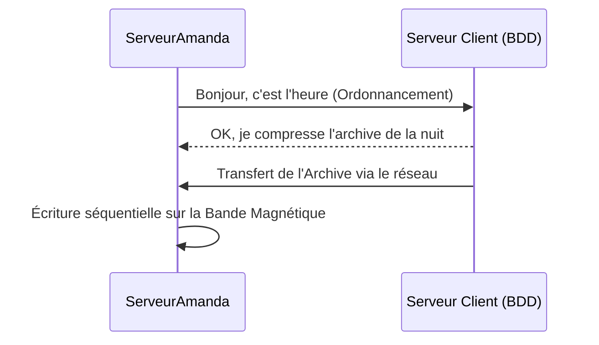

# L'outil Amanda (Archivage Réseau)

!!! quote "Analogie pédagogique"
    _La gestion du stockage (RAID, LVM) et des sauvegardes fonctionne comme la gestion financière d'une entreprise. Le RAID est une assurance contre les pannes matérielles du quotidien (un serveur qui tombe), tandis qu'une sauvegarde hors-ligne (Amanda) est votre coffre-fort dans une banque distante en cas d'incendie majeur._

!!! quote "Gérer les sauvegardes à l'échelle"
    _Si vous avez 2 serveurs, vous pouvez utiliser un simple script Bash avec la commande `rsync` pour copier les fichiers toutes les nuits. Mais si vous avez 500 serveurs (Linux, Solaris, Windows), gérant des bases de données immenses, vous avez besoin d'un "Maître des Sauvegardes" centralisé. C'est le rôle de solutions massives (et coûteuses) comme Veeam ou Bacula. **Amanda** est l'alternative open-source historique issue du monde de la recherche universitaire._

## 1. Qu'est-ce qu'Amanda ?

**Amanda** (Advanced Maryland Automatic Network Disk Archiver) a été développée par l'Université du Maryland en 1991. Elle a été conçue à une époque où le stockage principal des sauvegardes d'entreprise se faisait sur des **bandes magnétiques** (LTO).

### Architecture Client / Serveur
Amanda fonctionne de manière centralisée :
- Le **Serveur Amanda** possède le périphérique de sauvegarde (le lecteur de bandes magnétiques, ou le gros NAS).
- Les **Clients Amanda** (Les 500 serveurs de l'entreprise à sauvegarder) installent un petit agent.
- Chaque nuit, le Serveur contacte les Clients, leur demande de compresser les données modifiées de la journée, et rapatrie les données par le réseau vers les bandes magnétiques.

---

## 2. Les forces historiques d'Amanda

Amanda se distingue de simples outils de copie (`rsync`) par son intelligence de planification.

### Le Cycle de Sauvegarde (L'Ordonnancement intelligent)
Si vous faites une sauvegarde complète ("Full Backup") de vos 500 serveurs en même temps le dimanche soir, votre réseau va s'effondrer sous le poids des Terabytes, et l'opération prendra plus de 24h.

Amanda résout ce problème de manière autonome. Vous lui dites : "Je veux un Full Backup de chaque serveur tous les 7 jours". Amanda va mathématiquement étaler la charge. 
- Lundi : Full Backup des serveurs 1 à 70.
- Mardi : Full Backup des serveurs 71 à 140.
- Tous les autres serveurs font des petites sauvegardes Incrémentales (seulement les modifications de la journée).
La charge réseau est ainsi parfaitement lissée.

### Outils standardisés (Tar / Dump)
Une grande peur de l'administrateur système est d'utiliser un logiciel de sauvegarde propriétaire qui chiffre les fichiers dans un format obscur (`.vbxz`). Si l'entreprise fait faillite 10 ans plus tard, comment lire l'archive ?

Amanda utilise par défaut les outils standard UNIX : `tar` (Tape Archive) et `dump`. Si votre serveur Amanda explose, vous pouvez physiquement prendre la bande magnétique, la brancher sur n'importe quel ordinateur Linux du monde, et utiliser une simple commande `tar -xvf` pour récupérer vos données, sans avoir besoin de réinstaller Amanda. C'est l'essence même de l'archivage à long terme (Pérennité).

## Conclusion

Bien qu'Amanda soit vue aujourd'hui comme une technologie "historique" (les entreprises modernes se tournant vers Veeam, Rubrik ou Proxmox Backup Server), elle reste l'un des meilleurs exemples de conception logicielle résiliente, conçue spécifiquement pour maximiser la capacité des médias physiques (Bandes LTO) tout en utilisant des formats universels durables.

 

---

## Conclusion

!!! quote "Ce qu'il faut retenir"
    La résilience des données (RAID, sauvegardes) est le filet de sécurité ultime de l'entreprise face aux ransomwares et aux défaillances matérielles. Souvenez-vous : une sauvegarde non testée n'est qu'une illusion de sécurité.

> [Retourner à l'index →](../index.md)
